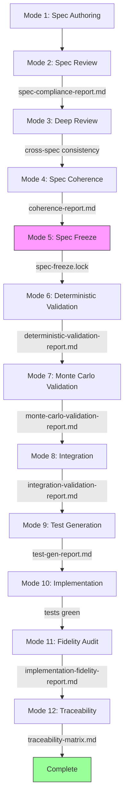
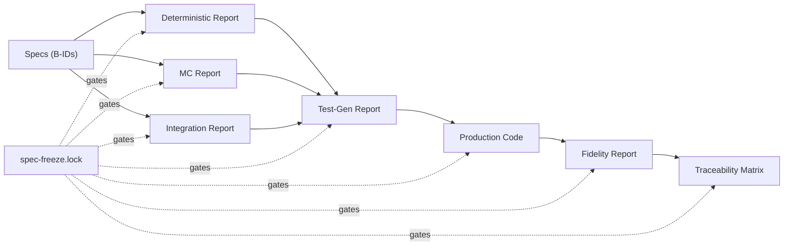
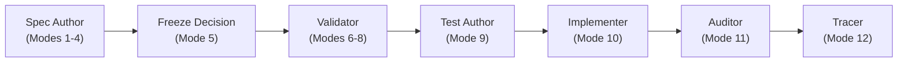

# Chapter 1: The Engineering Workflow

## Why Spec-First Engineering Exists

If you have worked on a software team for any length of time, you have lived through this. Someone has an idea. It gets discussed, maybe written up in a ticket, and handed to a developer. The developer writes code based on what they understood from the discussion. Six weeks later, the person who had the idea looks at what was built and says "that's not what I meant." The developer pulls up the ticket and points to the sentence that clearly supports what they built. The person with the idea points to a different sentence that clearly supports what they meant. Both are right. Both read the same document. The document was never a contract; it was a summary of a conversation, and conversations are ambiguous.

This is not a failure of communication. It is a structural failure of the development process. Narrative requirements documents are interpreted by readers, not executed by compilers. Every reader brings their own assumptions, fills their own gaps, and builds what they think was meant. The only way to eliminate that divergence is to replace narrative requirements with behavioral contracts: documents that specify what the system does precisely enough that there is no room for interpretation.

### The Phone Game Problem

Every time a requirement passes through a human being, it degrades. The product manager has an intent. They write a user story. The tech lead reads it in a planning meeting and explains it to the team. A developer hears the explanation and writes code. A QA engineer reads the code and writes tests based on what the code does. By the time a feature is in production, it has passed through four or five interpretive layers, and the original intent has been replaced with a chain of reasonable-sounding approximations. Nobody lied. Nobody was careless. The process degraded the signal.

Spec-first engineering short-circuits this by making the specification the canonical artifact that everyone works from directly. The spec is not a summary of a conversation. It is the conversation, formalized. When a developer has a question, they go to the spec. When a tester writes a test, they reference the spec. When a reviewer approves code, they check it against the spec. There is no chain of interpretive layers because there is one authoritative source.

### The Reasonable Assumption Problem

The second failure mode is subtler. A developer reads a narrative requirement like "the system computes retirement income" and makes a dozen reasonable assumptions in the process of implementing it. They assume retirement income starts at the configured retirement age. They assume it applies to the primary person, not both spouses. They assume the age is in whole years. They assume that if no retirement age is configured, the system uses a default. Every one of those assumptions might be wrong. None of them will appear in a code review, because they are embedded in the implementation, not stated explicitly anywhere.

The spec-first alternative forces those assumptions to become explicit decisions. A behavioral contract for the same requirement might read:

> **B-007:** Given a `PersonConfig` with `birthDate = 1955-06-15` and `retirementAge = 67`, the system computes retirement start as `2022-06-15` — the exact date obtained by adding 67 years to the birthdate. This is distinct from January 1st of the retirement year.

> **V-003:** `retirementAge` must be in the range `[55, 75]` inclusive. Values outside this range throw `ValidationException(INVALID_RETIREMENT_AGE)`. The check runs at scenario validation time, before any simulation begins.

> **AT-007 (Boundary):** Given `retirementAge = 54`, validation throws `ValidationException` with code `INVALID_RETIREMENT_AGE`. Given `retirementAge = 55`, validation passes.

That is not the same thing as "the system computes retirement income." It is a contract. The developer implementing it does not need to make any assumptions. The tester can read off the test cases directly. The reviewer can check that the boundary is `[55, 75]` inclusive, not `(55, 75)` exclusive.

### The Happy Path Problem

The third failure mode is the most expensive. Narrative requirements describe the happy path. The system "handles" errors. The system "supports" edge cases. The edge cases get specified in the middle of implementation, when a developer encounters them and makes a local decision. That decision is not reviewed. It is not documented. Six months later it is not understood. It is just code.

A well-written spec has as much content in the error cases and boundary conditions as in the happy path. The `ValidationException(INVALID_RETIREMENT_AGE)` in the example above is not a footnote; it is a first-class behavioral statement with its own behavior ID, its own acceptance test, and its own unit test. The discipline of writing specs forces you to enumerate the error cases explicitly, which means they get designed, not discovered.

### What Spec-First Engineering Actually Is

Spec-first engineering is the discipline of writing those contracts before writing any code, and enforcing that the contracts are complete before implementation begins. It does not mean you know everything upfront. It means that when you do not know something, you say so explicitly and decide whether it is in scope or out of scope, rather than leaving it as an implicit assumption in the code.

The key word is "explicit." An implicit assumption in code is invisible: it is indistinguishable from a deliberate decision. An explicit out-of-scope decision in a spec is visible, traceable, and can be revisited when priorities change. The discipline creates a paper trail. The paper trail creates a system you can understand and maintain.

None of this is new. Formal specifications, behavioral contracts, and traceability requirements have been advocated and practiced for decades. TDD, BDD, formal methods, IEEE 830 — the lineage is long. What is different in this book is the implementation context. The translation from spec to artifact is no longer performed by a deterministic compiler or a human following documented procedures; it is performed by a generative model. That shift is what forces the additional structure: the freeze gate, the no-memory rule, the manifest audit trail, the formal revision requests. The discipline is established. The adaptation is new.

## The Pipeline Structure

The Lumiscape engineering workflow is a sequential, artifact-gated pipeline with twelve modes. Each mode has a specific job, produces a specific artifact, and gates the next mode on whether that artifact passes. You cannot begin implementation until all the preceding gates have cleared. This is the key structural property: the gates enforce the order of operations, and the artifacts provide a permanent record of what was validated at each stage.

The modes govern when the spec surface is stable enough for a given kind of work. They do not gate when anyone writes code. Engineers write code throughout the project lifecycle, directing the LLM, editing files directly, or both. Code written outside Mode 10, or ahead of the spec surface, is normal engineering behavior. The drift marker discipline handles it, and it is covered in the Mode 10 section below.

The pipeline looks like this:

```
Mode 1  — Spec Authoring                 (free form)
Mode 2  — /spec-review                   → spec-compliance-report.md
Mode 3  — /spec-deep-review              → cross-spec consistency report
Mode 4  — /spec-coherence                → coherence-report.md
Mode 5  — Spec Freeze                    → engineering/spec-freeze.lock
Mode 6  — /spec-deterministic-validation → deterministic-validation-report.md
Mode 7  — /spec-monte-carlo-validation   → monte-carlo-validation-report.md
Mode 8  — /spec-integration              → integration-validation-report.md
Mode 9  — /spec-test-gen                 → test-gen-report.md
Mode 10 — /spec-execution                → production code (tests green)
Mode 11 — /spec-fidelity                 → implementation-fidelity-report.md
Mode 12 — /spec-traceability             → traceability-matrix.md
```



### Why Sequential and Artifact-Gated

The pipeline is sequential because the outputs of earlier modes are inputs to later modes. Mode 2 produces a set of behavior IDs that Mode 6 needs to verify coverage against. Mode 6 produces golden-case acceptance tests that Mode 9 uses as input for test generation. Mode 5's lock file is a hard gate that every downstream skill checks before doing anything. The sequence is not arbitrary; it is the order in which confidence about the system accumulates.

Artifact-gated means no mode can proceed until its predecessor's artifact exists and has passed. The gate is not a social convention. It is technical. Every skill in Modes 6 through 12 begins by checking for `engineering/spec-freeze.lock`. If that file does not exist, the skill stops immediately and refuses to proceed. The check happens in the first lines of the skill, before any analysis, before any file reads. There is no way to accidentally skip it.

What "gated" means in practice: the cost of skipping a step is explicit, not hidden. You cannot run spec-execution without a lock file. You cannot have a lock file without running spec-review. If you want to start implementation before running spec-deep-review, you have to explicitly choose to skip it and document that choice. The pipeline does not prevent bad decisions; it makes them visible.

Sequential means the forward direction: later modes build on earlier ones. It does not mean linear in the waterfall sense. Later modes regularly return you to earlier ones. Mode 6 might reveal an incorrect golden case, requiring an unfreeze and a spec correction before the test can be trusted. Mode 8 might find a semantic mismatch between the two engines, requiring a design decision before the integration can pass. Mode 10 might surface a contradiction no validation caught, requiring a Formal Spec Revision Request and a spec revision before implementation continues. These are not process failures. They are what the process is designed to surface. Every unfreeze, revision, and re-freeze is documented in the lock file. The iterations are explicit and traceable.

### Why Modes 2, 3, and 4 Are Separate

Mode 2 is a per-spec quality gate. It operates on one spec at a time and checks whether that spec is structurally complete: does it have behavior IDs, validation rules, acceptance tests, architecture metadata, and an out-of-scope section? These checks require reading one file and verifying its structure. They do not require any knowledge of other specs.

Mode 3 operates at the system level. It looks across every spec in every module simultaneously. The checks it performs, including dependent spec drift, stale vocabulary, count mismatches, and conflicting assertions, cannot be done per-spec because they require comparing two or more specs against each other. You could pass Mode 2 on every individual spec in the system and still have a system-level inconsistency that Mode 3 would catch.

The reason they are separate is cognitive scope. Mode 2 is a quality check that spec authors can run immediately after writing a spec, with a narrow scope and fast feedback. Mode 3 is an expensive, comprehensive audit that makes sense to run in batches: after a wave of related changes, or before freezing the spec surface. Merging them would mean running the cross-spec audit for every individual spec change, which is wasteful. Separating them means each mode runs at the right cadence.

Mode 4 (`/spec-coherence`) is also separate from Mode 3, for a different reason: it uses a fundamentally different methodology. Mode 3 is grep-based. It searches for known stale terms, known count values, known deleted construct names. Its checks are mechanical: grep, read result, assert PASS or flag. You can enumerate the checks in advance because you know what can go wrong.

Mode 4 does not enumerate checks in advance. It reads and traces. It picks an entry point, follows a data value through the Architecture Metadata dependency graph from spec to spec, and at each handoff asks: does the consumer expect exactly what the producer provides? The failures it catches, including contract mismatches, semantic disagreements, and lifecycle gaps, are not visible to any grep. They only surface when you follow the flow all the way through. Mode 3 runs when vocabulary changes. Mode 4 runs when contracts need tracing.

### Why Mode 5 Is a Human Step

Mode 5, the spec freeze, is the only mode that cannot be automated. Every other mode is a skill that Claude executes. The freeze is a human decision: you have decided that the specs are complete, that you are done discovering requirements, and that you are ready to commit to implementation. No algorithm can make that call. It requires judgment about project scope, timeline, stakeholder alignment, and risk tolerance.

The mechanic is deliberate: you write a lock file, create a git tag, and commit. If you later discover a gap, you have to explicitly unfreeze, make the revision, and refreeze. This process makes every post-freeze spec change visible and traceable. In the Lumiscape project, the lock file grew over time to document eight formal revisions, each with a reason and a list of affected specs. That history is invaluable when you are in the middle of implementation and wonder "why does this spec say X instead of Y?"; the lock file tells you exactly when it changed and why.

The friction is the point. You should not be able to slide from spec-writing into implementation without noticing.

## The Cognitive Mismatch That Forced the Structure

Early in the project, I spent an embarrassing amount of time trying to solve an engineering problem by having better conversations.

I would establish something in a spec, such as a naming constraint, a dependency direction, or a behavioral boundary, and then, a few sessions later, find it had drifted. Or flat-out ignored. A slightly different interpretation here, a reasonable-seeming assumption there. I would push back, re-explain, be more explicit. The next response was correct. Two exchanges later, the drift was back.

I escalated. More context, longer preambles, more explicit constraints in the prompt. Nothing stuck. At some point I complained about this directly to the model, which is the kind of thing you do when you have run out of technical ideas. The model apologized and explained itself, which did not help. Did I ever curse at it?  You know I did!

The problem was not instruction quality. The model was not failing to follow instructions. It was doing exactly what it is optimized to do: executing the current instruction window well. That is its job.

My job is different. When I make a decision in module A, I am holding module B in mind, and the API contract, and what happens in three months when we add a second person to the plan. That is global, cross-time reasoning. The model does not have a persistent system model. It has the current context plus what training gave it. A constraint stated in the window is respected in the window. A constraint that exists outside the window, because it was established two sessions ago or because it lives in an invariant across ten specs, is not something the model will maintain autonomously.

Once I stopped trying to fix this by arguing with the tool, the solution was obvious: externalize the constraints. Write them into specs. Lock them into artifacts. Enforce them with gates. Do not describe the system in a prompt; encode it in a structure the model operates within.

The twelve modes are that structure. The engineer holds global coherence, cross-spec alignment, and long-horizon integrity. The model executes the current instruction window against a surface the engineer controls. The pipeline separates those two jobs and keeps them from colliding.

The conversation did not stop. You are still talking to the model. Each mode runs in a Claude conversation: you invoke the skill, the model reads the spec files, runs the checks, and reports findings. What changed is what the model has access to when you start talking: not a free-form description of the system in the prompt, but a structured surface — specs, skill instructions, lock files — that constrain what the model can do and require it to show its work. The problem was never conversation. It was ungrounded conversation.

This does not mean the structure makes the model reliable. It will still forget. It will skip steps. It will make mistakes even inside a well-defined skill. The context window is finite; a long session compacts earlier work and the model loses it. A skill instruction that seemed clear will be misread. A manifest entry will look plausible and be wrong.

Your job is to watch for it. Stop the model when something looks off. Question what it asserts. Ask for evidence. Push back when the output is too fast or too clean. And when a failure pattern repeats — when the same kind of mistake happens twice — that is your cue to go back to the skill file and make it harder to make that mistake again. The skills are part of the engineering. They are not finished when you first write them.

The model will never be perfectly reliable. Do not fight that. Engineer around it.

The artifact model has a fourth category that is easy to overlook: documentation.

In most projects, documentation is written after the fact. A developer writes code, then documents it. A tech lead explains a system's behavior in a wiki page based on their understanding of the implementation. An API reference is generated from code comments written to explain code, not to define behavior. The result is documentation that reflects what the system does at the moment someone described it, which is not the same as what the system is specified to do.

Documentation drift is not a content problem. It is a system integrity problem. When documentation diverges from specs, engineers read it and build mental models that do not match the actual behavioral contracts. Those models drive the next round of changes. The drift compounds.

In SSE, documentation is compiled from the same authoritative surface as code and tests. An explanation of how the RMD calculator works is not written from memory or from reading the implementation; it is derived from the behavioral contracts in the spec, the same source that generated the acceptance tests and the IRS golden cases. The documentation and the code are independently derived from the same surface. If the spec changes, both change. That is the alignment discipline.

The practical consequence: documentation derived from the spec surface is traceable. If a claim in the documentation does not match the system's behavior, the claim either contradicts the spec, in which case the documentation is wrong, or it matches the spec but the implementation diverges, in which case the code is wrong. Either way, there is an authoritative surface to check against. Documentation not derived from that surface becomes folklore. Accurate for a while, then quietly diverging from reality as the system evolves around it.

## What Each Mode Is Actually Doing

### Mode 1: The Cognitive Work of Spec Authoring

Mode 1 is where you think. You write specs to understand the system you are building, not the other way around. A good spec author uses the act of writing a spec to discover the edge cases, the failure modes, the gaps in their mental model. If writing the spec is easy, you probably are not thinking hard enough about the problem. If it is hard, you are discovering the real complexity of what you are trying to build, which is exactly what you want to discover in a spec rather than in the middle of implementation.

The structural discipline of spec authoring is the key tool. A finished spec has a specific shape:

**Spec header:** Spec ID, module, package, related specs, conventions.

**Architecture Metadata table:** Declares the component's type (calculator, service, runner, dto, etc.), its dependencies, inputs, outputs, architecture role in a single sentence, where it sits in the data flow, and whether it is an architecture artifact eligible for diagram generation.

**Out of Scope (Non-Goals) section:** Explicit statements of what this component does not do, with numbered IDs (OOS-001, OOS-002, etc.). This section exists precisely so that behaviors do not end up as implicit assumptions in the implementation.

**Core Behaviors:** Numbered behavioral statements (B-001, B-002, ...) that are testable, deterministic, and complete. Each behavior is a statement that can be verified by a test.

**Validation Rules:** Numbered validation statements (V-001, V-002, ...) that specify exactly what inputs are rejected, what the rejection condition is, and what error is thrown. No implied validation. No "the system validates the input."

**Acceptance Tests:** Numbered test cases (AT-001, AT-002, ...) covering positive cases, negative cases, boundary cases, and edge cases. Expected outputs are exact. No "approximately correct" or "within a reasonable range" without specifying the tolerance and the reason.

The prohibited language is as important as the required structure. The spec author must not write "TODO," "defer," "for now," "stub," "placeholder," or "not implemented." These words signal an implicit assumption about to be baked into code without review. If a behavior cannot be specified now, it goes into the Out of Scope section with an explicit OOS ID. That is the only legal home for unresolved scope questions.

### Mode 2: The Per-Spec Quality Gate

Mode 2 (`/spec-review`) runs a systematic compliance check on individual specs. It enforces completeness, prevents deferral language from hiding gaps, and verifies that every spec has the structural elements needed to support the downstream pipeline modes. Running spec review is not about getting an LLM's approval; it is about running a check that catches the same categories of problems every time, without the reviewer's attention varying based on how tired they are or how well they understand a particular domain.

The review operates in a specific workflow. It launches a subagent to pre-classify any potential deferral language, then resolves flagged items with the user, extracts required behaviors, generates validation rules and acceptance tests, verifies no prohibited terms remain, and finally performs an architecture review that checks dependencies, roles, pipeline placement, and the `architecture_artifact` flag.

A concrete example of a failing spec illustrates what Mode 2 catches. Consider a spec that contains this under Core Behaviors:

> **B-003:** The system will compute the RMD amount for traditional IRA accounts. The exact RMD calculation logic will be deferred to implementation based on the IRS divisor table that is in effect at that time.

Mode 2 catches two violations here. The word "deferred" is a prohibited term; it belongs in the Out of Scope section, not in a core behavior. And the phrase "at that time" means the spec is not pinning the table version, which means any test written against this behavior cannot be deterministic. Mode 6 would later flag this as `AMBIGUITY: FAIL` because RMD calculations depend on a specific IRS publication year, and an unpinned reference is untestable against external authority.

What a compliant version looks like:

> **B-003:** The RMD amount for a traditional IRA is `round(accountBalanceCents / divisor)` where `divisor` is the value from the IRS Uniform Lifetime Table (Publication 590-B, 2022 edition and later) for the account holder's age at the start of the distribution year. The 2022 revision applies to distributions in 2022 and later.

> **B-004:** When `accountBalanceCents = 500_000_00` and the account holder is age 75, the RMD is `round(500_000_00 / 24.6) = 20_325_203` cents ($203,252.03). The divisor 24.6 for age 75 is from IRS Publication 590-B Table III.

The difference is testable precision. The first version cannot be tested without making assumptions. The second version produces a golden case from IRS publication data, and any implementation that produces a different result is wrong.

Mode 2 also enforces the architecture metadata requirement as a hard stop. If the `## Architecture Metadata` table is missing or incomplete, Mode 2 halts spec review immediately and refuses to continue. This is not a soft warning; the table is a prerequisite for test generation and traceability. A spec without metadata cannot participate in the pipeline.

### Mode 3: Cross-Spec Consistency at System Scale

Mode 3 (`/spec-deep-review`) operates at the system level. It looks across the entire spec surface for inconsistencies that no per-spec review would catch. The core problem it solves: a spec can be perfectly well-formed on its own and still be inconsistent with three other specs in ways that make the system impossible to implement correctly.

The methodology is explicit: grep first, read second. Mode 3 is required to show raw grep results before asserting PASS on any check. It never relies on memory or prior knowledge. Every pass-or-fail conclusion is grounded in search evidence. This is not bureaucracy; it is the only approach that scales to a spec surface of 50+ files without missing things.

This principle is formalized as the NO-MEMORY RULE and applies to every mode in the pipeline. Every behavioral claim must be grounded in a tool call from the current session. Prior knowledge about what a spec "should" contain is not evidence. Only current file contents on disk are authoritative. A spec read in a prior session may have changed since then. A spec read earlier in a long session may have been compacted out of context. The rule closes both gaps: grep the file, read the section, show the result.

The checks are organized into phases:

**Phase 1: Dependent spec drift.** Certain specs maintain their own copy of a list that is normatively defined in another spec. When the normative source changes, the copy drifts. Phase 1 reads the normative source and the dependent spec side by side and compares them item by item. Any item present in one list but absent from the other is flagged as a conflict. In Lumiscape, the grammar vocabulary in LUM-AI-018 has ten dependent specs that reference its action, target, and parameter lists. When the `life_events` grouped what_if target was replaced with eight fine-grained targets, Mode 3 caught that five dependent specs still referenced the old target, none of which would have failed Mode 2.

**Phase 1b: Canonical enumeration duplication.** A correct copy of a canonical list today is a drift conflict tomorrow. Phase 1b flags any spec that duplicates a canonical list (such as the 4 grammar actions, 8 what_if targets, or 21 EventType values) without a normative delegation statement. The compliant pattern is either pure delegation ("Normatively defined in LUM-AI-018 — do not maintain a separate list here") or delegation-with-copy ("The following replicates LUM-AI-018 §[section]. Do not modify independently — update LUM-AI-018 first"). A spec that lists the values with no delegation note is a violation even if the values are currently correct.

**Phase 2: Stale vocabulary.** When a term is renamed or removed, it does not automatically disappear from all specs. Phase 2 greps for a list of stale terms, such as `life_events`, `LogprobChatClient`, `MonteCarloResults` (renamed to `StochasticResults`), and `capScale` (field removed), and flags any match outside a changelog or historical-note section.

**Phase 4: Cross-spec conflicting assertions.** This is where Mode 3 catches the hardest category of bugs. Consider a scenario where LUM-DTO-016 defines the `Scenario` record with a field named `startDate`, and LUM-VAL-003 validates a field named `startYear` on the same record. Neither spec is wrong on its own terms. Both would pass Mode 2. Together they describe an impossible system: the DTO has one field and the validator is looking for a different field. The validator would compile, run, look for a field that does not exist, and silently produce incorrect validation results. Mode 3 catches this by explicitly checking that validated fields in the validator spec match the fields defined in the DTO spec.

**Phase 8: Cascade check.** Every conflict triggers a search of all modules for the same stale content. The reason is empirical: in practice, the same error appears in three to five specs simultaneously, because the same change propagated incompletely. Reporting each spec separately obscures the root cause. Mode 3 groups all instances of the same conflict under a single root cause, showing every affected location.

The output format is deliberately precise:

```
CONFLICT: what_if target `life_events` (should be 8 fine-grained targets)
  Found in: LUM-AI-012 (line 396), LUM-AI-019 (line 83, 603, 867), LUM-AI-025 (line 496)
  Root cause: LUM-AI-018 §What_If Change Targets updated; cascade incomplete
  Correct value: retirement, social_security, death, relocation, assumptions,
                 marital_trust, spending, income (per LUM-AI-018 §What_If Change Targets)
```

Mode 3 does not fix anything. It reports. After completing all phases, it asks: "Fix all conflicts?" The fix decision is human. Mode 3's job is to make sure you know exactly what is wrong before you decide what to do about it.

I ran Mode 3 eight times on the Lumiscape spec surface before it came back clean. Each run found something. That is not a sign the process was slow; it is a sign the process was working.

### Mode 4: Behavioral Coherence Across Paths

Mode 4 (`/spec-coherence`) addresses the failure category that no mechanical check can reach: behavioral incoherence. A spec surface can use the right vocabulary, reference the right specs, and still describe a system that cannot be implemented correctly, because the contracts at each data handoff are wrong.

The mechanism is path tracing. Mode 4 reads a spec, identifies its outputs in the Architecture Metadata table, reads the consuming spec, and verifies the contract at the handoff. Same type. Same nullability. Same semantics. Same constraints. At each handoff it also checks what happens when the input is null, empty, or at a boundary, because those are the cases where contracts most often break down silently.

The categories of failure it catches:

**Contract mismatch:** Spec A declares it produces a record with fields {a, b, c}. Spec B says it consumes that record and reads field {d}. Both specs pass mechanical review. Neither references a field that does not exist in its own context. The integration does not work.

**Semantic disagreement:** Two specs use the same term with subtly different meanings. One spec uses "withdrawal" to mean any retirement account distribution. Another uses it to mean only RMD-mandated distributions. The downstream calculation gets different numbers depending on which interpretation the implementer read first.

**Lifecycle gap:** A value is created in one spec, consumed in another, but no spec describes how it gets from producer to consumer. The transport mechanism is undefined.

**Ordering conflict:** Spec A assumes calculation X runs before Y. Spec B assumes the reverse. Neither documents the dependency. Both will fail under certain conditions and not others.

Mode 4 uses a chain-hash incremental model. Each spec's chain hash captures its own content and the content of all its transitive dependencies. When a DTO spec changes, every engine spec that depends on it, directly or transitively, gets a dirty chain hash, and those paths get re-traced. Paths with unchanged chain hashes carry forward their previous result. After three incremental runs, the next run is a mandatory full run, which bounds accumulated drift between checks.

Findings from Mode 4 do not feed back into Mode 3. They are a different category of problem. Mechanical inconsistencies belong to Mode 3. Behavioral incoherence belongs to spec authoring. When Mode 4 finds a contract mismatch, someone has to decide which side of the contract is right. That is a design decision, not a vocabulary correction.

### Mode 5: The Lock File as a Contract

The lock file at `engineering/spec-freeze.lock` is the single most important architectural decision in the pipeline. Every skill in Modes 6 through 12 checks for this file before doing anything else. If it does not exist, the skill stops and refuses to proceed. No exceptions.

The file itself is not just a sentinel. It contains meaningful state: the freeze confirmation message, the date, the git tag that identifies the frozen commit, and the commit hash. It also accumulates a revision log: every formal spec revision after the initial freeze is documented in the file with a reason, a list of affected specs, and the specific defects that triggered the revision.

In Lumiscape, the lock file documents eight revisions after the initial freeze. Revision R1 documents seven integration defects found by Mode 8 and which specs were changed to address them. Revision R7 documents the dissolution of the `lumiscape-ref-data` module, a structural decision that required moving six repository interfaces and two service classes across module boundaries, driven by circular dependency constraints discovered during implementation. Without the lock file, these decisions would be invisible in the commit history. With it, anyone joining the project can understand the evolution of the spec surface and the decisions that drove it.

The lock file is a human step because the decision to stop changing requirements is a project management decision, not a technical one. An algorithm cannot know whether you have finished discovering scope. A human has to make that call, accept the friction of the formal revision process for any future changes, and own the decision. The lock file is the artifact that records that decision.

Freezing is also a commitment to live with the revision process if you are wrong. That is not a trivial thing. It should feel like a commitment.

What happens when you run Mode 6 without a lock file:

```
spec-deterministic-validation cannot begin until the spec freeze is confirmed and the lock file is present.

Expected: engineering/spec-freeze.lock
Found: (file does not exist)

The lock file is the gate. No lock file = no execution.
```

The message is not negotiable. The skill does not offer to create the lock file for you. It does not offer an override flag. It stops and waits.

### Mode 6: Validating Against External Authority

Mode 6 (`/spec-deterministic-validation`) does something different from everything that came before it. Modes 2 and 3 check whether specs are internally consistent and structurally complete. Mode 6 checks whether the specs are correct in the first place, using external authoritative sources, including IRS publications, SSA data, Medicare tables, and actuarial standards, that exist independently of anyone on the team.

The distinction between internal consistency and external correctness matters. You can write a spec for an RMD calculator that is internally consistent, has complete behavior IDs, passes Mode 2, and produces wrong RMD values because someone misread the divisor table. Mode 6 catches this. Mode 2 does not.

The circularity problem that Mode 6 solves: if you write tests that verify the code matches the spec, and you write the spec before you know the correct answer, you have a circular verification. You are verifying consistency, not correctness. Mode 6 breaks the circularity by introducing a third party: a published authoritative source that neither the spec author nor the developer controls.

A concrete golden case from the Lumiscape deterministic validation report:

> **AT-D-001 (Positive, Golden): RMD at age 75 — published table divisor**
>
> Behavior: LUM-ENG-015 B-013
> Given: `age = 75`; `totalBalance = 500_000_00`; `uniformLifetimeDivisors[75] = 24.6`
> When: RMD calculated
> Then: `RMD = round(500_000_00 / 24.6) = 20_325_203` cents ($203,252.03)
> Source: IRS Pub. 590-B 2022, Table III, age 75 → divisor 24.6

That test does not verify that the code matches the spec. It verifies that the spec produces the same result as IRS Publication 590-B for a specific age and balance. If the spec had the wrong divisor, this test would fail. If the code matched the spec with the wrong divisor, the test would still fail. The external authority is the final arbiter.

The distinction is precise: without empirical anchoring, validation measures consistency. With empirical anchoring, it measures correctness.

Mode 6 also enforces year-pinning as a hard requirement. If a spec depends on a rule that varies by year, such as tax bracket tables, RMD divisors, or IRMAA thresholds, and the spec does not pin the year and table edition, Mode 6 flags the component as `AMBIGUITY: FAIL`. An unpinned reference means the test cannot be deterministic across years. The validation report shows the pinning check:

| Component | Rule Type | Spec Pins Year? | Status |
|-----------|-----------|-----------------|--------|
| D — RMD | IRS Uniform Lifetime Table (Pub. 590-B) | Yes — "2022+" in LUM-ENG-015 | PASS |
| E — Federal Brackets | 2024 MFJ example brackets | Yes — "2024 MFJ Example" in LUM-ENG-017 | PASS |
| F — Social Security | SS taxation thresholds | Yes — "2024" in LUM-ENG-017 §SS Taxation | PASS |

Every component that depends on year-varying rules must pin the version, or the validation fails. This is non-negotiable.

The coverage gate in Mode 6 is also non-negotiable: every deterministic behavior ID in the specs must map to at least one acceptance test. If any behavior ID is uncovered, the mode outputs FAIL and lists the missing IDs. Implementation cannot begin with coverage gaps.

### Mode 7: Stochastic Validation Is a Different Problem

Mode 7 (`/spec-monte-carlo-validation`) validates the Monte Carlo engine against existing mathematical art. The reason it is a separate mode, rather than an extension of Mode 6, is that stochastic validation requires a fundamentally different set of techniques than deterministic validation.

Deterministic validation is exact. Given input X, the output must be Y. If it is not Y, it is wrong. You can derive Y from authoritative sources. The test is a single comparison.

Stochastic validation is statistical. Given input X, the output after N runs must satisfy a distributional property. The property is never "the mean is exactly 0.07"; it is "the sample mean falls within the confidence interval around 0.07 consistent with N = 10,000 runs." The tests are non-trivial to design. A poorly designed stochastic test can be flaky, passing 95% of the time and failing 5% of the time even when the implementation is correct, because the statistical test is too tight.

Mode 7 addresses this with explicit requirements: use fixed seeds, specify N large enough to make the confidence interval tight, use formal hypothesis tests (KS or Anderson-Darling) rather than point estimates, and define tolerances explicitly. The seed policy prevents test flakiness: a seeded test runs the same sequence every time, so a test that passes once will pass every time until the implementation changes.

The degeneracy case is the most important test in Mode 7. When all return volatilities are set to zero and no regime switching is configured, the Monte Carlo engine should produce exactly the same output as the deterministic engine for every path. Success rate should be exactly 0.0 or 1.0; no fractional success rates are possible when every path is identical. The spread between the maximum and minimum terminal portfolio values across all N paths should be at most 2 cents (accommodating integer rounding). This is the degeneracy bridge, and it is the strongest integration test in the system: it verifies that the stochastic engine collapses to the deterministic case under degenerate conditions, which is a mathematical requirement of any correctly implemented Monte Carlo system.

### Mode 8: The Two-Engine Problem

Mode 8 (`/spec-integration`) validates the bridge between the deterministic and Monte Carlo engines. Both engines can pass their individual validations and still be semantically inconsistent with each other. Mode 8's job is to find the inconsistencies.

The most important category of integration failure is semantic misalignment: two engines using different definitions for the same concept. This is easy to overlook because each engine's behavior is locally correct. The inconsistency only surfaces when you compare them.

Consider the "success" definition. One engine defines success as "the portfolio has a positive terminal balance." Another defines success as "the portfolio never drops below the spending floor." These are different definitions. A scenario where the portfolio exhausts in year 28 out of a 30-year horizon but recovers to a positive balance by year 30 is "success" by the first definition and "failure" by the second. Both engines are implementing a valid definition. But if the deterministic engine uses one definition and the Monte Carlo engine uses the other, they will give different answers to the same question, and you will have no idea which one is correct.

Mode 8 resolves this by requiring both engines to share identical semantic definitions and testing them against identical scenarios. The test is: run the deterministic engine and the Monte Carlo engine (with σ=0) on the same scenario and compare their outputs. Any difference beyond rounding is a semantic misalignment, a defect that requires a formal spec revision request to resolve.

In Lumiscape, Mode 8 found seven defects on its first run. The floor definition defect (F-002) is illustrative. The deterministic engine compared terminal portfolio value against an inflation-adjusted floor. The Monte Carlo engine compared against a nominal floor. Both behaviors were specified somewhere in the specs, but the two specs had diverged. The portfolio could look like a success in the deterministic engine (nominal floor, high balance) and a failure in the Monte Carlo engine (real floor, same balance after inflation adjustment), or vice versa. Mode 8 caught this by requiring both engines to produce identical outputs under σ=0 conditions, and they did not. The fix required an explicit semantic decision: the floor is nominal everywhere. That decision is now documented in the lock file as Revision R1.

The parameter propagation check in Mode 8 is also critical. It verifies that deterministic inputs, including starting balances, inflation settings, tax configuration, and spending assumptions, propagate correctly into Monte Carlo runs. An off-by-one error in how the Monte Carlo engine initializes from the deterministic parameters would produce results that are subtly wrong in every run, without any single path being obviously incorrect. Mode 8 catches this by comparing year-by-year balance tables, not just terminal values.

### Mode 9: Test Generation Before Implementation

Mode 9 (`/spec-test-gen`) is the structural enforcement of test-first development. Before anyone writes a line of production code, the entire test suite exists. Every acceptance test, every invariant test, every unit test. They all compile. They all fail. That is the starting condition for implementation.

The prerequisite check is the same as Modes 6 through 8: verify `engineering/spec-freeze.lock` before doing anything else. Test generation against an unfrozen spec surface is pointless; the tests would reference behaviors that could change tomorrow.

Mode 9 runs four phases:

**Phase 2 (Global Coverage Audit):** Before writing a single test, Mode 9 audits every spec to verify that every behavior ID has a planned test, every validation rule is covered, and no deferral language exists. If coverage gaps exist, Mode 9 halts and reports them. No test generation begins until the audit passes.

**Phase 4 (Acceptance Test Generation):** Generates executable acceptance tests using black-box public APIs only. Every test method references exactly one behavior ID in a `// [Spec: LUM-XXX AT-NNN]` comment, tests a single named behavior with a specific expected outcome, and includes at least 2 negative tests per spec and at least 1 boundary test per numeric behavior.

**Phase 5 (Invariant Test Generation):** Generates system-level invariant tests independent of any spec. These test correctness properties that must hold regardless of implementation: balances never negative, withdrawals reduce balances, taxes non-negative, accounting identity holds within tolerance.

**Phase 6 (Unit Test Generation):** Generates white-box unit tests for internal logic. These are deterministic, fast, mutation-resistant, and edge-case focused. Targets include pure calculators (tax, RMD, interest, withdrawal math), rounding and precision utilities, validation and error handling, and boundary logic (age thresholds, bracket edges).

The hard rule that makes Mode 9 work: zero placeholder assertions. Every test method body contains real assertions. `assertTrue(true, "placeholder")` is never acceptable output. If the production class does not exist yet, the test is written against the expected public API as if it exists. The test will fail to compile until implementation is written. That is correct. A test that passes before production code exists is not a test.

Mode 9 produces `test-gen-report.md`, which must show zero placeholders, full AT-ID coverage, and all tests compiling (or targeting expected API signatures). Mode 10 cannot begin until this report exists and shows PASS.

### Mode 10: Implementation Against Failing Tests

Mode 10 (`/spec-execution`) is where implementation begins. The transition is a role change: Claude stops being a spec author, reviewer, and test writer, and becomes an implementation assistant operating under frozen contracts and a failing test suite. The specs are read-only. The tests are the behavioral authority. Any inconsistency, gap, or conflict that was not caught by the earlier modes must be raised as a Formal Spec Revision Request. Claude does not resolve ambiguity by making a reasonable assumption and moving on; it stops, documents the problem, presents options, and waits for a direction.

Mode 10 verifies three prerequisites before any implementation: the spec freeze lock exists, the test-gen report exists with PASS verdict, and the tests are actually failing. That third check is critical. If the tests already pass before any production code is written, the tests are not testing anything real. Stop and investigate.

The implementation loop is straightforward:

1. Confirm tests are failing (red)
2. Write implementation
3. Confirm tests pass (green)
4. Refactor under green
5. Iterate until all AT IDs pass

Mode 10 governs how code is written through implementation discipline rules: pure calculations isolated from orchestration, deterministic logic isolated from stochastic logic, IO only at boundaries, explicit state transitions, no hidden mutation, no silent fallbacks, no swallowed exceptions. These are not suggestions. They are the constraints that keep the codebase maintainable.

Code divergence is not confined to Mode 10. An engineer writes a prototype before any spec exists. A bug gets fixed between validation passes. A refactor improves the structure in ways the spec did not anticipate. This happens throughout the project lifecycle and it is not discouraged. The same markers handle it regardless of when the divergence occurs. `[SPEC-DRIFT]` marks code that has moved ahead of its spec: the implementation is right, but the spec has not caught up yet. `[SPEC-INCOMPLETE]` marks the reverse: the spec is right, but the implementation is not there yet. Every marker carries a spec ID and a one-line description. Mode 11 surfaces all unresolved markers. Zero markers is the target state before Mode 12 begins.

Before writing production code for any module, Mode 10 runs a pre-implementation checklist. Every type referenced in the module's specs must be defined in a spec for that module or in a module it already depends on. The module's pom.xml must already declare all required dependencies. All specs for the module must be internally consistent. If any check fails, Claude issues a Formal Spec Revision Request and skips the module entirely.

The Formal Spec Revision Request format is the mechanism that keeps the implementation honest:

```
FORMAL SPEC REVISION REQUEST

Conflict type: CROSS-SPEC-CONTRADICTION
Specs affected: LUM-SVC-004, LUM-DAC-001
Description: LUM-SVC-004 §SimulationService imports DataSource and
  raw repository interfaces directly, but LUM-DAC-001 B-001/B-003 requires
  all data access to go through the access-bean layer. The implementation
  cannot satisfy both specs simultaneously.
Options:
  A) Update LUM-SVC-004 to use access beans instead of raw repos (recommended)
  B) Relax LUM-DAC-001 to permit direct repo access in service layer
  C) Create a separate adapter in the data-access module that satisfies both
Recommendation: Option A — access beans are LUM-DAC-001's primary purpose;
  the service layer should not bypass them.
```

Claude does not choose an option. It stops and waits. The user decides. That decision becomes a formal revision entry in the lock file. Six months later, when someone asks "why is there an access-bean layer in front of the repositories?", the answer is in the lock file. It was a deliberate decision with a documented reason.

The format looks like overhead until you are six months into a production incident tracing a decision that nobody wrote down. Then it looks like the cheapest insurance you ever bought.

### Mode 11: Fidelity Audit

Mode 11 (`/spec-fidelity`) is the post-implementation audit. It answers three questions about the production code: is it faithful to the specs, is it contained to what the specs sanction, and is it complete?

The need for this audit is not obvious until you understand drift laundering. An implementation that is misaligned with the spec can be refined toward internal consistency: all the parts agree with each other, all the tests pass, and the whole has drifted from the original specification. The artifact looks correct. The tests pass. The evidence of misalignment has been smoothed away. Tests generated from the same context as the code cannot catch this class of drift — they were produced from the same interpretation that produced the implementation. Mode 11 catches it by comparing the artifact surface directly against the frozen spec surface, independent of any test suite.

**Faithful** means the production code implements every spec behavior exactly as described. Not approximately. Exactly. The wrong error type thrown, the wrong threshold used, a missing guard that the spec requires: these are faithfulness deviations.

**Contained** means the production code does only what the specs sanction. No undocumented observable behavior. A public method that alters system state in a way no spec describes is a containment flag. A class with no spec reference is not automatically a violation; only undocumented observable behavior is flagged.

**Complete** means every spec behavior is present in the implementation. Nothing omitted. No stubs, no placeholder methods, no "TODO: implement this."

Mode 11 gates on the spec freeze lock and the test-gen report. It runs in two tiers. Tier 1 launches parallel subagents for mechanical enumeration: extracting all behavior IDs, checking test coverage, finding stubs and placeholders, inventorying public observable behaviors. Tier 2 uses the enumeration evidence to drive targeted code reads and behavioral judgments.

The output is `implementation-fidelity-report.md`, which reports module scorecards with exact counts of missing, untested, and blocked behaviors, faithfulness deviations, and containment flags. Mode 12 cannot begin until the fidelity report shows no MISSING behaviors and no SPEC VIOLATIONS.

### Mode 12: Traceability, Mutation Resilience, and CI Enforcement

Mode 12 (`/spec-traceability`) is the final mode. It produces the traceability matrix, strengthens tests against common mutations, and verifies CI gate configuration.

The traceability matrix maps every requirement to its full chain: behavior ID to acceptance test to production class to unit test. You can follow this chain in either direction. Given a requirement ID, you find every artifact that touches it. Given a test failure, you trace back to the requirement it protects and the external authority that defines correct behavior.

Mode 12 also performs mutation resilience analysis. For each high-priority test (error handling, boundary conditions, financial calculations), it asks: if a developer made one common mutation to the production code, such as flipping an operator, swapping a comparison, or removing a guard, would this test fail? If the answer is no, the test is not mutation-resistant. Mode 12 strengthens it.

Finally, Mode 12 verifies CI enforcement. The most critical gate is the placeholder detector: a build that allows `assertTrue(true, "placeholder")` anywhere in test code is a build that can silently pass with no real assertions. That single gate prevents the scaffolding drift pattern where thousands of test stubs pass the build while asserting nothing.

Mode 12 produces `traceability-matrix.md`. After this mode passes, the implementation is specified (frozen specs), tested (real assertions, no placeholders), audited (fidelity report PASS), traced (every AT ID mapped), hardened (mutation-resistant tests), and enforced (CI gates present).

## The Lock File Gate

The lock file at `engineering/spec-freeze.lock` is the single most important architectural decision in the pipeline. Every skill in Modes 6 through 12 checks for this file before doing anything else. If it does not exist, the skill stops and refuses to proceed. No exceptions.

The reason this gate is valuable: it makes the cost of late spec changes visible. Without a gate, a developer changes a spec during implementation, updates a few tests, and moves on. The change is invisible: it happened in the same week as a dozen other commits, in the same file as other spec updates, with no record of why it changed or what code was written before the change. With a gate, any spec change after freeze requires explicitly unfreezing, making the revision, and re-freezing. The process itself creates a record and creates friction. That friction is the point.

Late spec changes are not a sign of a broken process. They are inevitable; implementation always reveals things that spec authoring missed. The lock file does not prevent late changes; it makes them formal. When you unfreeze to make a revision, you write a reason. When you re-freeze, you update the log. The revision history becomes an engineering record of how the system's design evolved and why.

In the Lumiscape project, the initial freeze was established with a clean spec-review pass across all 11 modules and three consecutive clean Mode 3 runs. Then Mode 8 ran and found seven defects. Those defects drove Revision R1. Mode 8 ran again and found two minor pseudocode inconsistencies. Revision R2. Mode 9's coverage audit found 85 specs missing explicit Out of Scope sections. Revision R3. And so on through eight revisions, each documented. By the time Mode 10 implementation began, the lock file was a complete engineering history of every structural decision made about the spec surface.

The value of that history is not auditing. It is debugging. When you are deep in implementation and something does not make sense, such as why a field exists, why a constraint is there, or why a module depends on another, the lock file is the first place to look.

Every one of those eight revisions was something discovered during validation that was not visible in the spec. That is the process working, not the process failing.

## The Artifact Chain

Each mode produces two artifacts: a human-readable report and a machine-readable manifest. The report is the deliverable. The manifest is the audit trail that proves the work was done and what evidence supports each conclusion. Evidence must be specific. A manifest entry that says "evidence: checked" or "evidence: looks correct" is an audit trail violation. This applies to every mode from 4 onward. When you are deep in Mode 10 implementing a complex calculator and you find what looks like an inconsistency, you can go back to the validation reports and check whether that inconsistency was flagged. If it was flagged and resolved in the spec revision process, you will find the decision documented. If it was not flagged, you have found something the validation missed, which is itself valuable information.

The chain from spec to implementation runs through every artifact:



**Specs** contain behavior IDs (B-001, B-002, ...) that are the atomic units of requirement. Every behavior ID gets an acceptance test. Every acceptance test gets coverage in the traceability matrix.

**Mode 6 report** (`deterministic-validation-report.md`) contains golden-case acceptance tests anchored to external authoritative sources. These tests feed into Mode 9, where they are formalized into executable test stubs. The golden cases are not discarded after Mode 6; they become the behavioral authority for the deterministic engine.

**Mode 7 report** (`monte-carlo-validation-report.md`) contains stochastic acceptance tests with explicit N, seed policies, and tolerance bounds. These feed into Mode 9 alongside the deterministic tests.

**Mode 8 report** (`integration-validation-report.md`) documents which semantic alignment checks passed and failed, and which spec revisions resolved the failures. It is the evidence that both engines were compared before implementation began.

**Test-gen report** (`engineering/artifacts/test-gen-report.md`) is Mode 9's output: the gate artifact that proves the test suite is complete and contains zero placeholder assertions. Mode 10 cannot begin without it.

**Fidelity report** (`engineering/artifacts/implementation-fidelity-report.md`) is Mode 11's output: proof that the implementation is faithful, contained, and complete relative to the specs. Mode 12 cannot begin without it.

**Traceability matrix** (`engineering/artifacts/traceability-matrix.md`) is the final link. Every requirement ID maps to an acceptance test, which maps to the code module that implements it, which maps to the unit tests that protect it.

A concrete traceability matrix entry:

```
Req:
LUM-ENG-015 B-013 — RMD at age 75, IRS Table III divisor 24.6 → $203,252.03 on $5M balance

AT:
AT-D-001

Code:
com.lumiscape.engine.calc / RmdCalculator.java

Test:
RmdCalculatorUnitTest#givenAge75_whenComputeRmd_thenUsesIRSTableDivisor()
```

You can follow this chain in either direction. Given a requirement ID, you can find every artifact that touches it: the spec section, the validation test, the acceptance test stub, the code location, the unit test. Given a test failure, you can trace back to the requirement it protects and the external authority that defines correct behavior.

This chain is the difference between a codebase you can maintain and a codebase you can only hope works. When a test fails, you know exactly what requirement it protects and where that requirement came from. When a requirement changes, you know exactly which tests to update and which code to revisit.

I have debugged systems with no artifact chain. You reconstruct intent from commit messages, code comments, and whoever is still around to remember. It is slow and unreliable, and it is entirely avoidable.

## What Goes Wrong Without This Structure

The failure modes of spec-first engineering done poorly are instructive, because they happen in a predictable sequence.

### Failure Narrative 1: No Spec Review

The team writes specs, actual documents rather than just tickets. But spec review is time-consuming and everyone is busy, so the specs go directly from authoring to implementation. Six weeks into development, a tester discovers that the retirement age validation accepts ages down to 18 ("we did not explicitly say it should not"). A developer discovers that the spending floor comparison uses an inflation-adjusted floor while another part of the system uses a nominal floor. A third developer has been writing RMD calculations against a divisor table that was superseded in 2022.

None of these problems would have survived Mode 2 spec review, which checks for explicit validation rules, explicit semantic definitions, and pinned external source versions. But there was no Mode 2. Each problem is discovered during implementation, when fixing it requires changing specs, changing tests, and re-implementing code that was already written.

### Failure Narrative 2: No Deep Review

Spec review runs on every spec. They all pass. The team proceeds to implementation with confidence. Integration testing begins six weeks later. The validator for `Scenario` is looking for a field called `startYear`, but the `Scenario` DTO has a field called `startDate`. The validator compiles, runs, finds nothing to validate, and silently permits scenarios with invalid start years to pass validation. The downstream engine fails with a confusing arithmetic error when it tries to compute year ranges from a null start year.

Finding this in integration requires reading the validator spec, reading the DTO spec, realizing they describe different fields on the same object, tracing back to where the divergence happened, and then deciding which name is correct. That is a day of debugging what should have been a five-minute grep. Mode 3 would have flagged this on its first run with an exact line number and exact stale text.

### Failure Narrative 3: No Validation Modes

Spec review and deep review both run. The specs are clean. The team freezes and begins implementation. Three months into development, a financial domain expert reviews the RMD calculations and discovers that the implementation is using the pre-2022 IRS divisor table, the one that was superseded by SECURE 2.0. Every RMD calculation in the system is producing slightly different values than current IRS requirements. The fix requires updating the divisor table data, updating specs, updating tests, and re-running every calculation that stored results in the database.

Mode 6 would have caught this before implementation began. The golden case `AT-D-001` verifies that the divisor for age 75 is 24.6 (the 2022+ table value). The pre-2022 table had a different divisor for age 75. Any implementation using the old table would have failed `AT-D-001` immediately. The validation mode exists precisely to catch this category of error, where the spec is internally consistent but factually wrong relative to external authority, before a line of production code is written.

Three months of work, and the fix is a different table. The table was published. It was public. Mode 6 would have caught it on day one.

## The Artifact Lifecycle

One thing that is easy to miss when reading the pipeline description is that the artifacts are not just outputs; they are inputs to subsequent modes. The relationship is a dependency graph, not just a sequence.

The spec-review compliance report (`spec-compliance-report.md`) is an input to the freeze decision. You do not freeze until spec review passes.

The deterministic validation report is an input to Mode 9. The golden cases in the report become the behavioral authority for the deterministic engine's acceptance tests. If you change a spec after freeze and re-run Mode 6, you get a new validation report. The new report might invalidate acceptance tests that were derived from the old report. This is the mechanism that keeps the artifact chain consistent: changing a spec after freeze requires re-running validation, which produces new tests, which means the traceability matrix needs to be updated.

The integration validation report documents which semantic alignment decisions were made and why. When the implementation assistant in Mode 10 encounters a question about the floor definition, nominal or real, the integration report is the authoritative source of that decision. The report documents that F-002 was resolved by choosing nominal floors everywhere, citing the spec revision (R1) that made it explicit.

The traceability matrix is Mode 12's final artifact, but it is also a living document. As implementation progresses through Mode 10, tests accumulate real assertions. Mode 11 audits completeness and faithfulness. Then Mode 12 fills in the matrix with actual code locations and test class names. A gap in the matrix, a behavior ID with no code location, is a signal that something was not implemented. The matrix makes the gaps visible.

## Adapting This Workflow

Every skill in this pipeline includes a `## PROJECT CONFIGURATION` block that contains the values specific to this project: lock file path, artifact output paths, spec ID prefix, domain-specific component lists. Everything outside that block is general-purpose. If you take this workflow to a different project, you replace the configuration block in each skill, replace the project-specific phases in `spec-deep-review`, and the rest of the pipeline works as-is. The discipline, including sequential modes, artifact gates, spec freeze, existing-art backing, and formal revision requests, applies to any spec-driven engineering project, regardless of domain.

The `spec-review` skill configuration block is minimal:

```
| Setting | This project (Lumiscape) |
|---------|--------------------------|
| Project name | Lumiscape |
| Spec ID prefix | LUM |
| Module naming convention | lumiscape-<name> |
| Null / Optional rules spec | LUM-SYS-002-NULL-RULES |
| Component types | dto | calculator | accumulator | validation | rules |
|                 | config | repository | runner | engine | service |
|                 | pipeline | router | narrator |
```

For a different project, you replace "Lumiscape" with your project name, change the spec ID prefix (say, "PAY" for a payroll system), update the module naming convention, replace the null rules spec reference with your own, and update the component type list to match your domain's component vocabulary. Every authoring rule, architecture extraction rule, diagram generation rule, and the workflow itself is unchanged.

The `spec-deep-review` skill requires more adaptation because it contains the project-specific vocabulary tables and cross-spec invariant pairs. The adaptation process is:

**Replace Phase 1** with your project's dependent spec relationships. If you have a canonical grammar spec, or a canonical enumeration spec, or an API surface spec that other specs reference, list those relationships explicitly. If you do not have this category of dependency, Phase 1 can be empty or replaced with your project's equivalent.

**Replace Phase 2** with your project's stale vocabulary table. What terms have been renamed, removed, or replaced in your project's history? List them explicitly with the correct replacement. If you are starting from scratch, this table starts empty and grows as vocabulary changes occur.

**Replace Phase 4** with your project's cross-spec invariant pairs. What DTOs are validated by validators? What repository operations are consumed by services? What enum values are used by which processors? These relationships are project-specific, but the pattern of checking them, reading the authoritative source and searching all other specs for contradicting claims, is identical.

**Keep Phases 6 and 7** (Architecture Metadata Completeness and Deferral Language) exactly as they are. These are domain-agnostic checks that apply to any spec-driven project.

**Keep Phase 8** (Cascade Check) exactly as it is. The pattern of "find one conflict, search all modules for the same stale content" is universal.

The key insight in adaptation is that the project-specific phases are the only things that change. The general phases, the methodology (grep first, read second), the output format, and the hard rules about not fixing anything are the durable parts of the skill that apply regardless of what you are building.

Concrete example: if you are adapting this workflow for a payroll system, your Phase 2 stale vocabulary table might look like:

| Stale term | Correct replacement | Notes |
|---|---|---|
| `grossPay` | `grossWagesCents` | Renamed in sprint 4 for consistency |
| `employeeId` | `workerId` | Renamed when contractor support added |
| `biweekly` as a pay period | `BI_WEEKLY` (enum value) | Replaced string with enum in v2 |

Your Phase 4 invariants might include:

| Invariant | Source spec | What to flag |
|---|---|---|
| Net pay = gross - federal - state - FICA | PAY-ENG-001 | Any spec claiming different deduction order |
| FICA employer match is 6.2% (IRS-hardcoded) | PAY-ENG-005 | Any spec claiming a configurable rate |

Everything else works as-is. The infrastructure is reusable. The project-specific knowledge is the only thing that needs to be supplied.



## The Engineering Contract

The pipeline described in this chapter is a contract about how software gets built. The contract has several parties: the spec authors who commit to writing complete, unambiguous behavioral contracts; the reviewers who verify those contracts before freezing; the validators who verify the contracts against external authority; and the implementers who implement exactly what the contracts say.

What makes the contract work is that every party in the chain has a specific, bounded responsibility, and the artifacts make those responsibilities verifiable. A spec author cannot claim a spec is complete if it is missing behavior IDs. A reviewer cannot claim a cross-spec consistency check passed if the grep evidence is not shown. A validator cannot claim correctness if no authoritative source is cited. An implementer cannot claim an ambiguity was unresolvable without issuing a Formal Spec Revision Request.

The pipeline is not overhead. It is the discipline that makes a complex system buildable without everyone having the same mental model of the system simultaneously. The artifacts externalize the mental model. The gates enforce that the artifacts exist before the next phase begins. The result is a system you can understand, verify, maintain, and evolve, because every decision that shaped it is written down somewhere.
