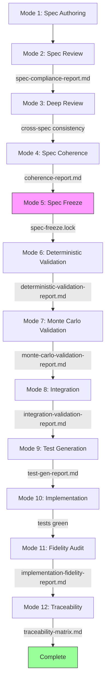
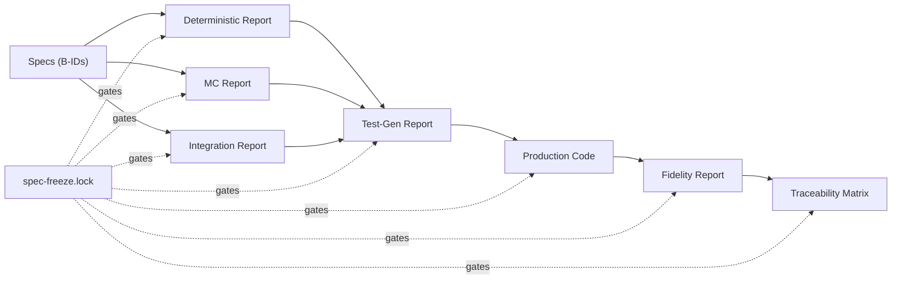
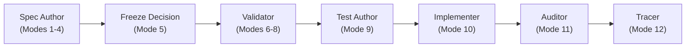

# Chapter 1: The Engineering Workflow

## The Problem That Created This Pipeline

If you have worked on a software team for any length of time, you have lived through this. Someone has an idea. It gets discussed, maybe written up in a ticket, and handed to a developer. The developer writes code based on what they understood from the discussion. Six weeks later, the person who had the idea looks at what was built and says "that's not what I meant." The developer pulls up the ticket and points to the sentence that clearly supports what they built. The person with the idea points to a different sentence that clearly supports what they meant. Both are right. Both read the same document. The document was never a contract; it was a summary of a conversation, and conversations are ambiguous.

That is the old version of the problem. There is a new one.

Early in this project, I spent an embarrassing amount of time trying to solve an engineering problem by having better conversations.

I would establish something in a spec: a naming constraint, a dependency direction, a behavioral boundary. A few sessions later, I would find it had drifted. Or flat-out ignored. A slightly different interpretation here, a reasonable-seeming assumption there. I would push back, re-explain, be more explicit. The next response was correct. Two exchanges later, the drift was back.

I escalated. More context, longer preambles, more explicit constraints in the prompt. Nothing stuck. At some point I complained about this directly to the model, which is the kind of thing you do when you have run out of technical ideas. The model apologized and explained itself, which did not help. Did I ever curse at it? You know I did.

The problem was not instruction quality. The model was not failing to follow instructions. It was doing exactly what it is optimized to do: executing the current instruction window well. That is its job.

My job is different. When I make a decision in module A, I am holding module B in mind, and the API contract, and what happens in three months when we add a second person to the plan. That is global, cross-time reasoning. The model does not have a persistent system model. It has the current context plus what training gave it. A constraint stated in the window is respected in the window. A constraint that exists outside the window, because it was established two sessions ago or because it lives in an invariant across ten specs, is not something the model will maintain autonomously.

Once I stopped trying to fix this by arguing with the tool, the solution was obvious: externalize the constraints. Write them into specs. Lock them into artifacts. Enforce them with gates. Do not describe the system in a prompt; encode it in a structure the model operates within.

The twelve modes described in this chapter are that structure.

## What Behavioral Contracts Replace

The gap between a narrative requirement and a behavioral contract is not a formatting difference. It is a thinking difference.

Consider: "The withdrawal calculator handles account withdrawals, taking into account the account type, balance, and any applicable penalties." Every engineer who reads this nods. This is not a spec. It is a description of what the engineer already knows is true about the system. It answers none of the questions that matter when you sit down to write code. What happens if the requested withdrawal exceeds the available balance? Exception? Return value? Which exception? What message? Is the early withdrawal penalty 10%? At what age threshold? Is that hardcoded or configurable?

A behavioral contract for the same requirement reads differently:

> **B-007:** Given a `PersonConfig` with `birthDate = 1955-06-15` and `retirementAge = 67`, the system computes retirement start as `2022-06-15`, the exact date obtained by adding 67 years to the birthdate. This is distinct from January 1st of the retirement year.

> **V-003:** `retirementAge` must be in the range `[55, 75]` inclusive. Values outside this range throw `ValidationException(INVALID_RETIREMENT_AGE)`. The check runs at scenario validation time, before any simulation begins.

> **AT-007 (Boundary):** Given `retirementAge = 54`, validation throws `ValidationException` with code `INVALID_RETIREMENT_AGE`. Given `retirementAge = 55`, validation passes.

The developer implementing this does not need to make any assumptions. The tester reads off the test cases directly. The reviewer checks that the boundary is `[55, 75]` inclusive, not `(55, 75)` exclusive. The edge cases are designed, not discovered during implementation.

This is spec-first engineering: the discipline of writing those contracts before writing any code, and enforcing that the contracts are complete before implementation begins. It does not mean you know everything upfront. It means that when you do not know something, you say so explicitly, as an out-of-scope decision, rather than leaving it as an implicit assumption in the code.

None of this is new. Formal specifications, behavioral contracts, and traceability requirements have been advocated and practiced for decades. TDD, BDD, formal methods, IEEE 830. What is different in this book is the implementation context: the entity translating spec to artifact is a generative model, not a deterministic compiler or a human following documented procedures. That shift is what forces the additional structure: the freeze gate, the no-memory rule, the manifest audit trail, the formal revision requests. The discipline is established. The adaptation is new.

## The Pipeline

The engineering workflow is a sequential, artifact-gated pipeline with twelve modes. Each mode has a specific job, produces a specific artifact, and gates the next mode on whether that artifact passes.

```
Mode 1  — Spec Authoring                 (free form)
Mode 2  — /spec-review                   → spec-compliance-report.md
Mode 3  — /spec-deep-review              → cross-spec consistency report
Mode 4  — /spec-coherence                → coherence-report.md
Mode 5  — Spec Freeze                    → engineering/spec-freeze.lock
Mode 6  — /spec-deterministic-validation → deterministic-validation-report.md
Mode 7  — /spec-monte-carlo-validation   → monte-carlo-validation-report.md
Mode 8  — /spec-integration              → integration-validation-report.md
Mode 9  — /spec-test-gen                 → test-gen-report.md
Mode 10 — /spec-execution                → production code (tests green)
Mode 11 — /spec-fidelity                 → implementation-fidelity-report.md
Mode 12 — /spec-traceability             → traceability-matrix.md
```



The gates are technical, not social. Every skill in Modes 6 through 12 begins by checking for `engineering/spec-freeze.lock`. If that file does not exist, the skill stops and refuses to proceed. The check happens in the first lines, before any analysis, before any file reads. There is no way to accidentally skip it.

Sequential means the forward direction: later modes build on earlier ones. It does not mean linear in the waterfall sense. Mode 6 might reveal an incorrect golden case, requiring an unfreeze and a spec correction. Mode 8 might find a semantic mismatch between the two engines. Mode 10 might surface a contradiction no validation caught. These discoveries are what the process is designed to surface. Every unfreeze, revision, and re-freeze is documented in the lock file. The iterations are explicit and traceable.

The modes govern when the spec surface is stable enough for a given kind of work. They do not gate when anyone writes code. Engineers write code throughout the project lifecycle, directing the LLM, editing files directly, or both. Code written outside Mode 10, or ahead of the spec surface, is normal. The drift marker discipline handles it.

### Spec Quality: Modes 1 through 4

Mode 1 is where you think. You write specs to understand the system you are building. A good spec author uses the act of writing a spec to discover the edge cases, the failure modes, the gaps in their mental model. If writing the spec is easy, you are probably not thinking hard enough.

A finished spec has a specific shape: a header with the spec ID and module, an Architecture Metadata table declaring the component's type and dependencies, an Out of Scope section with numbered exclusions, Core Behaviors with sequential IDs (B-001, B-002, ...), and Acceptance Tests with sequential IDs (AT-001, AT-002, ...) covering positive, negative, and boundary cases. Every behavior is covered by at least one test. Every test traces to at least one behavior. That bidirectional coverage rule is the most important structural property.

Mode 2 (`/spec-review`) checks individual specs for completeness. Does it have behavior IDs? Validation rules? Acceptance tests? Architecture metadata? An out-of-scope section? Is there deferral language hiding gaps? Mode 2 operates on one spec at a time and catches problems that require reading only that file.

Mode 3 (`/spec-deep-review`) operates at the system level. It looks across every spec simultaneously for inconsistencies that no per-spec review would catch. The methodology is grep first, read second: search for known stale terms, known count values, known deleted constructs, and show the raw evidence before asserting anything. In one system with a grammar-constrained LLM interface, the grammar vocabulary spec had ten dependent specs referencing its action, target, and parameter lists. When a grouped target was replaced with eight fine-grained targets, Mode 3 caught that five dependent specs still referenced the old target. None of those would have failed Mode 2. I ran Mode 3 eight times on one production spec surface before it came back clean. Each run found something.

Mode 3 also enforces a discipline that applies to the entire pipeline: every behavioral claim must be grounded in a tool call from the current session. Not memory. Not inference from a prior conversation. A concrete tool call: grep the file, read the section, show the evidence. The model has no persistent cross-session state. A decision made in yesterday's session does not exist in today's context window. This is the NO-MEMORY RULE, and without it the model will confidently assert things about specs it has not actually read.

Mode 4 (`/spec-coherence`) uses a fundamentally different methodology: read first, trace through. It picks an entry point, follows a data value through the dependency graph from spec to spec, and at each handoff asks: does the consumer expect exactly what the producer provides? The failures it catches, contract mismatches, semantic disagreements, lifecycle gaps, are not visible to any grep. They only surface when you follow the flow all the way through.

The three review modes are separate because they operate at different scopes and cadences. Mode 2 gives fast feedback after writing a single spec. Mode 3 makes sense in batches, after a wave of related changes. Mode 4 runs when contracts need end-to-end tracing. Merging them would mean running expensive cross-spec audits for every individual spec change.

### The Freeze: Mode 5

Mode 5 is the only mode that cannot be automated. Every other mode is a skill that Claude executes. The freeze is a human decision: you have decided that the specs are complete, that you are done discovering requirements, and that you are ready to commit to implementation. No algorithm can make that call.

You write a lock file, create a git tag, and commit. If you later discover a gap, you explicitly unfreeze, make the revision, and refreeze. The friction is the point. You should not be able to slide from spec-writing into implementation without noticing.

### Validation: Modes 6 through 8

Mode 6 (`/spec-deterministic-validation`) checks whether the specs are correct, not just consistent. Modes 2 through 4 verify internal consistency. Mode 6 introduces external authority: IRS publications, SSA data, actuarial tables. You can write a spec for an RMD calculator that passes every review mode and produces wrong values because someone misread the divisor table. Mode 6 catches this.

A concrete golden case from the example system:

> **AT-D-001 (Positive, Golden): RMD at age 75**
> Given: `age = 75`; `totalBalance = 500_000_00`; `divisors[75] = 24.6`
> When: RMD calculated
> Then: `RMD = round(500_000_00 / 24.6) = 20_325_203` cents ($203,252.03)
> Source: IRS Pub. 590-B 2022, Table III, age 75 → divisor 24.6

That test does not verify that the code matches the spec. It verifies that the spec produces the same result as IRS Publication 590-B. If the spec had the wrong divisor, this test would fail even if the code perfectly matched the spec. The external authority is the final arbiter. Without empirical anchoring, validation measures consistency. With empirical anchoring, it measures correctness.

Mode 7 (`/spec-monte-carlo-validation`) validates the stochastic engine against existing mathematical art. Stochastic validation is statistical: the property is never "the mean is exactly 0.07" but "the sample mean falls within the confidence interval consistent with N = 10,000 runs." Mode 7 requires fixed seeds, explicit N, formal hypothesis tests, and defined tolerances. The most important test is the degeneracy case: when all return volatilities are zero, the Monte Carlo engine must produce exactly the same output as the deterministic engine.

Mode 8 (`/spec-integration`) validates the bridge between the two engines. Both engines can pass their individual validations and still be semantically inconsistent with each other. In one production deployment, Mode 8 found seven defects on its first run. The floor definition defect is illustrative: the deterministic engine compared terminal portfolio value against an inflation-adjusted floor while the Monte Carlo engine compared against a nominal floor. Both behaviors were specified somewhere in the specs, but the two specs had diverged. The fix required an explicit semantic decision: the floor is nominal everywhere. That decision was documented in the lock file as a formal revision.

### Build: Modes 9 and 10

Mode 9 (`/spec-test-gen`) enforces test-first development structurally. Before anyone writes a line of production code, the entire test suite exists. Every acceptance test, every invariant test, every unit test. They all compile. They all fail. That is the starting condition.

The hard rule: zero placeholder assertions. `assertTrue(true, "placeholder")` is never acceptable. If the production class does not exist yet, the test is written against the expected public API. It will fail to compile until implementation is written. That is correct. A test that passes before production code exists is not a test.

Mode 10 (`/spec-execution`) makes the failing tests pass. Claude transitions from test author to implementation assistant operating under frozen contracts. The specs are read-only. The tests are the behavioral authority. Any inconsistency or conflict must be raised as a Formal Spec Revision Request:

```
FORMAL SPEC REVISION REQUEST

Conflict type: CROSS-SPEC-CONTRADICTION
Specs affected: LUM-SVC-004, LUM-DAC-001
Description: LUM-SVC-004 §SimulationService imports DataSource and
  raw repository interfaces directly, but LUM-DAC-001 B-001/B-003 requires
  all data access to go through the access-bean layer. The implementation
  cannot satisfy both specs simultaneously.
Options:
  A) Update LUM-SVC-004 to use access beans instead of raw repos (recommended)
  B) Relax LUM-DAC-001 to permit direct repo access in service layer
  C) Create a separate adapter in the data-access module that satisfies both
Recommendation: Option A — access beans are LUM-DAC-001's primary purpose;
  the service layer should not bypass them.
```

Claude does not choose an option. It stops and waits. The user decides. That decision becomes a formal revision entry in the lock file. The format looks like overhead until you are six months into a production incident tracing a decision that nobody wrote down.

Code divergence is not confined to Mode 10. Engineers write prototypes before specs exist. Bug fixes happen between validation passes. Refactors improve structure in ways the spec did not anticipate. This is normal and not discouraged. Two markers handle it: `[SPEC-DRIFT]` marks code that has moved ahead of its spec, and `[SPEC-INCOMPLETE]` marks code that has not caught up yet. Every marker carries a spec ID and a one-line description. Mode 11 surfaces all unresolved markers.

### Audit: Modes 11 and 12

Mode 11 (`/spec-fidelity`) is the post-implementation audit. Is the code faithful to the specs? Does it do only what the specs sanction? Is every spec behavior present? The need for this is not obvious until you understand drift laundering: an implementation that is misaligned with the spec can be refined toward internal consistency where all the parts agree with each other and all the tests pass, but the whole has drifted from the specification. Tests generated from the same context as the code cannot catch this. Mode 11 catches it by comparing directly against the frozen spec surface.

Mode 12 (`/spec-traceability`) maps every requirement to its full chain: behavior ID to acceptance test to production class to unit test. It also strengthens tests against common mutations (operator flips, comparison swaps, removed guards) and verifies that CI gates block placeholder assertions. After Mode 12 passes, the implementation is specified, tested, audited, traced, hardened, and enforced.

## The Lock File Gate

The lock file at `engineering/spec-freeze.lock` is the single most important architectural decision in the pipeline.

It makes the cost of late spec changes visible. Without a gate, someone changes a spec during implementation, updates a few tests, and moves on. The change is invisible: it happened in the same week as a dozen other commits, with no record of why it changed or what code was written before the change. With a gate, any spec change after freeze requires explicitly unfreezing, making the revision, and re-freezing. The process creates a record and creates friction. That friction is the point.

Late spec changes are not a sign of a broken process. They are inevitable; implementation always reveals things that spec authoring missed. The lock file does not prevent late changes. It makes them formal. When you unfreeze to make a revision, you write a reason. When you re-freeze, you update the log. The revision history becomes an engineering record of how the system's design evolved and why.

In one production project, the initial freeze was established with a clean spec-review pass across all modules and three consecutive clean Mode 3 runs. Then Mode 8 ran and found seven defects. Those defects drove the first formal revision. Mode 8 ran again and found two minor pseudocode inconsistencies. Second revision. The coverage audit found 85 specs missing explicit Out of Scope sections. Third revision. And so on through eight revisions, each documented. By the time implementation began, the lock file was a complete engineering history of every structural decision made about the spec surface.

The value of that history is not auditing. It is debugging. When you are deep in implementation and something does not make sense, the lock file is the first place to look.

What happens when you run Mode 6 without a lock file:

```
spec-deterministic-validation cannot begin until the spec freeze is confirmed and the lock file is present.

Expected: engineering/spec-freeze.lock
Found: (file does not exist)

The lock file is the gate. No lock file = no execution.
```

The message is not negotiable. The skill does not offer to create the lock file for you. It does not offer an override flag. It stops and waits.

## The Artifact Chain

Each mode produces two artifacts: a human-readable report and a machine-readable manifest. The report is the deliverable. The manifest is the audit trail that proves the work was done and what evidence supports each conclusion. Evidence must be specific. A manifest entry that says "evidence: checked" or "evidence: looks correct" is an audit trail violation.



The artifacts are not just outputs. They are inputs to subsequent modes. The deterministic validation report's golden cases become the behavioral authority for Mode 9's acceptance tests. The integration report's semantic decisions become the reference when Mode 10 encounters a question about floor definitions. A gap in the traceability matrix, a behavior ID with no code location, is a signal that something was not implemented.

A concrete traceability matrix entry:

```
Req:
LUM-ENG-015 B-013 — RMD at age 75, IRS Table III divisor 24.6 → $203,252.03 on $5M balance

AT:
AT-D-001

Code:
com.lumiscape.engine.calc / RmdCalculator.java

Test:
RmdCalculatorUnitTest#givenAge75_whenComputeRmd_thenUsesIRSTableDivisor()
```

You can follow this chain in either direction. Given a requirement ID, you find every artifact that touches it. Given a test failure, you trace back to the requirement it protects and the external authority that defines correct behavior.

I have debugged systems with no artifact chain. You reconstruct intent from commit messages, code comments, and whoever is still around to remember. It is slow, unreliable, and entirely avoidable.

## What Goes Wrong Without This Structure

The failure modes are instructive because they happen in a predictable sequence.

### No Spec Review

The team writes specs, actual documents rather than just tickets. But spec review is time-consuming and everyone is busy, so the specs go directly from authoring to implementation. Six weeks into development, a tester discovers that the retirement age validation accepts ages down to 18 ("we did not explicitly say it should not"). A developer discovers that the spending floor comparison uses an inflation-adjusted floor while another part of the system uses a nominal floor. A third developer has been writing RMD calculations against a divisor table that was superseded in 2022.

None of these problems would have survived Mode 2 spec review. But there was no Mode 2. Each problem is discovered during implementation, when fixing it requires changing specs, changing tests, and re-implementing code that was already written.

### No Deep Review

Spec review runs on every spec. They all pass. The team proceeds to implementation with confidence. Integration testing begins six weeks later. The validator for `Scenario` is looking for a field called `startYear`, but the `Scenario` DTO has a field called `startDate`. The validator compiles, runs, finds nothing to validate, and silently permits invalid scenarios through. The downstream engine fails with a confusing arithmetic error when it tries to compute year ranges from a null start year.

Finding this in integration requires reading the validator spec, reading the DTO spec, realizing they describe different fields on the same object, tracing back to where the divergence happened, and then deciding which name is correct. That is a day of debugging what should have been a five-minute grep. Mode 3 would have flagged this on its first run with an exact line number and exact stale text.

### No Validation Modes

Spec review and deep review both run. The specs are clean. The team freezes and begins implementation. Three months in, a financial domain expert reviews the RMD calculations and discovers that the implementation uses the pre-2022 IRS divisor table. Every RMD calculation in the system is producing slightly different values than current IRS requirements. The fix requires updating the divisor table, updating specs, updating tests, and re-running every calculation that stored results.

Mode 6 would have caught this before implementation began. The golden case `AT-D-001` verifies that the divisor for age 75 is 24.6 (the 2022+ table value). The pre-2022 table had a different divisor for that age. Any implementation using the old table would have failed immediately.

Three months of work, and the fix is a different table. The table was published. It was public. Mode 6 would have caught it on day one.

## Watching the Model

The conversation did not stop when I built this pipeline. You are still talking to the model. Each mode runs in a Claude conversation: you invoke the skill, the model reads the spec files, runs the checks, and reports findings. What changed is what the model has access to when you start: not a free-form description of the system in the prompt, but a structured surface, specs, skill instructions, lock files, that constrain what the model can do and require it to show its work.

This does not mean the structure makes the model reliable. It will still forget. It will skip steps. It will make mistakes even inside a well-defined skill. The context window is finite; a long session compacts earlier work and the model loses it. A skill instruction that seemed clear will be misread. A manifest entry will look plausible and be wrong.

Your job is to watch for it. Stop the model when something looks off. Question what it asserts. Ask for evidence. Push back when the output is too fast or too clean. When the same failure pattern repeats, that is your cue to go back to the skill file and make it harder to make that mistake again. The skills are part of the engineering. They improve over time.

The model will never be perfectly reliable. Do not fight that. Engineer around it.

## Adapting This Workflow

Every skill in this pipeline includes a `## PROJECT CONFIGURATION` block that contains the values specific to this project: lock file path, artifact output paths, spec ID prefix, domain-specific component lists. Everything outside that block is general-purpose. If you take this workflow to a different project, you replace the configuration block in each skill, replace the project-specific phases in `spec-deep-review`, and the rest works as-is.

The `spec-review` skill configuration block is minimal:

```
| Setting | This project (Lumiscape) |
|---------|--------------------------|
| Project name | Lumiscape |
| Spec ID prefix | LUM |
| Module naming convention | lumiscape-<name> |
| Null / Optional rules spec | LUM-SYS-002-NULL-RULES |
| Component types | dto | calculator | accumulator | validation | rules |
|                 | config | repository | runner | engine | service |
|                 | pipeline | router | narrator |
```

For a different project, you replace "Lumiscape" with your project name, change the spec ID prefix (say, "PAY" for a payroll system), update the module naming convention, replace the null rules spec reference with your own, and update the component type list to match your domain. Every authoring rule, architecture extraction rule, diagram generation rule, and the workflow itself stays unchanged.

The `spec-deep-review` skill requires more adaptation because it contains the project-specific vocabulary tables and cross-spec invariant pairs:

**Replace Phase 1** with your project's dependent spec relationships. If you have a canonical enumeration spec, or an API surface spec that other specs reference, list those relationships explicitly.

**Replace Phase 2** with your project's stale vocabulary table. What terms have been renamed, removed, or replaced in your project's history? List them. If you are starting from scratch, this table starts empty and grows as vocabulary changes occur.

**Replace Phase 4** with your project's cross-spec invariant pairs. What DTOs are validated by validators? What enum values are used by which processors? These relationships are project-specific, but the pattern of checking them is identical.

**Keep Phases 6, 7, and 8** exactly as they are. Architecture Metadata Completeness, Deferral Language, and Cascade Check are domain-agnostic.

Concrete example: if you are adapting this for a payroll system, your Phase 2 stale vocabulary table might look like:

| Stale term | Correct replacement | Notes |
|---|---|---|
| `grossPay` | `grossWagesCents` | Renamed in sprint 4 for consistency |
| `employeeId` | `workerId` | Renamed when contractor support added |
| `biweekly` as a pay period | `BI_WEEKLY` (enum value) | Replaced string with enum in v2 |

Your Phase 4 invariants might include:

| Invariant | Source spec | What to flag |
|---|---|---|
| Net pay = gross - federal - state - FICA | PAY-ENG-001 | Any spec claiming different deduction order |
| FICA employer match is 6.2% (IRS-hardcoded) | PAY-ENG-005 | Any spec claiming a configurable rate |

The infrastructure is reusable. The project-specific knowledge is the only thing you supply.


