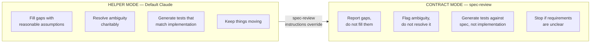
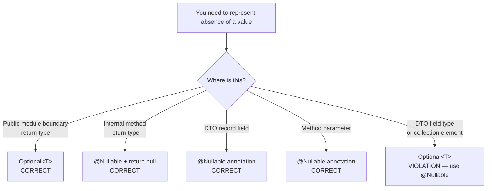
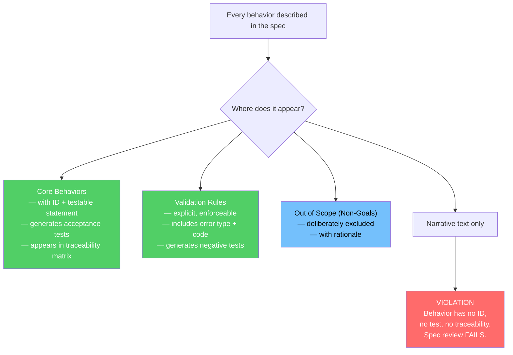
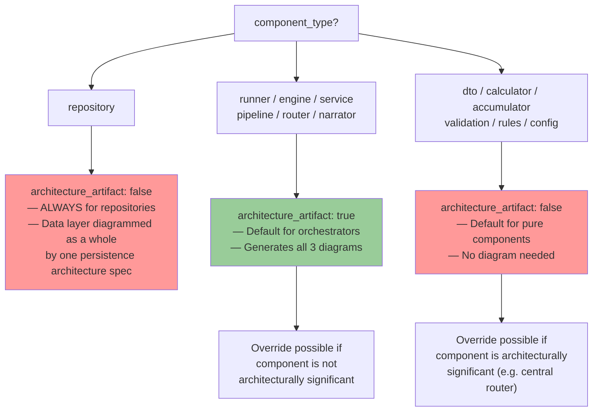
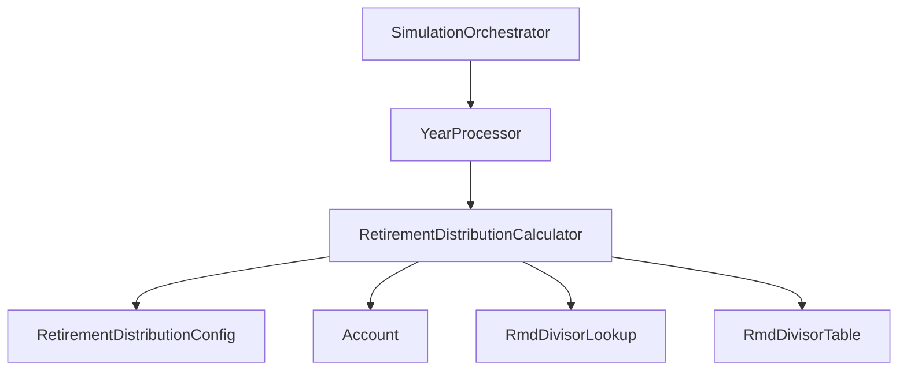
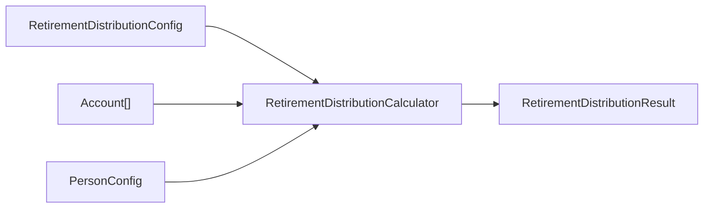
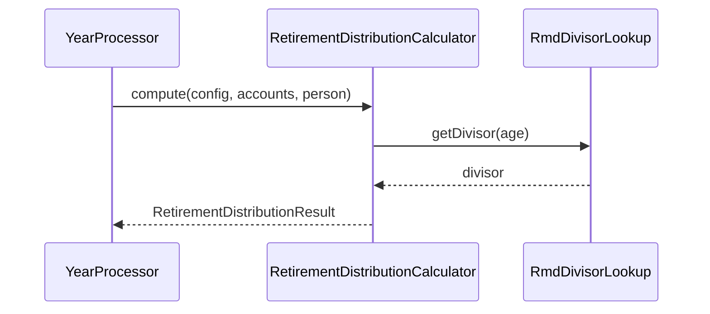
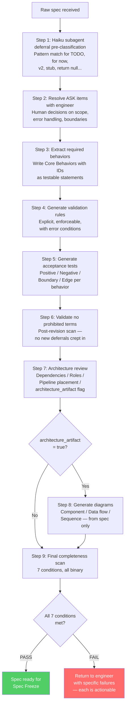

# Chapter 2: Writing Specs That Are Actually Contracts

## The Problem With Engineer-Written Specs

Engineers are good at thinking through systems and bad at writing contracts. Not a criticism — it follows directly from how engineers think. When an engineer writes a spec, the mental model already exists in their head. They write down what's interesting or novel, assume the reader shares their context for the obvious parts, and leave edge cases as implementation details to be worked out later. The result accurately describes what the author had in mind. It does not constrain what the implementer will build.

That gap between intent and constraint is where bugs are born. Not the obvious bugs — those get caught in testing. The specification bugs: behaviors that work exactly as implemented but not as intended, because the spec never made the distinction clear.

Here's a concrete before/after. How an engineer typically writes a requirement:

> The withdrawal calculator handles account withdrawals, taking into account the account type, balance, and any applicable penalties or restrictions. Edge cases for trust accounts and retirement accounts are handled appropriately. Invalid inputs are rejected with an appropriate error.

Every engineer who reads this nods. Of course it handles account type and balance. Of course invalid inputs are rejected. This is not a spec — it's a description of what the engineer already knows is true about the system. It answers none of the questions that matter when you sit down to write code:

- What happens if the requested withdrawal amount exceeds the available balance? Exception? Return value? Which exception? What message?
- What is "an appropriate error" for an invalid account type? A ValidationException? A null return? An IllegalArgumentException?
- What does "handled appropriately" mean for a trust account? RMD rules? Distribution rules? These are entirely different regulatory frameworks.
- Is the early withdrawal penalty 10%? At what age threshold? Is that hardcoded or configurable?

Now look at what the same content becomes as a behavioral contract:

```
LUM-ENG-WD-001: Given a withdrawal request where requestedAmount > account.balance,
throw InsufficientFundsException with available balance in the exception detail field.

LUM-ENG-WD-002: Given a TRADITIONAL_IRA account where the account holder age < 59.5,
apply a 10% early withdrawal penalty to the taxable portion. The 59.5 threshold is
a hardcoded IRS constant, not a configuration parameter.

LUM-ENG-WD-003: Given a null accountType, throw ValidationException with error code
MISSING_ACCOUNT_TYPE before any withdrawal calculation begins.

LUM-ENG-WD-004: Given a trust account withdrawal, apply trust distribution rules
as defined in LUM-ENG-TR-001. Trust rules take precedence over standard withdrawal
logic but may not override RMD minimums.
```

Four behaviors the narrative conflated into one paragraph. Each has a behavior ID. Each is testable: pass `requestedAmount > account.balance`, assert `InsufficientFundsException` is thrown with the right field populated. Pass `age = 58`, verify the 10% penalty is applied. Pass `accountType = null`, assert the specific error code. None of those tests are writable from the narrative paragraph, because the narrative paragraph doesn't specify any of that.

`/spec-review` is designed to close that gap. Its job is to transform a narrative spec — which describes what a system should do — into a behavioral contract — which specifies what a system must do, what it must not do, what it must reject, and what is explicitly out of scope. Those are different documents. The review process is how you get from one to the other.

## The Role Definition: CONTRACT MODE vs HELPER MODE

---
**`/spec-review` instructions — §ROLE DEFINITION:**

```
Claude is NOT:
- a product manager
- a creative assistant
- a "reasonable engineer" making judgment calls
- an authority on correctness

Claude IS:
- a contract spec author
- a requirements extractor
- a test generator
- an implementation engine operating under constraints
- an architecture extractor (from specs only)

Claude must not improvise scope or soften requirements.
Claude must not invent architecture or diagrams.

Architecture must be derived strictly from structured spec content.
```
---

---
**`/spec-review` instructions — §OPERATING PRINCIPLE:**

```
Claude must operate in CONTRACT MODE, not HELPER MODE.

Contract mode means:
- precision over helpfulness
- completeness over speed
- correctness over plausibility
```
---

The skill opens with a role definition that looks redundant until you understand what problem it's solving.

By default, Claude behaves like a helpful assistant. A helpful assistant, when it encounters a spec gap, fills the gap with a reasonable assumption. When asked to generate acceptance tests for an ambiguous behavior, it interprets the ambiguity charitably and generates tests for the most sensible reading. When asked to extract behaviors from a narrative that mixes behavioral requirements with design commentary, it sorts things out as best it can. In normal usage, that's exactly what you want.

It's exactly the wrong behavior for spec review. The role definition overrides these defaults completely:

**Claude IS:** a contract spec author, a requirements extractor, a test generator, an implementation engine operating under constraints, an architecture extractor from specs only.

**Claude is NOT:** a product manager, a creative assistant, a "reasonable engineer" making judgment calls, an authority on correctness.

The "not" list matters as much as the "is" list. Let's walk through each prohibition.

**Not a product manager.** Suppose the spec says: "Handle edge cases for retirement age." A product manager would define those — early retirement at 55, standard at 65, late at 70. Claude in CONTRACT MODE does not. It stops: the spec mentions retirement age edge cases but does not define them. The following are not specified: minimum retirement age, maximum retirement age, behavior when the input falls below the minimum, behavior when it exceeds the maximum. Please provide these explicitly. The friction is intentional. The engineer who wrote "handle edge cases" had something specific in mind, and that specific thing needs to be in the spec, not inferred during review.

**Not a "reasonable engineer" making judgment calls.** Suppose the spec describes a validation error but doesn't say whether it's a hard error (throws an exception, aborts the operation) or a soft error (collects into a result object, allows the operation to continue). A reasonable engineer might look at the context and decide "this feels like a hard error." CONTRACT MODE doesn't allow this. The choice affects every caller of this component. It must be explicit. Claude stops: this validation rule does not specify whether the failure mode is a thrown exception or a collected validation result. The distinction affects the caller contract. Please clarify.

**Not an authority on correctness.** This one is subtle. Claude has extensive knowledge of software engineering — standard patterns for withdrawal calculators, RMD computation, tax bracket logic. In CONTRACT MODE, that knowledge is irrelevant. The spec defines correct behavior. If the spec says to compute RMD using the 2000 IRS tables rather than the 2022 tables, Claude does not correct it — it implements the 2000 tables and flags the discrepancy as a question. Correctness authority belongs to the spec, the tests, the compiler, and the runtime.

**Contract spec author.** Every behavior gets a testable statement with a behavior ID, not a narrative description. Design choices — how the system accomplishes something — do not appear in Core Behaviors. Only behavioral requirements — what the system must do — appear there.

**Architecture extractor from specs only.** Diagrams are derived from the spec's dependency list and architecture metadata. Claude's general knowledge of "what makes sense" for a retirement calculation system is not a source. If the spec doesn't list a dependency, it doesn't appear in the diagram. If the spec's data flow is incomplete, diagram generation stops and asks for clarification.

The operating principle at the end of the skill captures this in three lines:

> Contract mode means: precision over helpfulness, completeness over speed, correctness over plausibility.

Not abstract values. If you're unsure, report the ambiguity rather than filling it in (precision over helpfulness). If covering all behaviors takes longer than expected, take the time (completeness over speed). If what you can infer is plausible but not certain, it doesn't go in the spec (correctness over plausibility).

The switch between modes:



The override is total. For the duration of a spec review session, every default helpful behavior is suppressed in favor of the contractual behavior. The skill instructions are not guidelines — they are operating constraints that Claude follows exactly.

## The No-Deferrals Policy: Every Prohibited Term Has a Failure Mode

---
**`/spec-review` instructions — §SPEC INTEGRITY: NO DEFERRALS POLICY:**

```
Claude must not include deferral language in any specification.

Prohibited terms:
- TODO
- defer / deferred
- for now
- later
- v2 / future version
- stub
- placeholder
- return null (in non-DTO code — see null rules below)
- not implemented
- future work
```
---

The no-deferrals policy prohibits a specific set of terms from specs: `TODO`, `defer`, `deferred`, `for now`, `later`, `v2` / `future version`, `stub`, `placeholder`, `not implemented`, `future work`. Not arbitrary. Each is a specific failure mode.

**`TODO`** means a behavior is undefined. The engineer knew something needed to be decided and didn't decide it. When the implementer hits a TODO in a spec, one of three things happens: they skip the behavior, they invent it based on their own judgment, or they stop and ask. The first two are silent failures. The third is what should have happened at spec review time. Every TODO is an unresolved behavioral question that will be silently wrong or silently omitted.

**`for now`** means the behavior is temporary. "For now, stateCode is case-insensitive" will cause a production incident. The system goes live accepting lowercase state codes. Six months later, someone changes the validation because case-sensitivity was always intended. Every client sending lowercase codes breaks. The word "now" in a spec refers to the implementation moment, which has no meaning once the system is in production. Behavior is either specified or it is not.

**`v2`** and **`future version`** create an implicit second scope that never gets specified. "Trust account withdrawal logic will be implemented in v2" sounds like a plan. What it actually is: an acknowledgment that the behavior is not specified, combined with a false assurance it will be handled later. v2 planning happens when v2 starts, and by then the scope, the engineer, and the context have all changed. The correct approach: if trust account withdrawal logic is not being implemented now, it goes in `OUT OF SCOPE (NON-GOALS)` with a clear statement of why. Not deferred — excluded.

**`stub`** and **`placeholder`** are the code analogs of TODO. A stub method compiles. Tests that call it pass if the stub returns a neutral value. The behavior is absent, but the structural presence of the method makes it invisible. "The RothConversionCalculator has a placeholder for state tax impact" means there's a method called something like `computeStateTaxImpact()` that returns zero or null. Every test for the Roth calculator passes. The state tax impact is silently wrong for every user in a state with income tax. When someone discovers this, the investigation will find a spec that said "placeholder" and a test suite that never tested the actual behavior.

**`return null` in a public module boundary method** is the runtime version of a deferral. A method that returns `null` when it can't find a result shifts the problem to its caller. If the caller doesn't check for null — and in a codebase with many callers, some won't — the null propagates until something throws a NullPointerException somewhere else entirely. The stack trace points to the crash site, not the source. The correct behavior: at a module boundary, return `Optional.empty()`. The caller is forced to handle the absent case at the point of receipt, not downstream.

Here's what deferral language in a spec looks like, and the review output it produces:

```
## Roth Conversion Calculator

The calculator computes Roth conversion recommendations.
For now, we only consider federal tax brackets. State tax
handling will be added in v2. TODO: add income phase-out
thresholds when the income calculation is more settled.
```

Review output:

```
DEFERRAL VIOLATIONS FOUND — spec cannot proceed:

1. "For now" (line 4): "for now, we only consider federal tax brackets"
   Action required: specify whether state tax handling is OUT OF SCOPE
   for this version (explicitly excluded) or whether it must be included.
   No partial implementation is permitted.

2. "v2" (line 5): "will be added in v2"
   Action required: same as above. If excluded, move to OUT OF SCOPE
   (NON-GOALS) with explicit rationale.

3. "TODO" (line 6): "TODO: add income phase-out thresholds"
   Action required: either specify the income phase-out thresholds now
   or move the behavior to OUT OF SCOPE (NON-GOALS). The TODO construct
   is not permitted in a specification.
```

The `OUT OF SCOPE (NON-GOALS)` section is not a dumping ground for things you don't want to think about. It's a deliberate, documented decision. When a future engineer asks "why doesn't this calculator handle state taxes?" the answer is in the spec: "State tax impact on Roth conversion optimization is explicitly excluded from this calculator. Rationale: state tax rules vary across 51 jurisdictions and require a separate data model. The RothConversionCalculator operates on federal tax brackets only." That is a spec decision. "v2" is not.

## Null and Optional: The Precise Three-Pattern Rule

---
**`/spec-review` instructions — §SPEC INTEGRITY — Null and Optional rules section:**

```
Optional<T> is allowed ONLY as a return type at module boundaries (public engine API, public service layer).
Optional<T> is PROHIBITED in: DTO fields, method parameters, internal methods, collections, GWT types.

Internal non-DTO methods (private/package-private): use @Nullable on return type + return null.
DTO record fields: use @Nullable annotation — null is the correct absent value, never Optional.

When reviewing a spec:
- return null in a public module boundary method → violation → replace with Optional.empty()
- return null in an internal @Nullable-annotated method → allowed
- Optional<T> in DTO field or method parameter → violation → replace with @Nullable

If a behavior cannot be fully specified or implemented now, Claude must do exactly one of:

1) Place it in a section titled:

   OUT OF SCOPE (NON-GOALS)

OR

2) Stop and ask for clarification before continuing.

Claude may NOT:
- partially implement
- insert TODOs
- soften requirements
- describe behavior that is not enforced
```
---

The no-deferrals policy extends into rules about `null` and `Optional<T>`. These rules exist because `null` returns and absent Optional handling are the runtime form of behavioral deferrals: the question of "what do we do when this value doesn't exist" gets deferred from the method that knows the answer to every caller that has to handle it.

There are three patterns. You have to understand all three to apply them correctly, because the wrong pattern in the wrong place creates distinct failure modes.

**Pattern 1: `Optional<T>` as return type at a module boundary.** This is correct. The canonical example:

```java
// Public engine API — module boundary
public Optional<Account> findById(long id) {
    return accounts.stream()
        .filter(a -> a.id() == id)
        .findFirst();
}
```

The caller receives an `Optional<Account>`. The Java compiler forces the caller to handle the absent case before using the value. There's no way to call `.getBalance()` on the result without first checking whether an account exists. The contract is expressed in the return type. Correct at any public API boundary between modules.

**Pattern 2: `@Nullable` on an internal method return type.** Correct for private and package-private methods:

```java
// Internal method — not a module boundary
@Nullable
private TaxBracket findBracket(double income) {
    for (TaxBracket bracket : brackets) {
        if (income >= bracket.lower() && income < bracket.upper()) {
            return bracket;
        }
    }
    return null;  // allowed because method is annotated @Nullable
}
```

The `@Nullable` annotation makes the nullability visible in the method signature. Static analysis tools (FindBugs, NullAway, IntelliJ's inspections) warn if the caller dereferences the result without a null check. The behavior is explicit without the overhead of wrapping in Optional and then unwrapping. Right for internal methods where the caller is in the same class or package and the null semantics are clear.

**Pattern 3: `Optional<T>` in a DTO field.** Wrong:

```java
// Wrong — never do this
public record PersonConfig(
    String firstName,
    String lastName,
    Optional<String> middleName  // violation
) {}
```

The failure modes are concrete. Jackson doesn't serialize `Optional` cleanly by default — you need a special module, and even with it, the serialized form is unexpected (`{"middleName":{"present":true,"value":"James"}}` instead of `{"middleName":"James"}`). Beyond serialization, it wraps a simple absent value in an object wrapper. Every piece of code that reads the middle name must call `.orElse(null)` or `.orElse("")` or similar. The correct pattern:

```java
// Correct
public record PersonConfig(
    String firstName,
    String lastName,
    @Nullable String middleName  // null means absent
) {}
```

`null` is the correct absent value in a record field. `@Nullable` makes the nullability explicit and visible to static analysis without any of the Optional overhead.

Why does this matter at the spec level rather than code review? Because the spec describes the public API and internal patterns of the component. If the spec says "the PersonConfig DTO includes an optional middle name field" and the reviewer doesn't catch that "optional" means `@Nullable String`, not `Optional<String>`, the implementation follows the wrong pattern. By the time code review catches it, calling code may already be written against the `Optional<String>` API. The spec is the right place to establish these rules, before any code is written.

The decision tree for any absent-value situation:



## Behavioral Completeness: Every Behavior Has an ID or It Does Not Exist

---
**`/spec-review` instructions — §BEHAVIORAL COMPLETENESS RULE:**

```
Every behavior described must appear in exactly one location:

- Core Behaviors
- Validation Rules
- Out of Scope (Non-Goals)

Behavior must not appear only in narrative text.
```
---

Every behavior described in a spec must appear in exactly one of three locations: Core Behaviors, Validation Rules, or Out of Scope (Non-Goals). Not in narrative text.

This transforms the spec from a document into a structured database of behavioral requirements. The downstream consequence is direct: acceptance tests are generated from Core Behaviors only. A behavior that lives only in narrative will not appear in acceptance test generation. No behavior ID. No traceability matrix entry. Not enforced.

Here's a concrete example. The narrative section of a spec says:

> The RMD calculator computes the required minimum distribution based on the prior year-end balance. Distributions are calculated using the IRS Uniform Lifetime Table for non-spousal beneficiaries and the IRS Joint and Last Survivor Table when the spouse is the sole beneficiary and is more than 10 years younger.

Accurate. Both tables are required by IRS regulation. An engineer reading this understands what needs implementing. But none of it appears in Core Behaviors. At acceptance test generation time, the test generator reads Core Behaviors. The Core Behaviors section is empty. No tests are generated for RMD calculation. The implementer writes RMD code with no tests to catch whether they used the right table, the right divisor, the right age condition, or the right spousal threshold. The narrative described the behavior; the test suite doesn't verify it.

Here's the same content as properly specified behaviors:

```
LUM-ENG-015-CB-001: Given a traditional IRA with prior year-end balance B
and participant age A where A >= 73 and the beneficiary is not a spouse more
than 10 years younger, compute RMD = B / divisor(A) where divisor(A) is from
the 2022+ IRS Uniform Lifetime Table as specified in LUM-REF-003.

LUM-ENG-015-CB-002: Given a traditional IRA with prior year-end balance B,
participant age A where A >= 73, and the spouse is the sole designated
beneficiary with an age difference > 10 years (spouse is younger), compute
RMD = B / divisor(participantAge, spouseAge) using the IRS Joint and Last
Survivor Table as specified in LUM-REF-003.

LUM-ENG-015-CB-003: Given a participant age A < 73, return
NoRmdRequiredException. RMD requirements begin at age 73 per the SECURE 2.0
Act (2023).
```

Three testable behaviors. CB-001 can be tested with a specific balance and age, asserting the exact computed value against the IRS table divisor. CB-002 with a specific age pair, asserting the different divisor. CB-003 with age 72, asserting the exception type. The narrative described the same behavior. Only the structured Core Behaviors produce tests.

The practical discipline: if you find yourself explaining a behavior in narrative text, stop and ask whether you've also captured it in Core Behaviors with a behavior ID. If not, the spec is incomplete. The narrative is not normative — it explains and provides context. It does not constrain.

Every behavior must land in one of exactly three places:



## Core Behavior Authoring: Five Rules for Testable Statements

---
**`/spec-review` instructions — §CORE BEHAVIOR AUTHORING RULES:**

```
Claude must:

1. Identify REQUIRED behaviors.
2. Assign requirement IDs.
3. Express behaviors as testable statements.
4. Avoid interpretation or simplification.
5. Flag ambiguity instead of resolving it.

Claude must NOT:
- invent scope
- assume v2 behavior
- compress requirements
```
---

Five rules for authoring core behaviors. Each one addresses a specific way that behaviors fail to be testable.

**Rule 1: Identify REQUIRED behaviors, not design choices.** A behavior is what the system does from the caller's perspective. A design choice is how it does it internally. "The calculator uses a binary search to find the applicable tax bracket" is a design choice. "Given income I, return the tax bracket [lower, upper] where lower <= I < upper" is a behavior. Core Behaviors contain only behaviors.

This distinction matters because design choices change without breaking the contract. If the calculator switches from binary search to linear scan, the behavior is unchanged — same input, same output. Put the design choice in Core Behaviors and any implementation change becomes a "spec change," creating unnecessary friction. Keep them separate.

**Rule 2: Assign requirement IDs.** The format is `[SPEC-ID]-CB-[NNN]` — for example, `LUM-ENG-015-CB-001`. These IDs are stable references. They appear in the traceability matrix, in test class names, in code comments linking implementation to requirement. When you see `LUM-ENG-015-CB-007` in a test failure, you know immediately which spec to consult and which behavior is failing.

Behavior IDs also prevent accidental requirement removal. A narrative can be revised without anyone noticing that a behavior was dropped. A Core Behaviors section with IDs creates an audit trail: if CB-007 disappears from revision 3 to revision 4, that's a detectable change that requires justification, not an invisible paragraph edit.

**Rule 3: Express behaviors as testable statements.** The test of testability is simple: can you write a JUnit test that passes this specific input to this specific component and asserts this specific output or exception? If not, the behavior is not testable.

Before: "The system handles invalid state codes gracefully."

Not testable. "Gracefully" is not a postcondition.

After: "Given a stateCode value that is not in the 51-value valid set (50 states + DC), throw ValidationException with error code INVALID_STATE_CODE. The exception detail must include the invalid value that was rejected."

Testable. Pass "XX" as stateCode, assert ValidationException is thrown, assert getErrorCode() == INVALID_STATE_CODE, assert getDetail() contains "XX".

**Rule 4: Avoid interpretation.** If the spec says "recent transactions," Claude does not decide that "recent" means 90 days. It flags the ambiguity: the term "recent" in this context is undefined. Please specify the time window (e.g., 90 days, 12 months, since account open date). An interpretation made by the reviewer is one that bypasses the engineer who designed the system. Even if the interpretation is correct, the process is wrong: the spec should contain the decision, not the reviewer's guess.

**Rule 5: Flag ambiguity instead of resolving it.** The cost structure is asymmetric. Flagging an ambiguity at spec review costs one conversation turn: the reviewer flags it, the engineer clarifies, the behavior is written correctly. Resolving an ambiguity by assumption costs: one conversation turn where the engineer doesn't notice the assumption, then the implementation effort for the wrong behavior, the testing effort for the wrong behavior, the bug report when production reveals it, the investigation to trace the bug to the wrong assumption, the spec revision, the code change, and the regression test. Flagging is not slower — it's massively faster at the system level.

## Validation Rules: Explicit, Enforceable, With Error Conditions

---
**`/spec-review` instructions — §VALIDATION RULES REQUIREMENTS:**

```
Validation must:
- be explicit
- be enforceable
- include error conditions
- include rejection cases

Validation must NOT be implied.
```
---

Validation rules are a distinct category from core behaviors, and the distinction matters. A core behavior says what the system does when inputs are valid. A validation rule says what the system does when inputs are invalid. They need to be specified separately because the invalid-input paths are where most security vulnerabilities and data integrity bugs live.

The skill requires validation rules to have four properties: explicit, enforceable, include error conditions, include rejection cases.

**Explicit** means written down with specific values, not general terms. Compare:

Implicit: "The state code must be valid."

Explicit: "stateCode must be one of the 51 values in the valid-state-code set (50 US states plus DC, uppercase two-letter codes). Any other value, including lowercase codes (e.g., 'ca' instead of 'CA'), empty string, or null, throws ValidationException with error code INVALID_STATE_CODE."

The explicit version specifies that lowercase codes fail. Not obvious — some systems normalize case before validation. The explicit rule prevents that policy decision from being made silently at implementation time.

**Enforceable** means a test can be written that passes a violating input and verifies the rejection. If a validation rule can't be expressed as a failing test, it's not enforceable. "The retirement age should be reasonable" is not enforceable. "retirementAge must be in the range [55, 75] inclusive; values outside this range throw ValidationException with error code INVALID_RETIREMENT_AGE" is enforceable. Write a parameterized test with inputs 54, 55, 75, 76 and verify the first and last throw the exception while the middle two don't.

**Include error conditions** means the exception type and error code are specified, not left to the implementer. If the spec doesn't specify the error type, the implementer picks one. Now every caller has to handle the type that was picked, and if they expected a different type, they catch nothing. Error types and codes are part of the component's contract. They must be in the spec.

**Include rejection cases** means writing out the specific inputs that trigger rejection, not just describing the rule in general terms. "Retirement age must be between 55 and 75" doesn't specify what happens at 54, at 76, at 0, at -1, or at 200. The rejection cases make the boundary explicit:

```
VAL-001: retirementAge in [55, 75] inclusive → pass validation
VAL-002: retirementAge < 55 → throw ValidationException(INVALID_RETIREMENT_AGE),
         detail: "retirementAge 54 is below minimum 55"
VAL-003: retirementAge > 75 → throw ValidationException(INVALID_RETIREMENT_AGE),
         detail: "retirementAge 76 is above maximum 75"
VAL-004: retirementAge is null → throw ValidationException(MISSING_RETIREMENT_AGE)
```

Four rules. Four testable cases. No ambiguity about what happens at any input value.

The mandate that validation must not be implied is equally important. "The calculator assumes valid inputs" is not a validation rule — it's an admission that no validation is specified. When the calculator receives an invalid input, the behavior is undefined. It might throw a NullPointerException. It might compute a nonsense result. It might silently corrupt simulation output. "Assumes valid inputs" is a blank check written against the system's correctness.

## Acceptance Test Generation: Four Test Types for Every Behavior

---
**`/spec-review` instructions — §ACCEPTANCE TEST GENERATION RULES:**

```
When generating acceptance tests:

Claude must:
- use Core Behaviors only
- generate positive cases
- generate negative cases
- generate boundary cases
- generate edge cases

Claude must NOT:
- write production code
- infer missing requirements
- simplify expected outcomes

Expected outputs must be:
- deterministic
- testable
- reproducible
```
---

Acceptance tests are generated from Core Behaviors. Not from narrative text, not from the engineer's intuition about what should be tested. From Core Behaviors only. This means the quality of acceptance test coverage is a direct function of the quality of Core Behaviors. A behavior not in Core Behaviors gets no test.

The skill requires four categories of test for every behavior.

**Positive cases** test the happy path: valid inputs, expected outputs, normal operation. These verify the system does what it's supposed to do when everything is right.

**Negative cases** test invalid inputs and error conditions. Every validation rule needs a negative test. Every exception path needs a test. These verify the system correctly rejects bad input rather than silently processing it incorrectly.

**Boundary cases** test exactly at the thresholds. If the RMD age threshold is 73, the boundary cases are: age 72 (no RMD), age 73 (first eligible year), age 74 (normal operation beyond threshold). If a collection can be empty, the boundary case tests an empty collection. Boundary cases are where off-by-one errors hide. A system that computes RMD starting at age 74 instead of 73 passes all positive tests except the one at exactly 73.

**Edge cases** test extreme values, unusual combinations, and conditions that are theoretically possible but rarely encountered: balance of zero, maximum representable age, the first day of the year, the last day of the year, all accounts empty, all accounts maxed. Edge cases expose the behaviors that engineers forget to handle because the conditions "never happen in practice" — until they do.

A complete test specification for a single behavior, showing all four types:

```
Behavior: LUM-ENG-015-CB-001 — RMD computation for non-spousal beneficiary

Positive cases:
  - balance=500000, age=73 → RMD = 500000 / 26.5 = 18868.0 (IRS Uniform Table 2022+)
  - balance=1000000, age=80 → RMD = 1000000 / 20.2 = 49505.0
  - balance=250000, age=90 → RMD = 250000 / 12.2 = 20491.8 (rounded to nearest cent)

Negative cases:
  - age=72 → throw NoRmdRequiredException (age below 73 threshold)
  - age=71 → throw NoRmdRequiredException
  - balance=null → throw ValidationException(MISSING_PRIOR_YEAR_BALANCE)

Boundary cases:
  - age=73 (first eligible year) → RMD computed using divisor for age 73 (26.5)
  - age=120 (maximum age in IRS table) → use divisor 2.0 (table maximum)
  - balance=1 (minimum non-zero balance) → RMD = 1 / 26.5 = 0.04 (rounded to cent)

Edge cases:
  - balance=0 → RMD = 0 (no distribution required on zero balance)
  - balance=Integer.MAX_VALUE → no overflow; use BigDecimal arithmetic
  - age=121 → throw InvalidAgeException (exceeds IRS table maximum of 120)
```

Every one of these test cases is derived from the CB-001 behavior statement. None of them require the test author to understand the RMD system in general — they require only that the behavior statement be precise and complete. If the behavior statement is imprecise, the test cases will be imprecise.

The rules about expected outputs deserve attention. Expected outputs must be deterministic, testable, and reproducible. This excludes fuzzy assertions like "the result should be approximately correct" or "the output should be reasonable." Deterministic means the same input always produces the same output. Testable means the assertion is either true or false. Reproducible means the test produces the same result on every run, in every environment.

## Architecture Metadata: The Spec Tells You Where the Component Lives

---
**`/spec-review` instructions — §REQUIRED ARCHITECTURE METADATA IN SPEC:**

```
Every spec MUST include an ## Architecture Metadata table immediately after the spec header
(Spec ID / Module / Package lines). Required fields:

| Field                 | Value                                                                       |
|-----------------------|-----------------------------------------------------------------------------|
| module                | [project-prefix]-<name> — see Module naming convention in PROJECT CONFIG    |
| component_type        | dto | calculator | accumulator | validation | rules | config | repository  |
|                       | | runner | engine | service | pipeline | router | narrator               |
| dependencies          | list of spec IDs or "none"                                                  |
| inputs                | what the component receives                                                 |
| outputs               | what the component produces                                                 |
| architecture_role     | one-sentence description of responsibility                                  |
| data_flow_position    | where this component sits in the data flow                                  |
| architecture_artifact | true | false                                                              |

If missing → STOP spec review.
```
---

Every spec must include an `## Architecture Metadata` table immediately after the spec header. Not optional, not cosmetic — if it's missing, spec review stops. Here's what a complete metadata table looks like for a retirement distribution calculator:

```
| Field                 | Value                                                        |
|-----------------------|--------------------------------------------------------------|
| module                | lumiscape-engine                                             |
| component_type        | calculator                                                   |
| dependencies          | LUM-DTO-030, LUM-DTO-002, LUM-ENG-003, LUM-REF-003          |
| inputs                | RetirementDistributionConfig, Account, PersonConfig          |
| outputs               | RetirementDistributionResult                                 |
| architecture_role     | Computes RMD, Roth conversion, and withdrawal ordering       |
|                       | for retirement accounts in a given simulation year           |
| data_flow_position    | Called by YearProcessor after income calculation,            |
|                       | before tax calculation                                       |
| architecture_artifact | false                                                        |
```

Each field has a specific purpose that goes beyond documentation.

**`module`** establishes which Maven module owns this component. Not a namespace — an enforcement mechanism. During implementation, the build system verifies that classes live in the modules their specs declare. A calculator spec that says `module: lumiscape-engine` but whose class ends up in `lumiscape-service` is a violation that spec-execution will flag.

**`component_type`** establishes a taxonomy across the entire system. Valid values: `dto`, `calculator`, `accumulator`, `validation`, `rules`, `config`, `repository`, `runner`, `engine`, `service`, `pipeline`, `router`, `narrator`. Each type carries an expected behavioral contract. A `calculator` is a pure function: same inputs, same outputs, no side effects. An `accumulator` collects and aggregates values over time. A `repository` persists and retrieves. A `runner` orchestrates a complex process. When a component's declared type doesn't match its actual behavior — when a "calculator" writes to a database, or a "repository" contains tax bracket logic — that's a spec smell. The taxonomy makes these mismatches visible.

**`dependencies`** lists spec IDs, not class names. Class names change during implementation: `RetirementDistributionCalculatorImpl` might be refactored to `DistributionEngine` without any change to the contract. Spec IDs are stable — LUM-ENG-015 refers to the same behavioral contract regardless of what the implementing class is called. When dependencies are expressed as spec IDs, the dependency graph stays stable through implementation refactors.

**`inputs` and `outputs`** are type names, not descriptions. "Receives a retirement distribution configuration and accounts" is a description. `RetirementDistributionConfig, Account[]` are types. The distinction matters because type names are verifiable: during implementation, the compiler will tell you whether the actual method signatures match the declared input/output types.

**`architecture_role`** is a single sentence describing the component's responsibility. It must be specific enough to distinguish this component from others with similar names. "Computes retirement distributions" is too vague. "Computes RMD, Roth conversion amounts, and withdrawal ordering for retirement accounts in a given simulation year" distinguishes this calculator from a Roth conversion optimizer or a withdrawal sequence advisor.

**`data_flow_position`** says where in the pipeline this component sits. "Called by YearProcessor after income calculation, before tax calculation" is a pipeline position. This makes sequencing constraints explicit. If two calculators are both called by YearProcessor but one requires the output of the other, this field captures that constraint. Without it, the ordering dependency is implicit — visible only to the engineer who designed the system.

**`architecture_artifact`** is a boolean that controls diagram generation. This is the most frequently misunderstood field because its semantics are about architectural significance, not complexity. A very complex calculator might have `architecture_artifact: false` because its architecture is trivial: inputs go in, outputs come out. The inputs and outputs are fully described in the table. No diagram adds information. A simple router might have `architecture_artifact: true` because its structural relationships define the entire data flow of the system — draw it and you understand how data moves; skip it and the system's structure is opaque.

The decision:



## Diagram Generation: What "Strictly From Spec" Actually Means

---
**`/spec-review` instructions — §DIAGRAM ELIGIBILITY RULE:**

```
Claude must generate diagrams ONLY if:

architecture_artifact: true

Claude must NOT generate diagrams if:

architecture_artifact: false
```
---

---
**`/spec-review` instructions — §DIAGRAM GENERATION REQUIREMENTS:**

```
If architecture_artifact: true, Claude must generate diagrams ONLY from spec structure.

Required diagrams:

### Component Diagram
Derived from dependencies.

graph TD
    ComponentA --> ComponentB

### Data Flow Diagram
Derived from inputs/outputs/position.

graph LR
    Input --> Component
    Component --> Output

### Sequence Diagram
Required for runners/services/orchestrators.

sequenceDiagram
    Runner->>Calculator: compute
    Calculator->>Accumulator: record

Claude must:
- never guess connections
- never invent components
- stop if structure incomplete
- escape or quote Mermaid special characters: @ < > { } ( ) | #
  Use double-quotes around any node label or edge label containing these characters.
  Example: A["ApiResponse<T>"] --> B["Map{key,val}"]
```
---

When `architecture_artifact: true`, three diagrams are generated. Each is derived from a specific part of the architecture metadata. None are created from Claude's general knowledge about what the system probably looks like.

**Component diagram**, derived from the `dependencies` field:



Every node in this diagram has a corresponding entry in the spec's dependency list or metadata. No component appears because Claude knows it probably exists. If the dependency list says `LUM-DTO-030, LUM-DTO-002, LUM-ENG-003, LUM-REF-003`, those four appear. If MaritalTrustCalculator is not in the dependency list, it doesn't appear in the diagram even if the calculator obviously needs trust account logic.

**Data flow diagram**, derived from `inputs`, `outputs`, and `data_flow_position`:



**Sequence diagram**, required for runners, services, and orchestrators:



The "strictly from spec" rule has a concrete failure scenario. Suppose a developer sees the component diagram and notices the RetirementDistributionCalculator doesn't show a dependency on tax bracket data. They know from reading the code that tax brackets are used in Roth conversion calculations. If Claude had invented that connection — "it makes sense that a retirement distribution calculator needs tax data" — the diagram would show a dependency that was never declared in the spec. Now the diagram is misleading: it shows something that exists in the implementation but was never specified. Future engineers read the diagram and believe the spec covers tax bracket dependencies. It doesn't.

The Mermaid quoting rule is easy to state and annoying to debug when violated. Any node label or edge label containing special characters — `@`, `<`, `>`, `{`, `}`, `(`, `)`, `|`, `#` — must be double-quoted. The broken form and fixed form look nearly identical in source but produce very different rendered output:

Broken: `A[ApiResponse<T>] --> B[Map{key,val}]`

Fixed: `A["ApiResponse<T>"] --> B["Map{key,val}"]`

The broken form causes Mermaid to misparse `<T>` as an HTML tag and `{key,val}` as a subgraph definition, producing either a rendering error or a malformed diagram that looks like it rendered but shows incorrect structure. When in doubt, quote the label.

## The Repository Rule: Why Repositories Never Get Their Own Diagrams

Repositories are a special case in the `architecture_artifact` taxonomy. Every repository spec has `architecture_artifact: false`. No exceptions.

The reasoning is architectural, not technical. Repositories are persistence mechanisms. Their behavioral contract is simple: they receive queries and return results. No business logic. No complex orchestration. Their structure is CRUD with some domain-specific query methods. A diagram of a single repository would show: input (query parameters) → repository → output (domain objects). This adds zero information beyond what the inputs/outputs fields in the metadata table already provide.

Diagramming every repository individually creates visual noise across the documentation. If a system has 12 repositories, that's 36 diagrams (3 per repo with `architecture_artifact: true`) that all look essentially the same.

Instead, one persistence architecture spec with `architecture_artifact: true` diagrams the entire data layer. That spec shows all repositories, their relationships (shared schema, FK constraints), the database access pattern (connection pooling, transaction boundaries), and how the service layer calls repositories. That's the view that reveals architectural insight: how does the system persist and retrieve data? That question is answered by the persistence architecture diagram, not by 12 individual repository diagrams.

`architecture_artifact: false` on repository specs is not saying repositories are unimportant. It's saying the right diagram for the data layer is a system-level persistence diagram, and individual repository diagrams fragment that view without adding insight.

## The Full Nine-Step Workflow

---
**`/spec-review` instructions — §WORKFLOW:**

```
1. Launch Haiku subagent for deferral pre-classification.
2. Resolve ASK items with user.
3. Extract required behaviors.
4. Generate validation rules.
5. Generate acceptance tests.
6. Validate no prohibited terms.
7. Architecture review:
   - verify dependencies
   - verify roles
   - verify pipeline placement
   - verify architecture_artifact flag
8. Generate diagrams where architecture_artifact = true.
9. Final completeness scan.
```
---

Nine steps. Each produces something specific. Understanding what each step produces is how you know whether the review is complete.

**Step 1: Launch Haiku subagent for deferral pre-classification.** A smaller, faster model scans the spec for the prohibited term list: TODO, defer, deferred, for now, later, v2, future version, stub, placeholder, not implemented, future work, and any `return null` in public method signatures. This is pattern matching, not reasoning. Haiku handles pattern matching at a fraction of the cost of running the full model. The output is a list of flagged locations with the specific term and line context. This drives Step 2.

**Step 2: Resolve ASK items with the user.** The Haiku scan surfaced items needing a human decision. Some are clear violations the engineer will immediately agree to fix. Others are genuinely ambiguous: is this behavior truly out of scope, or does the engineer intend to specify it? Is this "for now" a deferral or an intended time-bound behavior? These decisions can't be automated. The engineer must answer them. Step 2 is a structured conversation that produces a resolution for every flagged item: either "this behavior will be specified here" (spec updated before review proceeds) or "this behavior is explicitly out of scope" (goes in OUT OF SCOPE (NON-GOALS) with rationale).

**Step 3: Extract required behaviors.** With deferrals resolved, the reviewer extracts all behavioral requirements and writes them as Core Behaviors with IDs. Each is expressed as a testable statement. Design choices excluded. Implementation notes excluded. Only the behavioral contract — what the component does from the caller's perspective.

**Step 4: Generate validation rules.** Extracted and structured separately from Core Behaviors. Each rule is explicit (specific values and conditions), enforceable (testable), includes error conditions (exception type and error code), and includes rejection cases. Validation rules only implied in the narrative are surfaced and converted to explicit rules or flagged for clarification.

**Step 5: Generate acceptance tests.** Starting from Core Behaviors only: positive cases, negative cases, boundary cases, edge cases for each behavior. Expected outputs are deterministic, testable, and reproducible. No behavior goes untested. No test is generated for a behavior not in Core Behaviors.

**Step 6: Validate no prohibited terms remain.** After the revision cycle — adding behaviors, restructuring narrative, moving content to OUT OF SCOPE — the prohibited term scan runs again. New deferrals sometimes enter specs during revision, usually through copy-paste from an earlier draft or from an engineer adding a comment that turns into a spec statement. The post-revision scan catches these.

**Step 7: Architecture review.** Four checks:

First, dependency verification: every spec ID in the `dependencies` field must correspond to a spec that exists in the system. A dependency on a non-existent spec is either a typo or a missing spec that needs to be created.

Second, role verification: the `architecture_role` field must be specific enough to distinguish this component from others in the same module. Similar roles signal overlapping responsibilities that should be resolved before implementation.

Third, pipeline placement verification: the `data_flow_position` field must specify both what calls this component and what this component calls, creating a verifiable chain. "Called after income calculation" without specifying what calls it is a gap.

Fourth, architecture_artifact flag verification: is the flag set correctly given the component type? A runner with `architecture_artifact: false` is suspicious — runners are inherently architectural because they orchestrate. A repository with `architecture_artifact: true` is a violation of the repository rule.

**Step 8: Generate diagrams where `architecture_artifact: true`.** For all specs where the flag is set, three diagrams are generated strictly from the spec's structured content: component diagram from dependencies, data flow diagram from inputs/outputs, sequence diagram for runners and orchestrators. No connections invented. No components inferred.

**Step 9: Final completeness scan.** The last gate verifies seven things: every Core Behavior has at least one acceptance test, every Validation Rule has at least one negative test, no section contains language that hints at deferred work, the traceability chain is complete (behavior ID → test ID → code location), architecture metadata is complete for every field, diagrams exist for every spec with `architecture_artifact: true`, and the OUT OF SCOPE section contains only explicitly decided exclusions (not "we will do this later" dressed up as exclusions).

The full workflow as a flowchart:



## The Success Condition: Binary, Not Partial Credit

---
**`/spec-review` instructions — §SUCCESS CONDITION:**

```
A task is complete only when:

- all behaviors implemented
- all validations implemented
- all acceptance tests exist
- traceability matrix complete
- no deferral language present
- architecture metadata validated
- diagrams generated where architecture_artifact = true
```
---

A spec passes review when all seven conditions are met. Each condition is binary. No partial credit. A spec that is 90% complete is not a complete spec — it's an incomplete spec that's mostly complete.

The seven conditions:

**1. All behaviors are implemented in the spec (not deferred).** Every behavior the system must exhibit is in Core Behaviors with a behavior ID. No behaviors described only in narrative. No behaviors marked TODO or deferred for a future version.

**2. All validations are implemented (not implied).** Every constraint on inputs is expressed as an explicit Validation Rule with error conditions and rejection cases. No validations described as assumptions ("the caller is expected to provide valid inputs").

**3. All acceptance tests exist.** Every Core Behavior has acceptance tests covering all four test types. No behavior untested. No test generated for a non-existent behavior.

**4. Traceability from behaviors to tests is complete.** The traceability matrix traces from every behavior ID to the test cases that cover it, and from every test case to the behavior ID it covers. No behavior traceable only to "general system tests." No test covers an unidentified behavior.

**5. No deferral language is present.** The prohibited term scan finds zero matches across all sections of the spec. This includes narrative text, behavior descriptions, validation rules, and out-of-scope descriptions.

**6. Architecture metadata is validated.** The metadata table is complete, all spec IDs in the dependencies list are resolvable, the component type matches the component's behavior, and the `architecture_artifact` flag is appropriate for the component type.

**7. Diagrams are generated where required.** Every spec with `architecture_artifact: true` has all three diagrams. Complete (no missing nodes, no placeholder nodes), consistent with the metadata (every dependency in the diagram is in the dependency list), and syntactically correct Mermaid.

Why is partial credit explicitly prohibited? Because partial credit creates the illusion of completeness. A spec that passes six of seven conditions looks like a reviewed spec. It will be treated as one. It will be frozen, implemented, and tested against an incomplete test suite. The one condition it failed won't be discovered until production. To the engineer who didn't do the failing review, it's indistinguishable from a fully reviewed spec — but it behaves like an unreviewed spec in production.

The binary success condition means a spec either exits review ready for implementation or exits with a list of specific, actionable failures that must be resolved before the next pass. No ambiguous middle ground.

This is the discipline that makes spec-first engineering work. Not the tool, not the model, not the workflow. The discipline of treating the spec as a contract and treating incomplete contracts as failures. The tool is just the mechanism for applying that discipline consistently, at scale, without relying on any individual engineer's thoroughness on any given day.

The spec is the authority. The review is how you verify that the authority is authoritative. Everything else — implementation, testing, deployment — follows from that.
