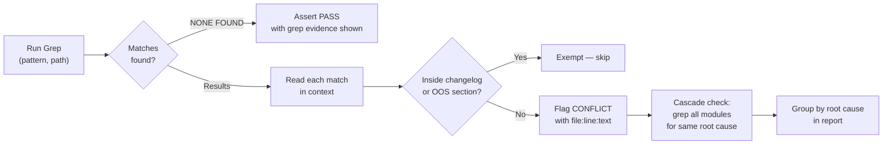
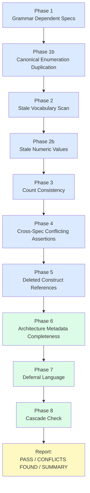
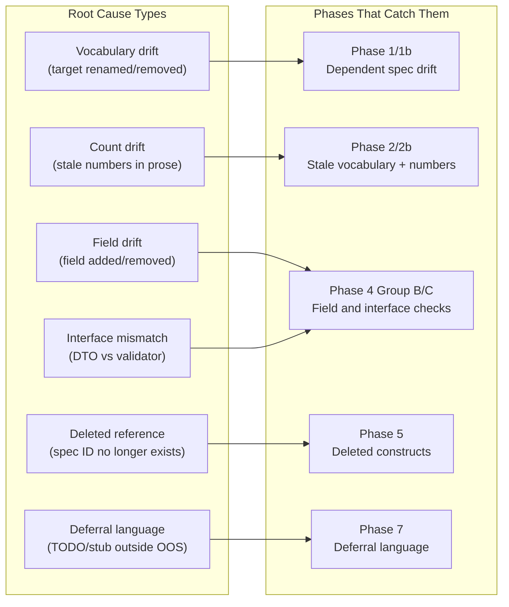
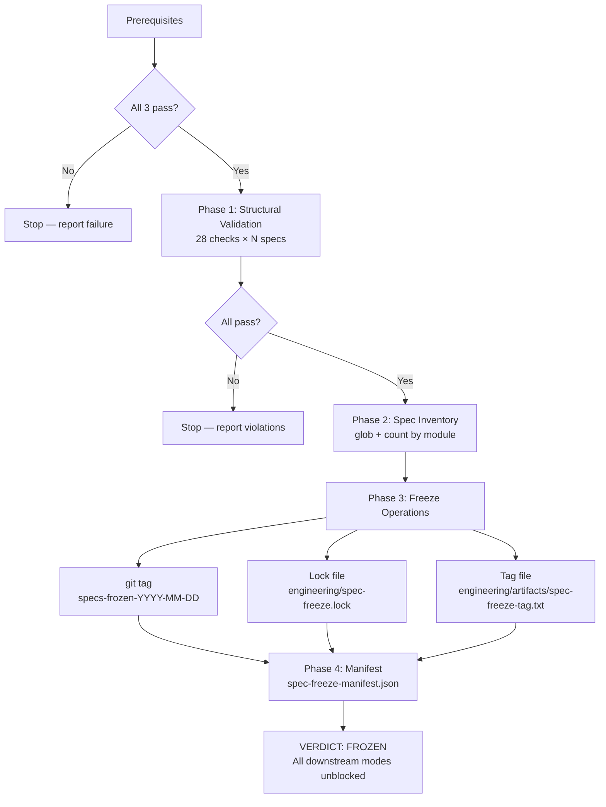

# Chapter 4: Finding What Individual Review Misses

## The Cross-Spec Consistency Problem

Every spec review in Chapter 3 validates one spec in isolation. That is necessary but not sufficient. A system is not a collection of independent specs — it is a network of specs that reference each other, share types, define interfaces that other specs consume, and collectively describe behaviors that emerge from their interactions. A spec that is individually correct can still be wrong in the context of the system it belongs to.

The simplest version of this is dependent spec drift. You have a normative source — a spec that defines the authoritative list of something, say the eight valid what-if change targets in the grammar vocabulary. Ten other specs reference those targets. When the normative source changes — two targets renamed, one removed — you need to update all ten. In practice you update three or four and miss the rest. The missed specs still carry the old vocabulary. Each one passes its own review. None of them is internally inconsistent. But they are all wrong in the context of the system, because they describe a vocabulary that no longer exists.

Here is what that looks like in practice. LUM-AI-018 defines the grammar vocabulary for the AI module. At one point the what_if change targets were a grouped set of five: `life_events`, `assumptions`, `marital_trust`, `spending`, `income`. This seemed reasonable as a grouping, but implementation revealed that `life_events` needed to break apart — the AI needed to distinguish between retirement, social security, death, and relocation to correctly parameterize the simulation. The vocabulary was refactored to eight fine-grained targets: `retirement`, `social_security`, `death`, `relocation`, `assumptions`, `marital_trust`, `spending`, `income`.

LUM-AI-018 was updated first, as the normative source. Then the cascade began. LUM-AI-011 was updated. LUM-AI-012 was updated. LUM-AI-019 was updated. LUM-AI-025 was updated. But LUM-AI-014, which describes the action dispatcher and maintains its own enumeration of valid what_if targets, was not. LUM-AI-014 passes its own individual review — it is internally consistent, it lists exactly five what_if targets with correct descriptions, and nothing in it contradicts itself. The problem is that the five targets include `life_events`, which no longer exists. The dispatcher built to this spec will reject valid grammar outputs because the grammar sends `retirement` and the dispatcher only knows about `life_events`.

To find this you need to compare the two lists. Read LUM-AI-014's §WHAT_IF Targets section verbatim, read LUM-AI-018's §What_If Change Targets section verbatim, compare item by item. If you read LUM-AI-014 first you do not notice the problem unless you already know what the correct list looks like. You need both texts simultaneously.

The more complex version of the problem is conflicting assertions. Spec A describes a DTO with a field called `dateOfBirth`. Spec B describes a validator that validates a field called `birthDate` on the same DTO. Neither spec is internally inconsistent. The validator spec correctly describes how to validate a `birthDate` field — not null, valid ISO date, not in the future, minimum plausible age of 18. The DTO spec correctly describes the `dateOfBirth` field. Together they describe an impossible system — the validator looks for a field that does not exist, and the `dateOfBirth` field never gets validated. This cannot be found by reading one spec at a time.

`/spec-deep-review` is the systematic check for both of these problem types. It runs across the entire spec surface, looking for evidence that something which should be consistent is not.

## Why Grep First, Read Second

---
**`/spec-deep-review` instructions — §Methodology — Grep First, Read Second:**

```
**You must use the Grep tool before reading any file.** The review process is:

1. For every phase: issue Grep searches across the spec root first
2. Collect ALL matches with file paths and line numbers
3. Only then open individual files to read context
4. Report raw grep output (or `NONE FOUND`) before asserting PASS for any term

Never assert PASS based on memory or prior knowledge. Show the grep evidence.
```
---

The "grep before read" rule might look like an operational detail. It is actually the most important discipline in the skill. Claude has read thousands of specs across many sessions. It has a strong mental model of the system, accumulated from prior reads, prior conversations, and memory files. That creates a specific bias: Claude will tend to confirm what it already knows rather than check the current state of the files.

Consider this. Deep review run 7 found and fixed `life_events` in LUM-AI-012, LUM-AI-019, and LUM-AI-025. The memory file records it: "7 specs fixed this session: LUM-AI-010/011/012/014/019/023/025 (all had `life_events` or `events`)." On run 8, when Phase 2 checks for `life_events`, memory says it was fixed. If Claude is allowed to assert PASS from memory, it will. And it will miss any file added or edited after run 7. Maybe a new integration spec describing the DST architecture includes an example what_if change with the `life_events` target — copied from an old example that was never updated. Memory does not capture that file. Only a grep does.

The rule forces every PASS assertion to be grounded in evidence. If Claude checks whether `life_events` appears as a stale vocabulary term, it must show the grep output — either the matches found, or the empty result. "I searched and found nothing" is only acceptable if the grep actually ran and the empty output is shown:

```
Grep: pattern="life_events", path="specs/modules/"
Result: NONE FOUND
```

That is a PASS. "I searched and found nothing" without that output is not a PASS. It is an assertion that may or may not be true.

When the grep finds matches, the output must show each one with its file path and line number:

```
Grep: pattern="life_events", path="specs/modules/"
specs/modules/lumiscape-ai/LUM-AI-012-dst-architecture.md:396:  - what_if targets: retirement, social_security, death, life_events, relocation
specs/modules/lumiscape-ai/LUM-AI-019-batch-testing.md:83:  The test matrix covers all eight life_events targets
specs/modules/lumiscape-ai/LUM-AI-019-batch-testing.md:603:  Run three life_events scenarios per person configuration
```

Then — and this is the step that requires the actual output — evaluate each match in context. The match at LUM-AI-012 line 396 is in a list of what_if targets in active spec prose. That is a conflict. The match at LUM-AI-019 line 83 is in the phrase "all eight life_events targets" — doubly wrong, because `life_events` is stale and "eight" is the wrong count for it (there are eight fine-grained replacements, not eight `life_events`). The match at LUM-AI-019 line 603 is in a test scenario description using the stale term. All three are conflicts.

But suppose there was also a match at line 890 of LUM-AI-019:

```
specs/modules/lumiscape-ai/LUM-AI-019-batch-testing.md:890:  ## Changelog
specs/modules/lumiscape-ai/LUM-AI-019-batch-testing.md:891:  v16: used life_events as grouped target; replaced by 8 fine-grained targets in v17
```

That match is inside a `## Changelog` section. It is exempt — that section exists specifically to document what changed. You cannot make that call from memory. You need the actual line, with context, to know whether it falls inside a changelog section or in active spec prose.

The exemption evaluation requires seeing the line number, cross-referencing it with the section structure, and confirming the section is a dedicated historical record. The raw grep output is what makes this possible. Without it, you are guessing.



## Inline Execution vs Subagent Delegation

The skill explicitly prohibits delegating to a Task subagent. Every phase runs directly in the main conversation using Grep, Read, and other tools inline. This constraint is documented in the skill file as a Lumiscape-specific note — spawning a subagent triggers hook warnings about newlines in the prompt parameter — but the reasoning applies to any project using this workflow.

When you delegate to a subagent, you get back a summary. The subagent ran the greps, evaluated the matches, and concluded: "Phase 2 passed. One stale term found and exempted." You cannot verify this. You cannot see which grep command ran. You cannot see the matches that were evaluated. You cannot see the line numbers that would let you look at a match in context. You are trusting an assertion, not evaluating evidence.

The deep review report is a narrative that interleaves grep evidence with analysis. It says: "Here is the grep command. Here is what it found. Here is why line 396 is a conflict and line 891 is exempt. Here is the root cause. Here are the other specs with the same problem." Each piece depends on the preceding piece. The conflict identification depends on seeing the grep output. The root cause explanation depends on reading the conflicting section in context. The cascade check depends on knowing the root cause before deciding what to grep for next.

Delegate this to a subagent and the narrative collapses into a conclusion. The user cannot follow the reasoning. The user cannot spot an error in the evaluation. The user cannot verify that the cascade check was complete. A conclusion without an evidence chain is not a review — it is a claim. The hard rule against subagents is what keeps the evidence chain intact.

## Structure: Project-Specific Phases Before General Phases

The skill is divided into two clearly labeled sections, and the division is not cosmetic — it encodes a maintainability principle.

The PROJECT-SPECIFIC REVIEW PHASES (Phases 1 through 5) contain all the Lumiscape-specific content: the grammar vocabulary tables, the spec IDs of dependent specs, the stale term inventory, the known-wrong number table, the enum inventories, the interface consistency pairs, the architectural invariants, the deleted construct table. These phases encode the current state of the project and its known problem areas.

These phases accumulate over time. Every significant rename adds a row to the stale vocabulary table. Every deleted spec adds an entry to the deleted construct table. Every time a canonical inventory is identified — a new enum, a new vocabulary — it gets added to the Phase 1b table. Every time an architectural invariant is decided — RMD is a non-negotiable floor, grammar constraint is per-request not at startup — it gets added to Group D. The project-specific phases are a living record of every decision that created a cross-spec consistency obligation.

The GENERAL REVIEW PHASES (Phases 6, 7, and 8) contain checks that apply to any spec-driven project: architecture metadata completeness, deferral language scan, and cascade discipline. These never change. Phase 6 checks that every spec has a properly formed architecture metadata table. Phase 7 searches for deferral language. Phase 8 is a discipline rule about how to handle conflicts when found. None of these checks depend on what the project is building or how its vocabulary evolved.

This separation matters for maintainability in two specific ways. When you make a change to the system — rename a class, delete a spec, add a new enum value — you update the project-specific phases and never touch the general phases. The maintenance surface is exactly as large as the set of project decisions, nothing more. And if you adapt this workflow for a different project, you replace everything in the PROJECT-SPECIFIC REVIEW PHASES section and keep Phases 6, 7, and 8 exactly as they are. The general phases are the invariant backbone.

The PROJECT CONFIGURATION block at the top of the skill lists the spec root, the active modules, and any dissolved modules. It changes when modules are added or dissolved. Everything else — methodology, output format, hard rules — is invariant across projects.



## Phase 1: Grammar Dependent Specs Verification

---
**`/spec-deep-review` instructions — §Phase 1 — Grammar Dependent Specs Verification:**

```
Read `LUM-AI-018-grammar-constraint.md` §Dependent Specs table.

For each row in that table:
1. Read the dependent spec section listed
2. Read the normative source section in LUM-AI-018
3. **Quote both lists verbatim side by side before comparing**
4. Compare item by item — any item present in one list but not the other is a conflict

**Do not assert PASS for any dependent spec without quoting both lists first.**

**Flag any mismatch as: DEPENDENT SPEC DRIFT — [spec] [section]**

Known dependent relationships (from LUM-AI-018 §Dependent Specs):
- LUM-AI-014 §SUMMARIZE Targets → LUM-AI-018 §Summarize/Compare Targets
- LUM-AI-014 §WHAT_IF Targets → LUM-AI-018 §What_If Change Targets
- LUM-AI-010 §what_if Targets → LUM-AI-018 §What_If Change Targets
- LUM-AI-010 §Java-Side Architecture → LUM-AI-018 §What_If Change Targets
- LUM-AI-011 §Grammar-Enforced Vocabularies → LUM-AI-018 §Format Specifications
- LUM-AI-012 §WHAT_IF Change Targets → LUM-AI-018 §What_If Change Targets
- LUM-AI-012 §Grammar-Enforced Vocabularies → LUM-AI-018 §Format Specifications
- LUM-AI-019 §Coverage Requirements → LUM-AI-018 §Summarize/Compare Targets, §What_If Change Targets
- LUM-AI-023 §what_if tool schema → LUM-AI-018 §What_If Change Targets
- LUM-AI-025 §WhatIfExecutor → LUM-AI-018 §What_If Change Targets
```
---

Phase 1 addresses the most common cross-spec consistency failure in this project: a spec that maintains a copy of a vocabulary list defined normatively in LUM-AI-018 has not been updated when LUM-AI-018 changed.

LUM-AI-018 is the grammar constraint spec. It defines the authoritative vocabulary for the AI module: four actions (`summarize`, `compare`, `help`, `what_if`), eight summarize/compare targets, eight what_if change targets, twenty-nine parameter names, and thirty-two enumerated values across six vocabularies. This vocabulary is the contract between the language model and the simulation engine. The model produces structured output conforming to it. The dispatcher parses that output and routes it. The executors implement the behavior. Every layer of that pipeline depends on the same vocabulary definition.

Ten other specs maintain sections that reference or duplicate parts of this vocabulary. The skill maintains an explicit table of these dependencies, read directly from LUM-AI-018's §Dependent Specs section:

- LUM-AI-014 §SUMMARIZE Targets → LUM-AI-018 §Summarize/Compare Targets
- LUM-AI-014 §WHAT_IF Targets → LUM-AI-018 §What_If Change Targets
- LUM-AI-010 §what_if Targets → LUM-AI-018 §What_If Change Targets
- LUM-AI-010 §Java-Side Architecture → LUM-AI-018 §What_If Change Targets
- LUM-AI-011 §Grammar-Enforced Vocabularies → LUM-AI-018 §Format Specifications
- LUM-AI-012 §WHAT_IF Change Targets → LUM-AI-018 §What_If Change Targets
- LUM-AI-012 §Grammar-Enforced Vocabularies → LUM-AI-018 §Format Specifications
- LUM-AI-019 §Coverage Requirements → LUM-AI-018 §Summarize/Compare Targets and §What_If Change Targets
- LUM-AI-023 §what_if tool schema → LUM-AI-018 §What_If Change Targets
- LUM-AI-025 §WhatIfExecutor → LUM-AI-018 §What_If Change Targets

Phase 1 checks each of these. The verification process is specific: read the dependent spec's section, read the corresponding section in LUM-AI-018, quote both lists verbatim side by side, then compare item by item.

Here is what that comparison looks like when it finds a conflict. The normative source, LUM-AI-018 §What_If Change Targets, reads:

```
What_If Change Targets (8):
  retirement
  social_security
  death
  relocation
  assumptions
  marital_trust
  spending
  income
```

LUM-AI-014 §WHAT_IF Targets, last updated before the vocabulary expansion, reads:

```
WHAT_IF Targets (5):
  life_events     — retirement timing, SS claiming, survivorship scenarios
  assumptions     — growth rates, inflation, Monte Carlo seeds
  marital_trust   — trust parameters and distributions
  spending        — discretionary and baseline spending changes
  income          — employment income modifications
```

Side by side, the drift is unmissable: the normative source has 8 targets; the dependent spec has 5. The normative source has `retirement`, `social_security`, `death`, `relocation` as separate targets; the dependent spec collapses them into `life_events`. The fix requires replacing the five-item list in LUM-AI-014 with the eight-item list from LUM-AI-018.

The instruction "quote both lists verbatim side by side before comparing" is not bureaucratic formality. It is the only reliable way to catch the case where you know both lists should match and your expectation smooths over the one item that differs. Skimming both lists in sequence, you might not notice that `death` appears in one and not the other. Reading them side by side, item by item, you cannot miss it.

"Do not assert PASS for any dependent spec without quoting both lists first" is equally non-negotiable. A PASS for LUM-AI-014 §WHAT_IF Targets that is not supported by a side-by-side comparison is not a PASS — it is an unchecked assumption that the spec was updated when it should have been.

## Phase 1b: Canonical Enumeration Duplication

Phase 1 catches drift after it happens. Phase 1b prevents it from happening by identifying any spec that is structurally vulnerable to drift.

The rule: no spec may maintain a local copy of a canonical inventory without a normative delegation statement pointing to the authoritative source. A local copy without a delegation statement will be edited in place, by someone who does not know to check the normative source first. The result is a local copy that diverges. That divergence is drift. And it will not be caught until the next deep review run.

The delegation statement is what makes the coupling visible. Without it, two specs happen to contain the same values with no textual indication that they are supposed to match. With it, the spec says explicitly: "this section is not independently authoritative — its content is determined by LUM-AI-018 §X, and any modification must start there."

The two compliant patterns are:

**Pure delegation (preferred):** The section contains a statement like "Normatively defined in LUM-AI-018 §What_If Change Targets. Do not maintain a separate list here." No inline list at all. A reader who wants the current list is directed to the normative source. This is the safest pattern because there is no copy to drift.

**Delegation-with-copy (acceptable):** The section contains an explicit statement immediately before the list, like "The following replicates LUM-AI-018 §What_If Change Targets. Do not modify independently — update LUM-AI-018 first." The list then follows. This is compliant because the coupling is explicit. The delegation statement tells the editor that this list is derived, not authoritative, and must only be updated by updating the source first.

Everything else is a violation, even if the values are currently correct. A correct copy today is a drift conflict tomorrow. The Phase 1b violation flag documents this: the problem is not that the values are wrong — they may be perfectly correct right now — but that the structure allows them to become wrong with no mechanism to detect it.

The canonical inventories subject to this rule include: the four grammar actions, the eight summarize/compare targets, the eight what_if change targets, the twenty-nine parameter names, the thirty-two enumerated values across six vocabularies, and the major DTO enums (EventType, MetricId, FilingStatus, the StateCode valid set). Any spec that lists five or more values from one of these inventories in prose, without a delegation statement in the same section, is in violation.

The Phase 1b check uses grep signals to find candidates: searching for `marital_trust` in a what_if target list context outside LUM-AI-018, searching for `observation.*results` in a target list context, searching for sequences of parameter names. Each match is then evaluated: does the containing section have a delegation statement? If yes, PASS. If no, DUPLICATION VIOLATION.

## Phase 2: Stale Vocabulary Scan

---
**`/spec-deep-review` instructions — §Phase 2 — Stale Vocabulary Scan (All Modules):**

```
For **each** stale term below, you MUST:
1. Run a Grep across `specs/modules/` for the term
2. Output the raw results (file + line + text) or write `NONE FOUND`
3. Evaluate each result: is it inside a changelog / historical note / Out of Scope section? If not, flag it.

**Do not assert PASS for any term without showing the raw grep results first.**

| Stale term | Correct replacement | Notes |
|-----------|--------------------|----|
| `life_events` | `retirement`, `social_security`, `death`, `relocation` | Old grouped what_if target |
| `"events"` as a target value | `"observation"` | Only stale when used as a summarize/compare target string |
| `DERIVE` or `derive` as a live action | — | Removed in v17; OK in changelog/historical notes |
| `alias-cmd` | — | Removed in v17 |
| `RETRIEVE` as a live action | `SUMMARIZE` | OK in changelog/historical notes |
| `5 vocabularies` | `6 vocabularies` | income_category was the missing 6th |
| `29 enumerated values` | `32 enumerated values` | Missing income_category (3 values) |
| `5 what_if targets` | `8 what_if targets` | |
| `capScale` | — | Removed from RunParameters entirely |
| `interestRate` on MaritalTrust | — | Field removed from LUM-DTO-014 |
| `LUM-DTO-021` | LUM-DTO-039 | MonteCarloResults deleted; superseded by StochasticResults |
| `MonteCarloResults` as a class/DTO name | `StochasticResults` | Class was renamed |
| `LogprobChatClient` | `LlmClient` | Replaced entirely; zero occurrences allowed |
| `grammarContent` as a field name in ActionDispatcher | — | ActionDispatcher no longer owns grammar; LlmClient does. Flag any spec that puts this field on ActionDispatcher |
| `GRAMMAR_SIMPLE` as a live mode | — | Out of Scope; only GRAMMAR_FULL and TOOL_CALLING are active |
| `three-mode` | two-mode | GRAMMAR_SIMPLE removed; only two active modes. Flag any reference outside Out of Scope / *(removed)* markers |
| `alias` as a live action name | — | Removed in v17; OK only inside ## Changelog / ## Version History. Flag in code comments, behavior IDs, test data, prose, and any live code path |
| `retrieve` as a live action name | `summarize` | Removed in v17; OK only inside ## Changelog / ## Version History. Flag in code comments, behavior IDs, test data, prose, and any live code path |
| `ActionDispatcher` as grammar owner/loader | `LlmClient` | ActionDispatcher does NOT load or store grammar. Grep `specs/modules/` for "ActionDispatcher" near "grammar", "gbnf", "loads", "grammarContent". Every such hit is a conflict unless it says "ActionDispatcher delegates to LlmClient" or equivalent. **Mermaid diagram arrows are NOT exempt:** a diagram line `ActionDispatcher->>LLM: "... with grammar"` (where the target is LLM, not LlmClient) is a conflict the same as any prose claim. |

**Flag any match (outside changelog/historical notes/Out of Scope sections) as: STALE VOCABULARY — [spec] line [N]**
```
---

Phase 2 is a grep-based scan for eighteen specific stale terms. Each one represents a named change to the system that needs to be reflected everywhere it appears. The table grows with the system — every significant rename, removal, or architectural refactoring adds a row.

The current table covers:

**`life_events`** — the old grouped what_if target. When the vocabulary was refactored from five grouped targets to eight fine-grained ones, `life_events` became stale everywhere it appeared. This is the most commonly found stale term across the spec surface. A grep across `specs/modules/` for `life_events` might return:

```
specs/modules/lumiscape-ai/LUM-AI-012-dst-architecture.md:396:  - what_if targets: retirement, social_security, death, life_events, relocation
specs/modules/lumiscape-ai/LUM-AI-019-batch-testing.md:83:  The test matrix covers all eight life_events targets
specs/modules/lumiscape-ai/LUM-AI-019-batch-testing.md:603:  Run three life_events scenarios per person configuration
specs/modules/lumiscape-ai/LUM-AI-019-batch-testing.md:867:  life_events combinations are tested pairwise
specs/modules/lumiscape-ai/LUM-AI-025-action-executors.md:496:  WhatIfExecutor supports life_events target via LifeEventHandler
```

Every one of those matches is a conflict unless it appears inside a `## Changelog` or `## Version History` section. The match at LUM-AI-019 line 83 is doubly wrong: "all eight life_events targets" treats `life_events` as a grouping containing eight items — mixing the old vocabulary with the new count.

**`LogprobChatClient`** — renamed to `LlmClient`. This was a complete replacement, not a rename. `LogprobChatClient` no longer exists. Any spec that references it describes a class that will not be found at compile time. The grep for `LogprobChatClient` should return zero results. Any result outside a changelog section is a hard conflict.

**`ActionDispatcher` as grammar owner or loader** — this is the most nuanced stale term in the table, because `ActionDispatcher` still exists. The stale part is not the name but the claimed responsibility. Before the LlmClient refactoring, ActionDispatcher loaded the grammar file and stored it as a field (`grammarContent`). After the refactoring, LlmClient owns grammar loading. ActionDispatcher selects the mode and delegates — it does not touch grammar content directly.

The grep here is more complex than a simple name search. The skill instructs: search for "ActionDispatcher" near "grammar", "gbnf", "loads", "grammarContent". That proximity search surfaces the specific claim being checked — not that ActionDispatcher exists, but that it owns grammar. Any spec saying "ActionDispatcher loads grammar", "ActionDispatcher stores grammarContent", or drawing a Mermaid diagram with an arrow from ActionDispatcher directly to grammar content is describing the old architecture.

The note that "Mermaid diagram arrows are NOT exempt" matters. A diagram line like `ActionDispatcher->>LLM: "with grammar attached"` is as much a claim as prose. It says ActionDispatcher is the component that attaches grammar. If that is no longer true, the diagram is stale and is a conflict the same as any prose claim. Diagrams are not decorative — they are spec assertions in visual form.

**`GRAMMAR_SIMPLE` as a live mode** — this mode was removed. Only `GRAMMAR_FULL` and `TOOL_CALLING` are now active. Any spec that describes GRAMMAR_SIMPLE as a functioning mode (not as a removed feature in a changelog) describes a mode that does not exist.

**The exemption rule for changelog sections** is precise. The ONLY exempt locations are dedicated sections whose entire purpose is historical record: `## Changelog`, `## Version History`, or `## Superseded Specs`. An inline parenthetical like `(removed in v17)` is not exempt. A line in a references section that says "supersedes LUM-AI-008 (deleted)" is not exempt. A sentence in active spec prose that says "the `alias` action was removed in v17" is not exempt.

The reason for this strictness: inline annotations create a false sense of safety. Someone reads `(DELETED)` next to a spec ID and thinks the problem is documented. But the reference is still there. If a code generator or static analysis tool scans the spec for references, it finds this one. If a reader is skimming quickly, they may not notice the annotation. The `— DELETED` label does not make the reference not-stale. It documents the staleness in place rather than removing it. The only clean fix is removing the stale reference from active spec prose and letting the changelog section serve as the historical record.

## Phase 2b: Stale Numeric Values

Stale vocabulary patterns catch renamed or removed identifiers. They do not catch stale numbers. You cannot grep for "wrong count" — you have to know what the wrong count is and grep for that specific value. Phase 2b maintains a table of specific known-wrong numbers that might still appear in specs.

The current table covers:

| Wrong value | Correct value | Context |
|-------------|---------------|---------|
| `5 actions` | `4 actions` | v17 grammar: summarize, compare, help, what_if only |
| `31 param` | `29 param` | v17 grammar: parameter name count |
| `33 param` | `29 param` | Pre-v17 parameter count |
| `29 enumerated` | `32 enumerated` | Old count before income_category was added |

A grep for `5 actions` across all spec files finds any spec that still claims five actions in its prose. A grep for `31 param` finds any spec describing the pre-v17 parameter count. These greps run across ALL spec files, not just the ten known dependent specs.

The reason for the "all spec files" scope: peripheral specs exist. LUM-AI-017 describes Apple Foundation Models integration. It has a section about grammar sync — synchronizing the grammar schema between the llama.cpp server and the AFM integration layer. That section includes count assertions: how many actions, how many parameters. LUM-AI-017 is not in the Phase 1 dependent spec list — it is not primarily a grammar spec and does not appear in LUM-AI-018's §Dependent Specs table. But it still contains count assertions that can drift. The global grep is the only way to catch it.

A count mismatch finding looks like this in the report:

```
COUNT MISMATCH — LUM-AI-017 §Grammar Sync line 241: "syncs 31 parameter names"
Root cause: v17 grammar reduced parameter count to 29; LUM-AI-017 not updated
Correct value: 29 parameter names (per LUM-AI-018 §Parameters)
```

## Phase 3: Count Consistency

Phase 3 is broader than Phase 2b. Where Phase 2b looks for specific known-wrong numbers, Phase 3 looks for any count claim in any spec and verifies that the claimed count matches the actual list. It operates on the priority checks in the table: EventType (21 values), MetricId (15 values), action count (4), summarize/compare target count (8), what_if change target count (8), grammar parameter count (29), enumerated value count (32), grammar vocabulary count (6), StateTaxTable entry count (51).

The verification for one entry: "MetricId enum has 15 values." Read LUM-DTO-020, find the MetricId enum definition, count the values. Suppose the enum reads:

```java
public enum MetricId {
    TOTAL_INCOME,
    TAXABLE_INCOME,
    INCOME_TAX,
    SPENDING,
    SAVINGS_RATE,
    PORTFOLIO_VALUE,
    PORTFOLIO_HEALTH,
    WITHDRAWAL_RATE,
    SS_INCOME,
    ROTH_CONVERSION,
    RMD_AMOUNT,
    HEALTHCARE_COST,
    IRMAA_TIER,
    NET_WORTH,
    TAXABLE_SS   // transient — not in final output
}
```

That is 15 values. The authoritative source says 15. Now run a global grep for `MetricId` and check every result against this count. A spec that says "the 14 MetricId values" or "all 16 MetricId metrics" is a count mismatch. A spec that references `MetricId.PORTFOLIO_REBALANCE` is referencing a value that does not exist in the enum — a conflict in Group A of Phase 4.

The global grep requirement for action and parameter counts is stated explicitly in the skill: "The instruction 'no spec claims 5 or more' is only enforceable through a global grep — not through checking the Phase 1 list alone." Peripheral specs exist that are not in the explicit dependent list but still contain count assertions. The global grep is the only reliable approach.

## Phase 4: Cross-Spec Conflicting Assertions

Phase 4 is the most thorough phase. It checks four categories of assertions that must be consistent across multiple specs. Each category has a different structure and requires a different approach.

### Group A: DTO Enum Values

Group A verifies that every spec's claims about DTO enums agree with the authoritative definition. For each major enum, Phase 4 reads the authoritative spec to get the definitive list, then searches all other specs for any reference to that enum that might contain a conflicting value.

The verification for EventType: read LUM-DTO-019, extract all 21 EventType values. Then run:

```
Grep: pattern="EventType", path="specs/modules/"
```

Every result is evaluated. A spec that lists EventType values must list only values that appear in the authoritative 21-value set. If a spec references `EventType.PORTFOLIO_REBALANCE` and that value does not exist in LUM-DTO-019, that is a conflict — the spec describes behavior that references an enum value the enum does not contain.

A spec that says "EventType has 18 values" when it has 21 is a count mismatch. A spec that says "EventType includes IRMAA_HIT, SS_COLA_APPLIED, RMD_ISSUED, and ROTH_CONVERSION" must be checked: are all four of those values in the authoritative list? If IRMAA_HIT is not in the list, that is a conflict.

The conflict report format for a Group A finding:

```
CONFLICTING ASSERTION: EventType value
Root cause: LUM-ENG-009 references EventType.IRMAA_EXEMPTION which does not exist in LUM-DTO-019
Affected:
  - LUM-ENG-009 §IRMAA Event Emission line 183: "emits EventType.IRMAA_EXEMPTION when patient is exempt"
Correct value: EventType enum (LUM-DTO-019) contains IRMAA_HIT; IRMAA_EXEMPTION is not a valid value
```

### Group B: DTO Field Existence

Group B verifies that specs agree on whether specific fields exist. These are fields that were added or removed during development. The check is: for each changed field, grep for it, and evaluate each result against the current authoritative state.

`MaritalTrust.interestRate` was removed from the MaritalTrust DTO. The authoritative source, LUM-DTO-014, no longer contains this field. A grep for `interestRate` across all specs finds any spec that still references it as a MaritalTrust field. A result might look like:

```
specs/modules/lumiscape-engine/LUM-ENG-014-roth-conversion-calculator.md:287:  MaritalTrust.interestRate used to compute trust income projection
```

That line, in active spec prose, is a conflict. The field does not exist. Any code built to this spec will fail at compile time.

`RetirementDistributionConfig` was added in LUM-DTO-030. Engine specs that predate this addition and describe the retirement withdrawal calculation using the old RMD-only API describe an interface that no longer matches. The grep for `RetirementDistribution` catches these. A result that describes calling `RmdCalculator` directly, without a `RetirementDistributionConfig` parameter, is describing the old API.

### Group C: Interface and Behavior Consistency

Group C is the most complex check in the skill. It verifies that pairs of specs agree on the interface they share. A DTO spec and its validator spec must agree. A repository spec and the DTO it persists must agree. An orchestrator spec and the engine API it calls must agree.

The verification for LUM-DTO-016 vs LUM-VAL-003: read LUM-DTO-016's Scenario fields, get the complete list of field names and their types. Read LUM-VAL-003's validated fields, get the complete list of what the validator checks. Then cross-reference both lists.

Any Scenario field that is required (not optional) in LUM-DTO-016 but has no corresponding validation rule in LUM-VAL-003 is a gap — the field will not be validated, and invalid values will pass into the simulation. Any field that LUM-VAL-003 validates but that does not appear in LUM-DTO-016's field list is a conflict — the validator checks a field that does not exist, which means the validation will always silently succeed (the field is always null) and real validation never runs.

The `dateOfBirth` vs `birthDate` example illustrates this exactly. If LUM-DTO-016 defines `birthDate: LocalDate` and LUM-VAL-003 validates `dateOfBirth`, the conflict is:

```
CONFLICTING ASSERTION: Scenario field name
Root cause: LUM-VAL-003 validates field "dateOfBirth"; LUM-DTO-016 defines field "birthDate"
Affected:
  - LUM-DTO-016 §Scenario fields: field is "birthDate" (type LocalDate)
  - LUM-VAL-003 §Validated fields line 47: "validate dateOfBirth is not null, not future, plausible age"
Correct value: Both specs must use the same field name. LUM-DTO-016 is the authoritative source for
  field names; LUM-VAL-003 must be updated to reference "birthDate"
```

The consequence in production: the validator runs against the Scenario object, looks for `dateOfBirth`, gets null (because the field is named `birthDate`), and either rejects all valid scenarios or silently passes all invalid ones, depending on how the null case is handled.

### Group D: Architectural Invariants

---
**`/spec-deep-review` instructions — §Phase 4 Group D: Architectural Invariants:**

```
| Invariant | Source spec | What to flag |
|-----------|------------|-------------|
| `portfolioHealth` denominator is fixed at scenario start (never reset annually) | LUM-ENG-006 | Any spec claiming denominator resets per year |
| Early withdrawal penalty threshold is age 59.5 (IRS-hardcoded) | LUM-ENG-015 | Any spec claiming a different threshold or calling it configurable |
| Grammar constraint applied per-request in API payload (NOT at llama-server startup) | LUM-AI-018 | Any spec claiming grammar is applied at server startup |
| `AtAge` resolves to exact `birthDate + N years` (NOT January 1st of the age year) | LUM-ENG-003 | Any spec claiming January 1st resolution |
| `stateCode` is case-sensitive (lowercase is a hard error) | LUM-DTO-023 | Any spec claiming case-insensitive matching or soft warning |
| RMD is a non-negotiable floor — trust rules must accommodate, not override | LUM-ENG-015 | Any spec allowing trust rules to suppress RMD withdrawals |
| `taxable_ss` is a transient metric (not persisted in final results) | LUM-ENG-017 / LUM-DTO-020 | Any spec treating `taxable_ss` as a persisted output metric |
| `income_tax` covers federal + state as sequential steps (not separate metrics) | LUM-ENG-017 | Any spec modeling federal and state tax as independent parallel metrics |
```
---

Group D verifies that facts established by one spec are not contradicted by any other spec. These invariants are non-negotiable — they represent decisions that are either legally mandated (IRS law), mathematically required (the RMD floor cannot be waived), or deliberately hardcoded (the AtAge resolution algorithm).

For each invariant: read the source spec to confirm the fact is established there, then search all specs for any claim that contradicts it.

**"RMD is a non-negotiable floor — trust rules must accommodate, not override."** The source is LUM-ENG-015. A search for content about trust rules and RMD interaction in all specs should not find any spec claiming that trust rules can suppress RMD withdrawals. A marital trust spec that says "distributions to the trust may delay RMD obligations in certain cases" is a conflict, because IRS law does not provide for this delay.

**"Grammar constraint applied per-request in API payload, NOT at llama-server startup."** The source is LUM-AI-018. This was decided because grammar files can be large, and applying them at startup would prevent runtime switching between grammar modes. The constraint goes in each inference request. Any spec claiming grammar is loaded once at server startup and applied to all subsequent requests describes an architecture that contradicts this decision.

**"AtAge resolves to exact `birthDate + N years`, not January 1st of the age year."** The source is LUM-ENG-003. A simulation using January 1st resolution produces incorrect results for any scenario where timing within the year matters — and retirement income timing matters significantly for tax purposes. Any spec claiming January 1st resolution describes an algorithm that produces systematically wrong results.

**"`taxable_ss` is a transient metric — not persisted in final results."** The source is LUM-ENG-017 and LUM-DTO-020. `taxable_ss` is computed during the income tax calculation as an intermediate step, used to determine the taxable portion of Social Security income. It is not a final output metric. A spec that treats `taxable_ss` as a persisted output — storing it in results, exposing it via an API endpoint, showing it in the client UI — contradicts this decision.

## Phase 5: Deleted Construct References

Phase 5 searches for references to spec IDs, class names, and constructs that no longer exist. This is a two-part check: an explicit table of known-deleted constructs, and an exhaustive verification that every spec ID referenced anywhere in the spec surface resolves to an actual file.

The explicit table covers:
- `LUM-DTO-021` — MonteCarloResults DTO, deleted; superseded by LUM-DTO-039 (StochasticResults)
- `LUM-AI-008` — InstructionQueryEngine, deleted
- `LUM-AI-015` — DriveAction, deleted
- `LUM-ENG-029` when referring to action executors — moved to LUM-AI-025
- `MonteCarloResultsRepository` — renamed to `ExecutionResultsRepositories`
- `MonteCarloResults` as a class/type name — renamed to `StochasticResults`

For each entry, the grep surfaces every reference. Each reference is evaluated: is it inside a dedicated changelog section? If not, it is a stale reference. The flag format:

```
DELETED REFERENCE — LUM-SVC-004 line 312: references LUM-DTO-021 as MonteCarloResults DTO
Root cause: LUM-DTO-021 deleted; superseded by LUM-DTO-039 (StochasticResults)
Fix: Replace LUM-DTO-021 with LUM-DTO-039; replace MonteCarloResults with StochasticResults
```

The exhaustive check goes beyond the explicit table. It extracts every pattern matching `LUM-[A-Z]+-\d+` from every spec file and verifies each one resolves to an existing file in `specs/modules/`. This catches references that predate the explicit table — a spec ID deleted before the deep review workflow was established, referenced in one obscure spec that was never updated.

The reference description consistency check adds another layer. When a spec lists a cross-reference in the form `LUM-ENG-015 — RMD Calculator`, the name in that reference must match the actual title of LUM-ENG-015. If LUM-ENG-015's scope expanded from "RMD Calculator" to "Retirement Withdrawal Calculator" when RetirementDistributionConfig was added, then any cross-reference still saying "RMD Calculator" is stale — not a deleted reference (the spec ID is valid), but a stale cross-reference describing an outdated understanding of what the spec covers.

The exemption rule for Phase 5 matches Phase 2: the ONLY exempt location is inside a dedicated `## Changelog`, `## Version History`, or `## Superseded Specs` section. A bullet in a References or Dependencies section that says "Supersedes LUM-AI-008" is not exempt. An inline annotation saying `(LUM-AI-008 — DELETED)` is not exempt. A line in the Architecture Metadata table's dependencies field that lists `LUM-AI-008` is not exempt.

The `— DELETED` label does not make the reference non-stale. It documents the staleness in place rather than removing it. Tools that scan for spec IDs — consistency checkers, documentation generators, coverage analyzers — will find this reference and may treat it as valid. The correct fix is removing the stale reference from active spec content entirely.

## Phase 6: Architecture Metadata Completeness

Phase 6 is the first of the general phases — the ones that apply to any spec-driven project, not just Lumiscape. Every spec in this project must have an `## Architecture Metadata` table with required fields: `module`, `component_type`, `dependencies`, `inputs`, `outputs`, `architecture_role`, `data_flow_position`, `architecture_artifact`.

The spot-check approach covers at least three specs per module. For each spec checked:
- Verify the `## Architecture Metadata` section exists
- Verify all required fields are present
- If `architecture_artifact: true`: verify three Mermaid diagram blocks exist
- If `architecture_artifact: false`: verify no Mermaid diagrams are present
- Verify the `module` field names an active module

The dissolved module check is specific. After lumiscape-ref-data was dissolved in R7, any spec with `module: lumiscape-ref-data` in its metadata table is stale. The module no longer exists. Its specs were deleted. Its repository interfaces moved to lumiscape-data. Its runtime components moved to lumiscape-service. If any spec still claims membership in the dissolved module, the metadata is wrong.

Finding dissolved module references uses a simple grep:

```
Grep: pattern="lumiscape-ref-data", path="specs/modules/"
```

Any result in a `module:` field of an Architecture Metadata table is a conflict. Any result in the active modules list of a project overview spec is a conflict. Any result in a dependencies field referencing lumiscape-ref-data as a dependency is also a conflict — if you depend on a dissolved module, the dependency statement is stale and must be updated to reference whatever absorbed the dissolved module's components.

The `architecture_artifact: true` / `architecture_artifact: false` Mermaid diagram rule exists to keep architectural documentation consistent and discoverable. Architecture artifact specs — the ones that define the overall structure of a module — must contain visual representations of their architecture: a component diagram, a data flow diagram, and a sequence diagram. These three provide three different lenses on the same architecture. A spec claiming to be an architecture artifact without these diagrams is missing its primary documentation obligation.

Conversely, a non-artifact spec that contains Mermaid diagrams is adding visual documentation that the metadata says it should not have. This creates inconsistency in how the spec surface is navigated — tooling that looks for architecture artifacts will find unexpected diagrams, and the metadata claim becomes false.

## Phase 7: Deferral Language Global Scan

---
**`/spec-deep-review` instructions — §Phase 7 — Deferral Language (All Modules):**

```
Search ALL spec files under the spec root for: `TODO`, `defer`, `deferred`, `stub`, `placeholder`, `for now`, `return null`, `not implemented`, `future work`, `v2`

Flag any match outside an `Out of Scope (Non-Goals)` section.

**Flag as: DEFERRAL LANGUAGE — [spec] line [N]: [exact text]**
```
---

Phase 7 complements the per-spec deferral check in `/spec-review` with a global search. Individual specs pass review when first written. Revision cycles introduce new content. A spec that was clean when reviewed in isolation may now contain deferral language added during a later revision — language that slipped through without a full review.

The global scan searches for: `TODO`, `defer`, `deferred`, `stub`, `placeholder`, `for now`, `return null`, `not implemented`, `future work`, `v2`. Any match outside an `Out of Scope (Non-Goals)` section is a conflict.

This is a global check rather than a per-spec check because the spec surface is constantly evolving. New content is added. Specs are revised. Individual spec review catches deferral language when the spec is first reviewed, but not when it is revised later. The global scan on every deep review run is the only way to catch deferral language introduced since the last individual review.

The specific terms matter. `return null` is deferral language because it indicates an unimplemented method — a spec that describes a behavior and then shows the implementation as `return null` is not specifying the behavior, it is deferring it. `stub` and `placeholder` are explicit markers of incomplete work. `for now` is the phrase people write when they know they will change something later but have not decided what yet. `future work` belongs in the Out of Scope section, not in active spec prose. `v2` as a label is the most common form of inline scope deferral — "we'll add X in v2" is a deferral statement that belongs in `## Out of Scope (Non-Goals)` or not at all.

The rule is not that these concepts cannot appear in the spec. They cannot appear outside the designated deferral section. If something is genuinely out of scope, it goes in `## Out of Scope (Non-Goals)` with a brief explanation — not inline in active spec prose as a promise to handle it later.

## Phase 8: Cascade Check

---
**`/spec-deep-review` instructions — §Phase 8 — Cascade Check:**

```
When a conflict is found in any phase, check ALL modules for the same stale content before moving on. The same error typically appears in 3-5 specs simultaneously.

Do not report each spec separately if the root cause is the same change propagating incompletely. Group them:

CONFLICT: what_if target `life_events` (should be 8 fine-grained targets)
  Found in: LUM-AI-012 (line 396), LUM-AI-019 (line 83, 603, 867), LUM-AI-025 (line 496)
  Root cause: LUM-AI-018 §What_If Change Targets updated; cascade incomplete
```
---

Phase 8 is a discipline rule, not a search phase. It governs how conflicts found in any preceding phase are handled before moving to the next check.

The rule: whenever a conflict is found, search all modules for the same stale content before moving on. The same error typically appears in three to five specs simultaneously. The reason is structural — all of those specs share the same root cause: one canonical source was updated and the cascade to its dependents was incomplete.

Here is the cascade check in action. Phase 2 finds `life_events` in LUM-AI-012 at line 396. Before moving to the next stale term, the cascade check runs:

```
Grep: pattern="life_events", path="specs/modules/"
specs/modules/lumiscape-ai/LUM-AI-012-dst-architecture.md:396: ...
specs/modules/lumiscape-ai/LUM-AI-019-batch-testing.md:83: ...
specs/modules/lumiscape-ai/LUM-AI-019-batch-testing.md:603: ...
specs/modules/lumiscape-ai/LUM-AI-019-batch-testing.md:867: ...
specs/modules/lumiscape-ai/LUM-AI-025-action-executors.md:496: ...
```

Four specs, six locations. All share the same root cause: LUM-AI-018 §What_If Change Targets was updated from five grouped targets to eight fine-grained targets; the cascade to dependent specs was incomplete.

The cascade grouping in the report:

```
CONFLICT: Stale what_if target `life_events`
Root cause: LUM-AI-018 §What_If Change Targets updated to 8 fine-grained targets; cascade incomplete
Affected:
  - LUM-AI-012 §WHAT_IF Change Targets line 396: "retirement, social_security, death, life_events, relocation"
  - LUM-AI-019 §Coverage Requirements line 83: "all eight life_events targets"
  - LUM-AI-019 §Coverage Requirements line 603: "Run three life_events scenarios per person configuration"
  - LUM-AI-019 §Coverage Requirements line 867: "life_events combinations are tested pairwise"
  - LUM-AI-025 §WhatIfExecutor line 496: "WhatIfExecutor supports life_events target via LifeEventHandler"
Correct value: Replace life_events with: retirement, social_security, death, relocation
  (per LUM-AI-018 §What_If Change Targets)
```

This grouping is more actionable than five separate findings. The user sees the complete scope at once. The fix is a single coordinated update to four specs with a shared root cause. If the findings were reported per-file, the user might fix LUM-AI-012 and close the issue, not realizing that LUM-AI-019 and LUM-AI-025 have the same problem.

The cascade check also prevents partial reporting. If Claude finds a conflict in Phase 2 and immediately moves to the next stale term, it reports LUM-AI-012 and misses LUM-AI-019 and LUM-AI-025. When the cascade check forces a global search after each finding, every instance of the same root cause is captured in the same review run, not spread across multiple runs.



## The Hard Rules: Report Only, Never Fix

---
**`/spec-deep-review` instructions — §Hard Rules:**

```
- Do NOT fix anything. Report only.
- Do NOT suppress minor conflicts. Every mismatch is reported.
- Do NOT resolve ambiguity. If something looks wrong but you are not certain, flag it as AMBIGUOUS and explain why.
- Report exact line numbers and exact stale text for every conflict.
- Group conflicts by root cause, not by file.
- Cascade check: every conflict triggers a search of all modules for the same stale content.
- After completing all phases, ask the user: "Fix all conflicts?" — do not auto-fix.
- **PASS requires evidence.** Never assert PASS for a check without showing the raw data (grep results, quoted list, or exact text) that proves it. "Searched and found nothing" is only acceptable after showing the grep command and its output.
- **Sum-expression tolerance.** A vocabulary arithmetic expression (e.g., `4+4+4+5+12+3=32`) is PASS if the total is correct and each individual operand matches a valid vocabulary size, even if the operand order differs from the canonical source. Only flag if the total is wrong or an operand value is wrong.
```
---

The most important hard rule: do NOT fix anything. Report only.

Fixing conflicts during the review changes the review itself. If Claude starts fixing stale vocabulary in LUM-AI-012 halfway through Phase 2, it cannot show the complete conflict inventory. The user cannot see the full scope of the problem before deciding how to address it. The fix for line 396 of LUM-AI-012 might be straightforward. But if LUM-AI-019 and LUM-AI-025 have the same problem, and the root cause is an incomplete cascade from LUM-AI-018, the most efficient fix might be to update LUM-AI-018's §Dependent Specs table to add a note that LUM-AI-012 must be updated when this section changes — a structural fix that prevents the drift from recurring, rather than just patching the three current instances.

The user cannot decide on that strategy if Claude has already fixed the three instances. The evidence chain is broken. The scope is hidden. The decision about fix strategy — patch the instances, fix the root cause, both — belongs to the user, with complete information in front of them. "Fix all conflicts?" at the end is not a rubber stamp. It is the moment where the user, having seen the complete conflict inventory with root causes grouped, decides whether to fix everything at once, fix incrementally, or address the structural issues first.

The other hard rules:
- Do NOT suppress minor conflicts. Every mismatch is reported. "Minor" is not a category.
- Do NOT resolve ambiguity. If something looks wrong but certainty is not possible, flag it as AMBIGUOUS and explain why.
- Report exact line numbers and exact stale text for every conflict. "Around line 400" is not acceptable.
- Group conflicts by root cause, not by file.
- PASS requires evidence. Never assert PASS without showing the raw data.

The "sum-expression tolerance" rule is a deliberate exception to strict literal matching. A vocabulary arithmetic expression like `4+4+4+5+12+3=32` is PASS if the total is correct and each operand matches a valid vocabulary size, even if the operand order differs from the canonical source. Different specs might list the six vocabulary sizes in different orders — actions first, then targets, then parameters — and any order is equivalent. The check is on the total and the individual values, not their sequence.

## The Report Format

---
**`/spec-deep-review` instructions — §Output Format:**

```
## Deep Review Report

### PASS
- [list each check that passed, grouped by phase]

### CONFLICTS FOUND

#### [conflict type] — [short description]
**Root cause:** [one sentence]
**Affected:**
  - [spec] §[section] line [N]: [exact stale text]
  - [spec] §[section] line [N]: [exact stale text]
**Correct value:** [what it should say, citing normative source]

---

[repeat for each conflict group]

### SUMMARY
Total checks: N
Passed: N
Conflicts: N
```
---

A complete deep review report has three sections: PASS (grouped by phase), CONFLICTS FOUND (grouped by root cause), and SUMMARY.

The PASS section lists each check that passed with its supporting evidence. It is not a bare assertion list — each item includes the evidence that supports the PASS:

```
## Deep Review Report

### PASS
**Phase 1 — Grammar Dependent Specs Verification**
- LUM-AI-014 §SUMMARIZE Targets: matches LUM-AI-018 §Summarize/Compare Targets (8 targets, all present)
  [both lists quoted and compared item by item]
- LUM-AI-014 §WHAT_IF Targets: CONFLICT — see CONFLICTS FOUND
- LUM-AI-011 §Grammar-Enforced Vocabularies: matches LUM-AI-018 §Format Specifications
  [both lists quoted and compared item by item]
  ...

**Phase 2 — Stale Vocabulary Scan**
- `life_events`: CONFLICT — see CONFLICTS FOUND
- `LogprobChatClient`: NONE FOUND
  [grep output: NONE FOUND]
- `GRAMMAR_SIMPLE` as live mode: NONE FOUND
  [grep output: NONE FOUND]
  ...
```

The CONFLICTS FOUND section groups all conflicts by root cause:

```
### CONFLICTS FOUND

#### DEPENDENT SPEC DRIFT — what_if target list in LUM-AI-014
**Root cause:** LUM-AI-018 §What_If Change Targets expanded from 5 to 8 targets; LUM-AI-014 not updated
**Affected:**
  - LUM-AI-014 §WHAT_IF Targets: lists 5 targets including `life_events` (stale grouped target)
**Correct value:** 8 targets: retirement, social_security, death, relocation, assumptions,
  marital_trust, spending, income (per LUM-AI-018 §What_If Change Targets)

---

#### STALE VOCABULARY — `life_events` in AI module specs
**Root cause:** `life_events` grouped target replaced by 8 fine-grained targets in v17; cascade incomplete
**Affected:**
  - LUM-AI-012 §WHAT_IF Change Targets line 396: "retirement, social_security, death, life_events, relocation"
  - LUM-AI-019 §Coverage Requirements line 83: "all eight life_events targets"
  - LUM-AI-019 §Coverage Requirements line 603: "Run three life_events scenarios per person configuration"
  - LUM-AI-019 §Coverage Requirements line 867: "life_events combinations are tested pairwise"
  - LUM-AI-025 §WhatIfExecutor line 496: "WhatIfExecutor supports life_events target via LifeEventHandler"
**Correct value:** Replace life_events with: retirement, social_security, death, relocation
  (per LUM-AI-018 §What_If Change Targets)

---

#### CONFLICTING ASSERTION — MaritalTrust.interestRate referenced as existing field
**Root cause:** MaritalTrust.interestRate removed from LUM-DTO-014; not reflected in engine spec
**Affected:**
  - LUM-ENG-014 §Roth Conversion Calculator line 287: "MaritalTrust.interestRate used to compute
    trust income projection"
**Correct value:** MaritalTrust.interestRate does not exist (removed per LUM-DTO-014).
  Reference must be removed or replaced with current MaritalTrust field API.

---

### SUMMARY
Total checks: 47
Passed: 44
Conflicts: 3 (across 7 spec locations)

Fix all conflicts?
```

The summary line "3 conflicts across 7 spec locations" gives the user both the conceptual scope (three distinct problems) and the practical scope (seven files to touch). These numbers come from the grouped findings, not from counting individual instances.

## Treating the Skill Instructions Like Code

Every rule in this skill exists because a real problem occurred. The grep-first rule exists because memory produced a false PASS. The cascade check exists because single-instance findings left three more instances unfixed. The no-subagents rule exists because subagent output lacked the evidence chain needed to verify findings. The exemption rule for changelog sections exists because inline annotations were being treated as fixes when they were just documentation of unfixed problems. The "quote both lists verbatim" rule exists because side-by-side comparison catches drift that sequential reading misses.

When you read the skill instructions and find a rule that seems overly rigid, the right question is not "is this rule necessary?" but "what failure did this rule prevent?" Every rule is the crystallized lesson from a real failure. That is what makes treating the skill like code the right framing: you do not relax rules in code because they seem strict. You understand what they guard against.

The Phase 1 through Phase 8 structure is the executable specification of cross-spec consistency review. Phases are inputs, transformations, and outputs. Phase 1 takes the dependent spec table as input, reads sections from paired specs, and produces a list of drift findings or PASSes. Phase 2 takes the stale vocabulary table as input, runs greps, evaluates matches, and produces a list of stale vocabulary findings or PASSes. Phase 8 takes each finding as input and produces a cascade-expanded finding that groups all instances of the same root cause.

The report format is the output specification: given a complete run of all phases, produce a structured document with three sections, PASS entries backed by evidence, CONFLICT entries backed by line numbers and exact text, and a SUMMARY with counts. The document is the deliverable. The phases are the process that produces it.

This is what it means to write a skill as a machine-executable specification rather than a narrative description. The machine — in this case, the AI assistant — does not need to understand why the rule exists. It needs to execute the rule exactly. The understanding of why lives in the chapter you just read.

## From Deep Review to Spec Freeze

Deep review is Mode 2b. If it ends clean, the next step is Mode 3: spec freeze. The freeze creates an immutable snapshot of the spec surface. Every downstream mode in the pipeline, from deterministic validation through traceability, gates on the freeze lock file. No lock file, no implementation.

The freeze is a one-time gate operation. Once frozen, specs are read-only until the user explicitly lifts the freeze. Claude cannot delete the lock file. Claude cannot modify specs. The only thing that happens is verification and tagging.

But before any tagging, the freeze skill runs structural validation against every spec file. This is the spec equivalent of a type-checker: before the code compiles, the types must be valid. Before the specs freeze, the structure must be valid.

### The Structural Template and Its 28 Checks

Chapter 2 covers LUM-SYS-004's structural template in detail: the thirteen ordered positions, the required vs conditional sections, the ID formats, the bidirectional AT-to-B coverage contract. The freeze skill validates all of that mechanically before anything gets tagged.

The spec freeze skill runs 28 checks against every spec file. These checks validate the template contract mechanically.

---
**`/spec-freeze` instructions — §Phase 1 — Structural Validation (LUM-SYS-004):**

```
Run the 28 structural checks from LUM-SYS-004 against every spec file under `specs/modules/`.

## Check Inventory

| # | Check | Method |
|---|-------|--------|
| S-01 | `**Spec ID:**` present | grep first lines |
| S-02 | Spec ID matches `LUM-[A-Z]{2,4}-\d{3}` | regex |
| S-03 | `**Module:**` present | grep header |
| S-04 | `**Package:**` present | grep header |
| S-05 | `**Conventions:**` includes LUM-SYS-004 | grep header |
| S-06 | `## Architecture Metadata` present | grep heading |
| S-07 | Metadata has all 8 fields | grep field names |
| S-08 | `component_type` in allowed set | value check |
| S-09 | `architecture_artifact` is `true` or `false` | value check |
| S-10 | Diagrams present when artifact=true | conditional grep |
| S-11 | Diagrams absent when artifact=false | conditional grep |
| S-12 | 3 diagram sub-headings when present | grep Component/Data Flow/Sequence |
| S-13 | `## Purpose` present | grep heading |
| S-14 | `## Location` or `## File Organization` present | grep heading |
| S-15 | `## Out of Scope (Non-Goals)` present (exact) | grep heading |
| S-16 | OOS IDs sequential from OOS-001 | extract + verify |
| S-17 | `## Core Behaviors` present | grep heading |
| S-18 | B-NNN IDs sequential from B-001 | extract + verify |
| S-19 | No V-NNN or G-NNN in Core Behaviors | grep |
| S-20 | `## Acceptance Tests` present | grep heading |
| S-21 | AT-NNN IDs sequential from AT-001 | extract + verify |
| S-22 | Every AT references >= 1 B-NNN | parse |
| S-23 | Every B-NNN covered by >= 1 AT | cross-reference |
| S-24 | `## References` present | grep heading |
| S-25 | Section ordering: positions appear in order | heading scan |
| S-26 | No reserved headings in FLEX zone | heading check |
| S-27 | Module in header matches metadata table | compare |
| S-28 | Spec ID in header matches filename | compare |
```
---

Each check is a single structural assertion. S-01 through S-05 validate the header block. S-06 through S-12 validate the architecture metadata and its diagram contract. S-13 through S-16 validate required sections and ID sequencing for Out of Scope items. S-17 through S-23 validate Core Behaviors and Acceptance Tests, including the bidirectional coverage constraint: every AT must reference at least one B-NNN, and every B-NNN must be referenced by at least one AT. S-24 through S-28 are structural consistency checks.

S-22 and S-23 together form the behavioral coverage contract. S-22 says: no orphan tests. Every acceptance test must trace to at least one behavior. S-23 says: no untested behaviors. Every behavior must be exercised by at least one acceptance test. These two checks together guarantee that the spec's behavioral surface is fully covered. A behavior without a test will never be verified. A test without a behavior is testing something that was never specified.

S-25 is the ordering check. It reads all `## ` headings, maps each to a position number from the template, and verifies they appear in ascending order. A spec that puts `## Core Behaviors` at position 10 before `## Out of Scope (Non-Goals)` at position 9 has them reversed. The ordering exists so that any reader of any spec knows where to find things. Core Behaviors always comes after Out of Scope. Acceptance Tests always comes after Core Behaviors. References is always last (before Changelog, if present).

S-26 prevents naming collisions in the FLEX ZONE. The reserved heading names, such as `## Architecture Metadata`, `## Core Behaviors`, and `## Acceptance Tests`, have fixed meanings at fixed positions. If a spec uses `## Core Behaviors` as a FLEX ZONE heading to describe business rules, it collides with the structural section of the same name. The fix: use a different heading (`## Business Rules`, `## Calculation Logic`, `## Validation Rules Summary`).

The execution path is straightforward. The project includes a Maven enforcer rule (`specTemplate`) that implements all 28 checks. Running `mvn validate` is the primary method. If the enforcer rule is not installed, the checks run manually using Grep and Read tools against the spec files.

### Prerequisites: Three Gates Before Freeze

---
**`/spec-freeze` instructions — §Prerequisites — Verify Before Freeze:**

```
All three must pass. If any fails, stop immediately and report which prerequisite is not met.

## 1 — Spec Review PASS

The most recent `/spec-review` run must have ended with a PASS verdict for all modules being frozen. Check `engineering/artifacts/spec-review-manifest.json` for the latest result.

If the manifest doesn't exist or shows FAIL: stop. Spec review must pass before freeze.

## 2 — Spec Deep Review CLEAN

The most recent `/spec-deep-review` run must show zero conflicts. Check `engineering/artifacts/deep-review-manifest.json` for the latest result.

If the manifest doesn't exist or shows conflicts: stop. Deep review must be clean before freeze.

## 3 — No Existing Freeze

If `engineering/spec-freeze.lock` already exists, the spec set is already frozen. Stop and inform the user.

To re-freeze (after spec revisions), the user must first explicitly lift the freeze by deleting the lock file and tag file. Claude must NOT delete these files automatically.
```
---

The prerequisites enforce the pipeline ordering. You cannot freeze specs that have not been reviewed. You cannot freeze specs that have unresolved cross-spec conflicts. You cannot freeze specs that are already frozen. Each prerequisite checks for an artifact from the preceding mode: the spec-review manifest, the deep-review manifest, the absence of an existing lock file.

The third prerequisite, "no existing freeze," prevents accidental re-freezing. If the lock file exists, the specs are already frozen and all downstream modes are unblocked. Freezing again would overwrite the lock file with a different commit SHA, potentially invalidating the relationship between the tag and the current state. To re-freeze after spec revisions, the user must explicitly unfreeze first: delete the lock file, delete the tag file, make changes, re-run review, re-run deep review, then re-freeze.

### The Freeze Operation

When prerequisites pass and structural validation is clean, three artifacts are created.

The git tag marks the exact commit where the specs were frozen. The tag name follows a date-based pattern: `specs-frozen-2026-02-20`. If a same-day re-freeze occurs, a sequence number is appended: `specs-frozen-2026-02-20-2`. The tag is local. The skill does not push it. The user decides when and whether to push.

The lock file at `engineering/spec-freeze.lock` is the gate artifact. Every downstream skill checks for this file before executing. Its contents record the tag name, commit SHA, date, and spec count:

```
# Spec freeze lock — do not delete unless intentionally unfreezing specs
# Created by /spec-freeze on 2026-02-20
# Tag: specs-frozen-2026-02-20
frozen=true
tag=specs-frozen-2026-02-20
commit=8fa1b62...
date=2026-02-20
specCount=144
```

The tag file at `engineering/artifacts/spec-freeze-tag.txt` contains a single line: the tag name. Downstream skills read this file to identify which spec snapshot they are operating against. The tag file exists because reading a single line from a small file is simpler and more reliable than parsing the lock file.

The manifest at `engineering/artifacts/spec-freeze-manifest.json` records everything: prerequisites checked with evidence, structural validation results, per-module spec counts, and the overall verdict. The manifest is the audit trail. If someone asks "when was this spec set frozen, and what was verified before freezing?" the manifest answers completely.



### Why This Belongs in the Deep Review Chapter

The spec freeze is not a deep review. It is a separate skill, a separate mode, a separate operation. But covering it here, at the end of the chapter that describes cross-spec consistency, follows the natural pipeline flow. You finish individual review (Chapter 3). You finish cross-spec review (this chapter). Then you freeze.

The structural validation in the freeze skill (the 28 checks) is conceptually similar to deep review. Both operate on the entire spec surface. Both use grep and read to verify structural properties. Both produce a pass/fail verdict with evidence. The difference is scope: deep review checks semantic consistency (do two specs agree about what a field is called?), while structural validation checks syntactic consistency (does every spec have the required sections in the right order?).

The freeze operation itself is simple, and its coverage here is intentionally brief. Three artifacts, one manifest, one hard rule: do not freeze if anything fails. The complexity is in what comes before the freeze, not in the freeze itself. Deep review is the last real verification before the specs become immutable. Everything after the freeze, from deterministic validation to implementation to traceability, operates on the assumption that the specs are correct and consistent. That assumption holds because of the work described in this chapter.
