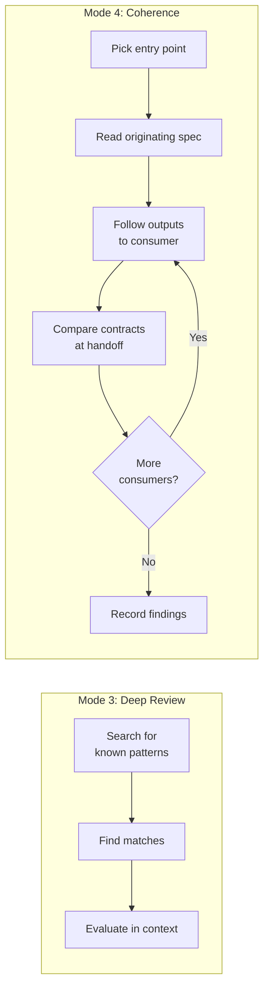
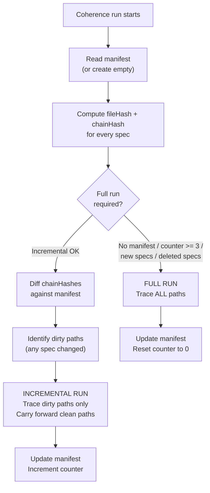
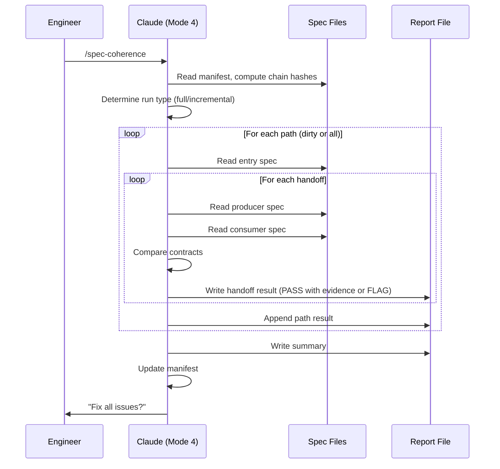

# Chapter 6: Tracing Contracts Across the Spec Surface

## What Grep Cannot Find

Chapter 5 describes a systematic grep-based methodology for finding cross-spec inconsistencies: stale vocabulary, wrong counts, deleted construct references, conflicting assertions. Those checks are mechanical. You know what can go wrong, you encode it as a search pattern, and you run it across the corpus. Every deep-review phase has a finite list of things it looks for. If the problem is not in the list, the review will not find it.

There is a category of failure that can never be in the list. Consider two specs: LUM-DTO-030 defines a `RetirementDistributionConfig` with four fields. LUM-ENG-015 consumes that config to calculate retirement withdrawals. Both specs pass individual review. Both have correct behavior IDs, valid architecture metadata, proper acceptance tests. Deep review finds no stale terms, no count mismatches, no deleted references. The field names match. The types match. Everything is mechanically consistent.

But LUM-DTO-030 describes one of those fields as nullable: "if `withdrawalStrategy` is null, the calculator uses the default pro-rata strategy." LUM-ENG-015 describes the same field as required: "the calculator reads `withdrawalStrategy` and applies the specified strategy; if the field is absent, throw `IllegalArgumentException`." Both specs are internally consistent. Neither contains a stale term. No grep will surface this conflict because the conflict is not in a name, a count, or a reference. It is in the behavioral contract between two specs that describe the same handoff differently.

This is a contract mismatch, and it is the simplest kind. The more subtle variants involve semantic disagreements (two specs use the same word with different meanings), ordering conflicts (spec A assumes X happens before Y, spec B assumes the opposite), and lifecycle gaps (a value is produced in one spec and consumed in another, but no spec describes the transport). None of these are visible to any grep. They only surface when you read both sides of a handoff and compare the contracts.

`/spec-coherence` exists to find these. It is Mode 4 in the pipeline, gated by Mode 3 (deep review), and it uses a fundamentally different methodology.

---
**`/spec-coherence` instructions -- §What This Review Catches:**

```
The spec corpus is not a collection of independent documents. It is a single behavioral specification distributed across files. Every data handoff between specs is a seam where the surface can contradict itself.

Mechanical checks (deep-review) verify that specs use the right names, counts, and references. This review verifies that they define **one coherent, unambiguous system**.
```
---

## Read First, Trace Through

Deep review's methodology is grep-first, read-second. You search for a known pattern, find matches, evaluate each match in context. The checks are enumerable because the failure modes are enumerable: stale vocabulary, wrong counts, deleted references. You know what to look for before you start.

Coherence review inverts this. You do not know what to look for. You know where to look: at the boundaries between specs, where data crosses from one jurisdiction to another. The methodology is read-first, trace-through: pick an entry point, read the originating spec, follow the data through the dependency graph, and at every handoff compare the contracts on both sides.

---
**`/spec-coherence` instructions -- §Methodology -- Read and Trace:**

```
### How to trace a data flow

1. **Pick an entry point.** Choose a value that enters the system (user input, configuration, external data) or a behavior that spans modules (calculation, event emission, error propagation).

2. **Read the originating spec.** Understand what the value is, its type, its constraints, its semantics.

3. **Follow the outputs.** The Architecture Metadata `outputs` field and `data_flow_position` description tell you where this value goes next. Read the consuming spec.

4. **At each handoff, verify the contract.** Does the consumer expect exactly what the producer provides? Same type? Same nullability? Same semantics? Same constraints?

5. **Continue until the value reaches its terminal destination** (UI rendering, database storage, API response, log output).

6. **At every node in the path, check:** What happens when this value is null? Empty? At its boundary? What error is raised and where does the user see it?
```
---

The Architecture Metadata table on every spec makes this traceable. Each spec declares its `dependencies`, `inputs`, `outputs`, and `data_flow_position`. These fields form an explicit dependency graph. When you read spec A and see that its output feeds into spec B, you know which spec to read next. You are not guessing about relationships; they are declared.

The difference from deep review is cognitive, not just operational. Deep review asks: "Is this term still correct?" Coherence review asks: "Do these two specs describe the same reality?" The first question has a binary answer you can verify with a grep. The second question requires understanding what both specs mean and comparing those meanings. No grep substitutes for that comparison.



## Seven Categories of Coherence Failure

The skill defines seven specific categories. Each represents a distinct way that two or more specs can individually pass review and collectively describe a system that does not work.

---
**`/spec-coherence` instructions -- §Categories of coherence failure:**

```
1. **Contract mismatch** — Spec A says it produces output X with fields {a, b, c}. Spec B says it consumes X with fields {a, b, d}. Both specs individually pass mechanical review. The system they describe does not work.

2. **Behavioral ambiguity** — Two specs describe the same operation but with different semantics. Neither contradicts the other explicitly — they simply leave room for two incompatible interpretations.

3. **Underspecified edge case** — A data flow path encounters a condition (null value, empty list, boundary year, death event) that no spec along the path addresses. The system's behavior at this point is undefined.

4. **Semantic disagreement** — Two specs use the same term with subtly different meanings. Example: "withdrawal" meaning RMD in one spec and any retirement account distribution in another.

5. **Ordering/sequencing conflict** — Spec A assumes calculation X happens before Y. Spec B assumes Y happens before X. Neither documents the dependency explicitly.

6. **Error handling inconsistency** — Spec A says "reject with validation error." Spec B says "fail at engine initialization." Both handle the same invalid input, but the error surfaces at different layers with different user-visible behavior.

7. **Lifecycle gap** — A value is created in one spec, consumed in another, but no spec describes how it gets from producer to consumer. The transport mechanism is undefined.
```
---

Categories 1 and 4 look similar but differ in detectability. A contract mismatch involves explicit disagreement: producer says field X, consumer says field Y. You can see it by reading both specs side by side. A semantic disagreement involves implicit disagreement: both specs say "withdrawal," but one means RMD and the other means any retirement account distribution. You can only see it by understanding what each spec means by the term, not just what term it uses.

Category 7, lifecycle gap, is the hardest to catch because it involves something that does not exist. No spec is wrong. No spec contradicts another spec. The problem is that no spec covers a necessary step. A value is produced in module A and consumed in module C, but no spec in module B describes the transformation or transport. The system has a hole. Implementation will either fill the hole with an undocumented assumption or fail when the value is not where module C expects it.

Each category has a specific flag format in the report. Contract mismatches cite the producer spec, consumer spec, and the exact fields or constraints that disagree. Semantic disagreements cite both specs with exact line numbers and the two meanings. Lifecycle gaps cite the producer, the consumer, and the word "UNDEFINED" for the transport.

## The Critical Path Catalog

Coherence review does not trace every possible data flow. It traces the paths that matter: the cross-module flows where data crosses boundaries, changes shape, accumulates state, or triggers downstream behavior. These paths are enumerated in advance as the critical path catalog.

---
**`/spec-coherence` instructions -- §Critical Path Catalog (preamble):**

```
This catalog lists ALL known cross-module data flows. **Full runs trace every path. Incremental runs trace only dirty paths.** Add new paths as the spec surface grows — adding a path forces a full run on next invocation.
```
---

In one production project, the catalog contains eleven paths. Each path is defined by its entry point, the specs it traverses, the modules it crosses, and the key handoffs where contracts must match. Three examples illustrate the range:

The **retirement withdrawal flow** starts at `RetirementDistributionConfig` (LUM-DTO-030), passes through the RMD calculator (LUM-ENG-015) and withdrawal calculator, lands in YearSummary fields and derivation metrics (LUM-DTO-026, LUM-DTO-020), and triggers an `RMD_TRIGGERED` event (LUM-DTO-019). The path crosses from the DTO module into the engine module and back to DTOs. The key handoffs are: do the config fields that the calculator reads match the fields the DTO defines? Do the calculator's outputs match the YearSummaryField and MetricId enums? Do the event emission conditions match the EventType semantics?

The **tax calculation flow** starts at `TaxConfig` (LUM-DTO-007) plus `StateTaxTable` (LUM-DTO-025), passes through the tax calculator (LUM-ENG-017), and produces income tax entries in YearSummary and derivation metrics. The handoffs include filing status transitions, bracket inflation mechanics, the treatment of `taxable_ss` as a transient metric, and the sequential ordering of federal then state tax.

The **AI action dispatch flow** is entirely internal to the AI module: user utterance enters through `LlmClient` (LUM-AI-026), dispatches through `ActionDispatcher` (LUM-AI-014), executes via an `Executor` (LUM-AI-025), and produces a `DispatchResult`. The handoffs include grammar constraint ownership (LlmClient owns the grammar, not ActionDispatcher), action/target vocabulary (the dispatcher must accept exactly the actions the grammar can produce), and parameter validation (parameters the grammar allows must be parameters the executor understands).

The catalog grows as the spec surface grows. Adding a new path forces a full run on the next invocation, because the new path has never been traced.

## What a Handoff Looks Like in Practice

The abstract definition of a handoff is: a boundary where data crosses from one spec's jurisdiction to another. In practice, it means reading two specs and comparing what each one says about the same data structure.

---
**`/spec-coherence` instructions -- §What counts as a handoff:**

```
A handoff occurs whenever:
- A DTO produced by module A is consumed by module B
- An engine calculator's output becomes an accumulator's input
- A service layer orchestrator calls an engine API method
- A validation layer rejects input that another layer also validates
- An event emitted by the engine is consumed by the observations layer
- A database schema stores a value that a DTO defines
```
---

Take the retirement withdrawal path. The first handoff is DTO to engine: `RetirementDistributionConfig` is defined in LUM-DTO-030, and the RMD calculator in LUM-ENG-015 reads its fields. To verify this handoff, you read both specs and check:

- Does LUM-ENG-015 reference every field that LUM-DTO-030 defines? Or does it read fields that do not exist?
- Does LUM-ENG-015 assume any field is non-null that LUM-DTO-030 declares as nullable?
- Does LUM-ENG-015 interpret any field's semantics differently than LUM-DTO-030 describes them?
- What does LUM-ENG-015 do if the config is absent entirely? What does LUM-DTO-030 say about that case?

If both specs agree on all four points, the handoff passes with evidence: "All 4 config fields consumed; types match; nullability matches." If they disagree on any point, the handoff fails with a flag: `CONTRACT MISMATCH -- LUM-DTO-030 → LUM-ENG-015`, citing the exact disagreement.

The evidence requirement is strict. A bare "PASS" without evidence is not acceptable. Every passing handoff must state what was compared and why it matches. This is what makes the report auditable: anyone reading the report can see not just the verdict but the reasoning behind every verdict.

## Chain Hashes and Incremental Runs

A full coherence run traces every path in the catalog end-to-end. For a corpus of 140+ specs and eleven paths, this means reading 30+ specs and verifying dozens of handoffs. It works, but it is slow. If a single DTO spec changed and only affects one path, re-tracing all eleven paths is wasteful.

The incremental model solves this with chain hashes: a compiler-style dirty propagation mechanism that identifies exactly which paths need re-tracing after a spec change.

---
**`/spec-coherence` instructions -- §Chain Hash Computation:**

```
fileHash(spec)  = SHA-256(spec file contents)
chainHash(spec) = SHA-256(fileHash + sorted(chainHash(dep) for dep in spec.dependencies))

The `dependencies` field from each spec's Architecture Metadata table provides the dependency graph. Specs with no dependencies have `chainHash = fileHash`.
```
---

The key insight is transitive propagation. A spec's chain hash incorporates the chain hashes of all its dependencies. If a leaf DTO changes, every spec that depends on it gets a new chain hash, even if those specs themselves did not change. A path is "dirty" if any spec in its list has a changed chain hash. Only dirty paths are re-traced.

The example from the skill file illustrates:

```
LUM-DTO-014 (SurvivorConfig)
  fileHash: a1b2c3, deps: [], chainHash: SHA(a1b2c3) = x1y2z3

LUM-DTO-030 (RetirementDistributionConfig)
  fileHash: d4e5f6, deps: [LUM-DTO-014], chainHash: SHA(d4e5f6 + x1y2z3) = m7n8o9

LUM-ENG-015 (RmdCalculator)
  fileHash: g7h8i9, deps: [LUM-DTO-030, LUM-DTO-014], chainHash: SHA(g7h8i9 + m7n8o9 + x1y2z3) = p1q2r3
```

If LUM-DTO-014 changes, its fileHash changes, which changes its chainHash, which changes LUM-DTO-030's chainHash (because DTO-030 depends on DTO-014), which changes LUM-ENG-015's chainHash. The retirement withdrawal path is dirty even though only one file changed. The incremental run re-traces that path and carries forward the results of unchanged paths.



### The Three-Run Counter

Incremental runs save time, but they accumulate risk. A series of small changes that individually produce clean handoffs might collectively drift the system. Implicit dependencies not captured in Architecture Metadata will not trigger dirty propagation. Semantic shifts that do not change file content (a team reinterpreting what a term means without editing the spec) are invisible to file hashing.

---
**`/spec-coherence` instructions -- §Maximum incremental runs: 3:**

```
After 3 incremental runs, a full run is forced. This is the safety net against:
- Accumulated small changes that individually pass but collectively drift
- Implicit dependencies not captured in Architecture Metadata
- Semantic shifts that don't change file content (convention reinterpretation)

The value 3 means: for every 4 coherence runs, 1 is full and 3 are incremental. This balances speed with safety for a corpus where changes cluster around design decisions (5-10 specs at a time).
```
---

The counter is simple: increment after each incremental run, reset to zero after each full run. When the counter reaches 3, the next run must be full regardless of whether any paths are dirty. The manifest records the counter, and the skill checks it at the start of every run.

## The Gate: Deep Review Must Be Clean First

Mode 4 is gated by Mode 3. You cannot run coherence review until the most recent deep review shows zero conflicts.

---
**`/spec-coherence` instructions -- §Prerequisite -- Deep Review PASS:**

```
This skill is gated by spec-deep-review. Do NOT run spec-coherence until the most recent deep review shows zero conflicts.

Rationale: mechanical consistency (stale vocabulary, wrong counts, missing references) must be clean before behavioral coherence can be meaningfully assessed. There is no value in tracing a data flow through specs that use the wrong field names.
```
---

The rationale is practical. If LUM-ENG-015 references a field called `withdrawalConfig` but the field was renamed to `distributionConfig` three revisions ago, that is a stale vocabulary problem. Deep review catches it. If coherence review runs first and traces the retirement withdrawal path, it will find a contract mismatch at the first handoff: the producer says `distributionConfig`, the consumer says `withdrawalConfig`. This is real, but it is the wrong level of analysis. The problem is not a behavioral disagreement between two specs; it is a stale name that was not updated. Fixing it does not require a design decision. It requires updating the name.

Coherence review should surface behavioral problems: "these two specs disagree about whether this field is nullable." Deep review should surface mechanical problems: "this spec uses a field name that was renamed." Running deep review first clears the mechanical noise so that coherence review can focus on the behavioral signal.

The relationship is one-directional. A coherence finding never sends you back to deep review. It sends you back to spec authoring (Mode 1) to clarify or align the specs. If the fix changes vocabulary or references, deep review will catch those on the next pass. But the coherence finding itself is a design question, not a consistency question.

## Compaction Resilience

Full runs may approach context window limits. Tracing eleven paths across 30+ specs involves many tool calls and large amounts of spec text. If earlier path traces get compacted (summarized to save context), the findings from those traces could be lost.

---
**`/spec-coherence` instructions -- §Compaction Resilience:**

```
1. **Write findings incrementally** — after each path trace, append results to `engineering/artifacts/coherence-report.md` immediately. Even if early context is compacted, the findings are preserved on disk.

2. **Re-read specs as needed** — if a spec read from an earlier path was compacted and a later path needs it, re-read it. Accept the cost of duplicate reads over the risk of working from compressed summaries.

3. **Do not rely on prior path context for later paths** — treat each path trace as self-contained. Read both sides of every handoff even if one side was read for a previous path.
```
---

The write-incrementally discipline is the primary defense. After completing each path trace, the results are appended to the report file on disk. If the context window compacts and the early traces are summarized, the full results are preserved in the file. The report grows incrementally rather than being assembled at the end.

The re-read discipline is the secondary defense. If a spec was read during an earlier path trace and that context was later compacted, the correct action is to re-read the spec. Relying on a compressed summary of a spec you read twenty minutes ago is exactly the kind of memory-based assertion the NO-MEMORY RULE prohibits. Re-reading is slower, but it is reliable.

Treating each path trace as self-contained follows from both defenses. Even if the tax calculation flow reads `LUM-DTO-026` (YearSummary) and the observation pipeline also reads `LUM-DTO-026`, each trace reads the spec independently. The second trace does not assume the first trace's reading is still in context. This produces duplicate reads, and that is acceptable. The alternative is a coherence finding based on a stale context summary, which is worse than no finding at all.

## Jurisdiction: Not Deep Review, Not Code Review

The skill's jurisdiction is clearly bounded.

| Concern | spec-deep-review | spec-coherence |
|---------|-----------------|----------------|
| Methodology | Grep first, read second | Read first, trace through |
| Scope | Every spec file (mechanical scan) | All critical paths (deep read) |
| Catches | Stale names, wrong counts, missing refs | Contract mismatches, ambiguity, undefined behavior |
| Jurisdiction | Individual spec correctness | Cross-spec behavioral consistency |
| When to re-run | After any spec text change | After spec revisions that affect data flows |
| Incremental support | Not applicable (greps are fast) | Chain hash manifest with 3-run counter |

The boundary with code is equally firm. Coherence review is spec-to-spec only. Production code is irrelevant. If the code handles a case that no spec addresses, that is not a coherence finding. If a spec describes behavior that the code does not implement, that is a fidelity finding (Mode 11), not a coherence finding. Coherence review asks: "Do the specs describe one coherent system?" It does not ask whether the implementation matches the specs.

## The Hard Rules

---
**`/spec-coherence` instructions -- §Hard Rules:**

```
- Do NOT fix anything. Report only.
- Do NOT suppress minor findings. Every coherence issue is reported regardless of perceived severity.
- Do NOT infer behavior from code. This review is spec-to-spec only. Production code is irrelevant here.
- **Full runs trace ALL paths.** No selection, no rotation, no priority ordering on full runs. Every path in the catalog is traced end-to-end.
- **Read both sides of every handoff.** Never assert a contract matches without reading both the producer spec and the consumer spec.
- **Quote exact text.** Every finding must cite the exact spec text (with line numbers) that creates the conflict or ambiguity.
- **Trace to termination.** Do not stop a trace mid-path because "the rest looks fine." Follow every value to its terminal destination.
- **Record PASS evidence.** For each handoff that passes, state what was compared and why it matches. A bare "PASS" without evidence is not acceptable.
- **Write incrementally.** Append each path's results to the report file as soon as the trace completes. Do not wait until all paths are done.
- **Re-read over assume.** If a spec was read earlier but may have been compacted, re-read it. Never rely on compressed context for contract verification.
- **Respect the counter.** When `incrementalRunsSinceFullRun >= 3`, a full run is mandatory. Do not override this with user convenience arguments.
- After completing all traces, ask the user: "Fix all issues?" — do not auto-fix.
```
---

"Report only" is the operating principle. Coherence findings are design questions. A contract mismatch between two specs means someone has to decide which side of the contract is correct: does the producer need to change its output, or does the consumer need to change its expectation? That is a design decision. The skill does not make design decisions. It identifies the disagreement, cites the exact text, and presents the finding to the engineer.

"Do not suppress minor findings" exists because severity is not the skill's judgment to make. A nullable/non-null disagreement on a field that is always populated in practice seems minor. But if a future scenario exercises the null case, the system will fail at a boundary that no test covers, because the specs never agreed on the behavior. Every finding is reported. The engineer decides which ones to fix now and which to accept as known risks.

"Trace to termination" prevents a common failure mode: the first three handoffs in a path look fine, so the reviewer concludes the path is clean and moves on. The fourth handoff has a lifecycle gap. The fifth has an error handling inconsistency. Stopping early misses both. Every path is traced from entry point to terminal destination, no exceptions.



## What Coherence Review Does Not Replace

Mode 4 does not replace Modes 2 or 3. It does not replace code review. It does not replace testing. It addresses a specific gap: the seam between specs where individually correct documents describe a collectively incoherent system. That gap is invisible to every other tool in the pipeline.

Mode 2 (spec review) validates individual specs. Mode 3 (deep review) validates mechanical consistency across specs. Mode 4 (coherence) validates behavioral consistency across specs. Mode 5 (freeze) makes the result immutable. The four modes together produce a spec surface that is individually complete, mechanically consistent, behaviorally coherent, and committed. Everything after the freeze operates on the assumption that the specs describe one correct system. That assumption holds because of the work done in Modes 2 through 4.
