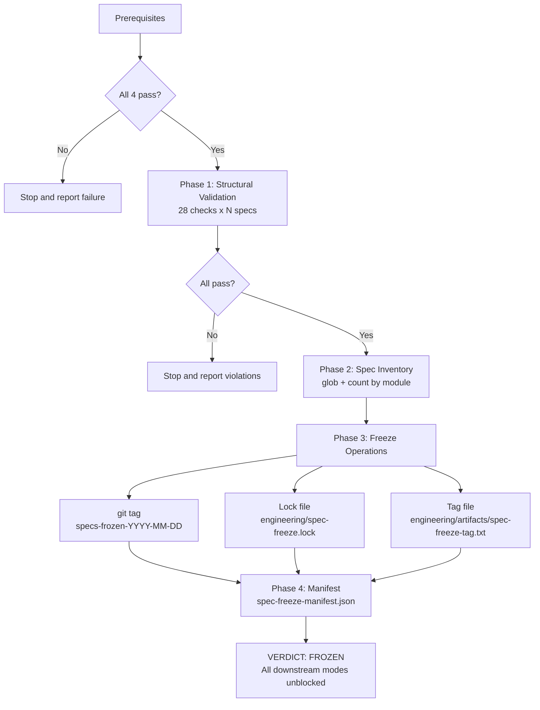
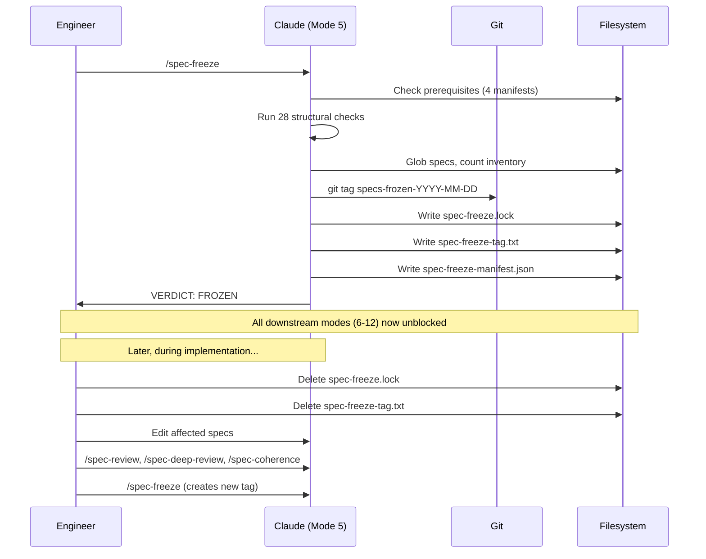

# Chapter 6: The Decision to Commit

## Why the Freeze Is a Human Step

Every other mode in the pipeline is a skill that Claude executes. You invoke it, Claude runs it, it produces a report. Mode 5 is different. The spec freeze is a human decision: you have decided that the specs are complete, that you are done discovering requirements, and that you are ready to commit to implementation. No algorithm can make that call. It requires judgment about project scope, timeline, and risk tolerance.

The mechanic is deliberate. You write a lock file, create a git tag, and commit. Everything downstream, from deterministic validation (Mode 6) through traceability (Mode 12), gates on that lock file. If it does not exist, every downstream skill refuses to run. The refusal is not a warning. It is a hard stop in the first lines of the skill, before any analysis, before any file reads.

---
**`/spec-freeze` instructions -- §Preamble:**

```
Freezes the spec set at a known-good state. Creates a git tag, lock file, and tag file that all downstream modes (6 through 12) gate on.

This is a one-time gate operation. Once frozen, specs are read-only until the freeze is explicitly lifted.
```
---

The friction is the point. You should not be able to slide from spec-writing into implementation without noticing. Without a gate, the transition is invisible: one day you are writing specs, the next day you are writing code against those specs, and nobody marks the boundary. Specs continue to change during implementation. Tests are written against specs that are still moving. The implementation targets a surface that has not stabilized. Every change during implementation invalidates some subset of the work already done, but which subset is invisible because there is no record of what the specs looked like when the work started.

The lock file makes the boundary visible. Before it exists, specs are mutable and downstream modes are blocked. After it exists, specs are immutable and downstream modes are unblocked. The transition is a single, traceable event.

## Prerequisites: Four Gates Before Freeze

The freeze skill does not blindly tag whatever happens to be on disk. It verifies that the spec surface has passed three prior modes before committing to immutability.

---
**`/spec-freeze` instructions -- §Prerequisites -- Verify Before Freeze:**

```
All four must pass. If any fails, stop immediately and report which prerequisite is not met.

## 1 — Spec Review PASS

The most recent `/spec-review` run must have ended with a PASS verdict for all modules being frozen. Check `engineering/artifacts/spec-review-manifest.json` for the latest result.

If the manifest doesn't exist or shows FAIL: stop. Spec review must pass before freeze.

## 2 — Spec Deep Review CLEAN

The most recent `/spec-deep-review` run must show zero conflicts. Check `engineering/artifacts/deep-review-manifest.json` for the latest result.

If the manifest doesn't exist or shows conflicts: stop. Deep review must be clean before freeze.

## 3 — Spec Coherence PASS

The most recent `/spec-coherence` run must show PASS. Check `engineering/artifacts/coherence-manifest.json` for the latest result.

If the manifest doesn't exist or shows FAIL: stop. Coherence must pass before freeze.

## 4 — No Existing Freeze

If `engineering/spec-freeze.lock` already exists, the spec set is already frozen. Stop and inform the user.

To re-freeze (after spec revisions), the user must first explicitly lift the freeze by deleting the lock file and tag file. Claude must NOT delete these files automatically.
```
---

The prerequisites enforce the pipeline ordering. You cannot freeze specs that have not been individually reviewed (Mode 2). You cannot freeze specs that have unresolved cross-spec conflicts (Mode 3). You cannot freeze specs that have unresolved behavioral incoherence (Mode 4). You cannot freeze specs that are already frozen. Each prerequisite checks for an artifact from a preceding mode: the spec-review manifest, the deep-review manifest, the coherence manifest, the absence of an existing lock file.

The fourth prerequisite, "no existing freeze," prevents accidental re-freezing. If the lock file exists, the specs are already frozen and all downstream modes are unblocked. Freezing again would overwrite the lock file with a different commit SHA, potentially invalidating the relationship between the tag and the current state. To re-freeze after spec revisions, the user must explicitly unfreeze first: delete the lock file, delete the tag file, make changes, re-run reviews, then re-freeze.



## Phase 1: Structural Validation

Before freezing, the skill runs 28 structural checks from the spec template (LUM-SYS-004) against every spec file. Chapter 4 covers these checks in detail. The freeze runs them again as a final gate, because a spec can pass individual review (Mode 2) and then be modified in the time between review and freeze. The structural validation at freeze time is the last chance to catch a broken spec before it becomes immutable.

---
**`/spec-freeze` instructions -- §Execution:**

```
Run all 28 checks using the Maven enforcer rule:

mvn validate

The `specTemplate` enforcer rule (SpecTemplateRule.java) implements all 28 checks. If it passes, Phase 1 passes. If it fails, report the violations and stop — do not freeze.

As a fallback (if the enforcer rule has not been installed yet), perform the checks manually using Grep and Read tools against `specs/modules/`. Report all violations before stopping.
```
---

The enforcer rule is the primary mechanism. It runs as part of the Maven build, checking every spec file under `specs/modules/` against the 28 structural requirements: header block present, architecture metadata complete, behavior IDs sequential, acceptance test IDs sequential, every AT references at least one B-NNN, every B-NNN referenced by at least one AT, section ordering correct, no reserved headings in the flex zone. If any check fails on any spec, the build fails and the freeze does not proceed.

The manual fallback exists for projects that have not yet installed the enforcer rule. The same 28 checks run via Grep and Read tools. The output is identical: pass or fail with specific violations listed. The enforcer rule is faster and more reliable, but the checks are the same either way.

## Phase 2: Spec Inventory

The freeze records exactly what was frozen. This means globbing `specs/modules/**/LUM-*.md`, grouping by module directory, and counting.

The inventory is not decorative. It serves three purposes: the manifest records the counts for auditability ("this freeze covered 144 specs across 10 modules"), the inventory detects orphan specs that might have been added after the last review but before the freeze, and it gives downstream modes a baseline to check against ("the freeze tag says 144 specs, but I see 146; two specs were added after the freeze, which means they were never reviewed").

## Phase 3: The Three Freeze Artifacts

When prerequisites pass and structural validation is clean, three artifacts are created. All three must succeed. If any fails, the freeze rolls back.

### The Git Tag

```
git tag specs-frozen-{YYYY-MM-DD}
```

The tag marks the exact commit where the specs were frozen. If a same-day re-freeze occurs, a sequence number is appended: `specs-frozen-2026-02-20-2`. The tag is local. The skill does not push it. Pushing is the user's decision.

The tag is a stable reference point. Any downstream mode can check out the tagged commit to see exactly what the specs looked like at freeze time. If a question arises during implementation ("did the spec always say this?"), the tag provides a definitive answer: the spec at the frozen commit either contains the text or it does not.

### The Lock File

The lock file at `engineering/spec-freeze.lock` is the gate artifact. Every downstream skill checks for it before executing.

```
# Spec freeze lock — do not delete unless intentionally unfreezing specs
# Created by /spec-freeze on 2026-02-20
# Tag: specs-frozen-2026-02-20
frozen=true
tag=specs-frozen-2026-02-20
commit=8fa1b62...
date=2026-02-20
specCount=144
```

The lock file is not just a sentinel. It contains the tag name, commit SHA, date, and spec count. This information is useful during implementation when you need to verify that you are working against the correct spec snapshot.

In the Lumiscape project, the lock file grew to document fifteen formal revisions after the initial freeze. Each revision records a reason, a list of affected specs, and the defects that triggered the revision. Revision R1 documents seven integration defects found by Mode 8. Revision R7 documents the dissolution of the `lumiscape-ref-data` module. Revision R14 documents the monthly ledger redesign. Without the lock file, these decisions would be invisible in the commit history. With it, anyone joining the project can read the evolution of the spec surface as a linear narrative.

### The Tag File

The tag file at `engineering/artifacts/spec-freeze-tag.txt` contains a single line: the tag name. Downstream skills read this file to identify which spec snapshot they are operating against. It exists because reading a single line from a small file is simpler and more reliable than parsing the lock file.

## Phase 4: The Manifest

The manifest at `engineering/artifacts/spec-freeze-manifest.json` records everything: prerequisites checked with evidence, structural validation results, per-module spec counts, and the overall verdict.

---
**`/spec-freeze` instructions -- §Manifest Structure (excerpt):**

```
{
  "lastRun": "2026-02-23",
  "tagName": "specs-frozen-2026-02-23",
  "commitSha": "abc1234...",
  "prerequisites": {
    "specReview": {
      "result": "PASS",
      "evidence": "spec-review-manifest.json shows PASS for all modules"
    },
    "deepReview": {
      "result": "PASS",
      "evidence": "deep-review-manifest.json shows 0 conflicts"
    },
    "specCoherence": {
      "result": "PASS",
      "evidence": "coherence-manifest.json shows PASS"
    },
    "noExistingFreeze": {
      "result": "PASS",
      "evidence": "engineering/spec-freeze.lock did not exist"
    }
  },
  "structuralValidation": {
    "checksRun": 28,
    "specsValidated": 144,
    "result": "PASS",
    "evidence": "mvn validate passed with specTemplate enforcer rule; all 28 checks clean"
  }
}
```
---

The manifest is the audit trail. If someone asks "when was this spec set frozen, and what was verified before freezing?", the manifest answers completely. Every prerequisite cites the specific manifest file it checked. The structural validation cites the enforcer rule output. The spec inventory records actual counts from the glob, not estimates. Evidence must be specific: `"evidence": "checked"` is an audit trail violation.

## Unfreezing and Re-Freezing

The freeze is not permanent. Implementation always reveals things that spec authoring missed. A deterministic validation test (Mode 6) might find that the spec's golden case uses the wrong IRS table. A spec-execution run (Mode 10) might surface a contradiction no validation caught. When this happens, the specs need to change, and the freeze needs to be lifted.

---
**`/spec-freeze` instructions -- §Unfreezing:**

```
To unfreeze specs for a new revision cycle:

1. User deletes `engineering/spec-freeze.lock`
2. User deletes `engineering/artifacts/spec-freeze-tag.txt`
3. Make spec changes
4. Re-run `/spec-review`, `/spec-deep-review`, and `/spec-coherence`
5. Re-run `/spec-freeze` to create a new tag

The old git tag is preserved for historical reference. Each freeze creates a new tag.
```
---

The unfreeze-edit-refreeze cycle is the expected workflow, not an exception. In Lumiscape, fifteen formal revisions occurred after the initial freeze. Some were minor: a single field renamed, a single behavior clarified. Others were structural: an entire module dissolved (R7), a new monthly ledger model introduced (R14), the annuitization sweep architecture added (R15). Each revision followed the same cycle: unfreeze, edit the affected specs, re-run reviews, re-freeze with a new tag.

The old tags are preserved. `specs-frozen-2026-02-20` captures the initial freeze. `specs-frozen-2026-02-23` captures the state after R7. `specs-frozen-2026-02-27-3` captures the state after R14. Each tag is a snapshot. If you need to understand the spec surface at any point in the project's history, you check out the tag and read the specs.

The lock file accumulates revision history. Each unfreeze-edit-refreeze cycle appends to the log. The log is the project's specification changelog: not what changed in the code, but what changed in the contracts that govern the code.

## The Hard Rules

---
**`/spec-freeze` instructions -- §Hard Rules:**

```
- **Do NOT freeze if any prerequisite fails.** Report what failed and stop.
- **Do NOT freeze if structural validation finds violations.** Report them and stop.
- **Do NOT delete an existing lock file.** Only the user can unfreeze.
- **Do NOT modify any spec files during this skill.** Freeze is read-only + tag/lock creation.
- **Do NOT push the git tag.** The tag is local. The user decides when to push.
- **Evidence required.** Every prerequisite and validation result must cite the specific file, grep output, or Maven output that proves it.
```
---

"Do NOT delete an existing lock file" is the most important rule. Claude cannot unfreeze specs. Freezing and unfreezing are user-initiated actions. This is not a technical limitation; it is a deliberate constraint. The freeze represents a human commitment. If Claude could lift the freeze to fix a spec issue it discovered, the freeze would be advisory, not contractual. An advisory freeze does not prevent the drift it is designed to prevent.

"Do NOT push the git tag" keeps the blast radius local. A local tag can be deleted and recreated if the freeze was premature. A pushed tag is visible to anyone who pulls the repository. The user decides when the freeze is ready to be shared.



## Why the Freeze Matters

The lock file is the single most important architectural decision in the pipeline. Without it, every downstream mode operates against a moving target. Tests verify behaviors that might change tomorrow. Validation reports describe a spec surface that no longer exists. Implementation targets specs that the engineer is simultaneously editing. The system converges on nothing because nothing is held still long enough to converge on.

With the lock file, the target is fixed. Mode 6 validates the spec surface at the tag. Mode 9 generates tests against the spec surface at the tag. Mode 10 implements against the spec surface at the tag plus the tests from Mode 9. Mode 11 audits the implementation against the spec surface at the tag. The tag is the constant. Everything else is derived from it.

Late spec changes are not a sign of a broken process. They are inevitable. The lock file does not prevent late changes. It makes them formal. When you unfreeze to make a revision, you write a reason. When you re-freeze, you update the log. The revision history becomes an engineering record: not just what the specs say now, but how the system's design evolved and why each decision was made.

The freeze is the boundary between design and construction. Before it, the spec surface is exploratory: you are discovering requirements, negotiating contracts, resolving ambiguities. After it, the spec surface is contractual: you are building against fixed contracts, and any deviation from those contracts is a traceable event. Both phases are necessary. The freeze is what makes the transition between them explicit, visible, and auditable.
