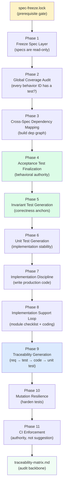
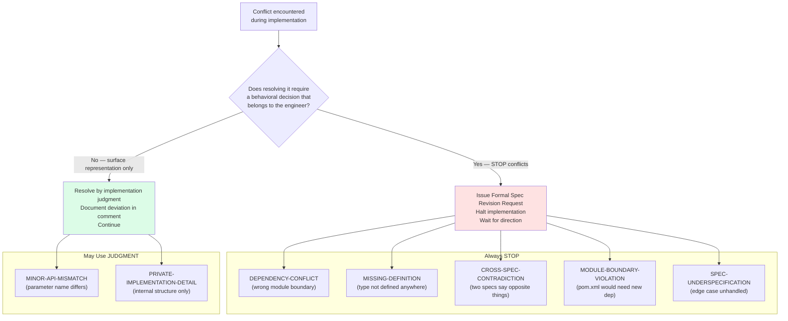
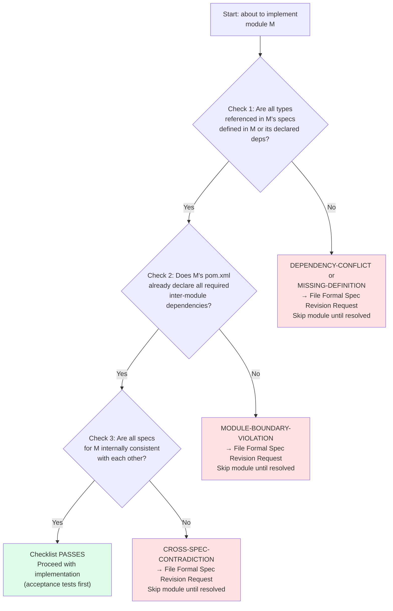

# Chapter 7: Implementing Under Frozen Contracts

## The Transition

Five modes of validation, and now the specs are frozen — behavioral contracts established, test suites designed, engines validated for semantic consistency. Time to write code. But the transition from spec author to implementer is not automatic, and it changes Claude's role in a way most engineers underestimate until they get it wrong.

---
**`/spec-execution` instructions — §PREREQUISITE — SPEC FREEZE VERIFICATION:**

```
Before any phase begins, Claude must verify:

lumiscape/engineering/spec-freeze.lock

If this file does not exist, Claude must:

- stop immediately
- not proceed with any phase
- inform the user that spec-execution cannot begin until the spec freeze is confirmed and the lock file is present

The lock file is the gate. No lock file = no execution.
```
---

As a spec author and reviewer, Claude's job is to find gaps, flag ambiguities, and ensure completeness. Interpretation is appropriate — you are helping the engineer express intent precisely. When you see "compute the applicable tax," you ask whether that means the marginal rate, the effective rate, or the total dollar amount, and you push until the spec is clear. Judgment calls are not just allowed, they are required — when two reasonable interpretations exist, you ask which one the engineer intends. You are a thought partner, sharpening the spec.

As an implementer, none of that applies. The specs are contracts. Interpretation is not appropriate because the spec says what it means and means what it says. Judgment calls are not allowed because every behavioral decision belongs to the spec, not to the implementer. If the spec is ambiguous, that ambiguity should have been caught in review, and if it wasn't, the right response is a formal revision request — not a quiet decision.

This is easy to state and consistently hard to internalize, because the same reasoning that makes an implementer effective — filling in gaps, making sensible decisions, keeping things moving — is precisely what the discipline is preventing. The implementer is not being asked to be less capable. They are being asked to redirect capability away from interpretation and toward execution.

To make the cost of quiet interpretation concrete: consider the RMD age threshold. A spec says "participants must begin taking Required Minimum Distributions when they turn 73." This is genuinely ambiguous in a way that matters. "When they turn 73" could mean the calendar year in which they reach age 73 (the IRS SECURE 2.0 rule, which actually follows this interpretation for RMD start dates) or it could mean the actual date of the participant's 73rd birthday. An implementer reads the spec, thinks "that's clearly the calendar year — that's how the IRS rule works," and implements accordingly. The choice is reasonable. The test they write is: participant born in 1951 is eligible for RMDs in 2024. Tests pass. Implementation ships.

Six months later, a user whose birthday is November 15, 1951 reports that their RMD calculation is off by one year in the year they turn 73. The implementation marks them as eligible starting in 2024 (the calendar year they turn 73), and the correct answer for their specific situation, per the spec's intent, was 2025 (because the spec author was thinking of fiscal year eligibility, not calendar year). The implementer's "reasonable" choice was wrong for this case. The cost: bug report, investigation, tracing the decision back through six months of commit history, spec revision meeting, code change, regression test for the new interpretation, coordination with any downstream consumers of the RMD eligibility data, and potentially a correction of stored simulation results in the user database.

The cost of stopping and asking before implementation: one conversation turn. The engineer would have said "calendar year" or "actual birthday date" and the ambiguity would have been resolved in the spec before a line of code was written.

This is the entire justification for the `/spec-execution` discipline. Not bureaucratic process for its own sake. The recognition that resolving ambiguity costs orders of magnitude less before implementation than after.



## Immutable Specs — The Four Prohibitions

---
**`/spec-execution` instructions — §PHASE 1 — FREEZE SPEC LAYER:**

```
Claude must:

- treat all specs as read-only
- not reinterpret, refine, or rewrite specs
- not add/remove behaviors
- not introduce TODOs/placeholders
- not resolve ambiguity by assumption

Any change must be raised as:

Formal Spec Revision Request

Specs are contract authority.
```
---

The skill establishes four specific prohibitions on what Claude may not do to a spec during implementation. Each one prevents a specific failure mode.

**Prohibition 1: Not Reinterpret.** The spec says "withdrawal order is traditional IRA first, Roth IRA second." You implement traditional IRA first and Roth IRA second. You do not decide this means "tax-deferred accounts first in general," even if that is the underlying tax logic and even if that is the rule a human financial planner would apply. The spec specifies account types, not tax treatment categories. If the spec intended the broader rule, it would have said the broader rule. Implement the broader rule, and you've changed the behavior — possibly in ways the engineer intended, possibly not. The engineer doesn't know you made this decision. The spec doesn't reflect it. The tests were written against the spec's language, so they pass even though you implemented something different. Six months later, when the spec drives an implementation in a different module, that implementation follows the spec literally and disagrees with yours. Two implementations, one silent inconsistency.

**Prohibition 2: Not Refine.** The spec says "compute tax using the applicable bracket." You do not refine this to "compute tax using linear interpolation between bracket midpoints," even if you believe linear interpolation is a more accurate model of the continuous nature of income. The spec means what the word "bracket" means in the context of US income tax: income within a range is taxed at the associated marginal rate, and the total tax is the sum of each bracket's contribution. If the spec wanted linear interpolation, it would specify linear interpolation. Refinements that seem like improvements are still changes to the behavioral contract, and changes to the behavioral contract require the engineer's explicit sign-off.

**Prohibition 3: Not Resolve Ambiguity by Assumption.** If the spec says "compute tax using the applicable bracket" and does not specify which tax year's bracket schedule to use, you do not assume the current year. You stop and file a Formal Spec Revision Request. The assumption seems harmless until a user runs a retirement projection for 2040 and discovers that the 2024 bracket schedule was used for all years because the spec was ambiguous and the implementer silently chose the simplest interpretation. Simulations are forward-looking. Bracket version selection is a consequential behavioral decision. It belongs in the spec.

**Prohibition 4: Not Add Behaviors.** If the spec does not describe what happens when all accounts are exhausted but withdrawals are still required, you do not add "default to zero withdrawal" or "return an error" or any other behavior. You report SPEC-UNDERSPECIFICATION. Zero withdrawal and error reporting are both plausible behaviors with different downstream effects on the simulation. The spec's silence is not an invitation to choose — it is a gap that must be filled by the engineer.

These prohibitions are reinforcing. Taken together, they establish that the implementation is a faithful translation of the spec into executable code — nothing added, nothing interpreted, nothing refined. The spec is the design. The implementation is the artifact.

## The Formal Spec Revision Request — Full Anatomy

---
**`/spec-execution` instructions — §FORMAL SPEC REVISION REQUEST:**

```
When a spec conflict is encountered, Claude must STOP and issue a
Formal Spec Revision Request using this format:

FORMAL SPEC REVISION REQUEST

Conflict type: [see taxonomy below]
Specs affected: [list spec IDs]
Description: [one paragraph — what the conflict is, why it can't be
  resolved by implementation alone]
Options: [A, B, C — concrete alternatives with trade-offs]
Recommendation: [optional — which option Claude would suggest and why]

Claude must NOT write any code for the affected module until the user
responds and a direction is chosen.
```
---

When a conflict is encountered, the Formal Spec Revision Request is a specific structured output, not a conversational report. The format exists for a reason: the engineer receives exactly the information needed to make a decision and nothing more.

Here is a complete example for a dependency conflict discovered while implementing LUM-ENG-015:

```
FORMAL SPEC REVISION REQUEST

Conflict type: DEPENDENCY-CONFLICT

Specs affected: LUM-ENG-015 (RetirementWithdrawalCalculator), LUM-DTO-030 (RetirementDistributionConfig)

Description: LUM-ENG-015 specifies that RetirementWithdrawalCalculator accepts a
RetirementDistributionConfig as input. RetirementDistributionConfig is defined in
LUM-DTO-030 in package com.lumiscape.dto.config, which belongs to the lumiscape-dto
module. LUM-ENG-015 belongs to lumiscape-engine. Inspecting lumiscape-engine/pom.xml
reveals no declared dependency on lumiscape-dto. Adding this dependency would introduce
a new inter-module coupling that is an architectural decision — it affects the build
graph, the dependency direction, and potentially the circular-dependency constraints
of the project. This decision belongs in the spec and in pom.xml, not in the
implementation layer. Implementation of LUM-ENG-015 cannot proceed without resolving
this dependency.

Options:
A. Add lumiscape-dto as a declared dependency of lumiscape-engine in pom.xml and
   update LUM-SVC-005 (module wiring and lifecycle) to document this dependency
   relationship explicitly. This is the simplest fix if lumiscape-engine is
   architecturally permitted to depend on lumiscape-dto without creating a cycle.
B. Move RetirementDistributionConfig to a shared module (lumiscape-api, or a new
   lumiscape-shared module) that both lumiscape-engine and lumiscape-dto can depend
   on. This avoids the direct engine→dto dependency but requires creating or
   modifying a shared module, which is a larger structural change.
C. Define a separate EngineRetirementConfig type in lumiscape-engine that mirrors
   the fields of RetirementDistributionConfig, with an explicit mapping step at
   the service layer that converts DTO config to engine config. This keeps
   lumiscape-engine independent of lumiscape-dto at the cost of maintaining a
   parallel type with a mapping layer.

Recommendation: Option A, if lumiscape-engine already depends on lumiscape-dto
for other types and the dependency direction is consistent with the layered
architecture. If lumiscape-engine should remain independent of lumiscape-dto for
layering reasons, Option C is the cleanest architectural choice.
```

Implementation stops after this request. No code for LUM-ENG-015, no code for anything in lumiscape-engine that transitively depends on RetirementDistributionConfig, until the engineer responds.

Now look at each element of the request and why it is structured as it is.

The **conflict type** must be from the taxonomy. Not "there is an issue with the dependency," not "I noticed a potential problem." The taxonomy term is specific — DEPENDENCY-CONFLICT conveys exactly what kind of problem this is and tells the engineer immediately what category of decision is required. Free-text descriptions force the engineer to read and interpret before understanding what kind of problem it is. The taxonomy does that work upfront.

The **description is one paragraph**. One paragraph is enough. If you need more, you are including implementation details the engineer doesn't need to make the decision. The description must answer three questions: what is the problem, where is it, and why can the implementation not resolve it without engineering input. If it answers those three, it is complete. More than that is too long.

The **options must have trade-offs**, not just labels. "Option A: add the dependency" is not useful. "Option A: add the dependency — simplest change, but introduces engine→dto coupling that may conflict with the layered architecture" is useful. The engineer can read the trade-offs and make an informed decision without re-deriving the implications of each option.

The **recommendation is optional**. When Claude has a clear basis for preferring one option — because it is consistent with existing architectural decisions elsewhere in the project — it states a recommendation. When the choice genuinely depends on an architectural preference that only the engineer can express, the recommendation is omitted. If Claude recommends Option A and the engineer has a strong reason to choose Option B, the recommendation creates friction. When in doubt, omit it and let the options speak.

## The Conflict Taxonomy — Deep Dive

---
**`/spec-execution` instructions — §CONFLICT TAXONOMY:**

```
These conflict types ALWAYS require a Formal Spec Revision Request.
Claude must NEVER resolve them unilaterally:

DEPENDENCY-CONFLICT — A type used in spec A is defined in module B,
but module A cannot depend on module B (circular dependency, wrong
dependency direction, or missing pom.xml entry). Do NOT move types,
duplicate types, or add undeclared dependencies. Stop and report.

MISSING-DEFINITION — A spec references a type, interface, or
behavior that is not defined in any spec. Do NOT invent the definition.
Stop and report.

CROSS-SPEC-CONTRADICTION — Two specs specify conflicting behavior
for the same operation, field, or interface. Do NOT choose one and
ignore the other. Stop and report.

MODULE-BOUNDARY-VIOLATION — Implementing a spec would require
adding a dependency not present in the module's pom.xml, moving a
class to a different package, or restructuring a module's source tree
in a way not specified. Stop and report.

SPEC-UNDERSPECIFICATION — A spec leaves a case unhandled that the
implementation must address (e.g., null handling, error paths, ordering)
and the correct behavior is not derivable from existing specs. Stop
and report.

These conflict types may be resolved by implementation judgment:

MINOR-API-MISMATCH — A spec shows a method signature that doesn't
exactly match the actual compiled type (e.g., parameter name differs,
return type is a subtype). Resolve by matching the compiled type.
Document the deviation in a comment referencing the spec ID.

PRIVATE-IMPLEMENTATION-DETAIL — A spec describes an internal
algorithm or data structure that isn't part of the public API. The
spec is a suggestion, not a contract. Implement the public behavior;
choose the internal approach. Document the deviation in a comment.
```
---

The taxonomy distinguishes conflicts that always stop implementation from conflicts that can be resolved by implementation judgment. The distinction turns on what makes a conflict architectural versus superficial.



**DEPENDENCY-CONFLICT** is the most common conflict in a multi-module Maven project, and it is the one where implementers are most tempted to "just fix it" without a formal request. The temptation is understandable: adding a Maven dependency is a two-line change in pom.xml, and it feels mechanical rather than architectural. But dependency direction encodes architecture. If lumiscape-engine depends on lumiscape-dto, that is a design statement: the engine layer knows about DTO types. If lumiscape-engine then also starts to depend on lumiscape-service for some other type, you now have engine depending on service, which is supposed to depend on engine. You have created a cycle. Cycles in a Maven multi-module build are not warnings — they are build failures. The implementer who "just added the dependency" has now broken a module they never touched, for a reason not visible at the call site.

Even if no cycle results, the dependency direction is wrong. Layers are supposed to depend downward: service depends on engine depends on dto. If engine suddenly depends on service, the layered architecture is violated. Future engineers reading the pom.xml won't know whether this was intentional or accidental. The spec doesn't reflect it. The architecture documentation doesn't reflect it. A quiet addition has introduced a permanent ambiguity into the codebase structure.

**MISSING-DEFINITION** catches the gap between what a spec references and what is actually defined. Consider: LUM-AI-014 describes ActionDispatcher and states that it "consults the ActionRegistry to look up the ActionExecutor for the parsed action." The ActionRegistry is referenced as though it were a defined interface, but no spec in lumiscape-ai or any other module defines what ActionRegistry is — its interface, its method signatures, its contract. The implementation cannot proceed because it does not know what to implement. You cannot write `ActionRegistry registry` without knowing whether ActionRegistry has a method called `lookup(String action)` or `getExecutor(ParsedAction action)` or something else entirely. The method signature determines what the caller does with the result, and that determines how ActionDispatcher is structured.

Filing a MISSING-DEFINITION request surfaces this gap explicitly. The engineer learns that they forgot to spec the ActionRegistry and can write LUM-AI-014b or update LUM-AI-014 to include the interface definition. The implementation waits. This is the correct outcome.

**CROSS-SPEC-CONTRADICTION** is the most expensive conflict to resolve after the fact. Consider a contradiction across the simulation stack: LUM-ENG-020 says MonteCarloRunner produces a StochasticResults object. LUM-DTO-039 defines StochasticResults with 14 specific fields. LUM-SVC-004 says the simulation service receives MonteCarloResults from the runner — note the different type name. Two type names: StochasticResults (from LUM-ENG-020 and LUM-DTO-039) and MonteCarloResults (from LUM-SVC-004). Are these the same type with two names? Different types with an implied mapping? The specs don't say. If they are the same type and you rename one, you break whichever spec used the original name. If they are different types, you need a mapper that neither spec defines. Stop and report.

**MODULE-BOUNDARY-VIOLATION** prevents the gradual erosion of module boundaries through implementation-time convenience decisions. The violation typically looks innocent: "I need the RetirementPlan type in lumiscape-ai for the ActionDispatcher, and it is defined in lumiscape-dto, and I could just add that dependency..." But lumiscape-ai is the AI inference layer. It parses user commands. It should not know about RetirementPlan — it should produce a ParsedCommand, which the service layer translates into a query against the RetirementPlan. If lumiscape-ai starts importing RetirementPlan, the AI layer is now coupled to the domain model, which means changes to RetirementPlan require changes to the AI layer even when the command vocabulary has not changed. The right answer is a thinner interface — an ActionContext or similar — that the AI layer uses without knowing about RetirementPlan.

**SPEC-UNDERSPECIFICATION** is the hardest conflict to catch in review, because reviewers often fill in the unspecified case intuitively without realizing the spec doesn't say it. Consider LUM-ENG-015 specifying withdrawal ordering: traditional IRA first, then Roth IRA. But what happens when there are multiple traditional IRAs? The spec doesn't say. Should they be withdrawn pro-rata? In order of account creation date? In alphabetical order by account name? In order of return rate, depleting the lowest-performing account first? Each answer is financially different and each is a reasonable interpretation of "traditional IRA first." The spec's silence means the implementer cannot choose without making a behavioral decision that belongs to the spec. File the request, and the engineer specifies the ordering rule explicitly.

**MINOR-API-MISMATCH** can be resolved by the implementer because it does not affect behavior. The spec shows `computeRetirementFraction(Person person, int year)`, but the actual compiled type uses `PersonConfig` instead of `Person`. This is a naming inconsistency between the spec (written when the type was called Person) and the implemented type. The behavior — compute retirement fraction given a person and a year — is identical. Resolve by matching the compiled type, and add a comment:

```java
// LUM-ENG-004 uses Person; actual type is PersonConfig per LUM-DTO-001
public RetirementFraction computeRetirementFraction(PersonConfig person, int year) {
```

The comment preserves traceability. A future reader following the spec reference can see immediately that the parameter name changed and why.

**PRIVATE-IMPLEMENTATION-DETAIL** can be resolved because the spec is describing internal structure, not behavioral contract. LUM-ENG-015 suggests storing withdrawal results in a HashMap for intermediate lookups. The spec is offering guidance on one implementation approach, not mandating it. The public behavior is what matters: given inputs, produce the correct withdrawal amounts. If you use a TreeMap for deterministic iteration order (which has testing benefits), the behavior is identical. Document it:

```java
// LUM-ENG-015 suggests HashMap; using TreeMap for deterministic iteration order in tests
private final TreeMap<AccountId, WithdrawalResult> withdrawalResults = new TreeMap<>();
```

The distinction between STOP and JUDGMENT conflicts is consistently: does resolving it require a behavioral decision that belongs to the engineer, or is it a surface representation difference that preserves the spec's behavioral intent? If behavioral — stop. If representational — resolve and document.

## Phase 2: Global Coverage Audit

---
**`/spec-execution` instructions — §PHASE 2 — GLOBAL COVERAGE AUDIT:**

```
Claude must verify across all specs:

- every Core Behavior ID appears in Acceptance Tests
- validation rules exist per spec
- Out-of-Scope sections are explicit
- no deferral language exists
- no behavioral gaps remain

Output:

- PASS / FAIL per spec
- consolidated gap list

No implementation begins until PASS.
```
---

Before any code is written, Claude audits the entire spec surface against the acceptance test suite and verifies that every Core Behavior ID has at least one test. This is not a redundant check from the review phase. Specs evolve during the review cycle. A behavior added to LUM-ENG-021 after the acceptance tests were generated for that spec will have no corresponding test. The coverage audit is the last checkpoint before implementation begins.

The audit produces two outputs: a PASS or FAIL for each spec, and for any FAIL, the specific behavior IDs that lack test coverage. Implementation does not begin until every spec passes.

Here is what a failed coverage audit looks like:

```
COVERAGE AUDIT — LUM-ENG-021 (Accumulators)

FAIL: The following Behavior IDs have no corresponding acceptance test:

  LUM-ENG-021-CB-007: healthcare accumulator tracks IRMAA tier transition
    (added to spec on 2026-02-15, after initial test generation)

  LUM-ENG-021-CB-008: healthcare accumulator includes Medicare Part B premium
    (added to spec on 2026-02-15, after initial test generation)

Required action: Generate acceptance tests for CB-007 and CB-008 before
implementation of LUM-ENG-021 proceeds. Tests must reference behavior IDs,
cite existing-art sources (IRS IRMAA schedule, CMS Medicare premium schedule),
define measurable pass/fail criteria, and use only public API.

All other Behavior IDs in LUM-ENG-021 have corresponding tests. LUM-ENG-021
is blocked pending test additions.
```

The sequencing — coverage audit before implementation — ensures that when a developer writes production code for LUM-ENG-021, the tests that will verify their implementation are already in place. Writing code and tests simultaneously defeats the behavioral contract: if you write the tests after the code, you tend to write tests that reflect what the code does rather than what the spec requires. The tests become a description of the implementation, not a verification of the contract.

## Phase 3: Cross-Spec Dependency Mapping

---
**`/spec-execution` instructions — §PHASE 3 — CROSS-SPEC DEPENDENCY MAPPING:**

```
Claude constructs a dependency model:

- spec → subsystem mapping
- spec outputs used as inputs elsewhere
- overlapping responsibilities
- semantic alignment across specs

Claude must NOT modify specs.

Output is:

Dependency Map Only
```
---

Phase 3 constructs a dependency model of the entire spec surface: which spec depends on which other spec, what outputs of one component serve as inputs to another, where responsibilities overlap, and in what order components should be implemented. This phase produces a map only — Claude does not modify specs based on what it finds in Phase 3.

The dependency map answers four questions. Which components can be implemented in parallel because they have no shared dependencies? Which must be implemented before others because they produce types that other components consume? Which have overlapping responsibilities that need to be reconciled before either is implemented? Which pairs of specs reference the same type with potentially different expectations about its structure?

Here is a concrete excerpt from a dependency map for the retirement distribution subsystem:

```
DEPENDENCY MAP — Retirement Distribution Subsystem

LUM-DTO-030 (RetirementDistributionConfig)
  Consumed by: LUM-ENG-015 (RetirementWithdrawalCalculator)
  Dependencies: LUM-DTO-001 (PersonConfig), LUM-DTO-002 (AccountConfig)
  Status: leaf node — no spec dependencies outside lumiscape-dto

LUM-ENG-015 (RetirementWithdrawalCalculator)
  Inputs: RetirementDistributionConfig (LUM-DTO-030), RmdDivisorTable (LUM-DAT-006)
  Outputs: RetirementDistributionResult
  Consumed by: LUM-ENG-021 (accumulators), LUM-ENG-023 (error handling)
  Note: RetirementDistributionResult not defined in LUM-DTO — verify definition location

LUM-ENG-021 (Accumulators)
  Inputs: RetirementDistributionResult (LUM-ENG-015), YearInputs (LUM-DTO-018)
  Outputs: YearMetrics
  Consumed by: LUM-SVC-004 (simulation orchestration), LUM-DTO-039 (results aggregation)

LUM-SVC-004 (Simulation Orchestration)
  Inputs: YearMetrics (LUM-ENG-021), StochasticResults (LUM-DTO-039)
  Outputs: SimulationResponse (LUM-API-004)

IMPLEMENTATION ORDER:
  1. LUM-DTO-030 (no dependencies)
  2. LUM-ENG-015 (depends on LUM-DTO-030)
  3. LUM-ENG-021 (depends on LUM-ENG-015)
  4. LUM-SVC-004 (depends on LUM-ENG-021)

FLAGGED GAPS:
  - RetirementDistributionResult: referenced in LUM-ENG-015 and LUM-ENG-021
    but not found in any LUM-DTO spec. If defined in LUM-ENG, it must be in
    a spec for lumiscape-engine. If defined in LUM-DTO, spec is missing.
    → Potential MISSING-DEFINITION — flag for Phase 8 checklist.
```

The gap flagged at the end — RetirementDistributionResult not found in any spec — is exactly the kind of finding that prevents a wasted implementation cycle. If implementation started without this map, the developer working on LUM-ENG-015 would create the RetirementDistributionResult class with whatever fields seemed necessary, and the developer working on LUM-ENG-021 would assume different fields, and the mismatch would surface at integration. Finding it in Phase 3 means it gets resolved in a spec revision before either developer writes a line of code.

## Phase 4: Acceptance Tests — Translating Contracts to Executable Verification

---
**`/spec-execution` instructions — §PHASE 4 — ACCEPTANCE TEST FINALIZATION:**

```
Claude generates executable acceptance test suites using black-box public APIs only.

Every test must:

- reference Behavior IDs
- cite the existing-art property and source
- define a measurable metric and explicit pass/fail criteria
- include deterministic degenerate and negative tests

No behavior left untested.

Produce a coverage matrix mapping Behavior IDs to tests.

Acceptance tests become:

BEHAVIORAL AUTHORITY
```
---

Acceptance tests are the primary behavioral authority. They are black-box: they invoke only public APIs, make no assumptions about internal structure, and are insulated from internal refactoring as long as public behavior is preserved. They reference Behavior IDs from the spec so that anyone reading a failing test can trace it directly to the behavioral requirement it verifies. They cite existing-art sources so that expected values are independently verifiable.

Here is a complete acceptance test specification for an RMD calculation behavior:

```java
/**
 * Behavior: LUM-ENG-015-CB-001
 * Description: Compute RMD for traditional IRA holder at age 73
 * Property: RMD formula — balance divided by IRS Uniform Lifetime Table divisor
 * Existing-art source: IRS Publication 590-B (2022 revision), Table III (Uniform
 *   Lifetime Table), age 73: life expectancy factor = 26.5
 * Arithmetic: $500,000 / 26.5 = $18,867.92 → rounded to nearest cent = $18,867.92
 * Pass criterion: result.rmdAmount() == 1_886_792L (cents)
 * Fail criterion: any other value, or exception thrown
 */
@Test
void givenAge73IraBalance500000_whenComputeWithdrawals_thenRmdIs18867Dollars92Cents() {
    // Arrange
    RetirementDistributionConfig config = RetirementDistributionConfig.builder()
        .account(TraditionalIraConfig.builder()
            .balance(50_000_000L)       // $500,000.00 in cents
            .accountId(AccountId.of("ira-primary"))
            .build())
        .person(PersonConfig.builder()
            .birthDate(LocalDate.of(1951, 6, 15))   // turns 73 in 2024
            .personId(PersonId.primary())
            .build())
        .taxYear(2024)
        .build();

    // Act
    RetirementDistributionResult result = calculator.compute(config);

    // Assert
    assertThat(result.rmdAmount())
        .as("RMD for age-73 IRA holder with $500,000 balance per IRS Pub 590-B Table III")
        .isEqualTo(1_886_792L);   // $18,867.92 in cents
}
```

Every element of this test is deliberate. The Javadoc comment cites the behavior ID (LUM-ENG-015-CB-001) to establish traceability. It cites the existing-art source with enough specificity to allow independent verification — not just "IRS Publication 590-B" but "2022 revision, Table III, age 73, factor 26.5." It shows the arithmetic so a future reader can verify the expected value without running the test. Pass and fail criteria are stated explicitly.

The test itself uses only public APIs: `RetirementDistributionConfig.builder()`, `calculator.compute()`, `result.rmdAmount()`. It does not reach into internal state. It does not call private methods. It does not depend on how the calculator stores intermediate results. If the implementation is refactored to use a different internal representation, this test is unaffected as long as `result.rmdAmount()` returns the same value.

The assertion uses `.as()` to provide a failure message that includes the financial context. When this test fails in CI, the failure message reads: "RMD for age-73 IRA holder with $500,000 balance per IRS Pub 590-B Table III — expected 1886792 but was 1876792." The developer reading the failure knows immediately what behavior is being tested and where to look in the IRS publication to verify the expected value.

Amounts are in cents (long integers). This is the project's money convention, and it is non-negotiable in tests. Floating-point money amounts are a correctness liability: IEEE 754 double cannot represent $18,867.92 exactly. Cent-denominated long integers are exact. The test's expected value 1_886_792L is exactly $18,867.92 with no rounding ambiguity.

## Phase 5: Invariant Tests — Mathematical Anchors Independent of Spec

---
**`/spec-execution` instructions — §PHASE 5 — INVARIANT TEST GENERATION:**

```
Claude generates system-level invariants independent of specs.

Examples:

- balances never negative
- withdrawals reduce balances
- taxes non-negative
- accounting identity holds
- monotonicity rules
- conservation rules

Invariant tests become:

CORRECTNESS ANCHORS
```
---

Invariant tests verify properties that must hold regardless of what the spec says. They are not derived from behavioral requirements — they come from mathematics, accounting identities, and physical constraints. A simulation that violates an accounting identity is provably wrong regardless of spec authority.

The accounting identity invariant is the most fundamental:

```java
/**
 * Invariant: Accounting Identity
 * ending_balance = starting_balance + contributions + returns - withdrawals - taxes
 * This is a mathematical identity — no spec is required to specify it.
 * Tolerance: 1 cent for rounding across multiple operations.
 */
@Test
void givenAnyScenario_whenRunSimulation_thenAccountingIdentityHoldsEveryYear() {
    SimulationResult result = engine.run(standardTestScenario());

    for (YearResult year : result.yearlyResults()) {
        long expectedEnding = year.startingBalance()
            + year.contributions()
            + year.investmentReturns()
            - year.withdrawals()
            - year.taxes();

        assertThat(year.endingBalance())
            .as("Accounting identity violated in year %d: expected %d, got %d",
                year.year(), expectedEnding, year.endingBalance())
            .isCloseTo(expectedEnding, within(1L));
    }
}
```

The tolerance of 1 cent is not a concession to imprecision — it is an acknowledgment that when you sum multiple rounding operations each rounded to the nearest cent, the accumulated error can be at most 1 cent. Any deviation beyond 1 cent is a bug, not rounding.

Additional invariants to generate for a retirement simulation engine:

Account balances must be non-negative in every year (you cannot withdraw from an empty account and end with a negative balance; the simulation must detect exhaustion):

```java
@Test
void givenAnyScenario_whenRunSimulation_thenNoAccountGoesNegative() {
    SimulationResult result = engine.run(standardTestScenario());

    for (YearResult year : result.yearlyResults()) {
        for (AccountResult account : year.accountResults()) {
            assertThat(account.endingBalance())
                .as("Account %s went negative in year %d",
                    account.accountId(), year.year())
                .isGreaterThanOrEqualTo(0L);
        }
    }
}
```

Tax amounts must be non-negative (tax refunds are not modeled as negative taxes — they are a separate concept):

```java
@Test
void givenAnyScenario_whenRunSimulation_thenTaxesNonNegativeEveryYear() {
    SimulationResult result = engine.run(standardTestScenario());

    for (YearResult year : result.yearlyResults()) {
        assertThat(year.taxes())
            .as("Negative tax computed in year %d", year.year())
            .isGreaterThanOrEqualTo(0L);
    }
}
```

These invariants are not in any spec. They don't need to be. They are mathematical facts. A simulation that violates them is wrong by definition.

## Phase 6: Unit Tests — Complete Coverage of the Testing Craft

---
**`/spec-execution` instructions — §PHASE 6 — UNIT TEST GENERATION (IMPLEMENTATION STABILITY):**

```
Claude writes unit tests for internal logic.

Unit tests:

- white-box
- deterministic
- fast
- mutation-resistant
- edge-case focused

Targets:

- pure calculators (tax, RMD, interest, withdrawal math)
- rounding/precision utilities
- validation and error handling
- boundary logic (age thresholds, bracket edges)
- state transitions (per-year updates)
- parsing/validation helpers
- small deterministic orchestration utilities

Unit tests must NOT:

- duplicate acceptance tests
- target end-to-end scenarios (those are acceptance/integration tests)
- target Monte Carlo distribution correctness (those are Monte Carlo validation tests)
- rely on IO, time, randomness, or global state
- include performance benchmarks

Unit tests protect:

IMPLEMENTATION STABILITY

## Required Practices

### Mutation Resistance

Write tests so that common mutations fail:

- operator flips (+ ↔ −, * ↔ /)
- comparison flips (< ↔ <=, > ↔ >=)
- off-by-one changes
- removed guards (null/empty/bounds checks)
- swapped branches in if/else
- wrong rounding mode

If a test would still pass after one of these changes, strengthen it.

## Tooling Defaults

Unless the project specifies otherwise:

- JUnit 5
- AssertJ (if available) or standard JUnit assertions
- Mockito only when unavoidable (prefer pure tests)
- No shared mutable fixtures across tests

## Stop Conditions

If a unit test would require randomness, time, IO, or system integration:

Stop. Request that it be written as an integration/acceptance test instead.
```
---

Unit tests are white-box, deterministic, fast, and mutation-resistant. They test internal logic at the method level, they run without infrastructure (no database, no network, no filesystem), and they are designed to fail when the production logic changes in a way that alters behavior. This section covers every required practice in depth.

### Mutation Resistance — The Core Testing Mindset

For every test you write, ask: "what single change to the production code could cause this test to still pass while the behavior is wrong?" If you can find such a change, the test is weak.

Consider a test for the RMD eligibility check:

**Weak version:**

```java
@Test
void givenAge74_whenCheckRmdEligibility_thenEligible() {
    assertThat(calculator.isRmdEligible(74)).isTrue();
}
```

This test passes with the correct implementation: `return age >= 73`. It also passes with a mutation that changes the condition to `return age >= 74`, because 74 still satisfies `>= 74`. The off-by-one mutation survives. Any user who turns 73 will be incorrectly excluded from RMD eligibility, and no test catches it.

**Stronger version:**

```java
@Test
void givenAge72_whenCheckRmdEligibility_thenNotEligible() {
    assertThat(calculator.isRmdEligible(72)).isFalse();
}

@Test
void givenAge73_whenCheckRmdEligibility_thenEligible() {
    // This is the critical boundary — the mutation age >= 74 fails HERE
    assertThat(calculator.isRmdEligible(73)).isTrue();
}

@Test
void givenAge74_whenCheckRmdEligibility_thenEligible() {
    assertThat(calculator.isRmdEligible(74)).isTrue();
}
```

Now the mutation `return age >= 74` fails the age-73 test. The mutation `return age > 73` also fails the age-73 test (since `73 > 73` is false). The mutation `return age >= 72` fails the age-72 test (which expects false). All three common operator mutations are caught.

Similarly for exception testing. The weak version:

```java
@Test
void givenNegativeBalance_whenComputeRmd_thenThrowsException() {
    assertThrows(IllegalArgumentException.class,
        () -> calculator.computeRmd(age(73), balance(-1L)));
}
```

This passes even if the wrong validation triggers the exception — for example, if age validation throws an IllegalArgumentException with a different message, and the balance validation was never implemented. The stronger version:

```java
@Test
void givenNegativeBalance_whenComputeRmd_thenThrowsValidationExceptionWithCorrectCode() {
    ValidationException ex = assertThrows(ValidationException.class,
        () -> calculator.computeRmd(age(73), balance(-1L)));

    assertThat(ex.getCode()).isEqualTo("INVALID_ACCOUNT_BALANCE");
    assertThat(ex.getMessage()).contains("negative");
}
```

Now the test fails if: the exception type is wrong, the code is wrong (a different validation triggered), or the message doesn't describe the problem correctly. Three mutations caught instead of one.

Common mutations to verify tests catch:
- Flip `<` to `<=` or `>` to `>=` in any comparison — does the boundary test fail?
- Remove a null guard — does the null-input test fail?
- Swap if/else branches — does the negative-case test fail?
- Change `HALF_UP` rounding to `FLOOR` or `CEILING` — does the golden-case test fail?
- Flip `+` to `-` in the accounting identity — does the invariant test fail?
- Return a constant instead of a computed value — does the parameterized test fail across multiple inputs?

### Boundary-First Coverage — Where Bugs Live

Boundary-first coverage starts with the edges and works inward. The happy path is the last thing tested, not the first. For RMD age threshold logic:

```java
@ParameterizedTest(name = "age {0} → expectRmd={1}")
@MethodSource("rmdAgeThresholds")
void rmdAgeThresholds(int age, boolean expectRmd) {
    assertThat(calculator.isRmdEligible(age))
        .as("RMD eligibility at age %d", age)
        .isEqualTo(expectRmd);
}

static Stream<Arguments> rmdAgeThresholds() {
    return Stream.of(
        Arguments.of(0,   false),   // impossible but should not throw
        Arguments.of(72,  false),   // one year before threshold
        Arguments.of(73,  true),    // first eligible year — critical boundary
        Arguments.of(74,  true),    // one year after threshold
        Arguments.of(100, true),    // oldest table entry
        Arguments.of(120, true),    // IRS table maximum
        Arguments.of(121, true)     // beyond table — must use fallback divisor
    );
}
```

The parameterized test covers every meaningful region of the age domain: impossible values, one below the threshold, the threshold itself, one above, well above, at table maximum, and beyond table maximum. The test name includes the parameters so that CI failure output reads "age 73 → expectRmd=true FAILED" instead of "rmdAgeThresholds[3] FAILED."

For balance inputs, the boundaries are:

```java
@ParameterizedTest(name = "balance {0} cents → rmd {1} cents")
@MethodSource("rmdBalanceBoundaries")
void rmdBalanceBoundaries(long balanceCents, long expectedRmdCents) {
    // age 73, divisor 26.5 per IRS Pub 590-B (2022) Table III
    assertThat(calculator.computeRmd(age(73), balance(balanceCents)))
        .isEqualTo(expectedRmdCents);
}

static Stream<Arguments> rmdBalanceBoundaries() {
    return Stream.of(
        Arguments.of(0L,          0L),          // zero balance → zero RMD
        Arguments.of(1L,          0L),          // 1 cent → rounds to 0 (below 1 cent result)
        Arguments.of(2650L,       100L),        // exactly $26.50 → RMD = $1.00
        Arguments.of(100_000_00L, 377_358L),    // $100,000 / 26.5 = $3,773.58 in cents
        Arguments.of(Long.MAX_VALUE / 10, -1L)  // overflow test — expected: exception or defined max
    );
}
```

Note the overflow test. This is a boundary most implementations skip because it seems impossible: who has a balance near Long.MAX_VALUE? But overflow bugs are silent — the computation produces a wrong result without throwing an exception, and the wrong result propagates through the simulation undetected.

### Golden Cases for Rule-Based Logic — Pin the Table

When logic depends on a published table, pin the expected values to specific table entries with full citation. Do not compute the expected value in the test itself (that would be testing your arithmetic against itself). Look up the value in the source, show the arithmetic in the comment, and hardcode the result:

```java
/**
 * RMD Golden Cases — IRS Publication 590-B (2022 revision), Uniform Lifetime Table (Table III)
 *
 * Age | Life Expectancy Factor | Test Balance  | RMD Computation          | Expected RMD
 * -----|----------------------|---------------|--------------------------|-------------
 *  73  |        26.5          | $500,000.00   | 50000000 / 26.5 = 188679.245... | $18,867.92 (cents: 1,886,792)
 *  80  |        20.2          | $500,000.00   | 50000000 / 20.2 = 247524.752... | $24,752.48 (cents: 2,475,248)
 *  85  |        16.0          | $1,000,000.00 | 100000000 / 16.0 = 625000.0    | $62,500.00 (cents: 6,250,000)
 *  90  |        12.2          | $200,000.00   | 20000000 / 12.2 = 163934.426... | $16,393.44 (cents: 1,639,344)
 */
@ParameterizedTest(name = "age {0} balance {1} → rmd {2}")
@MethodSource("rmdGoldenCases")
void rmdGoldenCases(int age, long balanceCents, long expectedRmdCents) {
    assertThat(calculator.computeRmd(age(age), balance(balanceCents)))
        .isEqualTo(expectedRmdCents);
}

static Stream<Arguments> rmdGoldenCases() {
    return Stream.of(
        Arguments.of(73,  50_000_000L,  1_886_792L),
        Arguments.of(80,  50_000_000L,  2_475_248L),
        Arguments.of(85, 100_000_000L,  6_250_000L),
        Arguments.of(90,  20_000_000L,  1_639_344L)
    );
}
```

Four golden cases is enough. They span a range of ages and balances, they are drawn directly from the published table, and the arithmetic is shown so any future engineer can verify the expected values independently. If IRS updates the Uniform Lifetime Table (as they did effective 2022), the comment's citation makes clear which table version is being used, and the test must be updated when the table version changes.

The critical rule: never compute the expected value programmatically in the test. If you write `assertThat(result).isEqualTo(balance / factor)`, you are testing that the implementation uses the same arithmetic you wrote in the test. You are not testing that the arithmetic is correct against the published source.

### AAA Structure — Arrange, Act, Assert

The AAA structure is not just a stylistic preference. Each section has a specific purpose, and deviating from it makes tests harder to read and more likely to over-assert.

```java
@Test
void givenIncomeAtBracketEdge_whenComputeTax_thenCorrectMarginalRate() {
    // Arrange: set up exactly the input state needed for this test
    // Income is at exactly the boundary where the 22% bracket begins (2024 single filer)
    TaxInputs inputs = TaxInputs.builder()
        .taxableIncome(8_907_500L)   // $89,075.00 in cents — 22% bracket starts here
        .filingStatus(FilingStatus.SINGLE)
        .taxYear(2024)
        .build();

    // Act: the single operation being tested
    TaxResult result = taxCalculator.compute(inputs);

    // Assert: ONLY what this test is about
    // We are testing the marginal rate at the bracket edge, not the total tax
    assertThat(result.marginalRate())
        .as("Marginal rate at $89,075 for single filer in 2024")
        .isEqualTo(new BigDecimal("0.22"));
    // Note: total tax is tested separately in givenTypicalIncome_whenComputeTax_thenCorrectTotal
}
```

The assertion at the end checks only the marginal rate. It does not assert `result.effectiveTax()`, `result.totalTax()`, `result.bracketBreakdown()`, or any other field of TaxResult. This test is about one behavior: the marginal rate at a bracket edge. Asserting `result.totalTax()` as well means this test breaks whenever total tax computation changes, even if the marginal rate computation is correct. Over-asserting creates tests brittle to legitimate refactoring. Under-asserting creates tests that pass when behavior changes silently.

Assert exactly what this test is claiming to verify. Each behavior gets its own test. Multiple tests on the same method is correct — not redundant, precise.

## Phase 7: Implementation Discipline — Production Code Rules in Full

---
**`/spec-execution` instructions — §PHASE 7 — IMPLEMENTATION DISCIPLINE (PRODUCTION CODE RULES):**

```
Claude must follow strict implementation discipline.

This governs HOW code is written.

## Architectural Separation

- pure calculations isolated from orchestration
- deterministic logic isolated from stochastic logic
- IO isolated from domain logic
- persistence isolated from calculation layers

## Determinism First

- deterministic engine must remain pure
- Monte Carlo randomness isolated to simulation layer
- no time dependency in domain logic

## State Discipline

- explicit state transitions
- no hidden mutation
- per-year state updates atomic
- no implicit carryover assumptions

## Side-Effect Containment

- IO only at boundaries
- calculators side-effect free
- simulation side-effects isolated

## Error Handling Discipline

- explicit failure paths
- no silent fallbacks
- no swallowed exceptions
- invalid inputs rejected deterministically

## Modularity Rules

- small cohesive modules
- single-responsibility functions
- no cross-layer leakage
- dependency clarity

## Performance Posture

- correctness first
- determinism first
- optimize only after stability
- no premature optimization

## Code Clarity Priority

- clarity > cleverness
- explicitness > abstraction
- readability > concision

Implementation must remain:

MAINTAINABLE OVER TIME
```
---

Phase 7 governs how production code is written. These rules are not style guidelines — they prevent categories of defects that tests cannot catch and that become exponentially more expensive to fix as the codebase grows.

### Architectural Separation — Purity as a Design Principle

A pure function takes inputs and returns outputs without side effects. It does not read from databases, call external services, modify shared state, or depend on the current time. Purity is the fundamental property that makes unit testing possible without mocking infrastructure.

Consider a calculator that is not pure:

```java
// VIOLATION: calculator has IO dependency
public class RmdCalculator {

    @Autowired
    private RmdDivisorRepository repository;  // database access

    public long computeRmd(int age, long balanceCents) {
        // This method now requires a database connection to test
        double divisor = repository.findDivisorForAge(age)
            .orElseThrow(() -> new RmdTableException("No divisor for age " + age));
        return Math.round((double) balanceCents / divisor);
    }
}
```

Testing this requires a database (or a mock of the repository). With a database, the test depends on the database having the right data. With a mock, the test is not testing the calculator — it is testing that the calculator calls the mock with the right arguments. Neither approach gives you a test of the actual computation.

The corrected design:

```java
// CORRECT: pure calculator — divisor is a parameter, not a lookup
public class RmdCalculator {

    public long computeRmd(int age, long balanceCents, double divisor) {
        if (balanceCents < 0) {
            throw new ValidationException("INVALID_ACCOUNT_BALANCE", "Balance cannot be negative");
        }
        if (divisor <= 0) {
            throw new ValidationException("INVALID_RMD_DIVISOR", "Divisor must be positive");
        }
        return Math.round((double) balanceCents / divisor);
    }
}

// Orchestration layer handles the lookup
public class RetirementWithdrawalCalculator {

    private final RmdCalculator rmdCalculator;
    private final RmdDivisorTable divisorTable;  // loaded once at startup, not per-call

    public RetirementDistributionResult compute(RetirementDistributionConfig config) {
        int age = config.person().ageInYear(config.taxYear());
        double divisor = divisorTable.getDivisorForAge(age);  // lookup here, not in calculator
        long rmd = rmdCalculator.computeRmd(age, config.account().balance(), divisor);
        // ...
    }
}
```

Now `RmdCalculator.computeRmd()` is pure. Testing it requires three primitive parameters. No mocks, no database, no infrastructure. The unit test suite for RmdCalculator runs in milliseconds.

The architectural separation principle applies to all layers:
- Pure calculations isolated from orchestration
- Deterministic logic isolated from stochastic simulation
- Domain logic isolated from IO (persistence, networking, filesystem)
- Persistence operations isolated from calculation layers

If you find yourself autowiring a repository inside a calculator, stop and redesign. The calculator should not know where the data comes from.

### Determinism First — Explicit Randomness Injection

The deterministic engine must remain pure. No calls to `Math.random()`, `System.currentTimeMillis()`, `UUID.randomUUID()` (when used for non-deterministic ID generation), or any other global state access inside domain logic. These calls make the domain logic non-deterministic, which means two runs with the same inputs produce different outputs, which means tests are unreliable.

For Monte Carlo simulation, randomness is required — but it must be injected explicitly:

```java
// WRONG: global state dependency
public class MonteCarloEngine {

    public SimulationResult run(Scenario scenario) {
        for (int trial = 0; trial < scenario.trialCount(); trial++) {
            double returnShock = Math.random();         // global state — no reproducibility
            double inflationShock = Math.random();      // different value every run
            runTrial(scenario, returnShock, inflationShock);
        }
    }
}

// CORRECT: explicit Random injection
public class MonteCarloEngine {

    public SimulationResult run(Scenario scenario, Random random) {
        for (int trial = 0; trial < scenario.trialCount(); trial++) {
            double returnShock = random.nextGaussian();     // uses injected random
            double inflationShock = random.nextGaussian();  // same seed → same values
            runTrial(scenario, returnShock, inflationShock);
        }
    }
}
```

With explicit injection, tests control the random behavior completely:

```java
@Test
void givenZeroVarianceRandom_whenRunMonteCarlo_thenMatchesDeterministicResult() {
    // A Random that always returns 0.0 from nextGaussian() is zero-variance Monte Carlo
    // This should produce the same result as the deterministic engine
    Random zeroVariance = mockRandomReturningConstant(0.0);

    SimulationResult mcResult = monteCarloEngine.run(testScenario(), zeroVariance);
    SimulationResult detResult = deterministicEngine.run(testScenario());

    // The degeneracy bridge: zero-variance MC must equal deterministic
    assertThat(mcResult.medianTerminalWealth())
        .isCloseTo(detResult.terminalWealth(), within(100L)); // 1 dollar tolerance
}

@Test
void givenSeeded42_whenRunMonteCarlo_thenResultIsReproducible() {
    SimulationResult run1 = monteCarloEngine.run(testScenario(), new Random(42));
    SimulationResult run2 = monteCarloEngine.run(testScenario(), new Random(42));

    // Same seed must produce identical results
    assertThat(run1.medianTerminalWealth()).isEqualTo(run2.medianTerminalWealth());
    assertThat(run1.successRate()).isEqualTo(run2.successRate());
}
```

Neither test is possible if randomness is accessed globally.

### State Discipline — Explicit Transitions, No Hidden Mutation

Simulation engines accumulate state across years. Each year builds on the previous year's ending balances, tax carryforwards, and accumulated metrics. All of this state must be explicit — visible in the method signatures, not hidden in instance fields.

The hidden mutation anti-pattern:

```java
// WRONG: hidden state with implicit carryover
public class YearProcessor {

    private long pendingTaxAdjustment = 0L;  // hidden instance state

    public YearResult process(YearState state) {
        // Uses pendingTaxAdjustment from previous year — you cannot see this at the call site
        long tax = computeTax(state) + pendingTaxAdjustment;
        pendingTaxAdjustment = computeNextYearAdjustment(state); // side effect
        return new YearResult(state.year(), tax);
        // The mutation of pendingTaxAdjustment is invisible to any caller
    }
}
```

The problem is not that carryover is being tracked — it might be required. The problem is that the carryover is invisible. When this class is tested in isolation, the test must know to set up `pendingTaxAdjustment` before calling `process()`. In production, the caller must call `process()` in year order and cannot safely call it out of order or in parallel. The hidden state creates invisible coupling between calls.

The corrected design makes all state explicit:

```java
// CORRECT: all state explicit in method signatures
public class YearProcessor {

    // Pure — no instance state
    public YearResult process(YearState state, YearCarryover carryover) {
        long tax = computeTax(state) + carryover.pendingTaxAdjustment();
        long nextAdjustment = computeNextYearAdjustment(state);
        // Return both the result and the next year's carryover
        return new YearResult(
            state.year(),
            tax,
            new YearCarryover(nextAdjustment)
        );
    }
}

// Usage — the caller manages state transitions explicitly
YearCarryover carryover = YearCarryover.initial();
for (int year = startYear; year <= endYear; year++) {
    YearState state = buildYearState(scenario, year, previousResult);
    YearResult result = processor.process(state, carryover);
    carryover = result.carryover();  // explicit — visible at every call site
    results.add(result);
}
```

Now the state transition is visible. Every call to `process()` shows exactly what state it receives and exactly what state it produces. The method can be tested in isolation with any carryover value. It can be called in any order for testing purposes. It cannot accidentally share state between invocations.

### Error Handling Discipline — Explicit Failure Paths

Silent fallbacks are a form of specification violation. When a spec says "withdraw from the traditional IRA," and the implementation silently withdraws less than requested because the balance is insufficient, the system has changed the behavior without reporting the change. The caller thinks the full withdrawal was made. The simulation proceeds on false premises.

The silent fallback:

```java
// WRONG: silent cap — caller never knows the withdrawal was short
public long withdrawFromAccount(long requestedCents, long availableBalanceCents) {
    return Math.min(requestedCents, availableBalanceCents);
}
```

This is one of the most common forms of silent data corruption in financial software. The account is exhausted, the simulation continues with reduced withdrawals, projected spending is lower than planned, and the simulation reports false success. The user's retirement plan looks better than it actually is.

The explicit failure path:

```java
// CORRECT: caller must handle the insufficient funds case
public WithdrawalResult withdrawFromAccount(long requestedCents, long availableBalanceCents) {
    if (requestedCents <= 0) {
        throw new ValidationException("INVALID_WITHDRAWAL_AMOUNT",
            "Requested withdrawal must be positive: " + requestedCents);
    }
    if (requestedCents > availableBalanceCents) {
        return WithdrawalResult.insufficient(
            requestedCents,
            availableBalanceCents,
            "Account balance " + availableBalanceCents + " insufficient for withdrawal " + requestedCents
        );
    }
    return WithdrawalResult.success(requestedCents, availableBalanceCents - requestedCents);
}
```

The caller receives a `WithdrawalResult` that explicitly reports whether the withdrawal succeeded and how much was actually withdrawn. The caller must handle the `INSUFFICIENT` case — it cannot be ignored without a compile error (if `WithdrawalResult` is a sealed class with cases) or at least a visible branch in the code. The failure is visible, traceable, and testable.

The no-swallowed-exceptions rule applies to exception handling as well:

```java
// WRONG: exception swallowed silently
try {
    result = calculator.computeRmd(age, balance, divisor);
} catch (Exception e) {
    logger.warn("RMD computation failed, defaulting to 0");
    result = 0L;  // simulation continues with wrong data
}

// CORRECT: exception propagates or is explicitly converted to an error result
try {
    result = calculator.computeRmd(age, balance, divisor);
} catch (ValidationException e) {
    // Explicitly convert to error result — not silently default
    return RetirementDistributionResult.error(e.getCode(), e.getMessage());
} catch (Exception e) {
    // Unexpected exception — do not swallow, propagate
    throw new SimulationException("RMD computation failed in year " + taxYear, e);
}
```

### Tolerances and Rounding — Precision as a Specification

Rounding is not a trivial detail. In financial computation, the rounding mode, the rounding point (where in the calculation you round), and the tolerance used for comparisons are all behavioral specifications. If the spec doesn't define them, that is SPEC-UNDERSPECIFICATION. If the spec does define them, implement them exactly.

The project's money convention is cent-denominated long integers. All monetary values are stored and computed in cents. This eliminates floating-point rounding errors from the storage layer: you cannot store $18,867.92 imprecisely in a long integer because it is stored as the integer 1886792.

The rounding question surfaces at the computation layer, when dividing integer cents by a floating-point divisor:

```java
// Dividing $500,000 (5000000 cents) by 26.5 produces a floating-point intermediate
double rmdFloating = (double) 50_000_000L / 26.5;  // = 1886792.452830...
long rmdCents = Math.round(rmdFloating);            // = 1886792 (rounds correctly)
```

`Math.round()` uses HALF_UP rounding (rounds 0.5 up). This must match the spec. If the spec requires HALF_EVEN (banker's rounding), implementing HALF_UP is a behavioral deviation. Document the rounding mode in every calculation that applies it:

```java
/**
 * RMD computation uses HALF_UP rounding per LUM-ENG-015-CB-001.
 * Intermediate division produces a floating-point value that is rounded
 * to the nearest cent. Math.round() implements HALF_UP.
 */
public long computeRmd(long balanceCents, double divisor) {
    return Math.round((double) balanceCents / divisor);
}
```

If BigDecimal is used for higher precision (for example, in tax bracket computations where fractional cents in intermediate steps affect the final result), the rounding mode must be explicit:

```java
BigDecimal income = new BigDecimal(taxableIncomeCents);
BigDecimal rate = new BigDecimal("0.22");
BigDecimal taxUnrounded = income.multiply(rate);
// HALF_UP per LUM-ENG-003-CB-004
long taxCents = taxUnrounded.setScale(0, RoundingMode.HALF_UP).longValueExact();
```

`longValueExact()` throws ArithmeticException if the result has a nonzero fractional part after scaling — it is the correct method when you want to catch unexpected fractional-cent results. `longValue()` silently truncates, which is the rounding mode you did not specify.

The tolerance for comparison in tests follows from the rounding mode. When a single HALF_UP rounding operation is applied, the maximum error is 0.5 cents (which rounds to 0 in cent arithmetic). When multiple rounding operations are composed — as in a tax calculation that rounds each bracket separately before summing — the maximum accumulated error per sum is n × 0.5 cents where n is the number of independently rounded terms. In practice, for a tax calculation with at most 7 brackets, the maximum accumulated error is 3 cents. Use `within(3L)` for assertions on total computed tax, and `isEqualTo()` for assertions on individual bracket computations where only one rounding operation is applied.

### Naming and Traceability — Every Class Traces Back

Every production class and method should trace back to a spec. The naming discipline enforces this: class names and method names use the vocabulary of the spec, not the vocabulary of the implementer. If the spec calls the component `RetirementWithdrawalCalculator`, the class is named `RetirementWithdrawalCalculator`, not `WithdrawalComputer` or `RmdProcessor` or anything else the implementer might prefer.

This is not just a naming convention. It is a traceability mechanism. When you read a class named `RetirementWithdrawalCalculator` and search the spec surface for that term, you find LUM-ENG-015. The traceability is direct and requires no intermediate lookup table. When you read a class named `RmdProcessor` and try to find its spec, you are doing a semantic search across all specs for something that might describe an RMD processing component. If the spec calls it something different, the search fails, and the relationship between code and spec is broken.

The same principle applies to method names. The spec says "compute the Required Minimum Distribution for the given account and participant." The method is `computeRmd()`. Not `getRmd()` (which implies retrieval, not computation), not `calculate()` (which is ambiguous about what is being calculated), not `processRequiredDistribution()` (which uses different vocabulary). The method name is the spec vocabulary rendered as code.

When a MINOR-API-MISMATCH forces a deviation — the spec says `computeRetirementFraction(Person person, int year)` but the actual type is `PersonConfig` — the comment preserves the traceability and explains the deviation. A future engineer following the spec reference finds the code immediately and understands why the parameter type differs. Without the comment, they see a mismatch and cannot tell whether it is an intentional deviation, an oversight, or a bug.

## Phase 8: Pre-Implementation Module Checklist — Catching Gaps Before Code

---
**`/spec-execution` instructions — §PRE-IMPLEMENTATION MODULE CHECKLIST (Phase 8):**

```
Before writing any production code for a module, Claude must verify:

1. Every type referenced in the module's specs is either:
   - defined in a spec for this module, OR
   - defined in a spec for a module that this module already depends on
     (per its pom.xml)
   If not → DEPENDENCY-CONFLICT or MISSING-DEFINITION → stop.

2. This module's pom.xml already declares all required dependencies.
   Claude must NOT add new inter-module dependencies.
   If a dependency is missing → MODULE-BOUNDARY-VIOLATION → stop.

3. All specs for this module are internally consistent with each other.
   If not → CROSS-SPEC-CONTRADICTION → stop.

If the checklist fails for any module, issue a Formal Spec Revision
Request and skip that module entirely until resolved. Do NOT partially
implement a module to work around a conflict.
```
---

The pre-implementation checklist is a three-item verification that must pass before any production code is written for a module. Running this checklist catches the most common pre-implementation problems at the moment when fixing them costs the least.



Here is the checklist applied to lumiscape-engine before implementing LUM-ENG-015:

**Check 1: Type verification.** LUM-ENG-015 references: RetirementDistributionConfig (LUM-DTO-030), PersonConfig (LUM-DTO-001), AccountConfig (LUM-DTO-002), LedgerEntry (LUM-DTO-018), RmdDivisorTable (LUM-DAT-006). Open `lumiscape-engine/pom.xml`. Dependencies include: lumiscape-dto (covers LUM-DTO-030, LUM-DTO-001, LUM-DTO-002, LUM-DTO-018), lumiscape-data (covers LUM-DAT-006). All types resolved. Check 1 passes.

**Check 2: Dependency verification.** LUM-ENG-015 does not require any type from a module not already in `lumiscape-engine/pom.xml`. Check 2 passes.

**Check 3: Internal consistency.** LUM-ENG-015 describes RetirementWithdrawalCalculator's public method as accepting RetirementDistributionConfig and returning RetirementDistributionResult. LUM-DTO-030 defines RetirementDistributionConfig with fields: account (AccountConfig), person (PersonConfig), taxYear (int). Compare against LUM-ENG-015's description of the config fields: account, person, taxYear. Consistent. RetirementDistributionResult is described in LUM-ENG-015 as containing: rmdAmount (long), rothConversionAmount (long), withdrawalOrder (List<AccountWithdrawal>). No contradicting definition found in any other spec. Check 3 passes.

The checklist produces a PASS for lumiscape-engine, and implementation of LUM-ENG-015 proceeds.

Now consider what happens if Check 1 fails. Suppose LUM-ENG-015 also references StochasticDrawdownConfig, a type that is described in LUM-AI-019 (batch testing spec) in the lumiscape-ai module. lumiscape-engine does not depend on lumiscape-ai. The type is not in any module that lumiscape-engine depends on. Check 1 fails, and the failure is a DEPENDENCY-CONFLICT:

```
FORMAL SPEC REVISION REQUEST

Conflict type: DEPENDENCY-CONFLICT

Specs affected: LUM-ENG-015 (RetirementWithdrawalCalculator), LUM-AI-019 (batch testing)

Description: LUM-ENG-015 references StochasticDrawdownConfig as an input parameter
variant for stress-test withdrawal computations. StochasticDrawdownConfig is defined
in LUM-AI-019 in the lumiscape-ai module. lumiscape-engine/pom.xml does not declare
a dependency on lumiscape-ai, and adding this dependency would create a layering
violation: the engine layer would depend on the AI layer, which is architecturally
inverted. Implementation of LUM-ENG-015's stress-test variant cannot proceed without
resolving this dependency.

Options:
A. Move StochasticDrawdownConfig to lumiscape-dto, where it belongs as a data
   transfer object, and update LUM-AI-019 to import from lumiscape-dto rather
   than defining it locally.
B. Define a separate EngineStochasticConfig in lumiscape-engine that contains
   only the fields LUM-ENG-015 needs, with no dependency on lumiscape-ai.
   Update LUM-ENG-015 to use EngineStochasticConfig and define it in a new spec
   LUM-ENG-025.
C. Remove the StochasticDrawdownConfig variant from LUM-ENG-015 if stress-test
   withdrawal is not a current requirement. Defer to a future spec.
```

Implementation stops. No code written. The conflict is surfaced before it can become hidden architectural debt.

**The Grammar Artifact Rule.** When implementing LUM-AI-018 (grammar constraint), the grammar file `training/instruction-grammar-v17.gbnf` must be updated before any Java code is written. After updating, run:

---
**`/spec-execution` instructions — §Grammar Artifact Rule:**

```
When implementing any of the following specs, update `training/instruction-grammar-v17.gbnf` to match before writing any Java code:

- LUM-AI-010 — actions or targets changed
- LUM-AI-011 — parameters or enumerated values changed
- LUM-AI-018 — grammar structure or format specifications changed

After updating the grammar, run:

cd training && python generate_swift_structs.py

The grammar file is a derived artifact of these specs. It must never diverge from them.
```
---

---
**`/spec-execution` instructions — §Tool Schema Artifact Rule:**

```
When implementing LUM-AI-023, update `training/tool-schema-v17.json` to match before writing any Java code.

The tool schema is a derived artifact of LUM-AI-023. Since LUM-AI-023 depends on LUM-AI-018 §Format Specifications for its vocabulary, any change to LUM-AI-018 that affects actions, targets, or enumerated values must cascade:

1. Update `instruction-grammar-v17.gbnf` (Grammar Artifact Rule above)
2. Update LUM-AI-023 (Dependent Specs table in LUM-AI-018)
3. Update `training/tool-schema-v17.json` (this rule)
```
---

```
cd training && python generate_swift_structs.py
```

The reason for this ordering is that the inference stack and the Java implementation must be synchronized. The grammar file is consumed by llama.cpp at inference time to constrain the model's output. If you update the Java parser to accept a new action type but do not update the grammar file, the model will not produce that action type (because the grammar doesn't allow it), and the Java parser will never receive it. The system appears correct in unit tests (where the Java parser is tested with hand-crafted inputs) but fails in production (where the model produces grammar-constrained outputs). Updating the grammar file first forces the full stack — grammar, model output, Swift parsing, Java parsing — to be considered as a unit before any individual layer is modified.

## Phase 9: Traceability Matrix — The Audit That Reveals Gaps

---
**`/spec-execution` instructions — §PHASE 9 — TRACEABILITY GENERATION:**

```
Claude must produce:

Requirement ID → Acceptance Test → Code Module → Unit Tests

Write to:

engineering/artifacts/traceability-matrix.md

Missing mappings = incomplete implementation.

Traceability becomes:

AUDIT BACKBONE
```
---

After implementation is complete, the traceability matrix maps every requirement to its verification. It is written to `engineering/artifacts/traceability-matrix.md`. The matrix is not documentation for its own sake — it is an audit instrument.

A complete matrix excerpt for the RMD subsystem:

```markdown
## Traceability Matrix — LUM-ENG-015 (RetirementWithdrawalCalculator)

| Requirement ID        | Acceptance Test                                                                                                    | Code Module                        | Unit Tests                                                                                                                                                              |
|-----------------------|--------------------------------------------------------------------------------------------------------------------|------------------------------------|--------------------------------------------------------------------------------------------------------------------------------------------------------------------------|
| LUM-ENG-015-CB-001    | RmdCalculationTest#givenAge73Balance500000_whenComputeWithdrawals_thenRmdIs18867Dollars92Cents                   | RetirementWithdrawalCalculator     | RetirementWithdrawalCalculatorTest#givenAge73_whenComputeRmd_thenUsesCorrectDivisor, #givenAge73Balance0_whenComputeRmd_thenReturnsZero                                  |
| LUM-ENG-015-CB-002    | RmdCalculationTest#givenAge72_whenComputeWithdrawals_thenNoRmdRequired                                            | RetirementWithdrawalCalculator     | RetirementWithdrawalCalculatorTest#givenAge72_whenCheckEligibility_thenReturnsFalse, #givenAge73_whenCheckEligibility_thenReturnsTrue                                    |
| LUM-ENG-015-CB-003    | RmdCalculationTest#givenMultipleIras_whenComputeWithdrawals_thenRmdSatisfiedFromFirst                            | RetirementWithdrawalCalculator     | RetirementWithdrawalCalculatorTest#givenTwoIras_whenComputeRmd_thenWithdrawsFromFirstBeforeSecond, #givenFirstIraExhausted_whenComputeRmd_thenContinuesToSecond          |
| LUM-ENG-015-CB-004    | RmdCalculationTest#givenInsufficientBalance_whenComputeWithdrawals_thenReturnsInsufficientResult                 | RetirementWithdrawalCalculator     | RetirementWithdrawalCalculatorTest#givenZeroBalance_whenComputeRmd_thenReturnsInsufficientResult, #givenPartialBalance_whenComputeRmd_thenReturnsActualWithdrawn         |
```

The matrix reveals three types of gap:

**Gap type 1: Requirement ID with no acceptance test.** A behavior was specified in the spec but no test verifies it. The code may implement it correctly or incorrectly, and CI will not catch it. Every row in the matrix must have an acceptance test. Any row with a missing test is an implementation that is incomplete.

**Gap type 2: Test with no requirement ID.** A test was written without a corresponding spec behavior. The test is verifying something the spec does not require — either a speculative feature (code that was not requested and may not be wanted), a duplicate of another test, or an implementation detail that was tested instead of behavior. Tests without spec authority should be investigated and either linked to a behavior ID or deleted.

**Gap type 3: Code with no traceability entry.** A class or method exists that implements behavior not in any spec. This is the most dangerous gap: code written without spec authority has no defined correct behavior. There is no spec to test against, no reviewer who approved the behavior, no user who asked for it. It is either dead code (should be deleted), speculative code (should be speced before shipping), or misimplemented code (where a developer tried to implement a spec behavior but implemented something subtly different and didn't notice).

The matrix is also an operational debugging tool. When LUM-ENG-015-CB-003 fails in CI, you look it up, find `RmdCalculationTest#givenMultipleIras_whenComputeWithdrawals_thenRmdSatisfiedFromFirst`, then look up LUM-ENG-015-CB-003 in the spec to read the exact behavior definition. You do not have to infer what the test is testing. The spec tells you what was intended.

## Phase 10: Mutation Resilience — Systematic Test Hardening

Phase 10 is a pass over the completed unit test suite specifically to verify that tests fail on common mutations. The process is systematic, not ad-hoc. For each test, apply each mutation type and verify that the test fails.

The mutation checklist for `RetirementWithdrawalCalculatorTest`:

**1. Operator mutations on age comparison.** The production code contains `if (age >= 73)`. Mentally apply: change to `if (age > 73)`. Does any test fail? If the test suite contains `givenAge73_whenCheckEligibility_thenReturnsTrue()`, yes — `73 > 73` is false, so the test fails. Good. If the test suite only contains `givenAge74_whenCheckEligibility_thenReturnsTrue()`, no — the mutation survives. The test is insufficient. Add the boundary test.

**2. Balance comparison mutations.** The production code contains `if (requestedCents > availableBalance)`. Apply: change to `if (requestedCents >= availableBalance)`. Does any test fail? If `givenExactBalance_whenWithdraw_thenSucceeds()` exists (where requested equals available), yes. If not, the mutation survives. Add the test.

**3. Null guard removal.** The production code contains `if (config == null) throw new NullPointerException(...)`. Apply: remove the guard. Does any test fail? If `givenNullConfig_whenCompute_thenThrowsException()` exists, yes. If not, the mutation survives (the code will throw an NPE somewhere deeper, but not at the intended point with the intended message). The test `givenNullConfig_whenCompute_thenThrowsNullPointerWithUsefulMessage()` should exist.

**4. Rounding mode mutations.** The production code contains `Math.round((double) balanceCents / divisor)`. Apply: change to `(long) ((double) balanceCents / divisor)` (truncation instead of rounding). Does any test fail? If the golden case tests use values where the fractional part is >= 0.5 (rounding up), yes — the truncation will return a value 1 cent lower. All golden cases should be selected to exercise rounding in both directions (round up and round down), so at least one will fail on this mutation.

**5. Branch swap mutations.** The production code contains:
```java
if (isRmdEligible(age)) {
    return computeRmd(balance, divisor);
} else {
    return 0L;
}
```
Apply: swap the branches. Does any test fail? Yes — `givenAge72_whenComputeWithdrawals_thenRmdIsZero()` will fail (it expects 0 but gets a computed value), and `givenAge73_whenComputeWithdrawals_thenRmdIsNonZero()` will fail (it expects a value but gets 0). Both boundary tests together catch the branch swap.

The pattern: mutations that survive are holes in the test suite. Finding them systematically in Phase 10 fills those holes before the code ships. Finding them after the code ships means real bugs.

## Phase 11: CI Enforcement — Authority, Not Suggestion

---
**`/spec-execution` instructions — §PHASE 11 — CI ENFORCEMENT:**

```
Claude treats CI gates as authority.

Blocked by:

- acceptance failures
- invariant failures
- unit test failures
- traceability gaps

Claude must NOT override CI.
```
---

Every prior phase has been a design-time or pre-implementation check. CI is the runtime check: does the actual compiled code, running actual tests, produce correct results on every commit?

The skill's language about CI is deliberate: "Claude treats CI gates as authority." Not "Claude respects CI." Not "Claude tries to keep CI green." Authority. The distinction matters because developers learn the behavior of the system around them. If CI failures are sometimes ignored, sometimes worked around by adjusting a test to match what the code does, sometimes declared "flaky" and skipped — developers learn that CI is a suggestion. They begin to make implementation decisions without regard for CI, knowing that a CI failure is not a hard stop.

If CI failures always result in the underlying problem being fixed before the commit lands, developers learn that CI is authority. They do not ship with failing tests. They do not redefine what "passing" means. They fix the code or the spec, but not the test to pass the wrong behavior.

What "not overriding CI" means in practice requires precision, because there are two kinds of failing tests.

**The test is correct and the code is wrong.** The acceptance test correctly describes the expected behavior per the spec. The code produces a different result. Fix the code. Claude does not adjust the expected value in the test, does not add a comment saying "known issue," does not create a ticket and mark the test as pending. The code is wrong and must be fixed before the commit lands.

**The test is wrong and the spec is wrong.** The acceptance test was written from a spec that has a bug — the expected behavior in the spec is incorrect, not the code. The test fails because the code correctly implements the correct behavior, not the specified behavior. The response is not to fix the code (which is correct) and not to adjust the test (which would silently accept wrong behavior). The response is a Formal Spec Revision Request to correct the spec, followed by a test update to match the corrected spec, followed (if necessary) by a code adjustment. The sequence is always spec first, then test, then code. Never test first to make CI pass.

This distinction matters because it means CI failures always trigger one of two responses, and only two: fix the code, or fix the spec. "Fix the test to make CI pass" is not a response. It is the removal of a guard that exists precisely to catch wrong behavior. When you change a failing test to passing by adjusting the expected value without spec authority, you are not fixing a problem — you are silencing a detector.

The CI gate is the last line of defense against incorrect implementation. A spec-first engineering process where CI authority is respected produces a codebase where every behavior is specified, every spec behavior is tested, every test is grounded in a spec, and every failing test represents a real problem that must be fixed. A spec-first engineering process where CI is treated as a suggestion produces a codebase that looks spec-first from the documentation but is not spec-first in practice — because the implementation has silently diverged from the spec wherever it was convenient to let it.

The eleven phases of `/spec-execution` are the architecture of that protection. Phase 1 prevents implementation from starting under ambiguous conditions. Phases 2 and 3 verify that the preconditions for correct implementation are in place. Phases 4 through 6 build the verification suite that CI will enforce. Phase 7 governs how code is written so that it remains correct and maintainable. Phase 8 catches module-level problems before they become code-level problems. Phase 9 creates the audit trail that keeps the implementation and the spec aligned. Phase 10 strengthens the verification suite against common mutations. Phase 11 enforces everything.

---
**`/spec-execution` instructions — §OPERATING PRINCIPLE:**

```
Claude is no longer:

- spec author
- spec reviewer
- math validator
- stochastic researcher

Claude is:

IMPLEMENTATION ASSISTANT

constrained by:

- frozen specs
- acceptance tests
- invariant tests
- unit tests
- implementation discipline
- CI enforcement
```
---

Taken together, these phases implement one principle: the spec is the authority, the tests verify the authority is implemented, and CI enforces that the verification passes. Every deviation from this sequence is a way of letting implementation decisions slip outside the authority of the spec. The discipline prevents it.

---
**`/spec-execution` instructions — §CORE DISCIPLINE:**

```
Behavior authority = specs + acceptance tests
Correctness authority = invariants
Implementation stability = unit tests
Architecture integrity = implementation discipline
Process authority = CI

Claude operates under all five.
```
---
