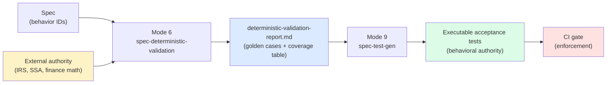
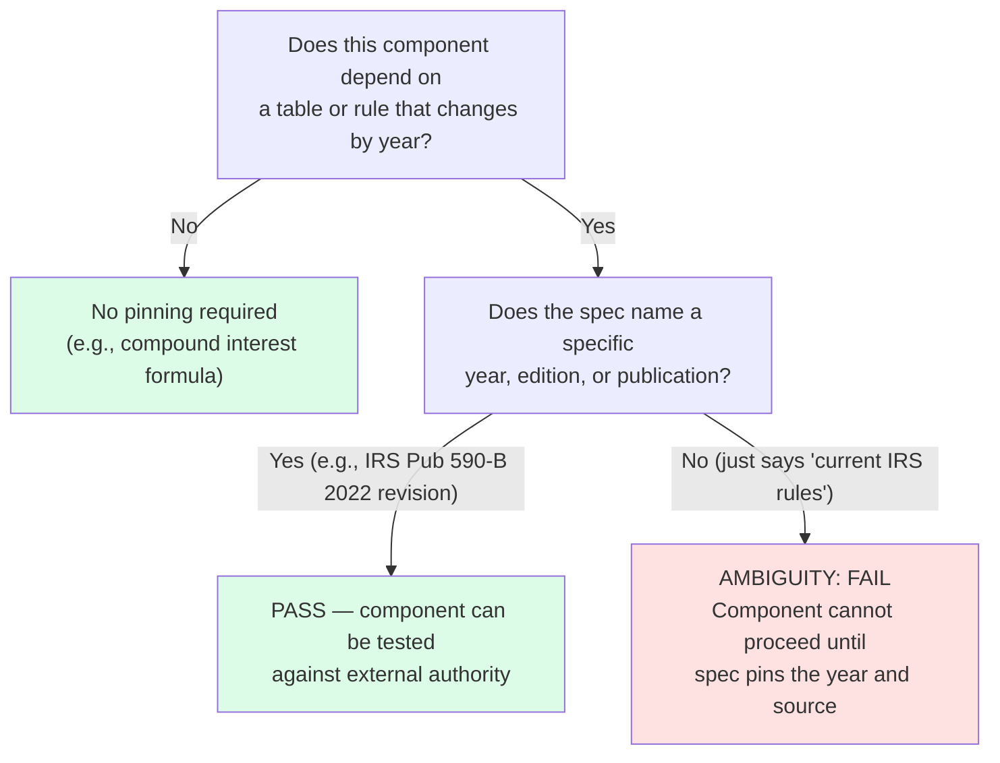

# Chapter 8: Testing Against Ground Truth

## The Circularity Problem

When you write tests for code you've implemented, you're checking consistency: does the code do what I think it should do? Useful. Catches typos, logic inversions, missed edge cases, off-by-one errors. But it doesn't catch the more fundamental problem: what if what you think it should do is wrong?

There are two distinct failure modes, and they're easy to conflate. The first is implementation error: the spec says X, the developer writes code that does Y, and the discrepancy is a bug. Tests that compare code to spec catch this. The second is spec error: the spec says X, the developer correctly implements X, the tests correctly verify that the code does X, but X is wrong — wrong according to IRS law, wrong according to financial mathematics, wrong according to a regulatory table that was updated two years ago. Internal consistency tests catch the first failure mode and completely miss the second.

For a retirement simulation, the distinction is not academic. The question is not "does the code correctly compute RMDs according to the spec?" The question is "does the spec correctly describe what RMDs are supposed to be according to IRS law?" A spec written by a developer who misread IRS Publication 590-B will produce code that is consistent with the spec and wrong in reality. Tests written against that spec will pass and confirm the wrong behavior.

Here's the failure mode in concrete terms. A developer writes a spec for RMD calculation. They look up the Uniform Lifetime Table but find a blog post referencing the pre-2022 IRS life expectancy factors — it ranks well in search results. The IRS issued new tables in 2022, reducing RMD amounts across the board by roughly 6-7% for most ages. The blog post was written in 2019 and describes the old tables, which were in effect from 2003 to 2021. The developer copies the factors into the spec. The spec says that at age 73, the life expectancy factor is 24.7. The developer implements the calculator. The calculator divides account balance by 24.7. Unit tests verify that balance / 24.7 = the expected amount. Integration tests pass. The system ships and computes RMDs that are consistently and silently too high, potentially triggering excess distribution rules or tax consequences for every user over 73.

The correct life expectancy factor for age 73 under the 2022 IRS Uniform Lifetime Table (IRS Publication 590-B, 2022 revision) is 26.5. The correct RMD for a $500,000 account is $500,000 / 26.5 = $18,868. Not $500,000 / 24.7 = $20,243. The difference is $1,375 per year. For a retiree who lives twenty years past age 73, that compounding error affects twenty distributions, affects tax calculations in each of those years, and in a simulation context produces systematically overstated RMDs that make portfolios deplete faster than they should, which in turn distorts Monte Carlo failure probability calculations. Every metric downstream of an RMD calculation is contaminated.

Internal consistency tests don't catch this. An existing-art test does: "IRS Publication 590-B (2022 revision), Uniform Lifetime Table, age 73 → life expectancy factor 26.5. Given balance = $500,000, age = 73 → expect RMD = $500,000 / 26.5 = $18,867.92..., rounded to nearest dollar = $18,868." The expected value comes from the IRS publication, not the spec. If the spec says 24.7, the external-authority test fails. The spec is exposed as wrong before the code ships.

`/spec-deterministic-validation` addresses this by anchoring every acceptance test to an external authoritative source. The test does not verify that the code matches the spec. It verifies that the code produces results that match IRS tables, SSA publications, and canonical financial mathematics. If the spec was written correctly, the code will satisfy both. If the spec was wrong, the external-authority tests will fail even when the internal consistency tests pass, revealing the error before it reaches production.

This is the existing-art approach: before you write any tests, identify the existing body of knowledge — the "art" that already exists — that defines correct behavior for each component. Anchor your tests to that body of knowledge. The tests are not circular because the external sources were not written by the team implementing the system.

---
**`/spec-deterministic-validation` instructions — §GOAL:**

```
Create an acceptance test suite that validates deterministic engine behavior against:
- accounting identities and invariants
- published regulatory rules and tables
- canonical financial mathematics

These tests must not depend on implementation details.
```
---



## What Makes a Source Authoritative

The skill is explicit about what counts as an authoritative source. For financial planning and retirement simulation, the allowed sources are IRS and SSA official publications and official data tables, standard finance math identities at textbook level, and state revenue department sources for state tax rules. Disallowed sources include blogs, Medium articles, StackOverflow answers, and vendor marketing.

---
**`/spec-deterministic-validation` instructions — §HARD RULES:**

```
- Every property MUST be anchored to authoritative sources:
  - project-specific regulatory publications (see **Authoritative source types** in PROJECT CONFIGURATION), or
  - standard domain math identities (textbook-level), or
  - regional/state regulatory sources as applicable to the domain
- Disallowed sources: blogs, Medium, StackOverflow, vendor marketing
- If a component depends on rules that vary by year and the spec does not pin the year/table version, flag an ambiguity and output **FAIL** for that component
```
---

This is not snobbery. It's a practical constraint with three justifications: verifiability, stability, and accountability.

Verifiability: an IRS publication with a specific publication number and tax year revision can be retrieved today, tomorrow, and in five years and will contain the same information. "IRS Publication 590-B (2022 revision)" is a permanent, retrievable citation. A blog post that explains RMD calculations in accessible language can't be cited with the same permanence — the author may update it, take it down, or let it go stale without any indication that the content changed. If a test is anchored to a blog post that no longer exists, the test's evidentiary basis evaporates.

Stability: IRS publications have explicit version labels. When the IRS updates a table, it publishes a new revision with a new date. The change is documented and announced. You know when the authoritative source changed, you know what changed, and you can update your tests accordingly. A blog post that informally incorporates regulatory updates doesn't give you this visibility — you might be reading a version that was silently corrected three months ago.

Accountability: in an audit context — not just financial audit, but any situation where you must justify a calculation — you need to cite an authoritative source. "We computed this based on IRS Publication 590-B" is a defensible statement. "We computed this based on a blog post that explained IRS Publication 590-B" is not. A test anchored to an informal source is no better than a test anchored to no source at all.

The "textbook-level" qualifier for finance math identities means the standard results: the compound interest formula A = P(1 + r/n)^(nt), the present value formula PV = FV / (1 + r)^n, the accounting identity that net income equals revenues minus expenses. These are mathematical facts that any finance textbook will confirm. They are not interpretations of tax law — they are logical consequences of defined mathematical operations. They're allowed as authoritative sources because they can't be wrong in the way that an interpretation of a regulatory rule can be wrong.

State revenue department sources deserve specific mention because state tax rules have high variance. State income taxes differ from federal income taxes in dozens of ways: different brackets, different standard deductions, different treatment of retirement income, different FICA treatment, some states with no income tax at all. The only authoritative source for a specific state's tax rules is that state's official revenue department publications. For Virginia, that's the Virginia Department of Taxation official instructions. For California, it's the Franchise Tax Board instructions. A multi-state tax comparison website is inadequate — these sites may contain errors, may not reflect the current year's rules, and can't be cited in any context that requires authority.

The reason blogs and StackOverflow answers fail as sources is illustrated concretely. Search for "IRS RMD rules 2022" and results will include blog posts written before SECURE Act 2.0 became law in December 2022. SECURE Act 2.0 changed the RMD starting age from 72 to 73 (and subsequently to 75 under certain conditions). A blog post written in January 2022 about RMD rules is wrong about the starting age. Using it as the basis for a test means you have a test that verifies correct-sounding but legally incorrect behavior, and you won't know it unless you have a better source to compare against. The entire point of existing-art tests is to have a source that is reliably right. Informal sources can't provide that guarantee.

## The Year-Pinning Requirement

Every regulatory rule that changes over time must be pinned to a specific year and source revision in the spec and in the test comments. The skill treats unspecified year-pinning as a FAIL on the component, not a warning. An unpinned test is not a test — it's a gamble.

---
**`/spec-deterministic-validation` instructions — §NOTE ON YEAR-PINNING:**

```
Deterministic rule tests become unreliable if table versions are not pinned. If the specs do not specify:
- tax year
- table edition
- bracket source/version

Flag ambiguity and FAIL that component until the spec pins the version.
```
---



Tax brackets illustrate the problem. Federal income tax brackets are adjusted annually for inflation. The 2024 22% bracket for married filing jointly covers taxable income from $94,301 to $201,050. The 2025 22% bracket covers taxable income from $96,951 to $206,700. A test that says "taxable income of $100,000 should produce federal income tax of approximately $X" is correct for one set of brackets and wrong for another. If the test was written using 2024 brackets and the code implements 2025 brackets, the test fails. If both are 2025, the test passes — but only because the assumptions happened to match. When 2026 brackets land, the test becomes wrong again without any visible indication it needs updating.

The correct approach pins the year explicitly: "implementing 2024 federal income tax brackets as published in IRS Revenue Procedure 2023-34." The test comment says:

```java
// IRS Rev. Proc. 2023-34 — 2024 Tax Year Brackets, MFJ:
// 10%: $0 – $23,200
// 12%: $23,201 – $94,300
// 22%: $94,301 – $201,050
// Taxable income $100,000:
//   10% bracket: $23,200 × 0.10 = $2,320.00
//   12% bracket: ($94,300 - $23,200) × 0.12 = $71,100 × 0.12 = $8,532.00
//   22% bracket: ($100,000 - $94,300) × 0.22 = $5,700 × 0.22 = $1,254.00
//   Total: $2,320 + $8,532 + $1,254 = $12,106.00
```

That arithmetic is pinned. If the spec is updated to implement 2025 brackets, the test comment is updated, the expected value is recomputed, and the test changes explicitly. Nothing silently drifts.

RMD divisors have their own pinning requirement. The IRS released updated life expectancy tables effective for tax year 2022, replacing the tables that had been in effect since 2003. The update increased life expectancy factors across the board, which reduces RMD amounts. A test written in 2021 using the pre-2022 factors is wrong for any system that implements the current tables. It gives no indication it was written for superseded tables. If the code correctly implements the 2022 tables and the test verifies the pre-2022 calculation, the test fails — and the failure looks like a code bug rather than a stale test. That diagnostic confusion is costly.

The year-pinned comment for an RMD test looks like this:

```java
// IRS Publication 590-B, 2022 revision — Uniform Lifetime Table (Table III)
// Participant age 73 at year-end: life expectancy factor = 26.5
// Prior year-end balance: $500,000
// RMD = $500,000 / 26.5 = $18,867.924...
// IRS rounding: round to nearest dollar = $18,868
```

IRMAA thresholds have the same requirement. IRMAA income thresholds are adjusted annually for inflation, and the adjustment applies on a two-year lookback — the IRMAA tier that applies in 2025 is based on MAGI from 2023. A test that says "MAGI of $200,000 should result in the second IRMAA tier" is wrong without specifying which year's thresholds apply, and without specifying the lookback year. Pin both: "2025 Part B IRMAA, based on 2023 MAGI — Tier 2 threshold: individual filer MAGI > $161,000. Source: CMS.gov IRMAA announcement, November 2024."

Year-pinning isn't just about protecting tests from silent drift. It's also documentation: when someone reads the test two years from now and wants to update it, the comment tells them exactly what source to consult, what year's tables were in use, and what arithmetic they need to redo. Without that, updating the test requires reconstructing the research that originally produced it.

## The Component Structure

The skill defines a domain-specific list of components that the validation must cover. For Lumiscape, these are: money conventions (cents rounding), interest and growth calculators, withdrawals, RMD calculations, taxes, Social Security, contribution limits, inflation application, ledger accounting, validation and error handling, and reporting. The component list lives in the PROJECT CONFIGURATION block of the skill so it can be replaced for a different domain without changing the validation methodology.

---
**`/spec-deterministic-validation` instructions — §TEST DESIGN REQUIREMENTS:**

```
- Tests must be black-box: use only public APIs
- Tests should be exact whenever possible
- If rounding is involved, tests must specify:
  - rounding rule (e.g., Math.round to nearest cent)
  - tolerance (typically <= 1–2 cents) and why
- For each component, include:
  - at least 3 positive tests (normal cases)
  - at least 2 negative tests (invalid inputs rejected with exact error codes/messages if specified)
  - at least 2 boundary tests (age thresholds, bracket edges, year transitions, zero balances)
  - at least 2 invariant tests (accounting identity / conservation of cents)
```
---

For each component, the skill requires a minimum of four test types: at least three positive tests covering normal operating cases, at least two negative tests verifying that invalid inputs are rejected with the correct error code and message, at least two boundary tests at threshold transitions, and at least two invariant tests verifying conservation properties. These are floors, not targets. A component with the complexity of the federal income tax calculator — with its progressive brackets, standard deduction, qualified dividend rules, capital gains rates, and Social Security taxation interaction — will need substantially more than three positive tests. The minimums exist to make sure negative and boundary cases don't get skipped, which is where bugs most often hide.

The component structure also requires, for each component: a SOURCES section listing the authoritative citations, a PROPERTIES section listing the numbered rules with citations, a TESTS section with exact inputs and expected outputs, a COVERAGE TABLE mapping behavior IDs to tests and sources, and an AMBIGUITIES section flagging anything that could not be resolved cleanly. This forces the test author to make explicit the chain from external authority to property to test. If that chain can't be completed — if a property can't be cited to an authoritative source — the component gets a FAIL for that property, not a warning.

## Component D: RMD Calculations — A Complete Example

RMD calculations are among the highest-stakes deterministic behaviors in a retirement simulation. They are mandatory — an account owner who fails to take the required minimum distribution owes a 25% excise tax on the shortfall (reduced to 10% if corrected promptly under SECURE Act 2.0 rules). Getting them right matters in a way that is directly measurable in dollars.

**Sources:**
- IRS Publication 590-B (2022 revision) — Distributions from Individual Retirement Arrangements — Table III (Uniform Lifetime Table) and Table II (Joint Life and Last Survivor Expectancy)
- IRS Notice 2022-53 — Guidance regarding updated life expectancy tables effective January 1, 2022
- SECURE Act 2.0 (enacted December 29, 2022) — Changed RMD starting age from 72 to 73 for individuals who turn 72 after December 31, 2022
- IRS Publication 590-B — Table I (Single Life Expectancy) — for beneficiaries of inherited IRAs

**Properties:**

(1) A participant who turns 73 in year Y must begin taking RMDs from traditional IRAs by April 1 of year Y+1 (the required beginning date). For all subsequent years, the RMD must be taken by December 31 of that year. Source: SECURE Act 2.0, IRC §401(a)(9)(C).

(2) RMD = prior year-end account balance / life expectancy factor from the Uniform Lifetime Table for the participant's age as of December 31 of the distribution year. Source: IRS Publication 590-B, 2022 revision, Table III.

(3) If the participant is a surviving spouse who is the sole beneficiary of the deceased spouse's IRA and is more than 10 years younger, use the Joint Life and Last Survivor Table instead of the Uniform Lifetime Table. Source: IRS Publication 590-B, Table II.

(4) A participant who is a beneficiary of an inherited IRA (non-spousal) uses the Single Life Expectancy Table (Table I). Source: IRS Publication 590-B, Table I.

(5) RMD amounts are rounded to the nearest dollar. Source: standard IRS rounding conventions.

**Tests:**

Positive test 1:

```java
/**
 * RMD Golden Case — IRS Publication 590-B (2022 revision)
 * Uniform Lifetime Table (Table III), participant age 73 at December 31:
 *   Life expectancy factor: 26.5
 *   Prior year-end balance: $500,000.00
 *   RMD = $500,000.00 / 26.5 = $18,867.924...
 *   Rounded to nearest dollar: $18,868
 *
 * This value can be independently verified by looking up age 73 in
 * IRS Pub 590-B Table III and performing the division.
 */
@Test
void givenAge73Balance500000_whenComputeRmd_thenReturns18868() {
    Account ira = TraditionalIraAccount.withPriorYearEndBalance(500_000_00L); // cents
    PersonState person = PersonState.withAge(73);
    long rmd = rmdCalculator.compute(ira, person, 2024);
    assertThat(rmd).isEqualTo(1_886_800L); // $18,868.00 in cents
}
```

Positive test 2:

```java
/**
 * RMD Golden Case — IRS Publication 590-B (2022 revision)
 * Uniform Lifetime Table (Table III), participant age 80 at December 31:
 *   Life expectancy factor: 20.2
 *   Prior year-end balance: $800,000.00
 *   RMD = $800,000.00 / 20.2 = $39,603.96...
 *   Rounded to nearest dollar: $39,604
 */
@Test
void givenAge80Balance800000_whenComputeRmd_thenReturns39604() {
    Account ira = TraditionalIraAccount.withPriorYearEndBalance(800_000_00L);
    PersonState person = PersonState.withAge(80);
    long rmd = rmdCalculator.compute(ira, person, 2024);
    assertThat(rmd).isEqualTo(3_960_400L); // $39,604.00 in cents
}
```

Positive test 3:

```java
/**
 * RMD Golden Case — IRS Publication 590-B (2022 revision)
 * Uniform Lifetime Table (Table III), participant age 90 at December 31:
 *   Life expectancy factor: 12.2
 *   Prior year-end balance: $250,000.00
 *   RMD = $250,000.00 / 12.2 = $20,491.80...
 *   Rounded to nearest dollar: $20,492
 */
@Test
void givenAge90Balance250000_whenComputeRmd_thenReturns20492() {
    Account ira = TraditionalIraAccount.withPriorYearEndBalance(250_000_00L);
    PersonState person = PersonState.withAge(90);
    long rmd = rmdCalculator.compute(ira, person, 2024);
    assertThat(rmd).isEqualTo(2_049_200L); // $20,492.00 in cents
}
```

Negative test 1 — pre-RMD age:

```java
/**
 * SECURE Act 2.0 (enacted Dec 29, 2022): RMD starting age is 73
 * for participants who turn 72 after December 31, 2022.
 * Age 72 is below the required beginning date threshold.
 */
@Test
void givenAge72_whenComputeRmd_thenThrowsNoRmdRequiredException() {
    Account ira = TraditionalIraAccount.withPriorYearEndBalance(500_000_00L);
    PersonState person = PersonState.withAge(72);
    assertThatThrownBy(() -> rmdCalculator.compute(ira, person, 2024))
        .isInstanceOf(NoRmdRequiredException.class)
        .hasMessageContaining("age 72 is below RMD threshold of 73");
}
```

Negative test 2 — Roth IRA:

```java
/**
 * Roth IRAs do not have RMD requirements during the owner's lifetime.
 * Source: IRC §408A(c)(5); IRS Publication 590-B.
 */
@Test
void givenRothIraAccount_whenComputeRmd_thenThrowsRmdNotApplicableException() {
    Account roth = RothIraAccount.withPriorYearEndBalance(500_000_00L);
    PersonState person = PersonState.withAge(75);
    assertThatThrownBy(() -> rmdCalculator.compute(roth, person, 2024))
        .isInstanceOf(RmdNotApplicableException.class)
        .hasMessageContaining("Roth IRA is not subject to RMD rules");
}
```

Boundary test 1 — first RMD eligible age:

```java
/**
 * Age 73 is the first year an RMD is required under SECURE Act 2.0
 * for participants who turn 72 after December 31, 2022.
 * This is the minimum age boundary — must trigger RMD, not throw.
 */
@Test
void givenAge73_whenComputeRmd_thenSucceeds() {
    Account ira = TraditionalIraAccount.withPriorYearEndBalance(100_000_00L);
    PersonState person = PersonState.withAge(73);
    long rmd = rmdCalculator.compute(ira, person, 2024);
    assertThat(rmd).isPositive(); // must succeed and return a positive amount
}
```

Boundary test 2 — maximum table age:

```java
/**
 * IRS Pub 590-B Table III extends to age 120+.
 * At age 120, the divisor is 2.0.
 * Balance $100,000 / 2.0 = $50,000.
 */
@Test
void givenAge120Balance100000_whenComputeRmd_thenReturns50000() {
    Account ira = TraditionalIraAccount.withPriorYearEndBalance(100_000_00L);
    PersonState person = PersonState.withAge(120);
    long rmd = rmdCalculator.compute(ira, person, 2024);
    assertThat(rmd).isEqualTo(5_000_000L); // $50,000.00 in cents
}
```

Invariant test — monotonicity of RMD with age:

```java
/**
 * As age increases, life expectancy factor decreases, so RMD increases
 * as a fraction of account balance. All else equal, older participant
 * must have higher RMD than younger participant.
 */
@Test
void givenSameBalance_whenAgeIncreases_thenRmdIncreases() {
    Account ira75 = TraditionalIraAccount.withPriorYearEndBalance(500_000_00L);
    Account ira76 = TraditionalIraAccount.withPriorYearEndBalance(500_000_00L);
    long rmd75 = rmdCalculator.compute(ira75, PersonState.withAge(75), 2024);
    long rmd76 = rmdCalculator.compute(ira76, PersonState.withAge(76), 2024);
    assertThat(rmd76).isGreaterThan(rmd75);
}
```

## Component E: Taxes — Showing the Complexity

Federal income tax calculation looks simple until you implement it. There are brackets. There is a standard deduction. There are multiple filing statuses with different bracket widths. Qualified dividends and long-term capital gains are taxed at preferential rates. The presence of Social Security income creates a provisional income calculation that determines how much of Social Security is taxable, which in turn affects the ordinary income calculation. Each of these interactions is a potential source of error, and each needs its own tests.

**Sources:**
- IRS Publication 17 (2024 tax year) — federal income tax brackets, standard deductions, filing status rules
- IRS Revenue Procedure 2023-34 — 2024 inflation-adjusted tax brackets (the authoritative publication for 2024 bracket amounts)
- IRS Publication 590-B — Social Security taxation thresholds
- IRS Publication 550 — qualified dividends and long-term capital gains rates
- IRC §86 — statutory basis for Social Security taxation

**Properties for SS Taxation:**

(1) Provisional income = Adjusted Gross Income + tax-exempt interest + 50% of Social Security benefits. Source: IRC §86(b)(2).

(2) If provisional income < $25,000 (single) or < $32,000 (married filing jointly), 0% of Social Security benefits are included in taxable income. Source: IRC §86(c)(1).

(3) If provisional income is between $25,000 and $34,000 (single) or $32,000 and $44,000 (MFJ), up to 50% of Social Security benefits are included in taxable income. Source: IRC §86(c)(1)(A).

(4) If provisional income exceeds $34,000 (single) or $44,000 (MFJ), up to 85% of Social Security benefits are included in taxable income. Source: IRC §86(c)(2).

**Golden case — SS taxation, 0% inclusion:**

```java
/**
 * IRC §86(c)(1): provisional income < $25,000 (single filer)
 * → 0% of SS benefit is taxable.
 *
 * AGI (non-SS): $18,000
 * Tax-exempt interest: $0
 * SS benefit (annual): $14,400
 * Provisional income: $18,000 + $0 + ($14,400 × 0.50) = $25,200
 *
 * Wait — this is ABOVE $25,000 threshold; recompute:
 * AGI (non-SS): $14,000
 * SS benefit: $14,400
 * Provisional income: $14,000 + $0 + $7,200 = $21,200 < $25,000
 * Taxable SS: $0
 */
@Test
void givenProvisionalIncomeBelow25000Single_whenComputeTaxableSS_thenReturnsZero() {
    TaxInput input = TaxInput.builder()
        .filingStatus(FilingStatus.SINGLE)
        .adjustedGrossIncome(1_400_000L)  // $14,000 in cents (non-SS)
        .taxExemptInterest(0L)
        .annualSsBenefit(1_440_000L)       // $14,400 in cents
        .build();
    long taxableSS = taxCalculator.computeTaxableSocialSecurity(input);
    assertThat(taxableSS).isEqualTo(0L);
}
```

**Golden case — SS taxation, 85% inclusion:**

```java
/**
 * IRC §86(c)(2): provisional income > $44,000 (MFJ)
 * → up to 85% of SS benefit is taxable.
 *
 * AGI (non-SS): $70,000
 * Tax-exempt interest: $5,000
 * SS benefit (combined): $36,000 ($18,000 per person × 2)
 * Provisional income: $70,000 + $5,000 + ($36,000 × 0.50)
 *                   = $70,000 + $5,000 + $18,000 = $93,000
 * $93,000 > $44,000 → 85% of SS benefit is taxable
 * Taxable SS: $36,000 × 0.85 = $30,600
 *
 * Source: IRC §86(c)(2) — the 85% cap applies; actual formula per IRS
 * is the lesser of 85% of SS benefit or a formula based on the excess
 * over $44,000. At this income level, the cap applies.
 */
@Test
void givenProvisionalIncomeAbove44000MFJ_whenComputeTaxableSS_thenReturns85Percent() {
    TaxInput input = TaxInput.builder()
        .filingStatus(FilingStatus.MARRIED_FILING_JOINTLY)
        .adjustedGrossIncome(7_000_000L)   // $70,000 in cents
        .taxExemptInterest(500_000L)        // $5,000 in cents
        .annualSsBenefit(3_600_000L)        // $36,000 in cents
        .build();
    long taxableSS = taxCalculator.computeTaxableSocialSecurity(input);
    // $36,000 × 0.85 = $30,600.00
    assertThat(taxableSS).isEqualTo(3_060_000L);
}
```

The SS taxation rules are a case where the spec can be wrong in subtle ways. The naive reading is "85% of SS benefits are taxable above the threshold." The correct reading is "the taxable amount is the lesser of (a) 85% of SS benefits, and (b) 85% of the excess of provisional income over the upper threshold, plus the entire amount previously taxable at 50%." At high income levels, these produce the same result: 85% of SS benefits. At moderate income levels, they differ. A spec that collapses these two formulas into "use 85% above $44,000" will produce correct results for high-income retirees and wrong results for moderate-income retirees in the transition zone between 50% and 85% inclusion. Only a test anchored to the actual statutory formula (IRC §86(c)) will catch this.

## The Required System Invariants

---
**`/spec-deterministic-validation` instructions — §REQUIRED INVARIANTS:**

```
Include as tests if applicable:

- Balance continuity: ending = starting + inflows + returns − outflows − taxes (within rounding tolerance)
- No negative balances unless explicitly allowed
- Withdrawals cannot exceed available balances
- Tax amounts cannot be negative
- If spending increases (with all else equal), terminal wealth cannot increase (monotonicity)
- If starting wealth increases (all else equal), failure probability cannot increase
```
---

Beyond component-specific tests, the validation requires tests for system-level invariants. These are properties that must hold across the entire simulation, not just within individual components. They come from financial mathematics and accounting, not from the spec. Any correct simulation must satisfy them regardless of implementation choices.

**Balance continuity** is the most fundamental invariant. In words: ending balance = starting balance + inflows + returns - outflows - taxes, within a rounding tolerance of 1-2 cents. In test form:

```java
/**
 * Accounting identity: ending balance = beginning balance + inflows + returns - outflows - taxes.
 * This is a mathematical identity that must hold regardless of implementation choices.
 * Tolerance: within 2 cents to account for per-transaction rounding.
 *
 * Scenario: $1,000,000 starting balance, $50,000 withdrawal, 7% return, $12,000 taxes.
 * Expected ending balance:
 *   Returns applied to starting balance: $1,000,000 × 0.07 = $70,000
 *   Ending = $1,000,000 + $0 (no inflows) + $70,000 - $50,000 - $12,000 = $1,008,000
 */
@Test
void givenOneYearSimulation_whenBalanceContinuityChecked_thenAccountingIdentityHolds() {
    Scenario scenario = scenarioBuilder()
        .startingBalance(100_000_000L)   // $1,000,000 in cents
        .annualWithdrawal(5_000_000L)    // $50,000 in cents
        .returnRate(0.07)
        .federalTaxes(1_200_000L)        // $12,000 in cents
        .build();

    SimulationResult result = engine.runDeterministic(scenario);

    long expectedEnding = 100_800_000L; // $1,008,000 in cents
    assertThat(result.endingBalance())
        .isCloseTo(expectedEnding, Offset.offset(200L)); // within 2 cents
}
```

What does this test catch? Integration errors — cases where two individually correct components interact incorrectly. For example: if withdrawals are applied before returns are computed, that's mathematically correct. But if a bug causes the withdrawal to be subtracted twice — once before returns, once after — the ending balance will be $50,000 lower than the identity requires. The accounting identity test fails with a clear discrepancy pointing directly to a double-counting bug. Component-level tests for withdrawal and return calculation might both pass independently; only the integration-level invariant catches the interaction.

**The spending monotonicity invariant** captures a relationship that seems obvious but can be violated in simulation systems with complex tax interactions:

```java
/**
 * Monotonicity: if spending increases (all else equal), terminal wealth cannot increase.
 * This is a first-principles requirement: spending is a drain on wealth.
 * Tax interactions can change the rate of decline but cannot reverse the direction.
 *
 * Violation scenario that could happen without this test:
 * Higher spending pushes income below a tax bracket threshold, reducing marginal tax
 * rate, which reduces taxes enough to partially offset the spending increase.
 * The NET effect (spending + taxes) could theoretically be less than the original taxes alone
 * at some narrow income band. If the simulation applies this effect compoundly, terminal
 * wealth could be higher with more spending — which is economically nonsensical.
 */
@Test
void givenHigherSpending_whenSimulationRuns_thenTerminalWealthNotHigher() {
    BaseScenario base = buildBaseScenario(ANNUAL_SPENDING_80K);
    BaseScenario higher = buildBaseScenario(ANNUAL_SPENDING_90K);

    long terminalWealthBase = engine.runDeterministic(base).terminalWealth();
    long terminalWealthHigher = engine.runDeterministic(higher).terminalWealth();

    assertThat(terminalWealthHigher).isLessThanOrEqualTo(terminalWealthBase);
}
```

**The withdrawal floor invariant** verifies that withdrawals never exceed available balance:

```java
/**
 * Withdrawals cannot create negative account balances (unless the account type
 * explicitly allows overdraft, which no retirement account type does).
 * This is an accounting constraint: you cannot withdraw money that is not there.
 */
@Test
void givenExcessWithdrawalRequest_whenProcessed_thenWithdrawalCappedAtBalance() {
    Account ira = TraditionalIraAccount.withBalance(10_000_00L); // $10,000
    long withdrawalRequest = 15_000_00L; // $15,000 — exceeds balance
    long actualWithdrawal = withdrawalProcessor.process(ira, withdrawalRequest);
    assertThat(actualWithdrawal).isEqualTo(10_000_00L); // capped at balance
    assertThat(ira.balance()).isEqualTo(0L);             // account emptied, not negative
}
```

**The tax non-negativity invariant** is straightforward but catches a class of bugs in bracket calculations:

```java
/**
 * Tax liability cannot be negative. Negative tax (i.e., the IRS owes you money
 * from bracket arithmetic alone) is not a valid output — credits and refunds are
 * separate from the liability calculation.
 * If a bracket arithmetic bug causes negative numbers (e.g., wrong sign in
 * marginal rate calculation), this invariant catches it.
 */
@Test
void forAnyValidTaxableIncome_whenComputeFederalTax_thenResultIsNonNegative() {
    long[] incomes = { 0L, 1_000_00L, 25_000_00L, 100_000_00L, 500_000_00L };
    for (long income : incomes) {
        long tax = taxCalculator.computeFederalTax(income, FilingStatus.SINGLE, 2024);
        assertThat(tax).isGreaterThanOrEqualTo(0L)
            .as("Tax must be non-negative for income %d cents", income);
    }
}
```

## Golden Cases — The Most Valuable Tests in the Suite

A golden case is a test where the expected value is computed from a cited external source, with the arithmetic shown in the comment. The "minimal but high-signal" policy governs how many golden cases to write for any component.

The policy: you need enough golden cases to verify that the correct table is being used and that the arithmetic is correct. For the RMD Uniform Lifetime Table, that means three cases: one near the minimum eligible age (73), one in the middle of the distribution (around 85-90), and one at the maximum table age (120+). These three cases verify that the table lookup works, that the division is being performed correctly, and that the boundary cases don't trigger lookup errors. Thirty golden cases that test every age from 73 to 120 add zero signal beyond what three cases establish — the table either works or it doesn't. If the lookup for age 73 is correct and the lookup for age 90 is correct and the lookup for age 120 is correct, the intervening values are almost certainly correct too.

More is not better. The danger of over-specifying golden cases is that the test suite becomes a reproduction of the IRS table in test form. When the IRS updates the table, you update every golden case instead of three. The maintenance cost scales with the number of cases, the signal doesn't. Three well-chosen golden cases provide near-certainty that the implementation is correct; thirty add overhead without adding certainty.

The complete golden case documentation format for a single test:

```java
/**
 * RMD Golden Case — IRS Publication 590-B (2022 revision)
 * Table III — Uniform Lifetime Table
 * Participant age 85 at December 31 of the distribution year:
 *
 *   Life expectancy factor at age 85: 16.0
 *   Prior year-end account balance: $750,000
 *   Required minimum distribution: $750,000 / 16.0 = $46,875.000
 *   IRS rounding rule: round to nearest dollar = $46,875
 *
 * Verification: consult IRS Pub 590-B (2022), Table III, row for age 85.
 * Factor is listed as 16.0. Division: $750,000 ÷ 16.0 = $46,875 exactly.
 * No rounding required in this case (exact division).
 *
 * This case tests the middle of the age range to confirm table traversal
 * is working for ages substantially above the minimum RMD age.
 */
@Test
void givenAge85Balance750000_whenComputeRmd_thenReturns46875() {
    Account ira = TraditionalIraAccount.withPriorYearEndBalance(750_000_00L);
    PersonState person = PersonState.withAge(85);
    long rmd = rmdCalculator.compute(ira, person, 2024);
    assertThat(rmd).isEqualTo(4_687_500L); // $46,875.00 in cents
}
```

Every part of this documentation matters. The citation gives the source. The age specifies which row was looked up. The factor value is stated before the arithmetic so a reader can verify the lookup independently. The arithmetic is shown in full so a reader can verify the division. The rounding rule is stated even when no rounding is needed — to confirm the reviewer was aware of it. The final comment explains why this case was chosen: what property of the system it verifies, not just what inputs it uses.

This documentation format is not overhead. It's the evidence that the test is an existing-art test rather than a consistency test. If the comment shows the IRS factor, shows the arithmetic, and the expected value matches the arithmetic, the test is anchored to reality. If the comment is absent, the test might be anchored to whatever the developer computed when they wrote it, which may or may not match the IRS table.

## The Coverage Gate: Non-Negotiable Completeness

---
**`/spec-deterministic-validation` instructions — §COVERAGE GATE (non-negotiable):**

```
- Every deterministic behavior ID in the specs MUST map to >= 1 acceptance test
- If any behavior ID is uncovered, output FAIL and list missing IDs
```
---

Every deterministic behavior ID in every spec must map to at least one acceptance test. If any behavior ID is uncovered, the validation report outputs FAIL and lists the missing IDs. This is a hard gate, not a soft warning.

The coverage gate is implemented as a coverage table that appears at the end of each component section. The format is:

```
## Coverage Table — Component D: RMD Calculations

| Behavior ID       | Test(s)                                     | Property | Source                          |
|-------------------|---------------------------------------------|----------|---------------------------------|
| LUM-ENG-015-B-001 | testRmdAge73, testRmdAge85, testRmdAge120   | (1), (2) | IRS Pub 590-B (2022), Table III |
| LUM-ENG-015-B-002 | testRmdEligibilityAge72, testRmdAge73       | (1)      | SECURE Act 2.0, IRC §401(a)(9)  |
| LUM-ENG-015-B-003 | testRmdRothNotApplicable                    | —        | IRC §408A(c)(5)                 |
| LUM-ENG-015-B-004 | testRmdMonotonicity                         | (2)      | IRS Pub 590-B (2022), Table III |
| LUM-ENG-015-B-005 | testRmdAccountBalanceZero                   | (2)      | Mathematical identity           |
| LUM-ENG-015-B-006 | testInheritedIraUsesTableI                  | (4)      | IRS Pub 590-B (2022), Table I   |
```

A FAIL on the coverage gate looks like this in the validation report:

```
COMPONENT D: RMD Calculations — FAIL
Coverage gate: FAILED

Uncovered behavior IDs:
  LUM-ENG-015-B-007 — Multi-account RMD aggregation: RMDs from multiple traditional IRAs
                       may be aggregated and taken from any one or combination of IRAs.
                       Source required: IRS Pub 590-B (2022), Aggregation Rules.
  LUM-ENG-015-B-008 — Inherited IRA RMD with 10-year rule (SECURE Act): non-spouse
                       beneficiaries who inherited after 2019 must empty the account within
                       10 years. No annual RMD is required in years 1-9 under the 10-year rule
                       (as clarified by IRS Notice 2022-53 and subsequent guidance).
                       Source required: SECURE Act §401, IRS Notice 2022-53.

These behavior IDs have no acceptance tests. Implementation of these behaviors will have
no external verification. Affected behaviors relate to multi-account RMD aggregation and
inherited IRA disposition rules — both high-complexity, high-stakes behaviors with
material impact on distribution calculations.

Action required: write acceptance tests for LUM-ENG-015-B-007 and LUM-ENG-015-B-008
before proceeding to Mode 9.
```

The gate is non-negotiable because the purpose of Mode 6 is to validate completeness before implementation begins. An uncovered behavior ID means there is no external-authority test for that behavior. When the developer implements it in Mode 10, they will write unit tests — but those tests will be consistency tests. They will verify that the code does what the developer thought it should do, not that what the developer thought is correct. The Mode 6 gate exists to prevent this gap. If the gate has exceptions, it doesn't protect the behaviors that need it most — the complex, subtle behaviors most likely to be implemented incorrectly.

## What This Mode Does Not Do

`/spec-deterministic-validation` does not write production code. It generates acceptance tests that will be run against eventual production code to verify correct behavior. The tests are written against the spec's defined public APIs, using method signatures and type names as defined in the specs, before any class exists in the `src/` directory.

This temporal ordering is the entire point. Tests written before implementation set targets. The implementation either hits the target or it doesn't. Tests written after implementation tend to reflect what was implemented rather than what should have been implemented — the author, consciously or not, writes tests that match the code. If the code computes RMDs using the wrong divisors, the tests a developer writes after the fact will use those wrong divisors as expected values, because the developer sees that the code produces a certain number and writes a test asserting that number. The test passes. The bug is invisible.

Tests written from the spec, before the code, enforce the spec. When those tests are anchored to external authoritative sources, they enforce correctness — not just consistency with the spec, but alignment with the IRS table, the accounting identity, the financial mathematics. The implementation either hits the target or it exposes a discrepancy. That discrepancy is either a bug in the implementation (fix the code), a bug in the spec (fix the spec through the freeze process), or a bug in the test (the external source was misread, fix the test and the citation). All three outcomes are improvements. None of them is silent.

The mode also does not test probabilistic or stochastic behaviors. If a calculation involves a random variable, a distribution, or a Monte Carlo simulation, it belongs to Mode 7 (`/spec-monte-carlo-validation`), which uses different techniques: fixed seeds, repeated runs, statistical confidence intervals, and formal hypothesis tests. Mode 6 is strictly for behaviors that are deterministic — given the same inputs, they always produce the same output. Tax brackets, RMD divisors, compound interest formulas, and accounting identities are all deterministic. The mode is named for this property, and it is enforced by the component list in the PROJECT CONFIGURATION block, which includes only deterministic components.

## The Deliverable Format — A Complete Example

---
**`/spec-deterministic-validation` instructions — §DELIVERABLE FORMAT (exact):**

```
1) COMPONENT INDEX (list components found)
2) For each component:
   A) SOURCES (bulleted)
   B) PROPERTIES (numbered, each with citation)
   C) TESTS (with names, exact inputs, and exact expected outputs)
   D) COVERAGE TABLE (Behavior ID → Test(s) → Property → Source)
   E) AMBIGUITIES / CONTRADICTIONS (if any)
3) OVERALL PASS/FAIL
```
---

The output of Mode 6 is the `deterministic-validation-report.md` artifact. Here is an excerpt showing what a complete component validation looks like in the report:

```markdown
# Deterministic Validation Report
**Generated:** Mode 6 — /spec-deterministic-validation
**Spec freeze tag:** spec-freeze-2026-02-21
**Date:** 2026-02-21

---

## COMPONENT INDEX

| # | Component | Status |
|---|-----------|--------|
| A | Money Conventions | PASS |
| B | Interest / Growth Calculators | PASS |
| C | Withdrawals | PASS |
| D | RMD Calculations | PASS |
| E | Taxes (Federal) | PASS |
| F | Taxes (State) | FAIL — year not pinned in LUM-DAT-006 |
| G | Social Security | PASS |
| H | Contribution Limits | PASS |
| I | Inflation Application | PASS |
| J | Ledger / Cashflow Accounting | PASS |
| K | Validation and Error Handling | PASS |
| L | Reporting | PASS |

**Overall: FAIL**
See Component F — ambiguity blocks state tax component.

---

## COMPONENT D: RMD Calculations

### Sources
- IRS Publication 590-B (2022 revision): https://www.irs.gov/publications/p590b
- IRS Notice 2022-53 — guidance on updated life expectancy tables
- SECURE Act 2.0 (P.L. 117-328, enacted December 29, 2022)

### Properties
(1) RMD starting age is 73 for participants turning 72 after December 31, 2022.
    Citation: SECURE Act 2.0, §107 amending IRC §401(a)(9)(C).
(2) RMD = prior year-end balance / Uniform Lifetime Table factor for participant age.
    Citation: IRS Pub 590-B (2022), Table III.
...

### Tests
[7 tests listed with full code as shown above]

### Coverage Table
[Table as shown above — all 6 behavior IDs covered]

### Ambiguities / Contradictions
None. Behavior IDs LUM-ENG-015-B-001 through LUM-ENG-015-B-006 are all pinned
to specific IRS publications and statutory citations. No year-pinning gaps identified.

**Component D result: PASS**

---

## COMPONENT F: Taxes (State)

### Sources
- LUM-DAT-006 references "state tax table" but does not specify tax year.

### Ambiguities / Contradictions
**AMBIGUITY (year-pinning):** LUM-DAT-006 (State Tax Table Repository) defines a
repository of state tax data but does not specify which tax year the data represents.
State income tax rules vary by year. Without pinning the tax year, acceptance tests
for state tax calculations cannot anchor to a specific authoritative source.

**Action required:** LUM-DAT-006 must be updated to specify the tax year for the
state tax table data (e.g., "2024 state income tax rules as published by each state's
revenue department"). Until this is resolved, state tax component tests cannot be
written to existing-art standard.

**Component F result: FAIL — year-pinning gap blocks test authoring**
```

The format makes the failure mode visible and actionable. A FAIL on Component F doesn't block Components A through E and G through L from passing. It identifies a specific gap in a specific spec, names the exact information needed to resolve it, and leaves the rest of the validation complete. When the spec is updated to pin the tax year, the author returns to Component F, writes the tests, and updates the report. The artifact is a living document until all components pass.

## Putting It Together: Why This Mode Cannot Be Skipped

The pipeline gates at `engineering/spec-freeze.lock` enforce sequential order. Mode 6 checks for this file before doing anything. If it doesn't exist, the mode stops. This is not a convention — it is a hard stop.

---
**`/spec-deterministic-validation` instructions — §PREREQUISITE — SPEC FREEZE VERIFICATION:**

```
Before anything else, verify:

lumiscape/engineering/spec-freeze.lock

If this file does not exist, stop immediately. Do not proceed. Inform the user that spec-deterministic-validation cannot begin until the spec freeze is confirmed and the lock file is present.

The lock file is the gate. No lock file = no execution.
```
---

The gate is enforced mechanically because the temptation to skip Mode 6 is strongest precisely when it matters most. Under schedule pressure, acceptance tests look like optional overhead — you have unit tests, you have the spec, the code is already being written. But "the code is already being written" means Mode 6 has failed at its primary purpose: establishing external-authority test targets before implementation begins. A Mode 6 run after the code exists is weaker because the test author has the code in front of them and may unconsciously anchor expected values to what the code produces rather than what the IRS table says.

The mode occupies its position in the pipeline — after spec freeze, before implementation — because that is when it is strongest. When tests written from external authorities disagree with tests written from specs, the discrepancy is visible before any code is written to satisfy either set of tests. The spec author and the test author together can identify whether the spec is wrong, whether the external source was misread, or whether there is genuine ambiguity in the regulatory rule. That conversation happens in a spec revision, before it becomes embedded in code.

Mode 6 is where the cost of being wrong is still low. By Mode 10, a wrong assumption has been implemented, tested, integrated, and connected to other components that depend on it. Fixing it requires changing code in multiple places. In Mode 6, fixing it requires changing a test comment and recomputing an expected value. The question Mode 6 forces is direct: are your tests anchored to reality, or just to your own prior assumptions? The IRS table does not care what your spec says. The accounting identity does not care what your implementation does. The existing-art test suite enforces this, and the spec freeze gate ensures you can't skip it.
