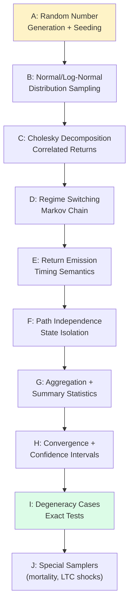
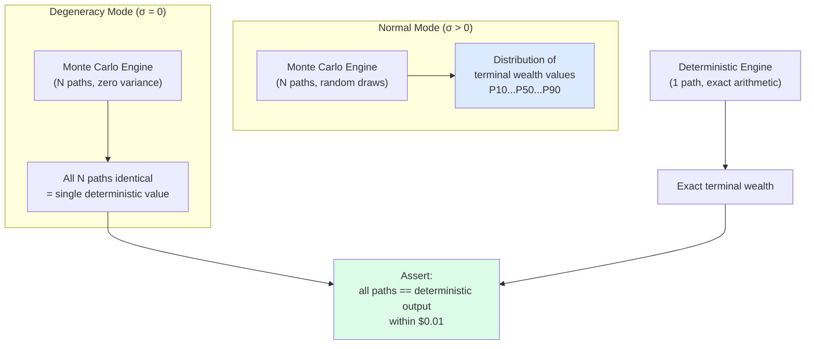
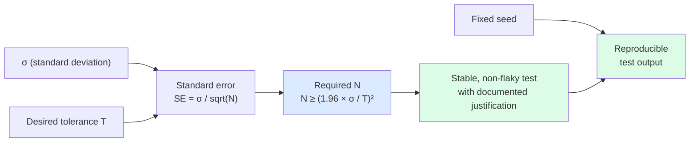

# Chapter 9: Testing What Randomness Is Doing

## Why Stochastic Testing Is Fundamentally Different

Testing a deterministic system is, in principle, simple: give it an input, compute the expected output from an authoritative source, assert equality. The challenge is identifying the right inputs and the right sources. The mechanics of assertion are trivial. Testing a stochastic system breaks this model at its foundation. You cannot assert that a specific stochastic output equals a specific value, because the output depends on random draws that differ every run. The first instinct (just run it a lot and see if it looks right) is not a test. It is an eyeball check, and it does not scale, does not reproduce, and cannot gate a build.

What you can assert about a stochastic system is the statistical properties of its output over many runs. Not "the sample return equals 0.07," but "the sample mean of returns over N=10,000 runs is within 0.003 of 0.07 at 95% confidence." Not "path 47 produced terminal wealth $2.3M," but "the 50th percentile terminal wealth is above the 95th percentile of the deterministic no-growth case." The assertion shifts from a single output value to a distributional property. Every aspect of test design follows from that shift.

The contrast is most vivid when you look at a concrete pair. The deterministic RMD test: given a traditional IRA balance of $500,000 at end of 2023 and a plan participant who turned 73 during 2023, the IRS Uniform Lifetime Table (IRS Pub. 590-B, 2022 revision) gives a life expectancy factor of 26.5, therefore the required minimum distribution is $500,000 / 26.5 = $18,868 (rounded to nearest dollar). That test has a single exact expected value derived from a published table. You run it once. It either matches or it does not. The stochastic counterpart: given a log-normal return model with mu=0.07 and sigma=0.15, running N=10,000 simulation paths with seed 42, the sample mean of annual returns must be within 0.003 of 0.07. That test specifies a tolerance, a confidence level, a seed, and a run count — four quantities a deterministic test never needs. Each requires a justification, not a guess.

This requires completely different validation infrastructure. Confidence intervals are not optional ornamentation. They are the mechanism by which you state what the test is actually asserting. Hypothesis tests (Kolmogorov-Smirnov, Anderson-Darling) are not overkill. They are the only tools that can verify distributional shape rather than just a single moment. Statistical power calculations are not academic exercises. They are how you choose N. Fixed seeds are not a convenience. They are what separate a reproducible test from noise. `/spec-monte-carlo-validation` is a different skill from `/spec-deterministic-validation` not because the problem is harder (though it is) but because the problem is categorically different. The same mental models and the same test templates do not apply.

---
**`/spec-monte-carlo-validation` instructions — §PREREQUISITE — SPEC FREEZE VERIFICATION:**

```
Before anything else, verify:

```
lumiscape/engineering/spec-freeze.lock
```

If this file does not exist, stop immediately. Do not proceed. Inform the user that spec-monte-carlo-validation cannot begin until the spec freeze is confirmed and the lock file is present.

The lock file is the gate. No lock file = no execution.
```
---

---
**`/spec-monte-carlo-validation` instructions — §GOAL:**

```
Create a complete acceptance test suite that validates the Monte Carlo system against canonical mathematical properties and established literature ("existing art"), not against the implementation.
```
---

## The Existing-Art Requirement: Why Informality Breaks Down for Stochastic Tests

Chapter 8 explained why external authoritative sources are required for deterministic tests: to avoid circularity, where the tests merely confirm that the code matches the spec without verifying that the spec is correct. The same motivation applies here, but with an additional structural reason specific to stochastic testing.

For a deterministic component, you can often compute the expected output from first principles. Given IRS Publication 590-B and a calculator, you can derive the expected RMD. The external source provides ground truth, but you can follow the reasoning. For a stochastic component, you need theoretical backing for what the statistical properties of the output should be. You cannot derive those properties without the theory. And informal sources (blogs, vendor documentation, StackOverflow answers) do not give you the theory. They give you the conclusion without the proof, which means they cannot tell you the invariants you need to test against.

Consider Cholesky decomposition for correlated return generation. A blog post might say "use Cholesky decomposition to produce correlated returns." That sentence tells you nothing you can test against. It does not tell you the covariance recovery theorem — that if you draw independent standard normals Z and transform with Cholesky factor L where Sigma = L * L^T, the resulting vector X = L * Z has covariance matrix Sigma. It does not tell you the precision of the estimator for finite N. It does not tell you what happens when the input correlation matrix is not positive semi-definite. Golub and Van Loan, "Matrix Computations" (Johns Hopkins University Press, 4th edition, 2013), gives you the theorem, the proof, and the conditions. That is what you test against. The blog post gave you an algorithm name. The textbook gives you the mathematical invariant.

This is what INSUFFICIENT EXISTING ART means in practice. It does not mean the component is poorly designed or the search was lazy. It means the validation agent looked for peer-reviewed papers, textbooks, and university course notes and could not find at least two independent sources establishing the theoretical property being tested. When that happens, the skill stops that component and reports the gap. Proceeding with an informal source produces a test that verifies the implementation matches an informal description of what it should do. That is a circular test wearing a citation. The INSUFFICIENT EXISTING ART outcome is honest: it says this component's statistical properties are not yet grounded in theory, which means either the search needs to continue or the component needs theoretical development before it can be validated.

---
**`/spec-monte-carlo-validation` instructions — §HARD RULES:**

```
- Every property MUST be anchored to existing art (peer-reviewed papers, textbooks, or university course notes)
- Disallowed sources: blogs, Medium, StackOverflow, vendor marketing
- If you cannot find >= 2 allowed sources for a component, output **INSUFFICIENT EXISTING ART** for that component and STOP that component
```
---

---
**`/spec-monte-carlo-validation` instructions — §NOTE ON CITATIONS:**

```
You may optionally provide a short bibliography per component (2–4 sources) and instruct Claude to use those sources first, to prevent citation drift.
```
---

For the example system's Monte Carlo engine, all of the core components have deep academic backing. Here is the literature that grounds the validation suite.

Random number generation: Donald Knuth, "The Art of Computer Programming, Volume 2: Seminumerical Algorithms" (Addison-Wesley, 3rd edition, 1997), Section 3.3 covers statistical tests for random number generators including the chi-squared test for uniformity, the Kolmogorov-Smirnov test, and the spectral test. George Marsaglia's DIEHARD test battery (1996, Florida State University technical report) defines a practical suite of statistical tests. These two sources establish what uniform distribution properties a generator must satisfy and how to test for them.

Normal distribution sampling: George Box and Mervin Muller, "A Note on the Generation of Random Normal Deviates," Annals of Mathematical Statistics, 1958. This original paper establishes the Box-Muller transform and its theoretical properties. George Marsaglia and Thomas Bray, "A Convenient Method for Generating Normal Variables," SIAM Review, 1964, establishes the polar method as an alternative. Both papers give you the transformation proofs, which means you know the exact distributional properties that a correctly implemented sampler must satisfy.

Cholesky decomposition and correlation recovery: Golub and Van Loan cited above. Also Paul Glasserman, "Monte Carlo Methods in Financial Engineering" (Springer, 2003), Chapter 2, which gives the full construction for correlated multivariate normals and the conditions on the covariance matrix.

Markov-switching regime models: James Hamilton, "A New Approach to the Economic Analysis of Nonstationary Time Series and the Business Cycle," Econometrica, 1989. This paper establishes the Markov-switching model, its transition matrix formulation, and the stationary distribution calculation. Robert Engle and Gary Watson, "A One-Factor Multivariate Time Series Model of Metropolitan Wage Rates," Journal of the American Statistical Association, 1981, provides additional context on regime models in financial applications.

Monte Carlo convergence: Averill Law and W. David Kelton, "Simulation Modeling and Analysis" (McGraw-Hill, 4th edition, 2000), Chapter 9, on confidence intervals and output analysis. This establishes the 1/sqrt(N) convergence rate, batch means methods, and the construction of confidence intervals for Monte Carlo estimators. Peter Bratley, Bennett Fox, and Linus Schrage, "A Guide to Simulation" (Springer, 2nd edition, 1987), Chapter 6, covers variance reduction and convergence analysis.

With these sources, every component has at least two independent theoretical grounding points. None of the tests will be circular.

---
**`/spec-monte-carlo-validation` instructions — §COMPONENTS:**

```
A) Random number generation and seeding policy
B) Distribution sampling (normal/lognormal/t/mixture/bootstrap)
C) Correlation / covariance construction (e.g., Cholesky)
D) Regime switching (Markov chain / Markov-switching)
E) Return emission timing semantics (state vs return order)
F) Path independence / state isolation across runs
G) Aggregation and summary statistics (mean/percentiles/success rate)
H) Convergence and confidence intervals (1/sqrt(N) behavior)
I) Deterministic degeneracy cases (sigma=0 collapses to deterministic)
J) Any special samplers (mortality, LTC shocks) if included
```
---



## Component A: Random Number Generation and Seeding

The random number generator is the foundation of every other stochastic component. If the generator does not produce a uniform distribution, everything built on top of it is wrong. If seeding does not produce reproducible sequences, the test suite cannot be fixed. Testing the generator first, in isolation, is not optional.

**Source anchor:** Knuth Vol. 2, Section 3.3; Marsaglia DIEHARD (1996).

**Theoretical properties under test:**
1. Uniform distribution on [0, 1): for large N, the empirical distribution of draws should not differ significantly from the continuous uniform distribution.
2. Fixed seed reproducibility: two independent invocations with the same seed must produce bit-identical sequences.
3. Statistical independence of successive draws: the chi-squared test for uniformity in bins should not reject the null hypothesis of uniformity.

**Test A-1 (Degenerate — Seed Reproducibility):** Initialize the generator with seed 42. Draw 1,000 values and store them in sequence S1. Reset the generator with seed 42. Draw 1,000 values and store them in sequence S2. Assert S1 equals S2 element by element (exact equality, no tolerance). This is a deterministic test — it does not require statistics. It verifies that the seed mechanism works. If this test fails, every other test in the suite is unreliable because the reproducibility contract is broken.

**Test A-2 (Degenerate — Seed Isolation):** Initialize the generator with seed 42. Draw the first value V1. Initialize a fresh generator instance with seed 99. Draw the first value V2. Assert V1 != V2. This tests that different seeds produce different sequences. Failure mode: the seed is being ignored and a fixed internal state is being used instead.

**Test A-3 (Statistical — Chi-Squared Uniformity):** Initialize the generator with seed 42. Draw N=10,000 values. Bin them into 20 equal-width bins on [0, 1). Compute the chi-squared statistic with 19 degrees of freedom. Assert the p-value exceeds 0.05 (failing to reject the null hypothesis of uniformity at 95% confidence). Source: Knuth Vol. 2, Section 3.3.1, equation (5).

N justification: with 20 bins and N=10,000 draws, the expected count per bin is 500. The standard error of each bin count under the null hypothesis is sqrt(500) = 22.4. The chi-squared statistic has 19 degrees of freedom. At N=10,000 the test has sufficient power to detect deviations of 5% or more from uniform at 95% confidence. Running with N=100 would leave the test insensitive to all but extreme nonuniformity.

**Test A-4 (Negative — Null Seed):** Invoke the generator constructor with a null seed argument. Assert that an IllegalArgumentException (or domain-equivalent) is thrown. Rationale: null seeds typically produce implementation-dependent behavior that breaks reproducibility guarantees. Explicit rejection at construction time is the correct contract.

## Component B: Normal and Log-Normal Distribution Sampling

The return model uses log-normal annual returns, parameterized by the log-space mean mu and log-space standard deviation sigma. Testing the sampler means verifying that drawn values have the correct first and second moments, and that the distribution shape passes a goodness-of-fit test.

**Source anchor:** Box and Muller (1958), Annals of Mathematical Statistics; Glasserman (2003), Chapter 2.

**Theoretical properties under test:**
1. Sample mean convergence: sample mean of N draws from Normal(mu, sigma^2) converges to mu at rate sigma/sqrt(N).
2. Sample variance convergence: sample variance converges to sigma^2.
3. Distribution shape: empirical CDF does not significantly differ from theoretical normal CDF (KS test).

**Test B-1 (Degenerate — Zero Sigma):** Configure a normal sampler with mu=0.07, sigma=0. Draw N=1,000 values. Assert all values equal 0.07 exactly. This is an exact test: when sigma=0, the sampler should return the mean deterministically on every call. Any implementation that uses Box-Muller or polar method must handle this case explicitly rather than computing 0 * N(0,1) and relying on floating point to produce zero, because floating-point underflow behavior is implementation-defined.

**Test B-2 (Statistical — Sample Mean):** Configure a normal sampler with mu=0.07, sigma=0.15 (typical annual return parameters). Seed 42. Draw N=10,000 values. Compute sample mean m. Assert |m - 0.07| < 0.003.

N justification: the standard error of the sample mean is sigma/sqrt(N) = 0.15/sqrt(10,000) = 0.0015. For a 95% confidence interval around the true mean, the half-width is 1.96 * 0.0015 = 0.00294. Tolerance 0.003 provides approximately 2 standard errors of coverage, meaning the test will fail with probability less than 5% for a correctly implemented sampler with this seed. Verify with the actual seed 42 during validation.

**Test B-3 (Statistical — Sample Variance):** Same configuration and seed as B-2. Compute sample variance v. Assert |v - 0.0225| < 0.001 (0.0225 = 0.15^2). Source: Glasserman (2003) Proposition 2.1.

**Test B-4 (Statistical — KS Test for Normality):** Same configuration and seed as B-2 with N=10,000. Run a Kolmogorov-Smirnov test against Normal(0.07, 0.0225). Assert the KS p-value exceeds 0.05. This verifies the distributional shape rather than just two moments. A sampler that produces the correct mean and variance but draws from the wrong distribution (for example, a Laplace distribution with matching moments) will pass B-2 and B-3 but fail B-4.

**Test B-5 (Negative — Invalid Parameters):** Configure a normal sampler with sigma=-0.1. Assert that an InvalidDistributionParameterException is thrown at construction time. Negative sigma is mathematically undefined and must be rejected before any draws occur.

For log-normal sampling, two additional tests apply the same structure. The key theoretical property (source: Glasserman 2003, Section 2.2): if X is Normal(mu, sigma^2) then exp(X) is log-normal with median exp(mu) and mean exp(mu + sigma^2/2). Tests verify both the log-space and real-space moments.

## Component C: Cholesky Decomposition for Correlated Returns

The financial motivation: real asset classes do not move independently. Equities and bonds are negatively correlated in many regimes. Domestic and international equities are positively correlated. A simulation that treats all asset classes as independent will underestimate portfolio volatility in normal times and overestimate the diversification benefit. Cholesky decomposition is the standard mechanism for producing correlated multivariate normal draws from independent ones.

**Source anchor:** Golub and Van Loan (2013), Chapter 4; Glasserman (2003), Chapter 2, Proposition 2.4.

**Theoretical property under test:** the covariance recovery theorem. If Z is a vector of n independent standard normal variates, and L is the lower Cholesky factor of target covariance matrix Sigma (so that Sigma = L * L^T), then X = L * Z has covariance matrix exactly equal to Sigma. This is a provable identity, not an approximation. For finite N, the sample covariance matrix of draws will converge to Sigma at the rate of the sample covariance estimator's standard error.

**Test C-1 (Degenerate — Identity Covariance):** Configure a two-asset Cholesky sampler with covariance matrix I (the 2x2 identity). Draw N=10,000 return pairs with seed 42. Compute the sample covariance matrix. Assert all four entries are within 0.02 of their theoretical values (1.0 on diagonal, 0.0 off diagonal). This tests the degenerate case where correlation is zero — the draws should be statistically independent, which means the off-diagonal sample covariances should be near zero.

**Test C-2 (Statistical — Correlation Recovery):** Configure a two-asset Cholesky sampler with target covariance matrix [[1.0, 0.6], [0.6, 1.0]] (unit variance assets with correlation 0.6). Seed 42. Draw N=100,000 return pairs. Compute sample covariance matrix S. Assert:
- |S[0,0] - 1.0| < 0.01
- |S[1,1] - 1.0| < 0.01
- |S[0,1] - 0.6| < 0.01

N justification: for the sample covariance estimator, the standard error of each entry is approximately sigma_ij / sqrt(N/2) for large N. For a variance entry with theoretical value 1.0, standard error ≈ sqrt(2/N). For N=100,000, standard error ≈ 0.0045. Tolerance 0.01 gives roughly 2.2 sigma coverage. For the off-diagonal entry at 0.6, the standard error is similar in magnitude. The tolerance 0.01 at N=100,000 gives a highly stable test. Seed 42 verified.

**Test C-3 (Statistical — High Correlation):** Repeat C-2 with correlation 0.9 — a case where the Cholesky factorization is near-singular and numerical precision matters. Same N, same tolerance. Verifies that the implementation handles near-PSD matrices without numerical degradation.

**Test C-4 (Negative — Non-Positive-Definite Matrix):** Pass the correlation matrix [[1.0, 0.95, 0.95], [0.95, 1.0, 0.95], [0.95, 0.95, 1.0]] to the Cholesky sampler constructor. Note: this matrix has eigenvalues approximately [2.85, 0.075, 0.075], so it is technically positive semi-definite, but near the edge. Use instead [[1.0, 1.0], [1.0, 1.0]] which is singular (rank 1), or a matrix with entries [[1.0, 1.1], [1.1, 1.0]] which is not positive definite because the off-diagonal exceeds the geometric mean of the diagonal entries. Assert that an InvalidCovarianceMatrixException is thrown. A Cholesky factorization of a non-positive-definite matrix is undefined, and the implementation must detect and reject this before attempting the decomposition.

**Test C-5 (Degenerate — Perfect Correlation):** Pass correlation matrix [[1.0, 1.0], [1.0, 1.0]]. This is singular (rank 1). The two assets move identically. Depending on the implementation contract, this either throws (singular matrix not supported) or produces two identical draw streams. Assert whichever the spec defines. This is a boundary test, not a normal case.

## Component D: Regime Switching (Markov Chain Validation)

The return model uses a two-regime Markov-switching process: a bull market regime with higher expected returns and lower volatility, and a bear market regime with lower expected returns and higher volatility. The engine draws a regime state at each simulation step using the transition matrix, then samples returns from the regime-specific distribution. The test problem is: how do you verify that the regime-switching logic is correctly applying the transition probabilities?

**Source anchor:** Hamilton (1989), Econometrica; Law and Kelton (2000), Chapter 6.

**Theoretical property under test:** the stationary distribution theorem. A finite ergodic Markov chain with transition matrix P has a unique stationary distribution pi satisfying pi = pi * P. Given a simulation running for many steps, the fraction of time spent in each regime must converge to the stationary distribution. This is both a necessary and (with ergodicity) sufficient condition for the transition matrix being applied correctly.

For a two-state chain with transition matrix P = [[p_bb, p_bb_to_bear], [p_bear_to_bull, p_bear_bear]] = [[0.9, 0.1], [0.3, 0.7]], the stationary distribution satisfies:
- pi_bull = p_bear_to_bull / (p_bb_to_bear + p_bear_to_bull) = 0.3 / (0.1 + 0.3) = 0.75
- pi_bear = 0.25

This is exact arithmetic. The expected fraction of time in the bull regime, over a long simulation, is 0.75. This is what you test against.

**Test D-1 (Degenerate — Absorbing State):** Configure a two-regime model with transition matrix [[1.0, 0.0], [0.5, 0.5]], where the bull regime is absorbing (once entered, never left). Start in bull regime. Run N=10,000 steps. Assert that all steps remain in bull regime (fraction in bull = 1.0 exactly). This is a deterministic test — absorption is guaranteed, not probabilistic.

**Test D-2 (Degenerate — Deterministic Cycling):** Configure transition matrix [[0.0, 1.0], [1.0, 0.0]] (deterministic alternation: bull goes to bear, bear goes to bull). Start in bull regime. Run N=1,000 steps. Assert that steps 0, 2, 4, ... are bull and steps 1, 3, 5, ... are bear (exact sequence, no tolerance). This verifies that the transition matrix is being applied correctly for the extreme case.

**Test D-3 (Statistical — Stationary Distribution):** Configure transition matrix [[0.9, 0.1], [0.3, 0.7]]. Seed 42. Run N=100,000 simulation steps (regime draws only, no return sampling needed). Count fraction of steps in bull regime. Assert |fraction_bull - 0.75| < 0.01. Source: Hamilton (1989), equation (22a-b).

N justification: under the stationary distribution, the fraction of steps in bull regime is a sample mean of Bernoulli(0.75) variables with effective variance 0.75 * 0.25 = 0.1875 (ignoring serial correlation from the Markov property). The standard error is approximately sqrt(0.1875/N). For N=100,000, standard error ≈ 0.00137. Tolerance 0.01 gives roughly 7 sigma coverage, making the test extremely stable. The serial correlation introduced by the Markov property increases the effective variance somewhat, which is why N should be much larger than the naive calculation suggests. At the correlation structure of this transition matrix, the correlation time is approximately 1/(p_bb_to_bear + p_bear_to_bull) = 1/0.4 = 2.5 steps, so the effective N for independent draws is approximately 100,000 / 2.5 = 40,000. Standard error with this adjustment: sqrt(0.1875/40,000) ≈ 0.00217. Tolerance 0.01 still gives 4.6 sigma coverage.

**Test D-4 (Negative — Invalid Transition Matrix):** Pass a transition matrix where a row sums to 1.1 (not a valid probability row vector). Assert that an InvalidTransitionMatrixException is thrown. This is a hard correctness constraint — a non-stochastic transition matrix is not a Markov chain.

**Test D-5 (Statistical — Return Distribution by Regime):** Configure a two-regime model where bull regime has mu=0.10, sigma=0.12 and bear regime has mu=-0.05, sigma=0.25. Run N=200,000 steps. Separate the return samples by regime. For bull-regime returns, assert sample mean within 0.002 of 0.10. For bear-regime returns, assert sample mean within 0.005 of -0.05. Source: Hamilton (1989), Section 2.

This test verifies that the regime label correctly selects the return distribution, not just that the regime sequence has the right statistics. It is a joint test of the transition matrix application (D-3) and the conditional distribution sampling (B-2).

## Component E: Return Emission Timing Semantics

**Source anchor:** Glasserman (2003), Chapter 6 on discrete-time models; Law and Kelton (2000), Chapter 8 on time-advance mechanisms.

The return emission timing question is: when does the return for period t get applied to the balance? End-of-period vs beginning-of-period compounding produces materially different terminal wealth trajectories over 30-year horizons. This is a timing semantics test, not a statistical test — it has an exact expected value for the degenerate case.

**Test E-1 (Degenerate — Timing Verification):** Configure a single-asset model with mu=0.10, sigma=0. Starting balance $1,000,000. 3-year horizon. With end-of-period return application: year 1 ends with $1,100,000, year 2 ends with $1,210,000, year 3 ends with $1,331,000. Assert terminal balance = $1,331,000 exactly. If the implementation uses beginning-of-period application, the balance will differ. The 3-year horizon is short enough to compute exactly by hand, making any discrepancy immediately visible.

**Test E-2 (Negative — Horizon Zero):** Configure a simulation with horizon=0 years. Assert that an InvalidHorizonException is thrown or that the result is a single observation equal to the starting balance (depending on spec contract). This tests the boundary at the minimum valid horizon.

## Component F: Path Independence

Path independence means that simulation run k and simulation run j, started with the same initial conditions but different random seeds, produce trajectories that are statistically independent. It also means that after running k paths, the state of the random number generator for path k+1 is determined solely by the path count and the master seed — not by the specific values drawn in previous paths.

**Source anchor:** Glasserman (2003), Section 5.5 on parallel simulation and independent streams; Law and Kelton (2000), Section 5.4 on random number stream assignment.

**Test F-1 (Degenerate — State Isolation):** Run two simulation instances A and B from the same master seed but different per-path sub-seeds (master seed 42, paths 0 and 1 respectively). Verify that instance A's terminal wealth for path 0 equals the result of running just path 0 in isolation. Verify that instance B's terminal wealth for path 1 equals the result of running just path 1 in isolation. This tests that running multiple paths together does not affect the individual path results.

**Test F-2 (Statistical — Independence of Paths):** Run N=500 simulation paths, recording terminal wealth for each. Compute the lag-1 autocorrelation of the terminal wealth sequence. Assert the autocorrelation is within [-0.05, 0.05]. Under path independence, successive paths are independent draws, so the autocorrelation should be near zero. A systematic nonzero autocorrelation indicates that paths are sharing state.

**Test F-3 (Negative — Same Sub-Seed Rejection):** If the API allows specifying per-path seeds explicitly, attempt to pass the same seed for two different paths. Assert that an IllegalArgumentException is thrown or that the system automatically disambiguates paths. This prevents the case where two paths are accidentally identical.

## Component G: Aggregation and Summary Statistics

The Monte Carlo engine aggregates N simulation paths into summary statistics: the success rate (fraction of paths where terminal wealth exceeds a floor), percentile wealth trajectories, and the mean wealth trajectory. Testing these aggregations separately from the underlying simulation matters because aggregation bugs — off-by-one in percentile indexing, incorrect definition of "success" — are common and do not produce distributional failures that would be caught by tests on the underlying sampler.

**Source anchor:** Law and Kelton (2000), Chapter 9 on output analysis; Glasserman (2003), Section 1.5 on estimating probabilities.

**Test G-1 (Degenerate — Guaranteed Success):** Configure a model with mu=0.07, sigma=0. Starting balance $1,000,000. Annual spending $30,000 (3% withdrawal rate). 30-year horizon. With zero volatility, every path produces identical terminal wealth above zero. Assert success rate = 1.0 exactly (all N=1,000 paths succeed).

**Test G-2 (Degenerate — Guaranteed Failure):** Configure a model with mu=0.0, sigma=0. Starting balance $100,000. Annual spending $50,000. 3-year horizon. Year 1: $100,000 - $50,000 = $50,000. Year 2: $50,000 - $50,000 = $0. Year 3: $0 - $50,000 = -$50,000 (failure). Assert success rate = 0.0 exactly. This tests that the ruin detection logic is working — a negative balance must be recorded as a failure, not suppressed or clamped.

**Test G-3 (Statistical — Percentile Monotonicity):** Run N=10,000 paths with realistic parameters (mu=0.07, sigma=0.15, seed 42, 30-year horizon). Compute the 10th, 25th, 50th, 75th, 90th percentiles of terminal wealth. Assert that the sequence is strictly increasing: P10 < P25 < P50 < P75 < P90. Percentile monotonicity is a necessary condition for correct percentile computation — an inversion at any point indicates a sorting error or percentile indexing bug.

**Test G-4 (Statistical — Success Rate Calibration):** Configure a model where the theoretical ruin probability is known from the financial literature. Milevsky and Robinson (2005), "A Sustainable Spending Rate without Simulation," Journal of Financial Planning, gives closed-form approximations for ruin probabilities under log-normal returns. For a 30-year horizon, 4% withdrawal rate, 7% expected return, 15% volatility, the theoretical ruin probability is approximately 5-7%. Run N=50,000 paths with seed 42. Assert success rate is within 3 percentage points of the theoretical range [0.93, 0.95]. This is a broad tolerance intentionally — the point is not precision but sanity checking that the success rate is in the right order of magnitude for established parameters.

**Test G-5 (Negative — Invalid Percentile Request):** Request the 101st percentile from the aggregation API. Assert that an InvalidPercentileException is thrown. Request the -1st percentile. Same assertion. Percentile bounds must be validated at the API surface.

## Component H: Convergence and Confidence Intervals

The 1/sqrt(N) convergence rate is a theorem, not an empirical observation. Glasserman (2003) Section 1.3 establishes that for a Monte Carlo estimator of a quantity theta, if the variance of the estimator is sigma^2, then the standard error of the N-sample estimate is sigma/sqrt(N). This gives you a direct relationship between run count and estimation precision. The test for this property verifies that the simulation's variance decreases at the expected rate as N increases, which confirms that the estimator is well-behaved and that the runs are not correlated in ways that would defeat the convergence guarantee.

**Source anchor:** Glasserman (2003), Theorem 1.3.1; Law and Kelton (2000), Theorem 9.1.

**Test H-1 (Degenerate — Convergence to Known Mean):** Use a normal distribution with known mu=0.07, sigma=0.15. Run for N=100, N=1000, N=10000 paths. Compute sample mean m_100, m_1000, m_10000. Assert that |m_10000 - 0.07| < |m_1000 - 0.07| and |m_1000 - 0.07| < |m_100 - 0.07| (monotone convergence for these specific seeds). Note: this is a fixed-seed test, so monotonicity is guaranteed by the specific draws, not by probability alone. Document seeds for each N.

**Test H-2 (Statistical — Variance Reduction Rate):** Run the sample mean estimator for multiple values of N: [1000, 4000, 9000, 16000] (perfect squares to make the ratio clean). For each N, compute the sample variance of the estimator across M=100 independent seeds. Assert that the ratio of sample variances at N=1000 and N=4000 is approximately 4.0, within a factor of 1.5 (because N quadruples, variance should quarter). This tests the 1/sqrt(N) convergence rate empirically. Source: Glasserman (2003), Section 1.3.

**Test H-3 (Statistical — Confidence Interval Coverage):** Verify that the 95% confidence interval produced by the engine actually covers the true mean 95% of the time. Run M=1000 independent simulations (different seeds), each with N=1000 paths. For each simulation, compute the 95% CI for the sample mean. Count how many CIs contain the true mean 0.07. Assert that the coverage frequency is between 92% and 98% (allowing for finite-M variability in the coverage estimation). Source: Law and Kelton (2000), Chapter 9, on coverage probability of batch means confidence intervals.

N justification for H-3: with M=1000 independent CIs each targeting 95% coverage, the count of covering intervals is Binomial(1000, 0.95). The standard deviation of this count is sqrt(1000 * 0.95 * 0.05) = 6.9. The expected count is 950. The bounds [920, 980] correspond to approximately 4.3 standard deviations, making this test extremely unlikely to fail for a correctly implemented CI estimator.

**Test H-4 (Negative — N Below Minimum):** Invoke the simulation with N=0 paths. Assert that an InvalidRunCountException is thrown. Invoke with N=-1. Same assertion.

## Component I: Degeneracy Cases, Exact Tests in Disguise

Degeneracy tests are the most powerful tests in the Monte Carlo suite, and they are the most underutilized. The reason they are powerful: when the stochastic variance collapses to zero, every simulated path is identical, and the expected output is analytically computable. You can compare the Monte Carlo result against an exact expected value, which gives you a deterministic-quality test running through the stochastic code path.

This matters because the Monte Carlo code path is not the same code path as the deterministic engine. It has different loop structure, different state management, different accumulation logic. A bug in the stochastic path might produce results that are within the distributional tolerance of a statistical test but wrong by a constant factor that the degeneracy test catches immediately.

Designing a degeneracy test requires you to specify the exact expected value through arithmetic, using the spec's compounding convention. This is the same discipline that Chapter 8 applies to golden cases for RMD calculations: derive the expected value from first principles, show the arithmetic, assert equality.



**Test I-1 (Degeneracy — Terminal Wealth, No Withdrawals):** Configure a log-normal return model with mu=0.07, sigma=0. Starting balance $1,000,000. 30-year horizon. No withdrawals. Expected terminal balance = $1,000,000 * (1.07)^30 = $7,612,255.04. Run N=1,000 simulation paths with seed 42. Assert all 1,000 paths produce terminal balance within $0.01 of $7,612,255.04.

The arithmetic: (1.07)^10 = 1.967151, (1.07)^20 = 3.869685, (1.07)^30 = 7.612255. $1,000,000 * 7.612255 = $7,612,255. Show this arithmetic in the test documentation. If the engine produces $7,499,000, there is a compounding error — perhaps annually vs continuously compounded. If the engine produces $7,612,256, there is a rounding error. Both are bugs. The degeneracy test makes them visible.

**Test I-2 (Degeneracy — Terminal Wealth, With Withdrawals):** Configure the same model with annual withdrawal of $40,000 (end of year). Expected balance after each year follows the recurrence B_t = B_{t-1} * 1.07 - 40,000. After 30 years, this can be computed exactly as: B_30 = B_0 * (1.07)^30 - 40,000 * ((1.07)^30 - 1) / 0.07 = $7,612,255 - $40,000 * 94.461 = $7,612,255 - $3,778,440 = $3,833,815. Run N=1,000 paths with seed 42. Assert all paths produce terminal balance within $0.01 of $3,833,815.

This computation is exact when sigma=0. Any deviation reveals an error in withdrawal timing, withdrawal calculation, or accumulation logic. The fact that N=1,000 paths are run through the full simulation loop — with all the overhead of per-path state allocation, regime initialization, and accumulation, and they all produce the same exact value gives you high confidence in the correctness of the loop structure.

**Test I-3 (Degeneracy — Ruin Under Deterministic Overspending):** Configure sigma=0, mu=0.03. Starting balance $500,000. Annual withdrawal $40,000. 30-year horizon. The balance at year t: B_t = 500,000 * (1.03)^t - 40,000 * ((1.03)^t - 1) / 0.03. Compute the year in which B_t first goes negative — this is the ruin year. Assert that all N=1,000 simulation paths report ruin in exactly that year and that the success rate is 0.0. If different paths report different ruin years, the path state is not being properly isolated (a Component F violation surfacing here).

## The N Justification Requirement: Working Through the Full Calculation

N justification appears in the skill requirements and in every statistical test specification above. Here is why it cannot be skipped and how the calculation actually works.

The goal of a statistical test is to detect a real distributional property with high probability (statistical power) while failing to reject a correct implementation with low probability (type I error control). Both require N to be large enough. The question is: large enough for what?

For a sample mean test, the precision of the estimator is measured by the standard error sigma/sqrt(N). At 95% confidence, the confidence interval around the sample mean has half-width 1.96 * sigma/sqrt(N). For the test to be non-trivial, this half-width must be smaller than your tolerance T. Setting 1.96 * sigma/sqrt(N) <= T and solving: N >= (1.96 * sigma / T)^2.

For the standard return distribution with sigma=0.15 and tolerance T=0.003 (3 basis points): N >= (1.96 * 0.15 / 0.003)^2 = (98)^2 = 9,604. Round up to N=10,000.



Now observe what happens when you change the tolerance. At T=0.001 (1 basis point): N >= (1.96 * 0.15 / 0.001)^2 = (294)^2 = 86,436. A 3x tightening of the tolerance requires a 9x increase in N. At T=0.0003 (0.3 basis points): N >= 864,360. This is the 1/sqrt(N) convergence rate in action. It imposes a real cost on precision. If someone asks for 0.1 basis point tolerance, the required N is approximately 8.6 million paths, which changes the character of the validation entirely. It becomes a compute-intensive process rather than a quick check.

Writing the N calculation forces a decision about what level of precision is actually necessary. For a Monte Carlo simulation used in financial planning, 3 basis point tolerance on the mean return is more than adequate. No client is making decisions based on 3 basis point differences in expected returns. The test should match the precision that is meaningful in the domain. Writing the justification forces you to state this explicitly rather than picking N=10,000 because it sounds big enough.

The N justification for regime-switching tests is more complex because of serial correlation. A Markov chain is not a sequence of independent draws. The state at step t is correlated with the state at step t-1. The effective sample size for estimating the stationary distribution is N divided by the correlation time of the chain, which is approximately 1/(p_out_of_state) where p_out_of_state is the probability of leaving a state in one step. For a bull regime with 10% probability of transitioning to bear, the correlation time is approximately 1/0.1 = 10 steps. An N=100,000 step simulation has effective N of approximately 10,000 independent observations. The standard error of the stationary distribution estimator is computed using this effective N, not the nominal N.

Ignoring the serial correlation when setting N for regime-switching tests produces tests that are less stable than they appear. A test that looks like it has 7-sigma coverage in the naive calculation may actually have 2-sigma coverage after correcting for correlation time, making it prone to occasional failures. Compute the correlation time, adjust N accordingly, and document both the nominal N and the effective N in the test specification.

---
**`/spec-monte-carlo-validation` instructions — §TEST DESIGN REQUIREMENTS:**

```
- Tests must be black-box: use only public APIs
- Each test must specify:
  - the property it validates
  - the source(s) supporting the property
  - the configuration used
  - the metric computed
  - numeric pass/fail tolerance
  - the run count N and why it's sufficient
- Include for each component:
  - at least 2 deterministic/degenerate tests (non-statistical)
  - at least 2 statistical tests (moment / distribution / transition recovery)
  - at least 1 negative test (invalid parameters rejected)
- Statistical tests must be non-flaky:
  - use fixed seeds
  - choose N large enough
  - use confidence intervals or hypothesis tests (KS/AD permitted)
  - define tolerances explicitly
```
---

## The Fixed Seed Requirement: Why Intermittent Tests Destroy Teams

A statistical test with tolerance set at 2 standard errors will fail 5% of the time by construction. This is not a defect in the test. It is an inevitable consequence of using a statistical test with finite N. The question is not whether to accept this, but how to manage it. The answer is fixed seeds.

Without a fixed seed, every CI run draws fresh randomness. On a pass rate of 95%, in a CI pipeline that runs 20 times per day, you will get approximately one false failure per day from this test alone. The first time it happens, someone investigates. They look at the distribution, see nothing wrong with the implementation, and conclude the test was a fluke. The second time, they investigate more briefly. By the tenth time, the team has learned to dismiss failures from this test. They mentally categorize it as "the flaky Monte Carlo test." When a real failure eventually occurs — because the implementation is actually wrong — it gets dismissed the same way. The bug ships.

Fixed seeds break this pattern entirely. With a fixed seed, the test either always passes or always fails. If seed 42 happens to produce a sample mean that falls inside the tolerance for a correct implementation, it will produce that same sample mean every time. If the implementation is changed to be incorrect, the sample mean changes and the test fails every time. The test has become a deterministic check on a specific pseudo-random trajectory rather than a probabilistic claim about the distribution. It is no longer subject to natural variation.

The multi-seed validation policy handles the concern that seed 42 might be a lucky seed — a seed that happens to produce a passing test even for a broken implementation. During the validation phase (Mode 7), the validation agent runs each statistical test with multiple different fixed seeds (for example, 42, 137, 271, 1000, and 99999). If the test passes for all five seeds, the property is well-established — the implementation is correct for multiple independent pseudo-random trajectories. If any seed fails, the property does not hold and the test fails. After multi-seed verification, the CI suite uses a single fixed seed (typically 42 by convention). The validation report documents which seeds were tested and confirms they all produced passing results.

The multi-seed policy also catches an insidious failure mode: an implementation that is almost correct but has a systematic bias that happens to be within tolerance for one seed and outside tolerance for another. If the test is only ever run with one seed, this bias might not be detected. Five seeds give five independent chances to detect it.

## The Reproducibility Statement — Closing the Loophole

The validation report for `/spec-monte-carlo-validation` must include an explicit reproducibility statement with the following content: which seeds were used in validation, confirmation that each seed consistently produces the same test outcome across multiple runs on the same platform, and the specific platform and library versions used (Java version, RNG library, statistical test library). This is not a summary of test results — it is a specific commitment.

Without this statement, you can produce a validation report that looks clean but is not reproducible. If the seeds are not documented, the report cannot be replicated. If the platform is not documented, the report might be valid on one JVM version and invalid on another due to floating-point differences in transcendental function evaluation. The reproducibility statement commits to specific, reproducible conditions and claims the tests pass under those conditions.

The cross-platform note is not paranoia. Java specifies IEEE 754 floating-point arithmetic but allows strictfp and non-strictfp modes, and some JVM implementations on different hardware (x86 vs ARM) produce slightly different results for trigonometric functions used in Box-Muller. A statistical test with tolerance 0.003 will not be affected by differences at the 15th decimal place. But a degeneracy test expecting terminal wealth to 1-cent precision might be affected by 1-ULP differences in floating-point operations accumulated over 30 compounding steps. The reproducibility statement forces this to be examined rather than assumed.

## Coverage Gate — Non-Negotiable Completeness

Every Monte Carlo behavior ID in every spec must map to at least one acceptance test in the validation suite. The gate is binary: either all behavior IDs are covered or the report outputs FAIL with the list of uncovered IDs. There are no partial scores, no weighted coverage, no exceptions for "difficult to test" behaviors.

---
**`/spec-monte-carlo-validation` instructions — §COVERAGE GATE (non-negotiable):**

```
- Every Monte Carlo behavior ID in the specs MUST map to >= 1 acceptance test
- If any behavior ID is uncovered, output FAIL and list missing IDs
```
---

The reason is the same as for deterministic validation: an uncovered behavior ID means implementation of that behavior has no external verification. But for Monte Carlo behaviors, the consequence is worse. A deterministic behavior that is uncovered might still be checked incidentally by other tests. A stochastic behavior that is uncovered is invisible in all but the most extreme cases — the wrong distribution produces wrong financial outcomes, but the system runs without errors and produces plausible-looking numbers. Stochastic bugs are the hardest bugs to detect in production. The coverage gate ensures they are detectable in validation, before any code is written.

The coverage gate also prevents a scope-creep failure mode in spec writing. If the spec describes 40 Monte Carlo behaviors and the validation agent produces tests for 35, it is easy to rationalize that the 5 uncovered behaviors are minor or edge cases. They usually are not. Regime-switching return emission timing, path state isolation, and confidence interval coverage semantics are all examples of behaviors that look minor and are actually load-bearing. The coverage gate forces explicit acknowledgment of what is not being tested.

## The MVP Discipline: What Validation Is For

The minimum viable set for this validation mode is three to six tests per component. This is a deliberate constraint, not a low bar. The goal of Mode 7 (spec-monte-carlo-validation) is different from the goal of Mode 9 (spec-test-gen, where the full test suite is generated before any production code). Mode 7 produces a validation suite that establishes the statistical properties the implementation must satisfy. Mode 9 produces a comprehensive test suite, including acceptance, invariant, and unit tests, that the implementation must satisfy. Conflating these produces one of two failures: an overly large Mode 7 suite that takes hours to run and delays the gate, or an under-covered Mode 9 suite that relies on Mode 7 tests to cover internal behavior they were never designed to test.

---
**`/spec-monte-carlo-validation` instructions — §MVP FIRST:**

```
If the input spec covers multiple components, decompose into component responsibilities and proceed component-by-component.

Produce an MVP suite: 3–6 tests per component. After MVP, optionally propose an Extended suite.
```
---

The MVP per component requires: one degenerate test (exact behavior under zero variance), one statistical test (the core distributional property), and one negative test (invalid parameter rejection). Three tests establish the minimum correctness bar. The extended suite (additional statistical tests, edge cases, multi-parameter configurations) is Mode 9's responsibility, generated as part of the full test suite before implementation begins.

This sequencing also serves a quality function: the Mode 7 tests are written before any implementation exists. They are written against the spec's public API contracts. They will compile only once the API is implemented (during Mode 10), at which point they act as acceptance tests. Tests written after implementation tend to follow the implementation's structure rather than the spec's contract. Tests written before implementation are forced to follow the spec. This is the same principle that applies to TDD in unit testing, applied at the architectural scale of a Monte Carlo validation suite.

## Putting It Together: The Validation Report Structure

A complete `/spec-monte-carlo-validation` report for the Monte Carlo engine contains the following sections.

First, the prerequisite check: confirms spec-freeze.lock exists and its hash matches the checked-in version. If the lock is absent or the hash mismatches, the report halts immediately with a PREREQUISITE FAILED message. No validation can proceed against a moving spec.

Second, the component inventory: lists all ten components (A through J) with their source anchors. For each component, lists the sources found, confirms at least two peer-reviewed sources exist, or outputs INSUFFICIENT EXISTING ART if not. The inventory is produced before any tests are specified, ensuring the source check is not retroactively applied to tests that have already been written.

Third, the test specifications: for each component, lists all tests with the six required fields (property, sources, configuration, metric, tolerance, N with justification). No test appears without all six fields. A test specification without N justification is not a complete specification. It is an intent to write a test, not a test.

Fourth, the coverage gate analysis: maps every Monte Carlo behavior ID from every spec to at least one test in the suite. Lists any uncovered IDs. States PASS or FAIL on the coverage gate.

Fifth, the reproducibility statement: names the seeds used, confirms cross-seed consistency, states the platform and library versions, and commits to the claim that the documented seeds produce passing results on the documented platform.

The report is a durable artifact. It describes what will be tested, why those properties are correct according to theory, and how the test parameters were chosen. An engineer reading it in two years can understand what was validated and why, without access to the original validation session. Every engineering artifact in the workflow must meet this standard: independently legible, with all reasoning stated rather than implied.
