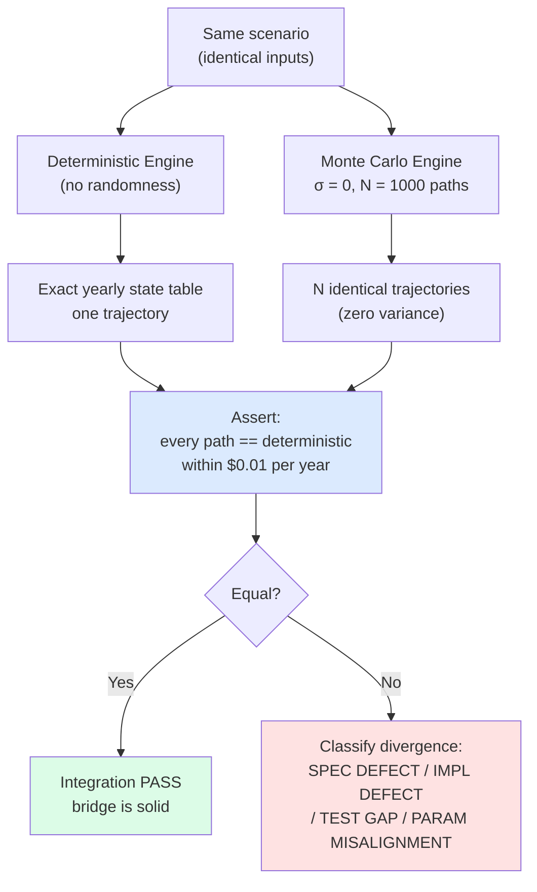
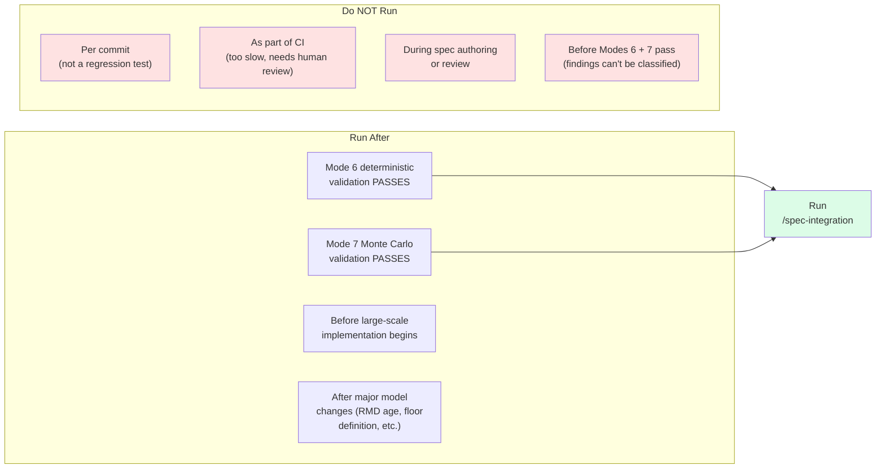
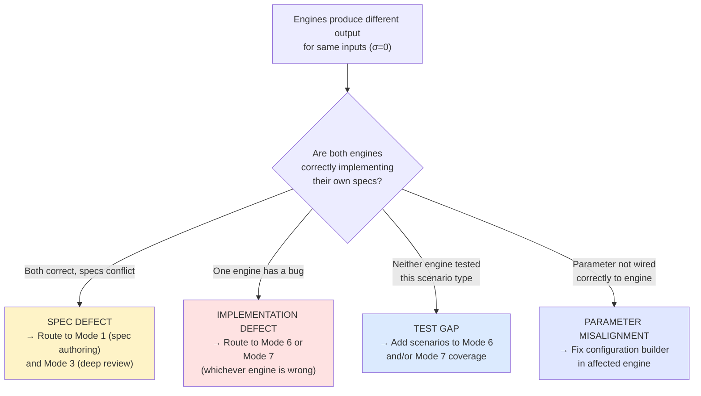

# Chapter 10: Verifying the Bridge Between Engines

## Two Engines That Must Agree

---
**`/spec-integration` instructions — §PREREQUISITE — SPEC FREEZE VERIFICATION:**

```
Before anything else, verify:

lumiscape/engineering/spec-freeze.lock

If this file does not exist, stop immediately. Do not proceed. Inform the user that spec-integration cannot begin until the spec freeze is confirmed and the lock file is present.

The lock file is the gate. No lock file = no execution.
```
---

---
**`/spec-integration` instructions — §GOAL:**

```
Ensure that deterministic and Monte Carlo engines:

1) produce consistent results under degeneracy conditions
2) share identical invariants
3) use consistent semantic definitions
4) propagate parameters correctly between models
```
---

Lumiscape has two distinct computational paths. The deterministic engine computes a single, exact retirement projection: given these assumptions, here is what your financial future looks like. The Monte Carlo engine computes thousands of scenarios by varying investment returns and applying stochastic shocks, then aggregates the results into probability distributions: given these assumptions, there is an N% chance your money lasts through retirement.

These two engines are developed, tested, and validated separately. The deterministic validation in Mode 6 verifies correctness against IRS tables and financial math. Mode 7 verifies that the stochastic components produce the correct distributional properties. But neither of those validations addresses a third category of problem: do the two engines agree on what they are computing?

Two engines can each be internally correct while being semantically inconsistent with each other. That is the harder problem, because the symptoms do not look like bugs. Both engines run cleanly. Both pass their individual test suites. Both produce numbers that look plausible. But when a user looks at their retirement projection on one screen and their Monte Carlo success rate on another, those two numbers were computed using subtly different rules — and depending on the scenario, the difference might be small enough to ignore or large enough to reverse a planning decision.

The failure modes are concrete. Let me walk through three of them before explaining how the integration validation catches them.

**Failure mode 1: Different "success" definitions.** Suppose the deterministic engine classifies a scenario as a success when the terminal balance is positive — the account never fully depleted during the simulation horizon. The Monte Carlo engine classifies a scenario as a success when spending never dropped below the spending floor in any year, regardless of terminal balance. These are not equivalent criteria. A scenario where the account hits exactly zero at month 359 of a 360-month simulation is a success by the deterministic definition (terminal balance is zero, which the engine counts as "not negative") but a borderline case by the Monte Carlo definition that depends on whether spending was maintained through that final year. More dramatically, a scenario where a large market crash in year 20 forces spending below the floor but the portfolio recovers by year 30 and ends with a positive balance is a success by the terminal-balance definition and a failure by the floor-maintenance definition. Run the same person through both engines and you get wildly different success rates — maybe 78% by one definition, 61% by the other — for the same starting scenario. The user has no idea they are looking at answers to different questions.

**Failure mode 2: Different return application ordering.** This one is subtle and compounds over time. In a simulation year, three operations interact with the account balance: apply investment returns, withdraw required and discretionary amounts, and compute and pay taxes. The order matters. Consider a simple single-year example: starting balance $1,000,000, expected return 7%, withdrawal $50,000.

Engine A applies returns before withdrawals — end-of-period return on start-of-period balance:

```
End balance = $1,000,000 × 1.07 − $50,000 = $1,020,000
```

Engine B applies returns after withdrawals:

```
End balance = ($1,000,000 − $50,000) × 1.07 = $1,016,500
```

The year-1 difference is $3,500. That might not seem like much. But this difference recurs every year, and the balances diverge as each year's starting balance is slightly different. Running these two regimes forward for 30 years on a realistic scenario produces a terminal wealth difference of roughly $26,000. Not a rounding error. A material difference in a projected financial outcome, existing purely because two engineers made a reasonable-sounding ordering choice without reading a shared spec that specified which order was canonical.

**Failure mode 3: Real versus nominal spending floor.** The spending floor is the minimum annual withdrawal below which the simulation does not allow spending to drop. It can be defined in real terms — inflation-adjusted each year to maintain purchasing power — or in nominal terms — a fixed dollar amount for the entire simulation horizon. These two definitions produce the same number in year 0. They diverge immediately thereafter. At 3% annual inflation over 20 years, a real floor of $50,000 becomes $50,000 × (1.03)^20 = $90,306. The nominal floor is still $50,000.

In year 20, a portfolio that can support $75,000 in withdrawals satisfies the nominal floor but fails the real floor. The deterministic engine, using a real floor, marks this scenario as a partial failure. The Monte Carlo engine, using a nominal floor, marks it as a success. Run an inflation-stress test — 4% average inflation for 20 years — and the success rates diverge dramatically. The real-floor engine produces a materially lower success rate because the floor target is growing faster than the portfolio expected, while the nominal-floor engine has the floor locked at the baseline value and does not see the same pressure. Both engines are internally correct. Both are computing exactly what their spec says. But the user's success rate jumps by 15 percentage points when they switch from the detailed projection view to the probability summary — and nobody can explain why.

`/spec-integration` is the mode that catches all three of these failures. Its job is not to re-validate either engine individually. It verifies that the bridge between them is solid — that the two engines are computing the same thing when given the same inputs, and that their outputs are semantically aligned across every dimension that matters.

## What Integration Mode Is Not Allowed to Do

---
**`/spec-integration` instructions — §HARD RULES:**

```
- Do NOT reinterpret specs
- Do NOT introduce new math
- Do NOT adjust tolerances unless explicitly defined
- Do NOT suggest architectural changes

If mismatches occur, classify them only:

- SPEC DEFECT
- IMPLEMENTATION DEFECT
- TEST GAP
- PARAMETER MISALIGNMENT

Do not resolve them.
```
---

The skill is explicit about its constraints: it cannot modify specs, re-validate deterministic math, re-validate Monte Carlo distributions, implement code, or introduce new requirements. It validates only the bridge between the two systems.

Understanding why these constraints exist requires understanding what goes wrong when you remove them.

If integration mode is allowed to modify specs, it becomes a mechanism for retroactively patching problems that should have been fixed in earlier phases. Suppose Mode 8 finds that the two engines define "success" differently. The natural temptation is to update one or both specs to align on a single definition and call it done. But this hides important information: which phase failed? Was the success definition ambiguous from the start — a Mode 2 failure, something the spec review should have caught? Was it clearly specified but inconsistent across specs — a Mode 3 failure? Was it clear and consistent but implemented incorrectly — a Mode 6 or Mode 7 failure? Patching it in Mode 8 closes the issue without understanding what broke upstream, which means the same class of problem will recur in the next feature.

If integration mode is allowed to introduce new requirements, it becomes a spec authoring session disguised as a validation session. Requirements introduced at this stage have not been reviewed, have not been prioritized, and have not been vetted against other specs for consistency. They are unilateral decisions made under pressure during validation, and they corrupt the spec corpus in ways that are hard to reverse.

The classification system — SPEC DEFECT, IMPLEMENTATION DEFECT, TEST GAP, PARAMETER MISALIGNMENT — routes problems back to the correct phase. A SPEC DEFECT routes back to Mode 1 and Mode 2. An IMPLEMENTATION DEFECT routes back to Mode 6 or Mode 7, whichever engine has the bug. A TEST GAP routes back to whichever validation mode had insufficient scenario coverage. A PARAMETER MISALIGNMENT may be either an implementation defect or a spec ambiguity depending on whether the parameter mapping was specified. The classification tells you where to go, not what to do when you get there.

Mode 8 stops at classification because the engineer needs to see the full picture before deciding how to fix anything. A single integration run might surface three SPEC DEFECTs, two TEST GAPs, and one IMPLEMENTATION DEFECT. The correct response is not six individual patches — it is a prioritization decision about whether to address them serially, in parallel, or with a scoped re-architecture. Mode 8 provides the evidence. The engineer makes the call.

## The Degeneracy Bridge: A Complete Test Design

---
**`/spec-integration` instructions — §REQUIRED VALIDATIONS — 1) Degeneracy Bridge:**

```
When stochastic variance is disabled or collapses to zero:

Monte Carlo outputs MUST equal deterministic outputs.

Validate:
- terminal wealth
- yearly balances
- taxes
- withdrawals
- success/failure classification

Differences beyond rounding tolerance = FAIL.
```
---



The degeneracy bridge is the most important test in the integration mode. The formulation is clean: when stochastic variance is set to zero everywhere (σ=0 for all asset classes), every Monte Carlo path through the simulation is deterministic. No randomness. Every path follows the same trajectory. The Monte Carlo engine's output should be a degenerate distribution with all paths at the same value — and that value should equal the deterministic engine's output within one cent.

Let me walk through a complete test design for a concrete scenario.

**Scenario definition:** Person age 60, single, starting balance $1,000,000 in a tax-deferred IRA, planned retirement at age 65, spending $50,000 per year in real (inflation-adjusted) terms, 3% CPI assumption, 7% nominal return assumption, 30-year simulation horizon (to age 90), spending floor $30,000 real, standard tax configuration.

**Deterministic engine configuration:** Return assumption 7.0% fixed for all years. No variance parameter — the engine is inherently deterministic.

**Monte Carlo engine configuration:** Same scenario object, return expectation 7.0%, σ=0.0 for all asset classes, seed=42, N=1000 paths.

**Expected result:** Every one of the 1000 Monte Carlo paths produces the same yearly state table as the deterministic engine.

**Verification procedure:**

Step 1: Run the deterministic engine against the scenario. Capture the yearly state table — one row per simulation year, columns: year, age, start_balance, withdrawal, taxes, spending, end_balance, cumulative_cpi.

```
Year  Age  Start_Balance     Withdrawal    Taxes     Spending   End_Balance   CPI_Factor
1     61   1,000,000.00       0.00         0.00      0.00      1,070,000.00   1.030
2     62   1,070,000.00       0.00         0.00      0.00      1,144,900.00   1.061
3     63   1,144,900.00       0.00         0.00      0.00      1,225,043.00   1.093
4     64   1,225,043.00       0.00         0.00      0.00      1,310,796.01   1.126
5     65   1,310,796.01   56,275.00    11,204.25  51,500.00   1,300,417.09   1.159
...
```

(The spending column is real spending — $50,000 × CPI factor for that year. The withdrawal covers spending plus taxes and may include required minimum distributions once the person reaches age 73.)

Step 2: Run the Monte Carlo engine with σ=0, seed=42, N=1000. For each of the 1000 paths, capture the same yearly state table format.

Step 3: Assert, for every path p in {1..1000} and every year y in {1..30}: |path[p].end_balance[y] − deterministic.end_balance[y]| ≤ $0.01.

Step 4: Assert the same equality for withdrawal, taxes, and spending columns.

Step 5: Assert success classification agrees: if the deterministic engine reports "success" (spending floor maintained throughout, positive terminal balance), then the Monte Carlo success rate should be 100.0%.

**What specific failures tell you:**

If year 1 end_balance disagrees, the divergence is in initial parameter ingestion or in the first-year arithmetic. Check whether the Monte Carlo engine is reading the starting balance from the scenario correctly, and whether the return application order is the same.

If years 1–4 agree but year 5 disagrees, the divergence occurs at retirement onset (age 65 in this scenario). The code paths that activate at retirement — switching from accumulation to distribution mode, beginning withdrawals, applying the RMD schedule (if age ≥ 73) — are candidates. This is where two engines most commonly diverge: the accumulation-to-distribution transition involves multiple new calculation pathways activating simultaneously, and they are the most likely to have been implemented differently.

If years 5–12 agree but year 13 disagrees (age 73), the divergence occurs at RMD onset. Required minimum distributions involve IRS life expectancy tables applied to the prior year's account balance. If the Monte Carlo engine is using a slightly different table lookup or a slightly different interpolation, the results will diverge here and accumulate from this point forward.

If balances agree but taxes disagree in any year, the tax bracket logic is different. Check for: different bracket thresholds, different standard deduction amounts, different treatment of provisional income for Social Security, different ordering of income types in the tax calculation.

If balances and taxes agree but spending disagrees, the spending floor logic is different. The most common cause is real versus nominal floor interpretation — the amount actually spent in each year is calculated differently.

If all yearly values agree but the success classification disagrees at the end, the classification criterion is different. One engine is applying a different definition of success.

The diagnostic specificity of this test is the reason it is the primary integration check. A single σ=0 run against a well-constructed scenario exercises every calculation pathway and every semantic choice simultaneously, and the pattern of divergence tells you which pathway is inconsistent.

## Shared Invariants: Same Tests, Different Code Paths

---
**`/spec-integration` instructions — §REQUIRED VALIDATIONS — 2) Shared Invariants:**

```
Both engines must satisfy identical system invariants:

- Accounting identity holds
- Balances never go negative unless explicitly allowed
- Withdrawals reduce balances
- Taxes non-negative
- Spending monotonicity preserved
- Wealth monotonicity preserved

Any invariant satisfied in one engine but violated in the other = FAIL.
```
---

Both engines must satisfy identical system invariants. The integration validation checks each invariant against both engines and verifies that the results agree. An invariant that holds in one engine but fails in the other is a defect — either in one engine's implementation or in the spec's failure to specify the invariant clearly enough to guarantee consistent implementation.

**Balance continuity:** For every year y, end_balance[y] = start_balance[y] + returns[y] − withdrawals[y] − taxes[y] ± $0.01. Money is neither created nor destroyed. This seems obvious, but it can be violated in subtle ways that only emerge in edge cases.

Consider a scenario where the Monte Carlo engine applies returns to the start-of-period balance and then applies a ceiling cap on the account balance (perhaps the spec says accounts cannot exceed some maximum, or the code has an implicit maximum from a data type boundary). The deterministic engine, validated only against scenarios where the balance never approaches any ceiling, does not exercise that code path. The Monte Carlo engine caps the balance. The accounting identity fails for paths where the cap activates: the cap silently removes money from the account without corresponding withdrawal or tax entries. The yearly balance table shows an end_balance lower than start_balance + returns − withdrawals − taxes, with the difference unaccounted for.

This failure would not appear in the deterministic engine's Mode 6 tests, because none of those scenarios triggered the ceiling. It would appear in Mode 7 only if the stochastic tests were specifically designed to generate high-return scenarios. The integration test surfaces it because both engines run against the same scenarios, and the accounting identity check applies to both.

**Withdrawal reduces balance:** Withdrawals must decrease the account balance. Mathematically trivial — a withdrawal is a deduction — but can be violated in edge cases involving minimum requirements when the balance is insufficient.

Concrete example: an account balance of $10 at age 73, where the RMD calculation requires a withdrawal of $5,000 based on the prior year's balance. The deterministic engine handles this by withdrawing the entire $10 balance and recording a $10 withdrawal (the maximum available). The Monte Carlo engine, implemented by a different engineer, handles this edge case differently: if the required withdrawal exceeds the available balance, it records a $0 withdrawal and flags the account as depleted. Both behaviors are defensible individually. But they violate the shared invariant: in the deterministic engine, the withdrawal reduced the balance (from $10 to $0). In the Monte Carlo engine, the withdrawal did not reduce the balance (it stayed at $10 until the depletion flag caused it to snap to $0 in the next step). The invariant check — withdrawal must reduce balance by exactly the recorded withdrawal amount — catches this because the balance arithmetic does not reconcile in the Monte Carlo path.

This matters: the two engines will produce different end-of-simulation results for low-balance scenarios, which is precisely the scenario type that matters most for retirement planning — the scenario where the client's money runs out.

**Spending monotonicity:** If spending is higher in every year (all else equal), terminal wealth must be lower. This invariant can be violated by tax interactions at bracket boundaries.

The concrete case: spending $60,000 pushes taxable income above the 22% bracket threshold. Spending $50,000 keeps income in the 12% bracket. Increasing spending by $10,000 triggers a tax event: the additional $10,000 in spending is gross income, but the marginal tax cost is 22% on the amount over the bracket boundary plus 10% additional on the income that got bracket-shifted from 12% to 22%. In edge cases, the combined tax cost of the additional spending exceeds the additional spending itself — meaning a scenario with $60,000 target spending actually withdraws more money and ends up with lower terminal wealth than a scenario with $50,000 target spending, not by $10,000 but by $10,000 plus the bracket-shift tax cost.

If the deterministic and Monte Carlo engines handle this bracket interaction differently — perhaps one applies the tax calculation before determining the gross withdrawal and the other iterates to convergence — they will produce different terminal wealth values and potentially different monotonicity behavior in this spending range. The integration test catches this by running both engines against the same high-spending and low-spending scenario variants and asserting consistent terminal wealth ordering.

**Taxes non-negative:** Tax liability cannot be negative. Seems obvious, but can be violated by incorrect ordering of credits, deductions, and withholding calculations. If one engine applies a refundable credit that can produce a negative net tax while the other treats tax as a floor at zero, the engines produce different behavior in scenarios where the credit exceeds the gross tax liability.

**Wealth monotonicity (inter-scenario):** A scenario with better starting conditions (higher starting balance, all else equal) must produce at least as good an outcome. Violations indicate a defect in account initialization or return scaling.

## Output Semantic Alignment: Reading Both Specs

---
**`/spec-integration` instructions — §REQUIRED VALIDATIONS — 3) Output Semantic Alignment:**

```
Verify both engines use identical definitions for:

- success
- failure
- floor (real vs nominal)
- terminal wealth
- spending
- taxes
- return application order

Semantic mismatch = FAIL.
```
---

For each semantic element in the simulation, the integration validation reads the definition from both engine specs and compares them verbatim. Not approximately. Not by assumption. Verbatim. The purpose is to find the places where two engineers, working independently from their respective specs, wrote definitions that look equivalent but are not.

**Process:** For each semantic element (success, failure, floor, terminal wealth, spending, taxes, return application order), locate the definition in the deterministic runner spec and in the Monte Carlo runner spec. Reproduce both definitions. Annotate any difference. A difference is a finding, regardless of whether it appears significant. Many findings that appear insignificant in isolation turn out to matter in specific scenarios.

**Concrete example — floor definition:** The deterministic runner spec says: "The spending floor is expressed in real (inflation-adjusted) dollars. In each simulation year, the floor is applied as spending_floor × cumulative_cpi, where cumulative_cpi is the product of all annual CPI factors from simulation start to the current year." The Monte Carlo runner spec says: "The floor is the minimum annual withdrawal amount below which spending cannot go."

These are not the same definition. The deterministic spec anchors the floor to real purchasing power using explicit CPI arithmetic. The Monte Carlo spec says "minimum annual withdrawal amount" without specifying whether that amount is real or nominal. An engineer implementing the Monte Carlo spec has to make an assumption, and "minimum annual withdrawal amount" sounds like a nominal amount — a fixed dollar value. The two implementations will agree in year 0 and diverge in every subsequent year by the CPI factor. By year 20 at 3% inflation, the deterministic engine is applying a floor of $90,306, and the Monte Carlo engine is applying a floor of $50,000.

This mismatch should have been caught in Mode 3 (deep review), which specifically checks for semantic consistency across specs. If it was caught there and the specs were updated, the integration test should see identical definitions and pass. If it was not caught — or if the specs were updated but the implementations were not — the integration test catches it at the semantic level (definition mismatch = SPEC DEFECT) and at the numerical level (degeneracy test diverges in years with significant cumulative inflation = confirms the implementation reflects the mismatched definitions).

**Concrete example — return application order:** The deterministic spec says: "In each simulation year, investment returns are applied to the start-of-year balance before withdrawals and taxes are computed." The Monte Carlo spec says: "The return for each simulation year is applied to the net balance after withdrawals." These are unambiguous, clearly written, and completely inconsistent. A SPEC DEFECT that Mode 3 should have caught. The integration mode catches it if Mode 3 missed it, and the degeneracy test quantifies the impact.

The arithmetic matters here. Return-before-withdrawal: balance × (1 + r) − withdrawal. Return-after-withdrawal: (balance − withdrawal) × (1 + r). The difference is withdrawal × r. At a 7% return and $50,000 withdrawal, the difference is $3,500 per year. Over 30 years with compounding, this accumulates to approximately $26,000 in terminal wealth difference. To compute the exact accumulation, note that the per-year error is withdrawal × r, but the balance it causes a difference on grows with the return rate: the year-1 error of $3,500 becomes $3,500 × (1.07)^29 ≈ $25,900 by year 30 if left unaddressed. A finding this size is material for a retirement plan.

**Concrete example — success definition:** The deterministic spec says: "A scenario is classified as successful if the account balance remains positive at the end of the simulation horizon." The Monte Carlo spec says: "A simulation path is classified as successful if spending in every year meets or exceeds the spending floor." A scenario where the portfolio survives intact but the client had to cut spending below the floor in years 18–22 due to a sequence-of-returns event is a success by the terminal-balance definition and a failure by the floor-maintenance definition. A scenario where the portfolio goes to exactly zero in the final month triggers a floor failure in that final year by the floor-maintenance definition if the floor was non-zero.

Run 1000 Monte Carlo paths through a scenario with average 6.5% returns and 10% return volatility. The terminal-balance success rate might be 83%. The floor-maintenance success rate might be 71%. The difference is not noise — it is a structural feature of the two definitions and will be stable across seeds. When the user sees 83% in one view and 71% in another, they have no way to know they are looking at different quantities.

## Parameter Propagation: The Test

---
**`/spec-integration` instructions — §REQUIRED VALIDATIONS — 4) Parameter Propagation:**

```
Verify deterministic inputs propagate correctly into Monte Carlo runs:

- starting balances
- inflation settings
- tax configuration
- withdrawal rules
- spending assumptions
- floor definitions

Incorrect propagation = FAIL.
```
---

Parameter propagation is the simplest class of integration failure to describe and often the simplest to fix, but it is easy to miss because the failure is silent: a parameter is not passed, gets a default value, and the engines silently diverge.

**The test procedure:** Configure a scenario with specific non-default values for every parameter that both engines read. For parameters that are particularly sensitive — spending floor, inflation rate, starting balance, state tax rate — choose values that are clearly not defaults so that a default-initialization bug is immediately visible.

Example scenario configuration: starting_balance=$1,234,567 (not a round number — defaults are round numbers), annual_spending=$52,750 (not a round number), inflation=2.5% (not the 3.0% default), spending_floor=$38,500 (not zero — a non-trivial floor), state_tax_rate=4.5% (non-zero, non-default), return_mean=7.25% (not the standard 7.0%).

Run the deterministic engine. Record all outputs. Configure the Monte Carlo engine with the same scenario, set σ=0. Run 100 paths (fewer needed here — this is a propagation check, not a statistical check). Assert degeneracy: all paths match the deterministic output within $0.01.

If any parameter was silently default-initialized rather than read from the scenario, the outputs will diverge. A default inflation rate of 3.0% vs the scenario's 2.5% will cause the real floor calculation to diverge starting in year 1. A default state tax rate of 0% vs the scenario's 4.5% will cause tax calculations to diverge in every year. These are immediately visible in the degeneracy test — you do not need a separate parameter propagation test to catch them if the degeneracy test is comprehensive.

However, there is a class of parameter propagation failure the degeneracy test can miss: parameters that affect the stochastic component only. If the Monte Carlo engine has a correlation matrix parameter that is incorrectly initialized (defaulting to identity matrix instead of reading from the scenario), this parameter has no effect when σ=0. It only matters when variance is non-zero. For this class of parameter, you need a separate propagation test that runs with σ > 0 and verifies that the output distribution changes when the parameter changes. If the correlation matrix is silently defaulting to identity, the output distribution will be the same regardless of whether you specify a correlation of 0.3 or 0.9 for equity-bond returns.

**The specific failure pattern to look for:** Internal configuration objects in the Monte Carlo engine that have multiple ways to set a value — constructor parameter, setter method, and default initializer — are the most common source of parameter misalignment. If the scenario-to-Monte-Carlo mapping sets the value via one mechanism but the object is constructed with a different default before the mapping runs, and if the field gets set twice (once in the constructor with a default, once from the scenario mapping), the question is which write wins. If the constructor runs after the mapping, the default wins. This is a classic Java object initialization ordering bug that appears when engineers construct objects in different orders or refactor constructors without updating all call sites.

The concrete example: the Monte Carlo engine's internal RunConfig has a `spendingFloor` field that is set to `scenario.getSpendingFloor()` in the configuration builder. It also has a `minimumWithdrawal` field that was added later, initialized to $0 by default and never connected to the scenario. In scenarios where the spending floor is the binding constraint, `minimumWithdrawal` is never used. In scenarios where the minimum withdrawal is the binding constraint (RMD scenarios where the RMD exceeds the spending target), the Monte Carlo engine uses `minimumWithdrawal` while the deterministic engine reads from a field that is correctly initialized from the scenario. These two engines produce different results for RMD-constrained paths, and the difference is a silent parameter misalignment that would not be caught by any Mode 7 test because Mode 7 tests the Monte Carlo engine in isolation and its internal parameters are self-consistent.

## The Scenario Coverage List

---
**`/spec-integration` instructions — §TEST DESIGN REQUIREMENTS:**

```
- Tests must be black-box
- Use identical scenarios across engines
- Use deterministic seeds for Monte Carlo
- Compare outputs across:
  - yearly state tables
  - summary metrics
  - terminal metrics
- Define rounding tolerance (<= 1–2 cents where applicable)
```
---

The integration validation requires specific scenario types, and each type tests a distinct aspect of cross-engine alignment. Understanding why each is required explains what gaps would remain if it were omitted.

**Degeneracy scenarios (primary alignment check):** The σ=0 scenarios described in detail above. These are not optional — they are the structural foundation of the integration test. Every other scenario type is an enhancement on top of the degeneracy check. Without them, the integration validation loses its ability to distinguish "the engines agree numerically" from "the engines produce numbers in a similar range." You need exact equality, not approximate agreement, to confirm that the bridge is solid.

**Baseline deterministic scenarios:** Normal-operation scenarios with standard parameters — mid-career couple, moderate spending, 30-year horizon, no unusual features. These verify that the engines produce consistent results under typical conditions, not just under degenerate conditions. Even if the degeneracy bridge passes, there can be numerical precision issues or approximation differences that only appear when the stochastic components are active. The baseline scenario with σ > 0 will not produce exact equality, but the distribution of Monte Carlo outcomes should be centered at the deterministic outcome. If the Monte Carlo mean at σ > 0 is significantly different from the deterministic output (more than a few percent), there is a systematic bias somewhere — a problem with how the stochastic shocks are being applied, not with the base-case arithmetic.

**High-spending scenarios:** Scenarios where annual spending is a large fraction of the starting portfolio — for example, $80,000 per year from a $1,000,000 portfolio. These stress-test the spending floor and withdrawal logic, which are the most common sources of semantic misalignment. When spending is high, the floor constraint becomes binding more often, and the floor implementation is exercised more aggressively. If the floor is implemented differently in the two engines, it shows up most clearly here. High-spending scenarios also stress the interaction between spending targets, taxes, and required minimum distributions: when spending targets, RMD requirements, and tax obligations all compete for limited portfolio resources, the ordering of these competing claims matters, and different orderings produce different results.

**Low-wealth scenarios:** Scenarios where the starting portfolio is small relative to spending requirements — for example, $300,000 starting balance with $50,000 annual spending. These test the behavior when accounts are near depletion, including the RMD edge case (balance too small to meet the required minimum distribution) and the floor edge case (spending forced below the floor by insufficient assets). These edge cases are handled by special-case code in both engines, and special-case code is where implementations most commonly diverge. If the deterministic engine clips the withdrawal at the available balance and the Monte Carlo engine handles the same situation with a different code path, low-wealth scenarios will reveal the difference.

**Boundary ages — retirement start:** The simulation logic changes at retirement onset. Before retirement, the simulation is in accumulation mode: contributions flow in, returns compound, no withdrawals. At retirement, the simulation switches to distribution mode: withdrawals flow out, spending begins, tax calculations change character. Both engines must apply this transition at exactly the same age and in exactly the same way. If one engine uses strict age comparison (retire at 65.000 years) and the other uses year-of-birthday comparison (retire in the calendar year the person turns 65), they will compute different first-year withdrawals for persons whose retirement birthday falls mid-year. The boundary-age scenario is specifically designed to expose this: use a person who retires mid-year (birthday in July, retirement month September) so that mid-year transitions are exercised.

**Boundary ages — RMD start:** Required minimum distributions begin at age 73 (under SECURE 2.0). The calculation uses the prior year's December 31 balance divided by the IRS Uniform Lifetime Table divisor for the person's age. Both engines must use the same divisor table, apply it at the same age, and use the same prior-year balance. If one engine pre-computes the RMD at the beginning of year 72 using the prior-year divisor, and the other engine computes the RMD dynamically at withdrawal time using the current-year divisor, the results will differ for persons whose life expectancy divisor is at a boundary value in the table. The RMD boundary scenario uses a person turning 73 during the simulation horizon and checks that both engines apply the same divisor in the same year.

**Tax bracket transitions:** Federal income tax rates change discontinuously at bracket boundaries. Both engines must use the same bracket thresholds, apply them to the same income definition, and produce the same marginal rate at the same income level. Scenarios designed for bracket testing use spending amounts that push income just across a bracket boundary: $89,000 for a single filer in 2024 crosses the 22%–24% boundary. Both engines should apply the 24% marginal rate to the income above $89,075. If one engine applies the rate to the full income and the other applies it only to the marginal amount, the tax calculations diverge by a large fraction of the bracket-rate-differential times the total income. Tax bracket scenarios run at three income levels: clearly below the boundary, clearly above, and at the boundary value within $1,000.

## When to Run, When Not to Run

---
**`/spec-integration` instructions — §WHEN TO RUN THIS MODE:**

```
Run only:

- after deterministic validation passes
- after Monte Carlo validation passes
- before large-scale implementation continues
- after major model changes

Do NOT run:

- during spec authoring
- during spec review
- per commit
- as part of CI

This is a structural integration validation step, not a regression process.
```
---



The skill specifies run conditions and no-run conditions. The no-run conditions are as important as the run conditions.

**Why not per commit:** Integration validation is not a regression test. A regression test is fast, automated, binary: did I break something that was working? It runs in seconds, produces a green/red signal, and requires no human interpretation. Integration validation is a diagnostic tool. It produces a report — a structured document with findings classified by type and severity — that requires an engineer to read it, understand the findings, and make decisions about what to address. Running this per commit would mean producing a new report with every change to either engine, which would result in reports that nobody reads. The value of a diagnostic tool is that it runs at meaningful inflection points and receives focused attention when it does.

**Why not as part of CI:** CI gates operate on two principles: fast feedback and clear signal. An integration validation run requires executing two full simulation engines against multiple complex scenarios — a runtime orders of magnitude slower than a unit test suite. More importantly, a CI gate produces a binary outcome: pass or fail. Integration validation produces a classified report. If the CI gate fails, the pipeline stops. But if the reason for failure is a TEST GAP (the scenarios didn't cover a specific scenario type), the correct response is to add tests — but the CI pipeline is blocked until someone makes a routing decision. CI gates need to be fixable by an engineer without manual intervention. Integration validation findings require manual interpretation. These are different tools for different purposes.

**Why run after deterministic validation passes and after Monte Carlo validation passes:** If the deterministic engine has known failures in Mode 6, those failures will appear in the integration test as well, and it becomes impossible to distinguish "these engines disagree because of a bridge problem" from "these engines disagree because Engine A has a known bug that Mode 6 already flagged." Running integration validation against a clean slate — both engines passing their individual validations — means every finding in the integration report is a new finding specific to the cross-engine bridge.

**Why run before large-scale implementation continues:** At this point in the pipeline, the specs are frozen (spec-freeze.lock exists), individual validations have passed, and the team is about to begin implementing features at scale. A SPEC DEFECT found here, before large-scale implementation, is inexpensive to fix — it requires updating a spec definition and ensuring both engine implementations reflect it. The same SPEC DEFECT found after large-scale implementation might require revisiting hundreds of tests and feature implementations that depend on the incorrect definition.

**Why run after major model changes:** When the simulation model changes significantly — new IRS rules for RMD age (SECURE 2.0 moved the start age from 72 to 73, affecting every simulation that crosses that age boundary), changes to the spending floor definition, new account types, changes to the withdrawal ordering logic — integration validation verifies that both engines were updated consistently. The change was implemented in one engine, reviewed and merged, and then the question is whether the other engine was also updated. The degeneracy bridge test answers that unambiguously: if the deterministic engine was updated for the new RMD age rules but the Monte Carlo engine was not, the degeneracy test will diverge at age 73 for scenarios that cross that boundary. The divergence pattern tells you exactly where the discrepancy is and which engine needs to be updated.

## The Failure Classification in Detail



When the integration validation finds a discrepancy, it classifies it into one of four categories. The classification determines where the problem goes: which engineer picks it up, which phase gets a feedback item, which spec or codebase gets modified. Getting the classification right matters.

**SPEC DEFECT:** Both engines are implementing their respective specs correctly, but the specs themselves are inconsistent or ambiguous in a way that permits different implementations. The engines agree with their individual specs and disagree with each other.

Concrete example: The floor definition in the deterministic spec is ambiguous about the base year for CPI adjustment. It says "expressed in real dollars" but does not specify whether "real" means adjusted from simulation start or adjusted from some fixed reference year. One engineer interprets this as "adjusted from simulation start, year 0 = base year." Another interprets this as "adjusted from retirement start, year of retirement = base year." These produce the same result in scenarios where retirement happens at simulation start. They produce different results in scenarios with a pre-retirement accumulation phase. Both implementations are consistent with the spec as written. The spec is the defect.

SPEC DEFECT classification routes back to Mode 1 for the ambiguous spec to be clarified, and back to Mode 3 which should have caught the inconsistency across the two specs. After the spec is clarified, both engines need to be updated if they implement the ambiguous interpretation differently.

**IMPLEMENTATION DEFECT:** The specs are clear and consistent. Both engines should produce the same results. They don't. One engine has a bug.

Concrete example: Both specs clearly state "spending floor is adjusted annually by CPI." The deterministic engine implements this correctly. The Monte Carlo engine has a copy-paste error in the floor calculation method: it divides by the cumulative CPI factor instead of multiplying, which produces a floor that shrinks with inflation instead of growing. The spec is fine. In year 10 with 3% CPI, the deterministic engine applies a floor of $50,000 × (1.03)^10 = $67,196. The Monte Carlo engine applies a floor of $50,000 / (1.03)^10 = $37,205. The discrepancy is large and grows with time and inflation. The degeneracy test catches it immediately: paths diverge in every year from year 1 because the floor constraint is being computed differently.

IMPLEMENTATION DEFECT classification routes back to the Mode 7 test suite (which should have tested the floor calculation and caught the inversion) and to the Monte Carlo engine's code. The spec is not changed. The implementation is fixed and Mode 7's scenario coverage is expanded to include an explicit floor calculation test.

**TEST GAP:** The discrepancy exists in the implementation, but neither Mode 6 nor Mode 7 had a scenario that exercised it. Both engines were validated against agreed-upon scenarios, and those scenarios happened not to trigger the inconsistency. The problem exists; it was just untestable with the scenarios that existed.

Concrete example: Both engines diverge in high-inflation scenarios (5%+ annual CPI) where the real floor adjustment becomes large enough to materially affect success rates. Mode 6 tested the deterministic engine with inflation scenarios at 2% and 3.5%. Mode 7 tested the Monte Carlo engine with the same inflation range. Neither mode tested at 5%+ inflation because the scenario library was built with historical average inflation in mind. The floor behavior at high inflation was never exercised in either validation mode, so no discrepancy was visible. The integration test is the first place that runs a 5% inflation scenario against both engines simultaneously, and the discrepancy surfaces.

TEST GAP classification routes back to Mode 6 and Mode 7 to add high-inflation scenarios to their respective coverage matrices. After adding the high-inflation scenarios and re-running Modes 6 and 7, the classification might change: if Mode 6 now catches a deterministic failure with the new scenario, it becomes an IMPLEMENTATION DEFECT. If both engines still diverge after adding the scenario and both pass their individual tests with it, it becomes a SPEC DEFECT.

**PARAMETER MISALIGNMENT:** A parameter from the scenario is not being correctly transmitted to one of the engines. The engine has the capability to use the parameter correctly, and its spec says it should, but the actual value being used is wrong.

Concrete example: The Monte Carlo engine's internal configuration object has two relevant fields: `spendingFloor` (populated from the scenario) and `minimumWithdrawal` (initialized to $0 by default, never connected to the scenario). In scenarios where spending floor equals zero (no floor constraint), both fields are zero and the engines agree. In scenarios where the spending floor is non-zero (say, $35,000), the deterministic engine uses $35,000 as the floor, and the Monte Carlo engine uses $35,000 for `spendingFloor` but $0 for `minimumWithdrawal`. If the withdrawal logic checks `minimumWithdrawal` in some code paths (perhaps for RMD-constrained scenarios where the RMD exceeds the target spending), those paths will behave as if there is no minimum withdrawal constraint even though the scenario specifies one. The engines produce different results for RMD-constrained paths, not because the specs are inconsistent and not because either engine has a bug in its core logic, but because the parameter was not wired correctly in the Monte Carlo engine's configuration builder.

PARAMETER MISALIGNMENT classification routes to the Monte Carlo engine's configuration builder and the integration wiring between the scenario object and the Monte Carlo configuration object. It may also route to Mode 7's test suite if Mode 7 did not have a test that verified the floor constraint is effective in RMD-constrained scenarios.

## The Integration Report as an Artifact

---
**`/spec-integration` instructions — §DELIVERABLE FORMAT:**

```
1) SCENARIOS TESTED
2) COMPARISON RESULTS
   - deterministic outputs
   - Monte Carlo degeneracy outputs
3) INVARIANT CHECK RESULTS
4) SEMANTIC ALIGNMENT RESULTS
5) PARAMETER PROPAGATION RESULTS
6) FAILURES / MISALIGNMENTS
7) OVERALL PASS/FAIL

PASS only if all alignment checks succeed.
```
---

The integration validation produces a single deliverable: `integration-validation-report.md`. This report has a specific structure. For each validation category (degeneracy bridge, shared invariants, semantic alignment, parameter propagation), it records: which scenarios were run, what the expected result was, what the actual result was, whether the result was a PASS or a FAIL, and for each FAIL, the classification and the supporting evidence.

The report is a document that a senior engineer reads, not a test runner output. It needs to contain enough information to make a routing decision: where does this problem go? The classification is the first routing signal, but it is not sufficient on its own. The evidence section must include: the actual numerical divergence (year, amount, both engine values), the spec text for each engine (the definition that was checked), the scenario configuration used, and where applicable, the year at which divergence began and its pattern. "Year 5, balance diverges by $156.23, degeneracy test" is not a finding — it is a number. "Year 5 divergence of $156.23 in retirement-onset year; deterministic engine shows $1,044,231.77, Monte Carlo path 1 shows $1,044,075.54; divergence matches $157.43 difference in first-year withdrawal between engines; deterministic engine: $51,500.00, Monte Carlo: $51,657.43; root cause candidate: CPI factor applied to spending floor uses different base year" — that is a finding. It gives the engineer a starting point, not just a symptom.

The integration report is the Mode 8 artifact that gates progression. Before Mode 10 (implementation at scale) begins, this report must exist and must have been reviewed by the engineer. A report full of PASS findings is a green light. A report with open findings requires the engineer to decide: resolve the findings now and re-run, or proceed with the findings documented and accepted as known limitations. The second option is sometimes the right choice — if a finding is a TEST GAP in a low-priority scenario type, the cost of fixing it may not justify blocking implementation. But the decision must be explicit and documented, not implicit.

## Where Integration Validation Fits in the Pipeline

The twelve-mode pipeline is designed so that each mode has a clear scope and a clear artifact. Mode 6 produces a deterministic validation report. Mode 7 produces a Monte Carlo validation report. Mode 8 produces an integration validation report. These are not redundant — they address different categories of failure, and they gate on each other.

Running Mode 8 before Modes 6 and 7 breaks the information structure. If Mode 8 finds a discrepancy during degeneracy testing, it cannot determine whether the discrepancy is in the deterministic engine, the Monte Carlo engine, or the bridge between them, without knowing whether each engine passes its individual validation. With clean Mode 6 and Mode 7 reports in hand, any Mode 8 finding is definitionally a bridge problem or a cross-engine semantic problem — the individual engines are known-good, so the discrepancy must be in how they relate to each other.

This sequencing is also why the integration mode is forbidden from re-validating deterministic math or re-validating Monte Carlo distributions. Those validations were done. They passed. They are in the record. If the integration mode were to re-run those validations and find a failure, it would mean the upstream modes were incomplete — and the correct response is to go back and fix Mode 6 or Mode 7, not to surface the finding in Mode 8 where it cannot be properly classified or routed. Mode 8 assumes the prior modes produced clean reports. If they did not, Mode 8 has no business running.

Do not skip modes to save time. Skipping Mode 6 and running Mode 8 directly is not an accelerated pipeline — it is a broken pipeline that will produce Mode 8 findings that cannot be correctly classified, because the baseline is not clean. The modes are cheap in sequence and expensive out of sequence, because out-of-sequence execution breaks the information structure that makes findings actionable.

Two engines that compute the same thing consistently, across all scenario types, across all boundary conditions, with shared invariants and aligned semantics — that is a system you can build on. The integration validation is the test that confirms you have that foundation before the build begins.
