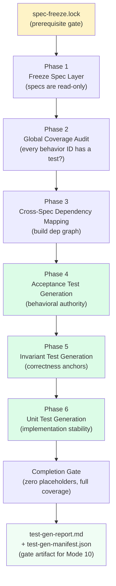
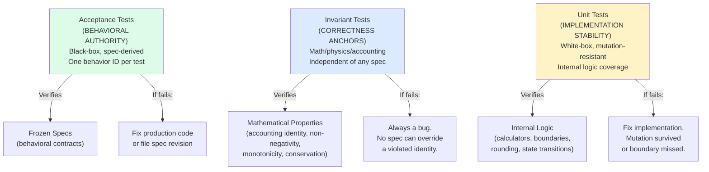
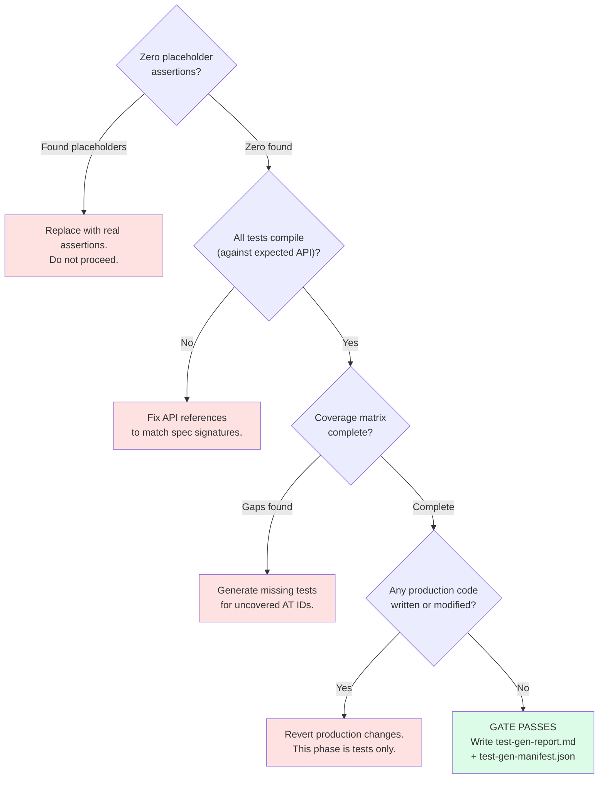

# Chapter 11: Tests Before Code

Mode 9 exists because of a specific failure we kept hitting: when test generation and implementation happen in the same phase, tests drift. They start describing what the code does instead of what the specs require. The implementer writes a calculator, writes a test that calls the calculator, and the test passes. Of course it passes. The test was written to match the code. Whether the code matches the spec is a different question, and one that the test is no longer equipped to answer.

The fix is structural. Generate the entire test suite first, before a single line of production code exists. Every test references a behavior ID from a frozen spec. Every test fails. Then implementation begins, and the only way to make progress is to satisfy the behavioral contract the tests define. If a test passes before any production code is written, the test is not testing anything. Strengthen it or delete it.

This is structural TDD enforcement. The test suite is the behavioral contract that the implementation must satisfy.



## Prerequisites

---
**`/spec-test-gen` instructions — §PREREQUISITE — SPEC FREEZE VERIFICATION:**

```
Before any phase begins, verify:

lumiscape/engineering/spec-freeze.lock

If this file does not exist:

- stop immediately
- inform the user that spec-test-gen cannot begin until the spec freeze is confirmed

The lock file is the gate. No lock file = no test generation.
```
---

The prerequisite is the same gate that every post-freeze mode checks: `engineering/spec-freeze.lock` must exist. If it does not exist, test generation cannot begin. This is not a soft warning. It is a hard stop. No lock file, no tests.

The lock file gates test generation because tests are derived from specs, and if the specs are still changing, the tests will be wrong by the time implementation starts. Freezing specs first, then generating tests, then implementing against those tests, is the sequence that keeps the behavioral contract honest.

## Phase 1: Specs Are Read-Only

---
**`/spec-test-gen` instructions — §PHASE 1 — FREEZE SPEC LAYER:**

```
Specs are read-only in this phase and all subsequent phases.

Claude must:

- treat all specs as read-only
- not reinterpret, refine, or rewrite specs
- not resolve ambiguity by assumption

Any spec issue encountered must be raised as a Formal Spec Revision Request (see spec-execution for format). Stop test generation for the affected module until resolved.
```
---

This is the same discipline that governs Mode 10 (implementation), but it applies here too. Specs are contracts. If a spec is ambiguous, that ambiguity should have been caught in review. If it was not caught, the right response is a Formal Spec Revision Request, not a quiet decision about what the spec "probably means."

The temptation during test generation is different from the temptation during implementation. During implementation, the temptation is to interpret the spec generously and write code that "makes sense." During test generation, the temptation is to skip a behavior ID because the spec does not define the expected output precisely enough to write an assertion. Both temptations lead to the same outcome: a gap in the behavioral contract that no one notices until production.

## Phase 2: Global Coverage Audit

---
**`/spec-test-gen` instructions — §PHASE 2 — GLOBAL COVERAGE AUDIT:**

```
Audit all spec files before writing a single test.

For each spec, verify:

- every Core Behavior ID has a corresponding test method planned
- every validation rule is covered
- Out-of-Scope sections are explicit
- no deferral language exists

Output:

- PASS / FAIL per spec
- consolidated gap list

No test generation begins until PASS for the target module.
```
---

Before writing a single test, audit the entire spec surface. Every Core Behavior ID in every spec must have a test planned. Every validation rule must be covered. Out-of-Scope sections must be explicit, not implied. No deferral language ("this will be addressed later," "to be determined") is acceptable in a frozen spec.

The audit produces a PASS or FAIL per spec and a consolidated gap list. Test generation does not begin for any module until that module's specs pass.

Here is what a failed coverage audit looks like:

```
COVERAGE AUDIT — LUM-ENG-021 (Accumulators)

FAIL: The following Behavior IDs have no corresponding acceptance test:

  LUM-ENG-021-CB-007: healthcare accumulator tracks IRMAA tier transition
    (added to spec on 2026-02-15, after initial test generation)

  LUM-ENG-021-CB-008: healthcare accumulator includes Medicare Part B premium
    (added to spec on 2026-02-15, after initial test generation)

Required action: Generate acceptance tests for CB-007 and CB-008 before
implementation of LUM-ENG-021 proceeds. Tests must reference behavior IDs,
cite existing-art sources (IRS IRMAA schedule, CMS Medicare premium schedule),
define measurable pass/fail criteria, and use only public API.

All other Behavior IDs in LUM-ENG-021 have corresponding tests. LUM-ENG-021
is blocked pending test additions.
```

The gap here is clear. Two behavior IDs were added to the spec after the initial test pass and have no coverage. The audit catches this before implementation begins. Without the audit, the implementer would write the healthcare accumulator, those two behaviors would have no tests, and the behaviors would either be implemented incorrectly or skipped entirely, with no failing test to surface the gap.

The sequencing matters. Coverage audit before test generation ensures that when we write tests, we write tests for everything. Writing code and tests simultaneously defeats the behavioral contract: if you write the tests after the code, you tend to write tests that reflect what the code does rather than what the spec requires. The tests become a description of the implementation, not a verification of the contract.

## Phase 3: Cross-Spec Dependency Mapping

---
**`/spec-test-gen` instructions — §PHASE 3 — CROSS-SPEC DEPENDENCY MAPPING:**

```
Construct a dependency model:

- spec → subsystem mapping
- spec outputs used as inputs elsewhere
- overlapping responsibilities
- semantic alignment across specs

This drives test fixture design: shared fixture objects must be consistent with
what downstream specs expect as valid inputs.

Output is:

Dependency Map Only (no tests written yet)
```
---

Phase 3 constructs a dependency model of the spec surface before any tests are written. The dependency map answers four questions. Which components can have tests written in parallel because they share no dependencies? Which must have their tests written first because they produce types that downstream tests consume? Where do fixture objects need to be consistent across test classes? Which pairs of specs reference the same type with potentially different expectations?

The dependency map also drives test fixture design. If LUM-ENG-015 produces a `RetirementDistributionResult` and LUM-ENG-021 consumes it, the test fixtures in both test classes must agree on what a valid `RetirementDistributionResult` looks like. Building the dependency map first prevents fixture inconsistency.

Here is a concrete excerpt:

```
DEPENDENCY MAP — Retirement Distribution Subsystem

LUM-DTO-030 (RetirementDistributionConfig)
  Consumed by: LUM-ENG-015 (RetirementWithdrawalCalculator)
  Dependencies: LUM-DTO-001 (PersonConfig), LUM-DTO-002 (AccountConfig)
  Status: leaf node — no spec dependencies outside lumiscape-dto

LUM-ENG-015 (RetirementWithdrawalCalculator)
  Inputs: RetirementDistributionConfig (LUM-DTO-030), RmdDivisorTable (LUM-DAT-006)
  Outputs: RetirementDistributionResult
  Consumed by: LUM-ENG-021 (accumulators), LUM-ENG-023 (error handling)
  Note: RetirementDistributionResult not defined in LUM-DTO — verify definition location

LUM-ENG-021 (Accumulators)
  Inputs: RetirementDistributionResult (LUM-ENG-015), YearInputs (LUM-DTO-018)
  Outputs: YearMetrics
  Consumed by: LUM-SVC-004 (simulation orchestration), LUM-DTO-039 (results aggregation)

IMPLEMENTATION ORDER:
  1. LUM-DTO-030 (no dependencies)
  2. LUM-ENG-015 (depends on LUM-DTO-030)
  3. LUM-ENG-021 (depends on LUM-ENG-015)
  4. LUM-SVC-004 (depends on LUM-ENG-021)

FLAGGED GAPS:
  - RetirementDistributionResult: referenced in LUM-ENG-015 and LUM-ENG-021
    but not found in any LUM-DTO spec. If defined in LUM-ENG, it must be in
    a spec for lumiscape-engine. If defined in LUM-DTO, spec is missing.
    → Potential MISSING-DEFINITION — flag for resolution before test generation.
```

The gap flagged at the end is exactly the kind of finding that prevents a wasted cycle. If test generation started without this map, the developer writing tests for LUM-ENG-015 would assume certain fields on `RetirementDistributionResult`, and the developer writing tests for LUM-ENG-021 would assume different fields, and the mismatch would surface during implementation. Finding it in Phase 3 means it gets resolved in a spec revision before either test class is written.

## Phase 4: Acceptance Test Generation

---
**`/spec-test-gen` instructions — §PHASE 4 — ACCEPTANCE TEST GENERATION:**

```
Generate executable acceptance test suites using black-box public APIs only.

Every test must:

- reference exactly one Behavior ID in a `// [Spec: LUM-XXX AT-NNN]` comment
- test a single, named behavior with a specific expected outcome
- include at least 2 negative tests per spec (invalid inputs rejected)
- include at least 1 boundary test per numeric behavior

## HARD RULE: No Placeholders

Every test method body MUST contain real assertions. The following are NEVER acceptable:

assertTrue(true, "AT-NNN placeholder — implement in Phase 8");

If you cannot write a real assertion for a behavior because the production class
does not exist yet, write the test against the expected public API as if it exists.
The test will FAIL TO COMPILE until implementation is written — that is correct.

## HARD RULE: Tests Must Fail Before Implementation

Every test generated in this phase must produce a red result when run against an
empty/absent production class. If a test passes before any production code exists,
the test is not testing anything — strengthen it or delete it.

Verify this by checking: if the entire production class were deleted, would this test
fail? If not, it is not a real test.

## Required Test Structure

Use the test naming convention:

given[Precondition]_when[Action]_then[ExpectedResult]()

Use Arrange–Act–Assert structure in every method.

Use `@DisplayName` with the behavior description.

## Coverage Matrix

Produce a coverage matrix mapping each Behavior ID to its test method:

LUM-XXX AT-001 → given[...]_when[...]_then[...]() in [TestClass]
LUM-XXX AT-002 → given[...]_when[...]_then[...]() in [TestClass]

Acceptance tests become:

BEHAVIORAL AUTHORITY
```
---

Acceptance tests are the primary behavioral authority. They are black-box: they invoke only public APIs, make no assumptions about internal structure, and are insulated from internal refactoring as long as public behavior is preserved. They reference Behavior IDs from the spec so that anyone reading a failing test can trace it directly to the behavioral requirement it verifies.

The zero-placeholder rule is absolute. `assertTrue(true, "placeholder")` is never acceptable output. Not as a temporary measure. Not as a reminder. Not as a "we'll come back to this." A placeholder test is a lie: it reports green in CI, it counts toward the coverage number, and it verifies nothing. When a future engineer sees green, they believe the behavior is tested. It is not.

If you cannot write a real assertion for a behavior because the production class does not exist yet, write the test against the expected public API as if the class exists. The test will fail to compile until implementation is written. That is correct. A compilation failure is honest. A placeholder assertion is dishonest.

Here is a complete acceptance test for an RMD calculation behavior:

```java
/**
 * Behavior: LUM-ENG-015-CB-001
 * Description: Compute RMD for traditional IRA holder at age 73
 * Property: RMD formula — balance divided by IRS Uniform Lifetime Table divisor
 * Existing-art source: IRS Publication 590-B (2022 revision), Table III (Uniform
 *   Lifetime Table), age 73: life expectancy factor = 26.5
 * Arithmetic: $500,000 / 26.5 = $18,867.92 → rounded to nearest cent = $18,867.92
 * Pass criterion: result.rmdAmount() == 1_886_792L (cents)
 * Fail criterion: any other value, or exception thrown
 */
@Test
void givenAge73IraBalance500000_whenComputeWithdrawals_thenRmdIs18867Dollars92Cents() {
    // Arrange
    RetirementDistributionConfig config = RetirementDistributionConfig.builder()
        .account(TraditionalIraConfig.builder()
            .balance(50_000_000L)       // $500,000.00 in cents
            .accountId(AccountId.of("ira-primary"))
            .build())
        .person(PersonConfig.builder()
            .birthDate(LocalDate.of(1951, 6, 15))   // turns 73 in 2024
            .personId(PersonId.primary())
            .build())
        .taxYear(2024)
        .build();

    // Act
    RetirementDistributionResult result = calculator.compute(config);

    // Assert
    assertThat(result.rmdAmount())
        .as("RMD for age-73 IRA holder with $500,000 balance per IRS Pub 590-B Table III")
        .isEqualTo(1_886_792L);   // $18,867.92 in cents
}
```

Every element of this test is deliberate. The Javadoc comment cites the behavior ID (LUM-ENG-015-CB-001) to establish traceability. It cites the existing-art source with enough specificity to allow independent verification: not just "IRS Publication 590-B" but "2022 revision, Table III, age 73, factor 26.5." It shows the arithmetic so a future reader can verify the expected value without running the test. Pass and fail criteria are stated explicitly.

The test itself uses only public APIs: `RetirementDistributionConfig.builder()`, `calculator.compute()`, `result.rmdAmount()`. It does not reach into internal state. It does not call private methods. If the implementation is refactored to use a different internal representation, this test is unaffected as long as `result.rmdAmount()` returns the same value.

The assertion uses `.as()` to provide a failure message that includes the financial context. When this test fails in CI, the failure message reads: "RMD for age-73 IRA holder with $500,000 balance per IRS Pub 590-B Table III: expected 1886792 but was 1876792." The developer reading the failure knows immediately what behavior is being tested and where to look in the IRS publication to verify the expected value.

Amounts are in cents (long integers). This is the project's money convention. Floating-point money amounts are a correctness liability: IEEE 754 double cannot represent $18,867.92 exactly. Cent-denominated long integers are exact. The test's expected value `1_886_792L` is exactly $18,867.92 with no rounding ambiguity.

Note that at the time this test is written, `RetirementDistributionConfig`, `RetirementDistributionResult`, and the `calculator` object may not exist yet. The test will not compile. That is the point. When the implementer writes the production class, the test becomes the first thing they make compile, and then the first thing they make pass. The test drove the implementation, not the other way around.

## Phase 5: Invariant Test Generation

---
**`/spec-test-gen` instructions — §PHASE 5 — INVARIANT TEST GENERATION:**

```
Generate system-level invariant tests independent of specs.

These test correctness properties that must hold regardless of implementation.

Examples:

- balances never negative
- withdrawals reduce balances
- taxes non-negative
- accounting identity holds (inflows + starting = outflows + ending, within tolerance)
- monotonicity rules (more spending → less terminal wealth)
- conservation rules

Same hard rule applies: no assertTrue(true) placeholders. Every invariant test
must be a real assertion that would fail if the invariant were violated.

Invariant tests become:

CORRECTNESS ANCHORS
```
---

Invariant tests verify properties that must hold regardless of what the spec says. They are not derived from behavioral requirements. They come from mathematics, accounting identities, and physical constraints. A simulation that violates an accounting identity is provably wrong regardless of spec authority.



The accounting identity invariant is the most fundamental:

```java
/**
 * Invariant: Accounting Identity
 * ending_balance = starting_balance + contributions + returns - withdrawals - taxes
 * This is a mathematical identity — no spec is required to specify it.
 * Tolerance: 1 cent for rounding across multiple operations.
 */
@Test
void givenAnyScenario_whenRunSimulation_thenAccountingIdentityHoldsEveryYear() {
    SimulationResult result = engine.run(standardTestScenario());

    for (YearResult year : result.yearlyResults()) {
        long expectedEnding = year.startingBalance()
            + year.contributions()
            + year.investmentReturns()
            - year.withdrawals()
            - year.taxes();

        assertThat(year.endingBalance())
            .as("Accounting identity violated in year %d: expected %d, got %d",
                year.year(), expectedEnding, year.endingBalance())
            .isCloseTo(expectedEnding, within(1L));
    }
}
```

The tolerance of 1 cent is not a concession to imprecision. It is an acknowledgment that when you sum multiple rounding operations each rounded to the nearest cent, the accumulated error can be at most 1 cent. Any deviation beyond 1 cent is a bug, not rounding.

Account balances must be non-negative in every year. You cannot withdraw from an empty account and end with a negative balance; the simulation must detect exhaustion:

```java
@Test
void givenAnyScenario_whenRunSimulation_thenNoAccountGoesNegative() {
    SimulationResult result = engine.run(standardTestScenario());

    for (YearResult year : result.yearlyResults()) {
        for (AccountResult account : year.accountResults()) {
            assertThat(account.endingBalance())
                .as("Account %s went negative in year %d",
                    account.accountId(), year.year())
                .isGreaterThanOrEqualTo(0L);
        }
    }
}
```

Tax amounts must be non-negative. Tax refunds are not modeled as negative taxes; they are a separate concept:

```java
@Test
void givenAnyScenario_whenRunSimulation_thenTaxesNonNegativeEveryYear() {
    SimulationResult result = engine.run(standardTestScenario());

    for (YearResult year : result.yearlyResults()) {
        assertThat(year.taxes())
            .as("Negative tax computed in year %d", year.year())
            .isGreaterThanOrEqualTo(0L);
    }
}
```

These invariants are not in any spec. They do not need to be. They are mathematical facts. A simulation that violates them is wrong by definition. No behavioral spec can override a violated accounting identity; it would mean the simulation is creating or destroying money.

Like acceptance tests, invariant tests are written against the expected public API. If the simulation engine does not exist yet, the tests do not compile. That is correct.

## Phase 6: Unit Test Generation

---
**`/spec-test-gen` instructions — §PHASE 6 — UNIT TEST GENERATION:**

```
Generate unit tests for internal logic.

Unit tests must be:

- white-box
- deterministic
- fast (no IO, no time, no randomness)
- mutation-resistant
- edge-case focused

Targets:

- pure calculators (tax, RMD, interest, withdrawal math)
- rounding/precision utilities
- validation and error handling
- boundary logic (age thresholds, bracket edges)
- state transitions (per-year updates)
- parsing/validation helpers
- small deterministic orchestration utilities

Unit tests must NOT:

- duplicate acceptance tests
- target end-to-end scenarios (those are acceptance/integration tests)
- rely on IO, time, randomness, or global state

## Mutation Resistance

Write tests so that common mutations fail:

- operator flips (+ ↔ −, * ↔ /)
- comparison flips (< ↔ <=, > ↔ >=)
- off-by-one changes
- removed guards (null/empty/bounds checks)
- swapped branches in if/else
- wrong rounding mode

If a test would still pass after one of these changes, strengthen it.

## Boundary-First Coverage

For any numeric logic, include tests for:

- zero values
- smallest non-zero value (e.g., $0.01)
- large values (stress range without overflow)
- boundary transitions (e.g., age 72→73, bracket cutoff)
- empty collections and single-element collections
- invalid inputs (negative balances, NaN, impossible ages)

## Tolerances and Rounding

- Default to exact cents
- If rounding is involved, specify:
  - rounding mode
  - tolerance (typically ≤ 1–2 cents)
  - why tolerance is required

Unit tests protect:

IMPLEMENTATION STABILITY
```
---

Unit tests are white-box, deterministic, fast, and mutation-resistant. They test internal logic at the method level, they run without infrastructure, and they are designed to fail when the production logic changes in a way that alters behavior. This section covers every required practice.

### Mutation Resistance

For every test you write, ask: "what single change to the production code could cause this test to still pass while the behavior is wrong?" If you can find such a change, the test is weak.

Consider a test for the RMD eligibility check:

**Weak version:**

```java
@Test
void givenAge74_whenCheckRmdEligibility_thenEligible() {
    assertThat(calculator.isRmdEligible(74)).isTrue();
}
```

This test passes with the correct implementation: `return age >= 73`. It also passes with a mutation that changes the condition to `return age >= 74`, because 74 still satisfies `>= 74`. The off-by-one mutation survives. Any user who turns 73 will be incorrectly excluded from RMD eligibility, and no test catches it.

**Stronger version:**

```java
@Test
void givenAge72_whenCheckRmdEligibility_thenNotEligible() {
    assertThat(calculator.isRmdEligible(72)).isFalse();
}

@Test
void givenAge73_whenCheckRmdEligibility_thenEligible() {
    // This is the critical boundary — the mutation age >= 74 fails HERE
    assertThat(calculator.isRmdEligible(73)).isTrue();
}

@Test
void givenAge74_whenCheckRmdEligibility_thenEligible() {
    assertThat(calculator.isRmdEligible(74)).isTrue();
}
```

Now the mutation `return age >= 74` fails the age-73 test. The mutation `return age > 73` also fails the age-73 test (since `73 > 73` is false). The mutation `return age >= 72` fails the age-72 test (which expects false). All three common operator mutations are caught.

The same principle applies to exception testing. The weak version:

```java
@Test
void givenNegativeBalance_whenComputeRmd_thenThrowsException() {
    assertThrows(IllegalArgumentException.class,
        () -> calculator.computeRmd(age(73), balance(-1L)));
}
```

This passes even if the wrong validation triggers the exception. If age validation throws an `IllegalArgumentException` with a different message, and the balance validation was never implemented, the test still reports green. The stronger version:

```java
@Test
void givenNegativeBalance_whenComputeRmd_thenThrowsValidationExceptionWithCorrectCode() {
    ValidationException ex = assertThrows(ValidationException.class,
        () -> calculator.computeRmd(age(73), balance(-1L)));

    assertThat(ex.getCode()).isEqualTo("INVALID_ACCOUNT_BALANCE");
    assertThat(ex.getMessage()).contains("negative");
}
```

Now the test fails if the exception type is wrong, the code is wrong (a different validation triggered), or the message does not describe the problem correctly. Three mutations caught instead of one.

Common mutations to verify tests catch:
- Flip `<` to `<=` or `>` to `>=` in any comparison: does the boundary test fail?
- Remove a null guard: does the null-input test fail?
- Swap if/else branches: does the negative-case test fail?
- Change `HALF_UP` rounding to `FLOOR` or `CEILING`: does the golden-case test fail?
- Flip `+` to `-` in the accounting identity: does the invariant test fail?
- Return a constant instead of a computed value: does the parameterized test fail across multiple inputs?

### Boundary-First Coverage

Boundary-first coverage starts with the edges and works inward. The happy path is the last thing tested, not the first. For RMD age threshold logic:

```java
@ParameterizedTest(name = "age {0} → expectRmd={1}")
@MethodSource("rmdAgeThresholds")
void rmdAgeThresholds(int age, boolean expectRmd) {
    assertThat(calculator.isRmdEligible(age))
        .as("RMD eligibility at age %d", age)
        .isEqualTo(expectRmd);
}

static Stream<Arguments> rmdAgeThresholds() {
    return Stream.of(
        Arguments.of(0,   false),   // impossible but should not throw
        Arguments.of(72,  false),   // one year before threshold
        Arguments.of(73,  true),    // first eligible year — critical boundary
        Arguments.of(74,  true),    // one year after threshold
        Arguments.of(100, true),    // oldest table entry
        Arguments.of(120, true),    // IRS table maximum
        Arguments.of(121, true)     // beyond table — must use fallback divisor
    );
}
```

The parameterized test covers every meaningful region of the age domain: impossible values, one below the threshold, the threshold itself, one above, well above, at table maximum, and beyond table maximum. The test name includes the parameters so that CI failure output reads "age 73 → expectRmd=true FAILED" instead of "rmdAgeThresholds[3] FAILED."

For balance inputs:

```java
@ParameterizedTest(name = "balance {0} cents → rmd {1} cents")
@MethodSource("rmdBalanceBoundaries")
void rmdBalanceBoundaries(long balanceCents, long expectedRmdCents) {
    // age 73, divisor 26.5 per IRS Pub 590-B (2022) Table III
    assertThat(calculator.computeRmd(age(73), balance(balanceCents)))
        .isEqualTo(expectedRmdCents);
}

static Stream<Arguments> rmdBalanceBoundaries() {
    return Stream.of(
        Arguments.of(0L,          0L),          // zero balance → zero RMD
        Arguments.of(1L,          0L),          // 1 cent → rounds to 0 (below 1 cent result)
        Arguments.of(2650L,       100L),        // exactly $26.50 → RMD = $1.00
        Arguments.of(100_000_00L, 377_358L),    // $100,000 / 26.5 = $3,773.58 in cents
        Arguments.of(Long.MAX_VALUE / 10, -1L)  // overflow test — expected: exception or defined max
    );
}
```

Note the overflow test. This is a boundary most implementations skip because it seems impossible: who has a balance near `Long.MAX_VALUE`? But overflow bugs are silent. The computation produces a wrong result without throwing an exception, and the wrong result propagates through the simulation undetected.

### Golden Cases for Rule-Based Logic

When logic depends on a published table, pin the expected values to specific table entries with full citation. Do not compute the expected value in the test itself (that would be testing your arithmetic against itself). Look up the value in the source, show the arithmetic in the comment, and hardcode the result:

```java
/**
 * RMD Golden Cases — IRS Publication 590-B (2022 revision), Uniform Lifetime Table (Table III)
 *
 * Age | Life Expectancy Factor | Test Balance  | RMD Computation          | Expected RMD
 * -----|----------------------|---------------|--------------------------|-------------
 *  73  |        26.5          | $500,000.00   | 50000000 / 26.5 = 188679.245... | $18,867.92 (cents: 1,886,792)
 *  80  |        20.2          | $500,000.00   | 50000000 / 20.2 = 247524.752... | $24,752.48 (cents: 2,475,248)
 *  85  |        16.0          | $1,000,000.00 | 100000000 / 16.0 = 625000.0    | $62,500.00 (cents: 6,250,000)
 *  90  |        12.2          | $200,000.00   | 20000000 / 12.2 = 163934.426... | $16,393.44 (cents: 1,639,344)
 */
@ParameterizedTest(name = "age {0} balance {1} → rmd {2}")
@MethodSource("rmdGoldenCases")
void rmdGoldenCases(int age, long balanceCents, long expectedRmdCents) {
    assertThat(calculator.computeRmd(age(age), balance(balanceCents)))
        .isEqualTo(expectedRmdCents);
}

static Stream<Arguments> rmdGoldenCases() {
    return Stream.of(
        Arguments.of(73,  50_000_000L,  1_886_792L),
        Arguments.of(80,  50_000_000L,  2_475_248L),
        Arguments.of(85, 100_000_000L,  6_250_000L),
        Arguments.of(90,  20_000_000L,  1_639_344L)
    );
}
```

Four golden cases is enough. They span a range of ages and balances, they are drawn directly from the published table, and the arithmetic is shown so any future engineer can verify the expected values independently. If IRS updates the Uniform Lifetime Table (as they did effective 2022), the comment's citation makes clear which table version is being used, and the test must be updated when the table version changes.

The critical rule: never compute the expected value programmatically in the test. If you write `assertThat(result).isEqualTo(balance / factor)`, you are testing that the implementation uses the same arithmetic you wrote in the test. You are not testing that the arithmetic is correct against the published source.

### AAA Structure

The Arrange-Act-Assert structure is not just a stylistic preference. Each section has a specific purpose, and deviating from it makes tests harder to read and more likely to over-assert.

```java
@Test
void givenIncomeAtBracketEdge_whenComputeTax_thenCorrectMarginalRate() {
    // Arrange: set up exactly the input state needed for this test
    // Income is at exactly the boundary where the 22% bracket begins (2024 single filer)
    TaxInputs inputs = TaxInputs.builder()
        .taxableIncome(8_907_500L)   // $89,075.00 in cents — 22% bracket starts here
        .filingStatus(FilingStatus.SINGLE)
        .taxYear(2024)
        .build();

    // Act: the single operation being tested
    TaxResult result = taxCalculator.compute(inputs);

    // Assert: ONLY what this test is about
    // We are testing the marginal rate at the bracket edge, not the total tax
    assertThat(result.marginalRate())
        .as("Marginal rate at $89,075 for single filer in 2024")
        .isEqualTo(new BigDecimal("0.22"));
    // Note: total tax is tested separately in givenTypicalIncome_whenComputeTax_thenCorrectTotal
}
```

The assertion checks only the marginal rate. It does not assert `result.effectiveTax()`, `result.totalTax()`, `result.bracketBreakdown()`, or any other field. This test is about one behavior: the marginal rate at a bracket edge. Asserting `result.totalTax()` as well means this test breaks whenever total tax computation changes, even if the marginal rate computation is correct. Over-asserting creates tests that are brittle to legitimate refactoring. Under-asserting creates tests that pass when behavior changes silently.

Assert exactly what this test is claiming to verify. Each behavior gets its own test. Multiple tests on the same method is correct, not redundant.

## Completion Gate

---
**`/spec-test-gen` instructions — §COMPLETION GATE:**

```
Before writing the test-gen report, verify:

1. **Zero placeholder assertions** — grep the test output for `assertTrue(true, ".*placeholder")`.
   If any are found, replace them with real assertions before proceeding.

2. **All tests compile** (or would compile against expected API signatures from spec).

3. **Coverage matrix is complete** — every AT ID in every spec maps to at least one test method.

4. **No production code was written or modified during this phase.**

If any condition fails, do not write the report. Fix the condition first.
```
---

The completion gate has four conditions. All four must pass before the test-gen report is written.

**Zero placeholder assertions.** Grep the entire test output for `assertTrue(true, ".*placeholder")`. If any are found, they must be replaced with real assertions. This is not a guideline. It is a hard gate. A single placeholder assertion means the report cannot be written. The grep is mechanical and unambiguous: either the pattern exists or it does not.

**All tests compile.** Every test must compile against the expected API signatures from the spec. If the production class does not exist yet, the test will fail to compile, and that is acceptable, because the compilation will succeed once the production class is written with the expected public API. What is not acceptable is a test that references a method name or parameter type that does not match the spec. The test must compile against the spec's API, even if the production class does not exist yet.

**Coverage matrix is complete.** Every AT ID in every spec maps to at least one test method. If a behavior ID has no test, the coverage matrix has a gap, and the report cannot be written. This is the final check that the global coverage audit from Phase 2 did not miss anything and that no behavior IDs were dropped during test generation.

**No production code was written or modified.** This phase writes tests only. If any production class was modified, something went wrong. The discipline exists to prevent test generation from being influenced by implementation decisions.

If any condition fails, do not write the report. Fix the condition first. The test-gen report gates Mode 10 (implementation). An incomplete or dishonest report means implementation starts against an incomplete behavioral contract. The cost of that gap compounds through every subsequent mode.



## The Report and Manifest

The test-gen report is written to `engineering/artifacts/test-gen-report.md`. It is the human-readable deliverable. Alongside it, the manifest (`engineering/artifacts/test-gen-manifest.json`) provides the machine-readable audit trail with chain hashes, per-spec evidence, and incremental run tracking.

The report structure is standardized:

```markdown
# Test Generation Report
Generated: <date>
Spec tag: <contents of engineering/spec-freeze-tag.txt>

## Summary
- Modules covered: N
- Acceptance tests generated: N
- Invariant tests generated: N
- Unit tests generated: N
- Placeholder assertions: 0 (REQUIRED — any nonzero = FAIL)
- Coverage gaps: N (list any uncovered AT IDs)

## Per-Module Status
| Module | AT IDs | Tests Generated | Placeholders | Status |
|--------|--------|-----------------|--------------|--------|
| ...    | ...    | ...             | 0            | PASS   |

## Coverage Matrix
[Full AT-ID → test method mapping]

## OVERALL VERDICT
PASS — zero placeholders, full coverage, all tests compile
FAIL — [reason]
```

The report is the gate artifact for Mode 10 (spec-execution). Implementation must not begin until this report exists and shows PASS.

## What Comes Next

The test suite now defines the behavioral contract. Every spec behavior has a corresponding test. Every test fails. Every invariant anchors a mathematical property. Every unit test is designed to catch the mutations that would silently corrupt the implementation.

Mode 10 begins. The implementer's job is to make these tests pass, one at a time, without modifying them. The tests are the authority. The implementation serves them.
