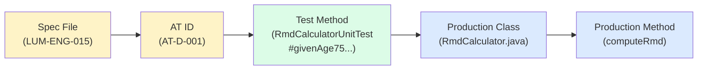
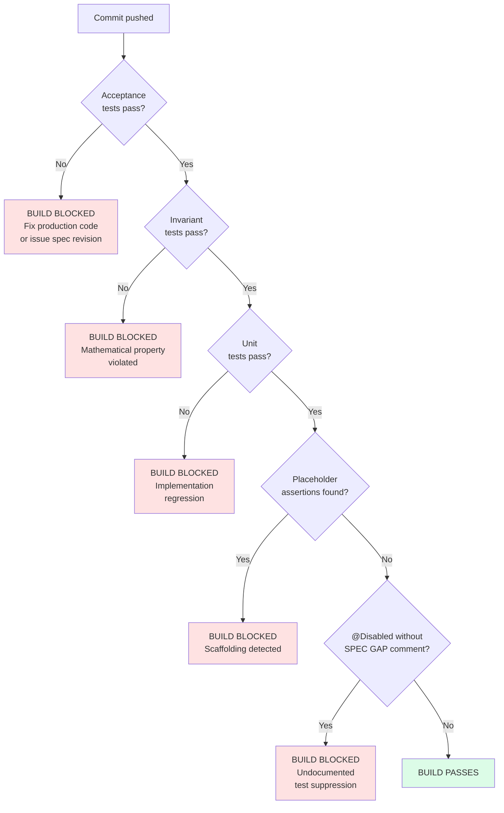
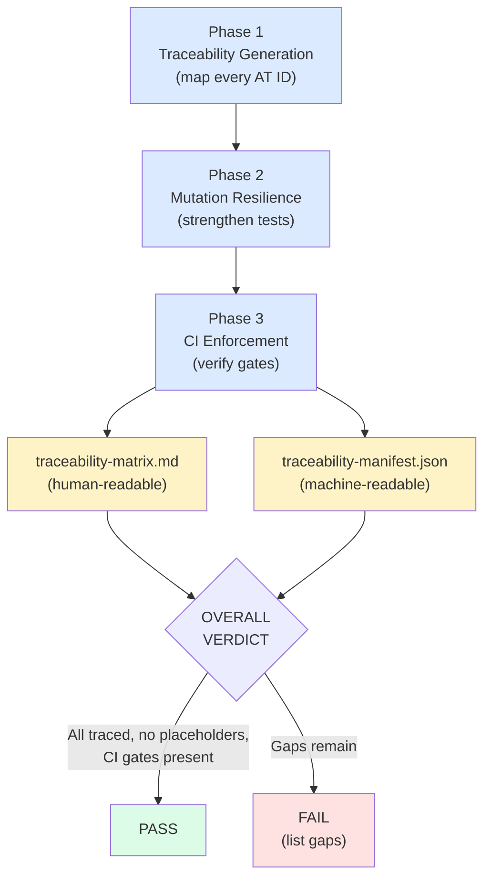

# Chapter 11: The Proof

Nine modes. Specifications authored, reviewed for consistency, frozen. Deterministic and stochastic engines validated. Integration points verified. Tests generated from behavioral contracts, with real assertions that fail. Production code written under discipline, constrained by those failing tests until every one turns green. A fidelity audit confirming completeness, faithfulness, and containment. All of that work produces a codebase that is, by construction, correct. But "by construction" is a claim. Mode 9 produces the evidence.

The traceability matrix is that evidence. It maps every requirement to a test, every test to production code, and every link in that chain to a verifiable entry. If any link is missing, the implementation is incomplete. If any test passes through a common mutation without failing, the test is insufficient. If CI does not enforce these properties on every commit, the guarantees degrade. Mode 9 closes all three gaps: traceability, resilience, enforcement.

## Prerequisites

Mode 9 gates on two artifacts and one behavioral condition.

---
**`/spec-traceability` instructions -- PREREQUISITES:**

```
Before any phase begins, verify ALL of the following:

## 1 — Spec Freeze Lock

lumiscape/engineering/spec-freeze.lock

If absent: stop. Traceability cannot be generated for an unfrozen spec set.

## 2 — Fidelity Report

lumiscape/engineering/artifacts/implementation-fidelity-report.md

If absent: stop. Run `/spec-fidelity` first. Traceability requires that the
implementation has been audited.

## 3 — Fidelity Verdict

The fidelity report must show:

- **Completeness:** No MISSING behaviors (behaviors with zero test coverage and no
  indirect coverage)
- **Containment:** No SPEC VIOLATIONS

The traceability matrix should not be generated over an implementation known to have
unresolved completeness or containment gaps — those gaps would appear as holes in
the matrix, which is misleading. Resolve all MISSING behaviors and SPEC VIOLATIONS
in the fidelity report before generating traceability.

Note: UNTESTED behaviors (placeholders replaced with real assertions) and BLOCKED
behaviors (@Disabled due to architectural constraints) may remain — they will be
documented as gaps in the matrix.
```
---

The spec freeze lock has been present since Mode 3. It guarantees the specs have not changed since they were frozen. Without it, traceability is meaningless: you would be mapping requirements to code while the requirements are still moving.

The fidelity report is the output of Mode 8b. It audits whether the implementation is complete (no MISSING behaviors), faithful (no divergence from spec intent), and contained (no SPEC VIOLATIONS where code does something the spec prohibits). Mode 9 requires that report to show a clean verdict. If the fidelity report still has unresolved gaps, those gaps would appear in the traceability matrix as missing links, and the matrix would document known incompleteness rather than proving completeness. Fix the gaps first.

The exception is deliberate: UNTESTED behaviors (where placeholders have been replaced with real assertions but the behavior is not yet fully exercised) and BLOCKED behaviors (marked `@Disabled` with a documented architectural constraint) may remain. These show up in the matrix as explicitly documented gaps, not as holes. The distinction matters. A documented gap says "we know this is missing and here is why." A hole says nothing.

## Phase 1: Traceability Generation

---
**`/spec-traceability` instructions -- PHASE 1 -- TRACEABILITY GENERATION:**

```
Claude must produce the full requirement-to-code mapping.

## Mapping Structure

For every spec behavior ID, record:

| AT ID | Spec | Behavior Description | Test Class | Test Method | Production Class | Production Method |
|-------|------|---------------------|------------|-------------|-----------------|-------------------|

## Discovery Process

For each module:

1. Extract all AT IDs from spec files
2. For each AT ID, find the test method with its `// [Spec: LUM-XXX AT-NNN]` citation
3. For each test method, identify which production class/method it exercises (via inspection)
4. Record the full chain: requirement → test → implementation

## Gap Notation

If any link in the chain is missing, record it explicitly:

- `TEST: MISSING` — no test references this AT ID (completeness gap)
- `TEST: PLACEHOLDER` — test exists but still contains `assertTrue(true, ...)` (untested)
- `TEST: BLOCKED` — test exists but is `@Disabled` with architectural constraint note
- `IMPL: MISSING` — test exists but no production code implements the behavior (stubbed)
- `IMPL: UNKNOWN` — test passes but the implementation class could not be identified

Do NOT suppress gaps. Every gap is documented.

## Traceability becomes:

AUDIT BACKBONE
```
---

The discovery process is mechanical. For each module, extract every AT ID from the spec files. For each AT ID, find the test method that cites it in a `// [Spec: LUM-XXX AT-NNN]` comment. For each test method, inspect the code to identify which production class and method it exercises. Record the full chain. The result is a table where every row is a requirement, and every column tracks one link in the chain from spec to code.



Here is a complete matrix excerpt for the RMD subsystem:

```
Req:
LUM-ENG-015 B-013 — RMD at age 75, IRS Table III divisor 24.6 on $5M balance

AT:
AT-D-001

Code:
com.lumiscape.engine.calc / RmdCalculator.java

Test:
RmdCalculatorUnitTest#givenAge75_whenComputeRmd_thenUsesIRSTableDivisor()
```

```
Req:
LUM-ENG-015 B-002 — No RMD required before age 73

AT:
AT-D-002

Code:
com.lumiscape.engine.calc / RmdCalculator.java

Test:
RmdCalculatorUnitTest#givenAge72_whenCheckEligibility_thenReturnsFalse()
```

```
Req:
LUM-ENG-015 B-003 — Multiple IRAs satisfy RMD from first account before second

AT:
AT-D-003

Code:
com.lumiscape.engine.calc / RetirementWithdrawalCalculator.java

Test:
RetirementWithdrawalCalculatorTest#givenMultipleIras_whenComputeWithdrawals_thenRmdSatisfiedFromFirst()
```

```
Req:
LUM-ENG-015 B-004 — Insufficient balance returns explicit insufficient result

AT:
AT-D-004

Code:
com.lumiscape.engine.calc / RetirementWithdrawalCalculator.java

Test:
RetirementWithdrawalCalculatorTest#givenInsufficientBalance_whenComputeWithdrawals_thenReturnsInsufficientResult()
```

Every row in the matrix tells you four things: what the spec requires, which AT ID identifies the requirement, which test verifies it, and which production code implements it. If any column is empty, the chain is broken.

### The Three Gap Types

The matrix reveals three types of gap, each with different implications for the implementation.

**Gap type 1: Requirement ID with no test.** A behavior was specified in the spec but no test verifies it. The code may implement it correctly or incorrectly, and CI will not catch it. Every row in the matrix must have a test. Any row with a missing test is an implementation that cannot be verified. This is the most straightforward gap: it means Mode 7 (spec-test-gen) missed something, or a behavior was added during a late spec revision and the test was never generated.

**Gap type 2: Test with no requirement ID.** A test exists that does not cite a spec behavior. The test is verifying something the spec does not require. This could be a speculative feature (code that was not requested and may not be wanted), a duplicate of another test under a different name, or an implementation detail that was tested directly instead of through its behavioral contract. Tests without spec authority should be investigated and either linked to a behavior ID or removed.

**Gap type 3: Code with no traceability entry.** A production class or method exists that implements behavior not found in any spec. This is the most dangerous gap. Code written without spec authority has no defined correct behavior. There is no spec to test against, no reviewer who approved the behavior, no user who asked for it. It is either dead code (should be deleted), speculative code (should be speced before shipping), or misimplemented code where a developer tried to implement a spec behavior but implemented something subtly different and never noticed.

The matrix is also an operational debugging tool. When LUM-ENG-015-CB-003 fails in CI, look it up, find the test method, then look up the behavior ID in the spec to read the exact behavior definition. You do not have to infer what the test is testing. The spec tells you what was intended.

## Phase 2: Mutation Resilience

---
**`/spec-traceability` instructions -- PHASE 2 -- MUTATION RESILIENCE:**

```
Strengthen tests against common mutations.

## Mutation Categories

Analyze each test for resilience to:

- **Operator mutations** — + ↔ −, * ↔ /, && ↔ ||
- **Comparison mutations** — < ↔ <=, > ↔ >=, == ↔ !=
- **Boundary mutations** — off-by-one changes in thresholds
- **Guard removal** — null checks, empty checks, bounds checks deleted
- **Branch mutations** — if/else branches swapped
- **Rounding mutations** — wrong rounding mode applied

## Analysis Process

For each test marked as a high-priority target (error handling, boundary conditions,
financial calculations), ask: if a developer made ONE of the above mutations to the
production code, would this test fail?

If the answer is no — the test is not mutation-resistant. Strengthen it.

## Strengthening Patterns

Weak: tests only the happy path
Strong: tests happy path + at least one boundary below + at least one boundary above

Weak: tests output exists (e.g., `assertNotNull(result)`)
Strong: tests output value exactly (e.g., `assertEquals(expectedCents, result.getBalanceCents())`)

Weak: tests error is thrown (e.g., `assertThrows(...)`)
Strong: tests error type AND message AND specific condition that triggers it

## Priority Order for Mutation Analysis

1. Financial calculations (taxes, RMD, interest, withdrawals)
2. Validation and error handling (rejection conditions)
3. Boundary logic (age thresholds, bracket edges, year transitions)
4. State update functions (per-year evolution)
5. Orchestration logic
```
---

The core question for every test: if a developer made one common mutation to the production code, would this test fail? If the answer is no, the test is insufficient. It passes when the code is correct and also passes when the code is wrong. That is not verification; it is coincidence.

Phase 2 applies this question systematically. The priority order is deliberate. Financial calculations come first because a mutation in a tax or RMD computation produces a wrong dollar amount that propagates silently through the simulation. Validation and error handling come second because a removed guard lets invalid data enter the system unchecked. Boundary logic, state updates, and orchestration follow in decreasing order of mutation impact.

### Worked Examples

**1. Operator mutations on age comparison.** The production code contains `if (age >= 73)`. Mentally apply: change to `if (age > 73)`. Does any test fail? If the test suite contains `givenAge73_whenCheckEligibility_thenReturnsTrue()`, yes, because `73 > 73` is false, so the test fails. Good. If the test suite only contains `givenAge74_whenCheckEligibility_thenReturnsTrue()`, no, because the mutation survives. The test is insufficient. Add the boundary test.

**2. Balance comparison mutations.** The production code contains `if (requestedCents > availableBalance)`. Apply: change to `if (requestedCents >= availableBalance)`. Does any test fail? If `givenExactBalance_whenWithdraw_thenSucceeds()` exists (where requested equals available), yes. If not, the mutation survives. Add the test.

**3. Null guard removal.** The production code contains `if (config == null) throw new NullPointerException(...)`. Apply: remove the guard. Does any test fail? If `givenNullConfig_whenCompute_thenThrowsException()` exists, yes. If not, the mutation survives, because the code will throw an NPE somewhere deeper but not at the intended point with the intended message. The test `givenNullConfig_whenCompute_thenThrowsNullPointerWithUsefulMessage()` should exist and should assert both the exception type and the message content.

**4. Rounding mode mutations.** The production code contains `Math.round((double) balanceCents / divisor)`. Apply: change to `(long) ((double) balanceCents / divisor)` (truncation instead of rounding). Does any test fail? If the golden case tests use values where the fractional part is >= 0.5, yes, because truncation returns a value 1 cent lower. All golden cases should exercise rounding in both directions (round up and round down), so at least one will fail on this mutation.

**5. Branch swap mutations.** The production code contains:

```java
if (isRmdEligible(age)) {
    return computeRmd(balance, divisor);
} else {
    return 0L;
}
```

Apply: swap the branches. Does any test fail? Yes. `givenAge72_whenComputeWithdrawals_thenRmdIsZero()` fails because it expects 0 but gets a computed value. `givenAge73_whenComputeWithdrawals_thenRmdIsNonZero()` fails because it expects a value but gets 0. Both boundary tests together catch the branch swap.

The pattern: mutations that survive are holes in the test suite. Finding them systematically in Phase 2 fills those holes before the code ships. Finding them after the code ships means real bugs in production.

Note that Phase 2 only modifies tests. No production code changes are allowed. The skill's hard rules are explicit: "No production code changes. Mutation resilience improvements are test-only." The implementation is already audited by the fidelity report. Phase 2 strengthens the guard around it; it does not change what it guards.

## Phase 3: CI Enforcement

---
**`/spec-traceability` instructions -- PHASE 3 -- CI ENFORCEMENT:**

```
Claude treats CI gates as authority.

## Required CI Gates

Verify that the project's CI configuration enforces all of the following:

- All acceptance tests pass
- All invariant tests pass
- All unit tests pass
- No `@Disabled` tests added without a `// SPEC GAP:` comment explaining the architectural constraint
- No `assertTrue(true, ".*placeholder")` assertions in test code

## Placeholder Detection Gate (critical)

The most important CI gate is the placeholder detector:

grep -r 'assertTrue(true, ".*placeholder' src/test/ && echo "FAIL: placeholder tests found" && exit 1

Or equivalent for the test framework in use. This gate must fail the build if ANY
placeholder assertion exists in test code.

This single gate would have prevented the scaffolding drift pattern (where Phase 8
created ~2,428 test stubs that all passed JUnit while asserting nothing).

## CI Must Block On

- acceptance failures
- invariant failures
- unit test failures
- traceability gaps
- placeholder assertions

Claude must NOT suggest overriding CI (no `--no-verify`, no skipping tests).
```
---

CI gates are authority. Not suggestions, not guidelines, not "best practices." Authority. The distinction matters because developers learn the behavior of the system around them. If CI failures are sometimes ignored, sometimes worked around by adjusting a test to match what the code does, sometimes declared "flaky" and skipped, developers learn that CI is a suggestion. They begin to make implementation decisions without regard for CI, knowing that a CI failure is not a hard stop.

If CI failures always result in the underlying problem being fixed before the commit lands, developers learn that CI is authority. They do not ship with failing tests. They do not redefine what "passing" means. They fix the code or the spec, but not the test to pass the wrong behavior.



### Two Kinds of Failing Tests

What "not overriding CI" means in practice requires precision, because there are two kinds of failing tests.

**The test is correct and the code is wrong.** The acceptance test correctly describes the expected behavior per the spec. The code produces a different result. Fix the code. Do not adjust the expected value in the test, do not add a comment saying "known issue," do not create a ticket and mark the test as pending. The code is wrong and must be fixed before the commit lands.

**The test is wrong and the spec is wrong.** The acceptance test was written from a spec that has a bug: the expected behavior in the spec is incorrect, not the code. The test fails because the code correctly implements the correct behavior, not the specified behavior. The response is not to fix the code (which is correct) and not to adjust the test (which would silently accept wrong behavior). The response is a Formal Spec Revision Request to correct the spec, followed by a test update to match the corrected spec, followed (if necessary) by a code adjustment. The sequence is always: spec first, then test, then code. Never test first to make CI pass.

This distinction matters because it means CI failures always trigger one of two responses, and only two: fix the code, or fix the spec. "Fix the test to make CI pass" is not a response. It is the removal of a guard that exists precisely to catch wrong behavior. When you change a failing test to passing by adjusting the expected value without spec authority, you are not fixing a problem. You are silencing a detector.

### The Placeholder Detection Gate

The single most important CI gate is the placeholder detector. A placeholder assertion, `assertTrue(true, "some placeholder message")`, passes JUnit unconditionally. It looks like a test. It has a test name, a test class, a `@Test` annotation. It counts toward test coverage metrics. But it verifies nothing.

The scaffolding drift pattern is what happens without this gate. A test generation phase creates thousands of test stubs with placeholder assertions. All tests "pass." CI is green. The codebase appears fully tested. But no behavioral verification is happening. The stubs are scaffolding, and scaffolding that passes CI is scaffolding that never gets replaced.

The placeholder detection gate makes this impossible. If any `assertTrue(true, ".*placeholder")` exists anywhere in test code, the build fails. The scaffolding cannot pass CI. It must be replaced with real assertions before the build succeeds. One grep command prevents an entire category of silent test debt.

## Manifest and Audit Trail

---
**`/spec-traceability` instructions -- MANIFEST & AUDIT TRAIL:**

```
**Manifest file:** `engineering/artifacts/traceability-manifest.json`

### Full Run vs Incremental Run

This skill supports incremental optimization to avoid re-tracing unchanged specs.

**Full run:** Traces all AT IDs across all specs. Required when:
- No prior manifest exists
- `incrementalRunsSinceFullRun >= maxIncrementalRuns` (counter = 3)
- Specs have been added or removed since last run
- Dependency graph has changed (new dependencies added/removed in Architecture Metadata)
- User explicitly requests a full run

**Incremental run:** Re-traces only AT IDs from specs whose `chainHash` has changed since last run. Preserves tracing results for unchanged specs.

### Chain Hash Computation

chainHash(spec) = SHA-256(fileHash(spec) + sorted(chainHash(dep) for dep in spec.dependencies))

Where `dependencies` comes from the spec's `## Architecture Metadata` table. A change in any transitive dependency propagates a dirty signal through the chain.

A spec is "dirty" if its current chainHash differs from the manifest's recorded chainHash.

### Counter Logic

- `maxIncrementalRuns`: 3
- After each incremental run, increment `incrementalRunsSinceFullRun`
- Full run resets `incrementalRunsSinceFullRun` to 0
- When counter reaches 3, next run MUST be a full run

### Manifest Structure

{
  "lastFullRun": "2026-02-23",
  "lastRun": "2026-02-24",
  "incrementalRunsSinceFullRun": 1,
  "maxIncrementalRuns": 3,
  "specs": {
    "LUM-ENG-015": {
      "fileHash": "a1b2c3...",
      "chainHash": "d4e5f6...",
      "dependencies": ["LUM-DTO-030", "LUM-DTO-019"],
      "atIdsTraced": 12,
      "fullyTraced": 11,
      "gaps": ["AT-009: TEST BLOCKED — @Disabled, architectural constraint"],
      "mutationAnalysis": { "testsStrengthened": 2 },
      "result": "PASS",
      "evidence": "12 AT IDs traced; 11 fully linked (AT→test→impl); 1 blocked with documented reason"
    }
  },
  "overallResult": "PASS",
  "ciGates": {
    "placeholderDetection": "PRESENT",
    "disabledTestComments": "PRESENT"
  }
}

### Evidence Requirements

For each spec in the manifest:
- **fileHash** — SHA-256 of the spec file
- **chainHash** — transitive hash including all dependencies
- **atIdsTraced** — count of AT IDs in this spec
- **fullyTraced** — count with complete AT→test→impl chain
- **gaps** — list of AT IDs with incomplete tracing (with gap type)
- **mutationAnalysis** — count of tests strengthened during this run
- **result** — PASS or FAIL with reason
- **evidence** — one-sentence summary of tracing completeness

A spec with `"evidence": ""` or `"evidence": "traced"` is an audit trail violation. Evidence must be specific.

### Manifest Write Step

After producing the traceability matrix, write the manifest. The manifest and the matrix are complementary:
- The **matrix** is the human-readable deliverable
- The **manifest** is the machine-readable audit trail that proves work was done
```
---

The manifest is the machine-readable complement to the human-readable matrix. The matrix is what an engineer reads. The manifest is what CI reads.

### Chain Hash Computation

The chain hash is the mechanism that makes incremental runs possible. Each spec has a `fileHash`, which is the SHA-256 of the spec file itself. The `chainHash` extends this to include the hashes of all transitive dependencies:

```
chainHash(spec) = SHA-256(fileHash(spec) + sorted(chainHash(dep) for dep in spec.dependencies))
```

If LUM-ENG-015 depends on LUM-DTO-030 and LUM-DTO-019, and someone modifies LUM-DTO-030, then LUM-DTO-030's fileHash changes, which changes its chainHash, which changes LUM-ENG-015's chainHash (because LUM-DTO-030 is in its dependency list). The incremental run detects that LUM-ENG-015 is "dirty" and re-traces it. Specs whose chain hashes have not changed are preserved from the previous run.

This propagation is transitive. If LUM-DTO-030 depends on LUM-DTO-001, and LUM-DTO-001 changes, the dirty signal propagates through LUM-DTO-030 to LUM-ENG-015. Every spec in the dependency chain gets re-traced.

### Full vs. Incremental

Incremental runs save time on large spec surfaces. But they accumulate risk: if the discovery process has a bug, or if a file was modified without changing its content hash (unlikely but possible with certain filesystem operations), the incremental run preserves the stale result. The counter logic limits this risk. After three incremental runs, the next run must be a full run. This ensures that the entire matrix is re-derived from scratch at regular intervals.

A full run is also required when specs are added or removed, when the dependency graph changes, or when the user explicitly requests it. The manifest tracks the counter:

- After each incremental run, increment `incrementalRunsSinceFullRun`
- A full run resets the counter to 0
- When the counter reaches 3, the next run must be full

### Evidence

Every spec entry in the manifest must include specific evidence. "12 AT IDs traced; 11 fully linked; 1 blocked with documented reason" is evidence. "traced" is not. The evidence requirement prevents the manifest from becoming a rubber stamp where every entry says PASS without explaining what was actually verified.

## Output

---
**`/spec-traceability` instructions -- OUTPUT -- TRACEABILITY MATRIX:**

```
Write the matrix to:

engineering/artifacts/traceability-matrix.md

Report structure:

# Traceability Matrix
Generated: <date>
Spec tag: <contents of engineering/spec-freeze-tag.txt>
Fidelity report: engineering/artifacts/implementation-fidelity-report.md

## Summary
- Total AT IDs: N
- Fully traced (AT → test → impl): N
- Test missing: N
- Test placeholder: N
- Test blocked (@Disabled): N
- Impl unknown: N

## Traceability Table
| AT ID | Spec | Behavior | Test Class | Test Method | Production Class | Status |
|-------|------|----------|------------|-------------|-----------------|--------|

## Mutation Resilience Findings
[List tests strengthened, with before/after description]

## CI Gates
[Status of each required gate — PRESENT or MISSING]

## OVERALL VERDICT
PASS — all AT IDs traced, no placeholders, CI gates present
FAIL — [list gaps]

Missing mappings = incomplete implementation.

Traceability is:

AUDIT BACKBONE
```
---

The matrix and the manifest are the two outputs of Mode 9. The matrix is the human-readable report. The manifest is the machine-readable audit trail. Together, they answer the question: for every requirement in the frozen spec set, is there a test that verifies it and production code that implements it?



A PASS verdict means: every AT ID is traced to a test and an implementation, no placeholder assertions exist in the test code, all CI gates are present and enforced. A FAIL verdict lists exactly which gaps remain. There is no partial pass.

## The Pipeline Is Complete

---
**`/spec-traceability` instructions -- LIFECYCLE POSITION:**

```
This mode is the final step in the engineering pipeline:

spec-freeze → validation → integration → spec-test-gen → spec-execution → spec-fidelity → spec-traceability

After this phase passes, the implementation is:

- Specified (frozen specs)
- Tested (real assertions, no placeholders)
- Audited (fidelity report PASS)
- Traced (every AT ID mapped to test and implementation)
- Hardened (mutation-resistant tests)
- Enforced (CI gates present)
```
---

Nine modes, and the codebase has passed through all of them.

Mode 1 authored the specs. Mode 2 reviewed them for compliance, and Mode 2b reviewed them for cross-spec consistency. Mode 3 froze them. Mode 4 validated the deterministic engine against spec behaviors. Mode 5 validated the stochastic engine against statistical properties. Mode 6 verified integration points across module boundaries. Mode 7 generated the full test suite from behavioral contracts, with real assertions, every test failing. Mode 8 wrote production code under discipline until every test turned green. Mode 8b audited the implementation for completeness, faithfulness, and containment. Mode 9 built the traceability matrix, hardened the tests against mutations, and verified CI enforcement.

---
**`/spec-traceability` instructions -- OPERATING PRINCIPLE:**

```
This phase is post-implementation hygiene.

Claude is:

TRACEABILITY AUDITOR

constrained by:

- frozen specs
- implementation-fidelity-report
- acceptance tests
- implementation discipline
```
---

The implementation is specified, tested, audited, traced, hardened, and enforced. Every requirement maps to a test. Every test maps to production code. Every link is verified. Every common mutation is caught. Every CI gate is in place.

That is the proof.
