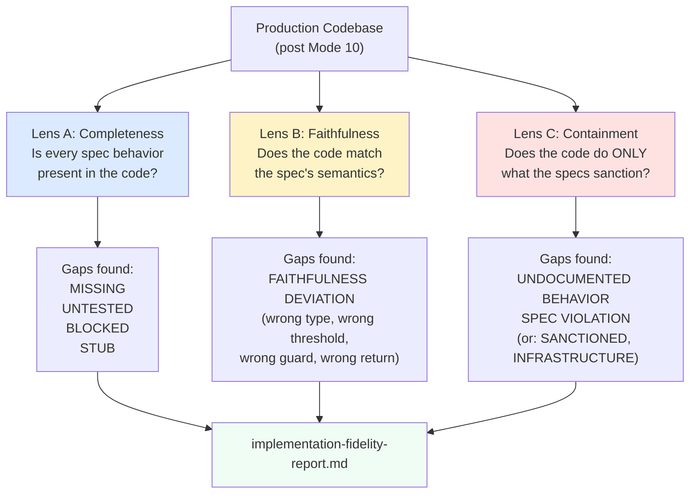
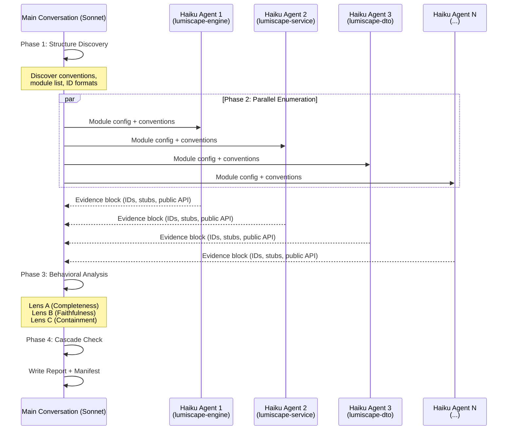
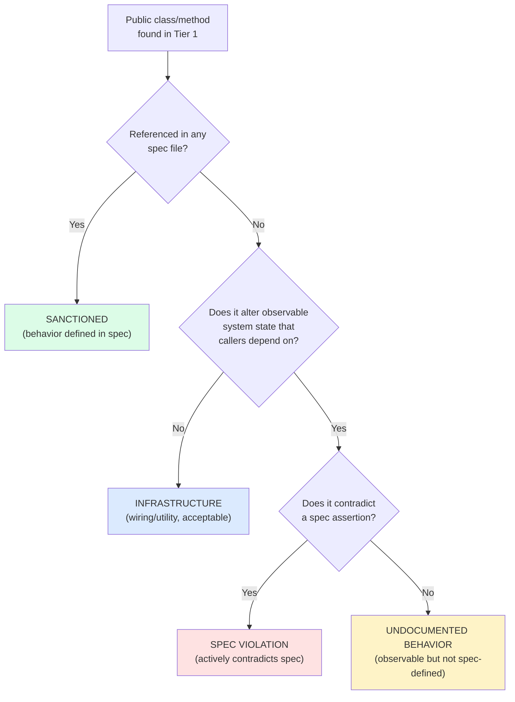

# Chapter 12: The Fidelity Audit

## After Implementation, the Hard Question

Mode 10 is done. Tests are green. Production code exists for every module. The frozen specs drove implementation, the test suite verified it, and CI enforced it. So now what?

Now you ask the hard question: does the code actually do what the specs say?

Green tests are necessary but not sufficient. A test suite can pass while the implementation silently misses a behavior the spec describes, adds a behavior no spec sanctions, or subtly diverges from a spec's intent. The test suite verifies what it tests. It does not verify what it does not test. If a spec behavior has no corresponding test (because the test was disabled, because it was missed in generation, because it fell through a crack), the passing build tells you nothing about whether that behavior is implemented.

Mode 11 exists to catch these gaps. It sits between implementation (Mode 10) and traceability (Mode 12) because it answers a question that must be settled before the codebase can be considered complete. If the implementation has unresolved fidelity gaps, a traceability matrix built on top of it maps incomplete implementation to specs and declares the mapping valid. The fidelity audit prevents that.

## Prerequisites

---
**`/spec-fidelity` instructions -- §PREREQUISITE -- SPEC FREEZE VERIFICATION:**

```
Before anything else, verify `engineering/spec-freeze.lock` exists.

If absent: stop immediately. Inform the user that spec-fidelity cannot run until the spec is frozen.
```
---

The spec freeze lock is the same gate that controls every mode from 4 onward. The fidelity audit compares code against specs. If the specs are not frozen, they could change during the audit, and the audit's findings would be invalid before it finishes. The lock file is a precondition, not a suggestion.

This mode also assumes that Mode 10 is complete. Production code and tests exist. The skill file states this directly: "This skill runs after spec-execution is complete. It assumes production code and tests exist." There is no explicit artifact gate for Mode 10 completion (unlike Mode 9's test-gen-report.md), but the audit cannot produce meaningful findings against code that does not exist yet.

## The Three Questions

---
**`/spec-fidelity` instructions -- §Introduction:**

```
You are performing a post-implementation audit to answer three questions:

1. **Faithful** — Does the production code implement every spec behavior exactly as described?
2. **Contained** — Does the production code do *only* what the specs sanction? No undocumented observable behavior.
3. **Complete** — Is every spec behavior present in the implementation? Nothing omitted.

This skill runs **after** spec-execution is complete. It assumes production code and tests exist.
```
---

These three questions organize the entire audit. They are not three separate audits run in sequence. They are three lenses applied to the same codebase, each revealing a different category of problem.

**Faithful** asks: where the code does implement a spec behavior, does it implement it correctly? The spec says "returns null when not found." Does the code return null, or does it throw an exception? The spec says the threshold is `> 0`. Does the code check `> 0`, or `>= 0`? Faithfulness is about semantic match between the spec's description and the code's behavior.

**Contained** asks: does the code do anything the specs do not describe? A public method exists that no spec mentions. A class emits an event that no spec defines. An error path exists that no spec sanctions. Containment is about surface area. Code that does more than what is specified has undocumented behavior, and undocumented behavior is untested by definition.

**Complete** asks: is every spec behavior accounted for in the implementation? A behavior ID exists in the spec with no test and no implementation evidence. A stub exists where real code should be. Completeness is about coverage of the spec surface.



Together, these three lenses form a complete check. Faithful catches wrong implementations. Contained catches extra implementations. Complete catches missing implementations. Any implementation that passes all three is a faithful rendering of the frozen spec surface and nothing more.

## Structure Discovery (Phase 1)

---
**`/spec-fidelity` instructions -- §PHASE 1 -- STRUCTURE DISCOVERY:**

```
Before launching Haiku agents, discover the project layout. Do not hardcode paths.

**Spec root:** Look for `specs/modules/` or `specs/` in the project root. If found, enumerate subdirectories — each is a module's spec directory.

**Module roots:** Look for build manifests (`pom.xml`, `package.json`, `build.gradle`, `Cargo.toml`, `go.mod`) to enumerate modules. Match module names to spec directories.

**Source roots:** For each module, look for common source root patterns:
- `src/main/java/`, `src/main/kotlin/`, `src/`, `lib/`, `Sources/`

**Test roots:** For each module, look for common test root patterns:
- `src/test/java/`, `src/test/kotlin/`, `test/`, `tests/`, `__tests__/`, `spec/`

**Behavior ID format:** Sample 3–5 spec files, grep for ID patterns (e.g., `AT-\d+`, `B-\d+`, `TC-\d+`, `BEHAVIOR-\d+`). Use the dominant pattern found as the canonical format.

**Test reference format:** Sample 3–5 test files, grep for spec citation patterns (e.g., `// [Spec:`, `@see`, `# Spec:`, `/* AT-`). Use the dominant pattern found.

**Disabled/skipped markers:** Discover the test framework's skip annotation by sampling test files (`@Disabled`, `@Ignore`, `@pytest.mark.skip`, `xit(`, `pending`, `skip(`).

Record all discovered conventions before proceeding to Phase 2.
```
---

Phase 1 is automated discovery, not hardcoded configuration. The skill does not assume Maven, does not assume Java, does not assume JUnit. It discovers the project's conventions by sampling real files.

This matters because the fidelity audit needs to work across projects. A hardcoded path like `src/main/java` fails on a Kotlin project, a Go project, a TypeScript project. The discovery phase reads the actual build manifests and source trees and records what it finds. The behavior ID format is discovered by sampling spec files, not assumed to be `AT-\d+`. The test framework's skip annotation is discovered by sampling test files, not assumed to be `@Disabled`.

The output of Phase 1 is a set of conventions: where specs live, where source lives, where tests live, what the behavior IDs look like, how tests reference specs, and how tests are disabled. Every subsequent phase uses these conventions instead of assumptions.

## Parallel Enumeration (Phase 2)

---
**`/spec-fidelity` instructions -- §PHASE 2 -- PARALLEL HAIKU ENUMERATION:**

```
Launch one Haiku agent per module simultaneously. Each agent receives:
- Module name
- Spec directory path
- Source root path(s)
- Test root path(s)
- Discovered behavior ID format (regex)
- Discovered test reference format
- Discovered disabled marker

**Each Haiku agent must produce a structured evidence block in this exact format:**

```
MODULE: <module-name>

## BEHAVIOR ID INVENTORY
For each spec file:
  SPEC: <LUM-XXX> <title>
  IDs found: [AT-001, AT-002, ..., AT-N]
  IDs with passing test: [AT-001, ...]
  IDs with disabled test: [AT-002 — reason: <text from disabled annotation>]
  IDs with no test at all: [AT-003, ...]

## STUB / PLACEHOLDER INVENTORY
Files containing stubs (grep for: UnsupportedOperationException, "not implemented",
"TODO", "FIXME", "stub", "placeholder", return null where non-null expected,
empty method bodies on non-void methods):
  FILE: <path>
  LINE: <N> — <exact text>

## PUBLIC OBSERVABLE BEHAVIOR INVENTORY
For each production class in this module, list:
  CLASS: <fully-qualified name>
  Referenced in spec: YES <spec-id> / NO
  Public methods: [list]
  Observable outputs not in any spec comment: [list any that seem undocumented]
  Events/metrics/errors emitted: [list with spec reference if known]

## RAW GREP EVIDENCE
Show the raw grep output for each search performed.
Do not assert PASS without showing raw evidence.
```

**Haiku agent hard rules:**
- Do not assert PASS for any ID without showing the grep match
- `NONE FOUND` is only acceptable after showing the grep command output
- Do not read implementation logic — only enumerate, do not judge
- If a file is too large, read only the relevant sections (class declarations, method signatures)
```
---

Phase 2 is where the two-tier execution model takes effect. The audit uses two different models for two different tasks, because the tasks have fundamentally different cost profiles.

Enumeration is mechanical. Extract all behavior IDs from spec files. Grep test files for references to those IDs. Grep production code for stubs and placeholders. List all public methods on all production classes. This work is high-volume and low-judgment. It does not require understanding what the code does, only cataloging what exists. Haiku is fast, cheap, and accurate for this kind of structured extraction. Running one Haiku agent per module in parallel means the entire enumeration phase completes in the time it takes to enumerate the largest single module.

Behavioral analysis is the opposite. Reading a spec behavior description, reading the production code that implements it, and judging whether the code does what the spec says requires contextual understanding. It requires knowing that "returns null when not found" and "throws NoSuchElementException" are different behaviors, even though both handle the not-found case. Sonnet handles this in Phase 3.



The separation is strict. Haiku agents enumerate but do not judge. The skill's hard rules enforce this: "Do not read implementation logic." A Haiku agent lists that `RmdCalculator` has a public method `computeRmd(int, long, double)` and that it is referenced in spec LUM-ENG-015. It does not read the body of `computeRmd` to decide whether the implementation is faithful. That judgment belongs to Phase 3.

The evidence requirement is equally strict: "Do not assert PASS for any ID without showing the grep match." This prevents false positives from agents that claim a behavior is covered without actually verifying it. Every assertion must be backed by raw grep output. If the grep finds nothing, the output is `NONE FOUND`, and the raw grep command is shown so a human can verify that the search was correct.

The three inventory types each feed a different lens in Phase 3:

- **Behavior ID Inventory** feeds Lens A (Completeness). IDs with no test need investigation.
- **Stub/Placeholder Inventory** feeds Lens A (Completeness). Stubs indicate unfinished implementation.
- **Public Observable Behavior Inventory** feeds Lens C (Containment). Classes and methods not referenced in any spec need investigation.

## Behavioral Analysis (Phase 3)

Phase 3 takes the Tier 1 evidence blocks from every module and applies the three lenses. This is where Sonnet reads actual code, compares it to actual spec text, and makes behavioral judgments.

### Lens A: Completeness

---
**`/spec-fidelity` instructions -- §PHASE 3 -- Lens A: Completeness:**

```
For every behavior ID marked **no test** or **disabled test**:

1. Read the spec behavior description
2. Check if the behavior is also exercised indirectly by a higher-level test (integration, smoke)
3. Classify:
   - `MISSING` — no implementation evidence found anywhere
   - `UNTESTED` — implementation likely exists but no direct test; indirect coverage only
   - `BLOCKED` — test cannot be written due to architectural constraint (private method, DTO invariant, etc.)

For every stub/placeholder found in Tier 1:
1. Read the stubbed code
2. Read the spec behavior it is supposed to implement
3. Classify: `STUB` (spec behavior not yet implemented) vs `UTILITY` (helper not spec-defined, acceptable)
```
---

Completeness analysis starts with every behavior ID that lacks a passing test and asks: what is actually going on here?

Consider a concrete example. The Haiku agent for lumiscape-engine reports that behavior ID AT-D-027 (`getTaxableIncomeCents` on `YearTaxAccumulator`) has no test at all. Phase 3 reads the spec: LUM-ENG-021 defines AT-D-027 as "YearTaxAccumulator exposes getTaxableIncomeCents() returning the accumulated taxable income for the year." Phase 3 searches the production code: no method named `getTaxableIncomeCents` exists on `YearTaxAccumulator`. The method is not present. Classification: `MISSING`. The spec describes a behavior, the code does not implement it, and no test verifies it.

Now consider AT-D-015 in the same module, which the Haiku agent reports as having a `@Disabled` test with reason "SPEC GAP: SimulationService.runSimulation() not yet implemented." Phase 3 reads the spec and finds that LUM-SVC-004 describes the full simulation orchestration flow. Phase 3 checks whether an integration test or smoke test exercises this path indirectly. It finds that `SmokeTestAcceptanceTest` calls the simulation endpoint and verifies the response shape, which exercises `SimulationService.runSimulation()` end-to-end. Classification: `UNTESTED` (no direct unit test, but indirect integration coverage exists through the smoke test).

Finally, consider AT-D-042, a behavior about a DTO record's equals/hashCode contract. The spec says "two PersonConfig records with identical fields are equal." This is a property of Java records by definition; the compiler generates `equals()` and `hashCode()` from the record components. Writing a test for it is not blocked by an architectural constraint, but it tests compiler-generated behavior, not implementation behavior. Classification: `BLOCKED` (the behavior is guaranteed by the language, not by implementation code that could regress).

For stubs, the analysis is simpler. A Haiku agent reports a stub in `ExportServiceImpl.java` at line 47: `throw new UnsupportedOperationException("not implemented")`. Phase 3 reads the spec: LUM-DAC-005 defines the export behavior. The stub is in the production code path that should implement it. Classification: `STUB`. If instead the `UnsupportedOperationException` is in a utility method that no spec references, it is classified as `UTILITY` and is not a fidelity gap.

### Lens B: Faithfulness

---
**`/spec-fidelity` instructions -- §PHASE 3 -- Lens B: Faithfulness:**

```
For a **representative sample** of behavior IDs that have passing tests, perform a faithfulness check.

Priority order for sampling:
1. Core behaviors marked as architectural (B-xxx in spec's Core Behaviors section)
2. Error handling behaviors (negative paths, rejection cases)
3. Boundary conditions (edge cases, thresholds)
4. Any behavior ID where the spec description is unusually detailed or precise

**For each sampled behavior ID:**
1. Read the spec's description of this behavior (exact language)
2. Read the test that covers it
3. Read the production code that implements it
4. Judge: does the code do what the spec says, with the same semantics, the same error conditions, the same outputs?

Flag any of these as **FAITHFULNESS DEVIATION**:
- Wrong error type thrown (spec says `IllegalArgumentException`, code throws `RuntimeException`)
- Wrong return value semantics (spec says "returns null when not found", code throws instead)
- Wrong field populated (spec says field X, code populates field Y)
- Wrong threshold or boundary (spec says `> 0`, code checks `>= 0`)
- Missing guard (spec says "reject if null", code silently accepts)
- Extra guard (code rejects cases the spec permits)
- Wrong event emitted, wrong metric recorded, wrong state updated
```
---

Faithfulness cannot be checked exhaustively. A project with 400 behavior IDs would require reading 400 spec descriptions, 400 tests, and 400 code paths in detail. The skill requires sampling instead, with a priority order that focuses on the behaviors most likely to have subtle deviations.

Core architectural behaviors come first because they define the system's fundamental contracts. If `RetirementWithdrawalCalculator.compute()` is unfaithful to its spec, every downstream consumer of its output is affected. Error handling behaviors come second because they are the most commonly deviated category: the spec says "reject with IllegalArgumentException," but the developer threw RuntimeException because it was convenient, and the test checks for RuntimeException to match the code rather than the spec.

A faithfulness deviation is specific. It is not "the implementation seems different from the spec." It is: the spec says `> 0`, the code checks `>= 0`, and this means the code accepts zero as valid input when the spec forbids it. The deviation is a concrete semantic difference with a concrete behavioral consequence.

Consider a concrete case. LUM-ENG-015 specifies: "If the account balance is zero, return a result with rmdAmount = 0 and status = NO_RMD_REQUIRED." The test asserts `result.rmdAmount() == 0L` and `result.status() == NO_RMD_REQUIRED`. The production code returns `RetirementDistributionResult.empty()`, which sets `rmdAmount = 0` and `status = EMPTY`. The test passes because it only checks `rmdAmount`, not `status`. But the spec says `NO_RMD_REQUIRED`, and the code returns `EMPTY`. These are different status values with different semantic meanings: "no RMD required" (the participant is not yet 73) versus "empty" (the account has no balance). This is a faithfulness deviation. The code does not do what the spec says, even though the test passes.

### Lens C: Containment

---
**`/spec-fidelity` instructions -- §PHASE 3 -- Lens C: Containment:**

```
For every class marked **"Referenced in spec: NO"** in Tier 1, plus any class where public methods appear undocumented:

1. Read the class's public interface
2. For each public method / observable behavior:
   - Search all spec files for any mention of this behavior (by name or semantic description)
   - If found in specs: mark `SANCTIONED`
   - If not found: read the implementation and judge
     - Does this method alter observable system state in a way callers depend on?
     - Does it emit events, metrics, or errors not defined in any spec?
     - Is it a private implementation detail exposed unnecessarily?
3. Classify:
   - `SANCTIONED` — behavior is defined in at least one spec
   - `INFRASTRUCTURE` — utility/wiring code with no observable behavioral effect (acceptable)
   - `UNDOCUMENTED BEHAVIOR` — observable behavior not defined in any spec (flag)
   - `SPEC VIOLATION` — behavior actively contradicts a spec assertion

For `UNDOCUMENTED BEHAVIOR` and `SPEC VIOLATION`, always show:
- The exact code that implements it
- Which spec(s) are silent or contradicted
- Whether it affects outputs callers observe
```
---

Containment is the most nuanced lens because not every class without a spec reference is a problem. A Spring `@Configuration` class that wires beans together has no spec because it is infrastructure, not behavior. A utility method that formats a log message has no spec because it does not alter observable system state. These are `INFRASTRUCTURE`, and they are acceptable.

The question is always behavioral: does this code produce observable effects that callers depend on? If yes, and no spec defines those effects, it is undocumented behavior.



Consider three concrete cases.

**Case 1: INFRASTRUCTURE.** The Haiku agent reports `ServiceConfig.java` in lumiscape-service with no spec reference. Phase 3 reads it: it is a Spring `@Configuration` class that declares `@Bean` methods for service-layer components. It does not define any behavioral contract. It wires dependencies. Classification: `INFRASTRUCTURE`.

**Case 2: UNDOCUMENTED BEHAVIOR.** The Haiku agent reports `PortfolioRebalancer.java` in lumiscape-engine with no spec reference and a public method `rebalance(Portfolio portfolio, AllocationTarget target)`. Phase 3 searches all spec files for "rebalance," "portfolio rebalancer," and "allocation target." No spec mentions this class or this behavior. Phase 3 reads the implementation: the method adjusts account balances to match a target allocation, which alters observable portfolio state. Callers of the simulation engine may receive different withdrawal amounts depending on whether rebalancing occurred. This is observable behavior with no spec authority. Classification: `UNDOCUMENTED BEHAVIOR`. The report shows the class, the method, the absence of spec authority, and the observable effect.

**Case 3: SPEC VIOLATION.** The Haiku agent reports that `WithdrawalCalculator.withdrawFromAccount()` has an extra guard: it rejects withdrawal amounts below 100 cents ($1.00) with an `IllegalArgumentException`. Phase 3 searches the spec: LUM-ENG-015 says "reject if requestedCents <= 0." The spec permits any positive withdrawal amount. The code rejects amounts between 1 and 99 cents that the spec explicitly permits. Classification: `SPEC VIOLATION`. The code actively contradicts the spec's assertion about valid inputs.

## Cascade Check (Phase 4)

---
**`/spec-fidelity` instructions -- §PHASE 4 -- CASCADE CHECK:**

```
When any gap is found in any phase, check **all modules** for the same pattern before moving on.

The same omission, stub pattern, or undocumented behavior typically appears in multiple places simultaneously. Do not report each instance separately if the root cause is the same. Group by root cause:

```
COMPLETENESS GAP: AT-027 (getTaxableIncomeCents) has no test
  Found missing in: lumiscape-engine StateTypesTest, lumiscape-service (indirect)
  Root cause: YearTaxAccumulator missing getTaxableIncomeCents() method
```
```
---

Phase 4 is about root cause grouping. When a gap appears in one module, the same pattern usually appears in others. A missing method on `YearTaxAccumulator` will show up as a completeness gap in lumiscape-engine (where the class lives), as an untested behavior in lumiscape-service (which calls the method), and potentially as a faithfulness deviation in any module that consumes the accumulator's output.

Reporting these as three separate findings obscures the root cause. The engineer does not need to fix three problems. They need to fix one: add `getTaxableIncomeCents()` to `YearTaxAccumulator`. Phase 4 groups findings by root cause so the report presents actionable items, not a flat list of symptoms.

## The Manifest and Incremental Runs

---
**`/spec-fidelity` instructions -- §MANIFEST & AUDIT TRAIL:**

```
**Manifest file:** `engineering/artifacts/fidelity-manifest.json`
```
---

The skill produces two outputs: a human-readable report and a machine-readable manifest. The report is the deliverable. The manifest is the audit trail that proves work was done and enables incremental runs.

The manifest tracks per-module results with chain hashes computed from the spec files and their transitive dependencies. When a spec changes, its chain hash changes, which propagates a dirty signal through any module that depends on it. An incremental run audits only dirty modules and reuses previous results for clean modules. After three incremental runs, the next run must be a full run to guard against accumulated drift.

The evidence requirement for the manifest is specific: a module entry with `"evidence": ""` or `"evidence": "audited"` is an audit trail violation. The evidence field must describe what was actually checked. "45 behavior IDs fully traced; 12 sampled for faithfulness with 0 deviations; 8 classes checked for containment" tells a reader what the audit covered. "Audited" tells them nothing.

## Output

---
**`/spec-fidelity` instructions -- §OUTPUT:**

```
Write the full report to:

```
engineering/artifacts/implementation-fidelity-report.md
```

Report structure:

```markdown
# Implementation Fidelity Report
Generated: <date>
Spec tag: <contents of engineering/spec-freeze-tag.txt>

## Executive Summary
- Total behavior IDs audited: N
- Completeness: N/N covered (N missing, N untested, N blocked)
- Faithfulness: N sampled, N deviations found
- Containment: N classes audited, N undocumented behaviors, N spec violations

## COMPLETENESS GAPS
### MISSING (no test, no indirect coverage)
...
### UNTESTED (no direct test, indirect coverage only)
...
### BLOCKED (architectural constraint)
...
### STUBS (production code not implemented)
...

## FAITHFULNESS DEVIATIONS
...

## CONTAINMENT FLAGS
### UNDOCUMENTED BEHAVIOR
...
### SPEC VIOLATIONS
...

## MODULE SCORECARDS
| Module | Behaviors | Missing | Untested | Blocked | Faith Deviations | Containment Flags |
|--------|-----------|---------|----------|---------|------------------|-------------------|
| ...    | ...       | ...     | ...      | ...     | ...              | ...               |

## OVERALL VERDICT
PASS — all three lenses clean
FAIL — [summary of failures]
```
```
---

The report structure mirrors the three lenses. Completeness gaps come first because they represent the most fundamental problem: spec behaviors that are simply not there. Faithfulness deviations come second because they represent behaviors that exist but are wrong. Containment flags come third because they represent behaviors that exist but are not sanctioned.

The Module Scorecards table provides a per-module summary so an engineer can quickly identify which modules need attention. A module with zero gaps across all three lenses is clean. A module with one MISSING behavior and two UNDOCUMENTED BEHAVIORs needs targeted work. The table is a triage instrument.

The Overall Verdict is binary: PASS or FAIL. There is no "PASS with warnings." If any behavior is MISSING, any faithfulness deviation exists, or any SPEC VIOLATION is found, the verdict is FAIL. UNTESTED and BLOCKED behaviors do not automatically trigger FAIL (they are documented risks, not unresolved gaps), but MISSING and SPEC VIOLATION always do.

## Hard Rules

---
**`/spec-fidelity` instructions -- §HARD RULES:**

```
- **Grep first, read second.** Never assert a behavior is implemented or missing without showing raw grep evidence.
- **Haiku enumerates, Sonnet judges.** Haiku agents must not make behavioral judgments. Sonnet must not skip behavioral analysis and rely on Haiku counts alone.
- **Evidence required for PASS.** Every PASS assertion must cite the test ID, file path, and line number of the passing test.
- **No auto-fix.** This skill reports only. It does not modify production code, specs, or tests.
- **Containment is behavioral, not surface.** A class with no spec reference is not automatically a violation. Only undocumented *observable behavior* is flagged.
- **Sampling is required for Lens B.** Faithfulness cannot be checked exhaustively for every ID. Sample must include at minimum: all MISSING/DISABLED IDs plus 20% of passing IDs, prioritized by complexity.
- **Do not suppress minor findings.** Every deviation is reported, regardless of perceived severity.
- **After completing all phases, ask the user:** "Fix all gaps?" — do not auto-fix.
```
---

Two of these rules deserve emphasis.

"Grep first, read second" prevents a common failure mode where the auditor reads a file, remembers seeing a method name, and asserts that the behavior is implemented. Memory is unreliable. Grep output is evidence. The raw grep output must appear in the Tier 1 evidence block before any claim about implementation status.

"No auto-fix" is the boundary between Mode 11 and Mode 10. The fidelity audit reports. It does not fix. Fixing production code, adjusting tests, or revising specs in response to findings is a separate action that requires the engineer's direction. The skill asks "Fix all gaps?" after completing all phases and waits for a response.

## Gating Mode 12

The fidelity report (`engineering/artifacts/implementation-fidelity-report.md`) gates Mode 12 (spec-traceability). If the report shows MISSING behaviors, faithfulness deviations, or spec violations, the traceability matrix built in Mode 12 would map an incomplete or incorrect implementation to specs and declare the mapping valid. The fidelity audit prevents that by ensuring the implementation is faithful, contained, and complete before the traceability matrix locks it down.

A PASS verdict means the implementation matches the spec surface. Every spec behavior is present, the sampled behaviors are faithful to their specs, and no undocumented observable behavior exists outside the spec surface. The traceability matrix can now map this implementation with confidence. A FAIL verdict means gaps exist that must be resolved first, either by implementing missing behaviors, correcting deviations, or filing formal spec revision requests for behaviors that the spec does not yet cover.
