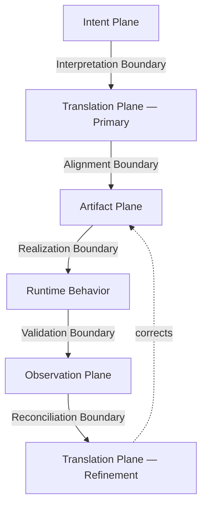

# Engineering Alignment in Probabilistic Generation
## Achieving Correctness Across Interpretive Boundaries

## Abstract

The goal of software engineering is correctness: behavior that matches specified intent. That goal does not change when the implementation tool is a large language model. What changes is how correctness is threatened.

This paper presents a structural model for achieving and maintaining correctness in LLM-assisted systems. It argues that correctness depends not on generation quality alone, but on the explicit management of boundaries between intent, translation, realization, and observation. At each boundary, meaning crosses from one representational domain to another. At each crossing, correctness can degrade. The mechanism of that degradation is drift — subtle semantic shifts, implicit assumption filling, interpretation under ambiguity, compression of meaning at transitions. Drift does not announce itself. It accumulates. And without governed boundaries, it compounds until the system that was built is not the system that was specified.

> In probabilistic software construction, correctness degrades at boundaries unless actively governed.

The goal is not to eliminate probabilistic behavior. It is to constrain, measure, and reconcile it — so that correctness survives from intent through realization.

---

## Key Takeaways

- LLMs do not break software correctness — they relocate where it must be governed.
- Correctness degrades at interpretive boundaries: the transitions between specification, generated artifacts, and runtime behavior. It does not propagate automatically through any of them.
- Current techniques — prompt engineering, structured outputs, evaluation harnesses — govern within a single layer. They do not govern boundaries.
- The specification must function as authority, not documentation: the spec surface from which all artifacts are compiled.
- Each boundary requires an explicit closure mechanism. Unverified boundary crossings are where correctness fails silently and compounds invisibly across the stack.

---

## The Goal Is Correctness — The Threat Is Drift

Software correctness is not a new requirement. It has always meant: does the system behave according to specified intent? Not probable intent, not inferred intent, not "most sensible interpretation" — specified intent.

LLMs do not change that requirement. They change the failure mode.

In deterministic systems, errors are local and detectable. A compiler finds a type mismatch. A test finds a wrong return value. The error is visible, bounded, and addressable. In probabilistic systems, errors are distributed. An LLM generating an artifact from a specification will approximate. It will fill gaps. It will resolve ambiguities. It will make choices that are locally reasonable and globally wrong. And each downstream step works from the output of the step before, compounding small misalignments into large divergences that look correct at every individual layer.

The mechanism of this failure is drift: the gradual movement of realized behavior away from specified intent through the accumulation of small interpretive errors at boundaries. Drift does not break things dramatically. It erodes correctness quietly. A system can pass its test suite, compile cleanly, and ship features while becoming progressively less aligned with what it was meant to do. Research on semantic drift in generative systems confirms this behavior at the generation level: models produce plausible continuations that progressively diverge from factual grounding, with the divergence invisible at any individual step [1]. In software construction, the same dynamic operates across abstraction boundaries rather than within a single generation.

> Correctness erodes at boundaries.

Engineering must govern the boundaries. That is the core claim of this paper.

---

## Why Current LLM Engineering Practice Fails to Protect Correctness

Modern LLM engineering has converged on a set of practical techniques: prompt engineering, tool calling, agent orchestration, retrieval augmentation, structured output constraints, and evaluation harnesses. These are real advances. They improve reliability. They reduce hallucination. They make systems usable.

But they do not protect correctness across boundaries.

They operate within a single layer of the problem — the translation plane, where human intent is mapped into machine-interpretable instructions and outputs. This is not where correctness is lost. Correctness is lost when intent is translated into specification, when specification is realized into artifacts, when artifacts are executed, and when execution results are interpreted back into meaning. Each boundary introduces interpretation. Each interpretation introduces the possibility of misalignment.

Prompt engineering reduces ambiguity in a single translation step. Tooling constrains output shape. Evaluation frameworks detect observable failure cases. None of these govern the relationship between intent, specification, artifact, and execution across boundaries. Correctness can degrade at each crossing even when every individual step looks fine.

This points to a deeper structural problem that current practice does not address. The engineer holds system coherence across time, sessions, and modules. A constraint established in one session, a vocabulary decision made last week, an invariant that spans ten specifications — all of these live in the engineer's mental model of the system. The model operates within its current context window. A constraint that exists outside the window, because it was established two sessions ago or because it lives in a specification the model has not read, will not be maintained autonomously. This is not a model failure. It is a structural property of the tool. And it means that every constraint the engineer cares about must be externalized into artifacts the model operates within, not assumed to persist through conversation.

This explains a pattern that many teams experience but struggle to name. Systems appear stable at the prompt level. They produce valid structured outputs. They pass evaluation suites. And yet, over time, behavior diverges from the original intent. Nothing breaks. Correctness erodes.

The erosion is structural, not random. It is the consequence of treating correctness as a property of model interaction rather than a property of explicit boundary governance.

This is why progress in prompt engineering and agent design, while meaningful, does not converge toward correctness. It improves translation fidelity within a layer while the system continues to accumulate drift across layers.

To protect correctness, engineering must move away from the model interface and toward the surfaces where correctness is at risk. That surface is the spec surface — the authoritative collection of specifications from which all artifacts are compiled — not documentation written after the fact, but the governing boundary through which all interpretation passes.

---

## A Layered Model of Correctness

Correctness is defined at the intent plane and must survive through translation, realization, and observation. It does not propagate automatically. Each boundary is a place where it can degrade, silently and without signaling failure to any individual layer.

The engineering system under probabilistic generation can be understood as a set of planes separated by boundaries. Drift — the mechanism of correctness erosion — concentrates at the boundaries, where meaning crosses from one representational domain to another.

### Planes

1. **Intent Plane**
   Human goals, domain rules, invariants, constraints, structured specifications. This is where engineering decisions are made and where correctness is ultimately defined. The spec surface is the materialization of this plane: the place where intent is encoded with sufficient precision to become a governing constraint on everything downstream.

2. **Translation Plane (Primary)**
   Probabilistic transformation of structured intent into artifacts. This is where the LLM operates.

3. **Artifact Plane**
   Code, tests, documentation, generated outputs — the observable system. Artifacts are the materialization of translated intent. Correctness is visible here, or it is not visible at all.

4. **Observation Plane**
   Measurement, validation, empirical checks, acceptance criteria. This is where correctness is tested against independent authority.

5. **Translation Plane (Refinement)**
   Iterative transformation of artifacts under corrective pressure — a feedback plane, not a forward-path step. Refinement is triggered by the observation plane; it does not sit between primary translation and artifact production. It is a distinct translation stage with its own drift profile.

### Boundaries

- **Interpretation Boundary**
  Where intent becomes machine-consumable structure. Ambiguity compressed here propagates into every downstream plane.

- **Alignment Boundary**
  Where structured intent is transformed into artifacts. The question here is not quality — it is faithfulness to specified intent.

- **Realization Boundary**
  Where artifacts become executable system behavior. Generation success does not guarantee behavioral correctness.

- **Validation Boundary**
  Where observable behavior is measured against expectations. Without empirical anchoring, this boundary measures consistency, not correctness.

- **Reconciliation Boundary**
  Where deviations are corrected via refinement. Each reconciliation cycle is itself a probabilistic translation step — another opportunity for drift.

Each boundary falls between planes: the Interpretation Boundary lies between the Intent and primary Translation planes; the Alignment Boundary between the Translation and Artifact planes; the Realization Boundary between the Artifact plane and execution; the Validation Boundary between runtime behavior and the Observation plane where behavior meets expectation; and the Reconciliation Boundary where observation feeds back into refinement.

Correctness degrades at these boundaries. Engineering governs them.

---

## The Intent Plane and Structured Constraint

Traditional specification-driven development emphasizes structured specification as a precursor to implementation. This work builds on that tradition. The Intent Plane is where correctness is defined; the precision of that definition determines how much correctness survives the downstream translation process.

The Intent Plane must contain:

- explicit domain rules
- defined invariants
- structured grammar or schema where applicable
- quantitative constraints
- references to external, empirical grounding (existing art — published authoritative sources that exist independently of the system being built)

The specification surface encodes constraints within the intent plane. It does not eliminate ambiguity entirely, but it reduces interpretive latitude. This reduction is the primary mechanism of correctness preservation: the less latitude available to probabilistic translation, the smaller the drift potential at the alignment boundary.

Without constraint, probabilistic translation becomes interpretive improvisation. With constraint, translation becomes bounded transformation. The difference is not model quality — it is the degree to which the intent plane specifies what faithful translation looks like.

Gaps in the intent plane are not neutral. They are licenses for the model to fill intent with plausible inference. Those inferences will frequently be wrong in ways that are invisible until realization — by which point the gap has been compiled into artifacts, validated against tests derived from the same inference, and shipped.

The spec surface as single source of truth has a concrete consequence beyond code correctness: it eliminates documentation drift. In conventional development, documentation is written from the code, maintained alongside it, and progressively misrepresents the system as the code evolves without corresponding updates. The failure is typically attributed to process discipline — developers forget to update the docs. The cause is structural: documentation and code have different sources, so they can diverge. When documentation is compiled from the spec surface — derived from the same authoritative source as the code, under the same boundary governance — that structural cause is removed. Documentation and code share a single source of truth. If that source changes through a formal reconciliation event, both must be regenerated from it. The drift problem is not managed. It is architecturally prevented.

---

## The Interpretation Boundary

The first structural threat to correctness appears before generation even begins.

When narrative intent is transformed into structured specification, meaning is compressed. Ambiguities surface. Counts mismatch. Assumptions leak. In deterministic engineering, this boundary is often implicit — the human author and the compiler share a formal language, and compression is constrained by syntax. In probabilistic systems, the boundary must be made explicit because the downstream translator will fill every gap it encounters — silently, without flagging the resolution as a decision.

Errors introduced here propagate downstream. Refinement cannot correct what was never specified. A behavior that was ambiguous at specification time will be arbitrarily resolved at translation time, and the resolution will look authoritative to every subsequent validation pass.

Engineering discipline at this boundary requires explicit constraint declaration, cross-specification consistency analysis, and elimination of ambiguity before translation begins. The process is not one-pass. Specifications written at this boundary require iterative review: each pass surfaces assumptions the author held implicitly and did not encode. A declared behavior without a testable acceptance criterion is an unresolved interpretive question. A validation rule that says "inputs are validated" without specifying the rejection condition, the error type, and the exact invalid inputs is an open boundary that the translator will close in its own way.

Closing the interpretation boundary also requires verifying consistency across specifications, not just within them. A specification can be internally consistent and still be wrong in the context of the system it belongs to. When a normative source is updated — a vocabulary list extended, a field removed, an interface changed — dependent specifications that were not updated carry stale intent. Each passes individual review. Together they describe a system that cannot be implemented consistently, and correctness cannot survive that inconsistency.

Misalignment tolerated at the interpretation boundary becomes a correctness failure in every artifact produced from it.

---

## Primary Translation: Probabilistic Generation

Primary translation converts structured intent into artifacts.

Unlike deterministic compilers, LLMs do not perform deterministic mapping. They approximate. Given a specification, the model produces a statistically plausible artifact — one consistent with the training distribution conditioned on the prompt. This introduces variability in structural decisions, naming, implementation strategy, and boundary handling. As one technical analysis of LLM-based code translation observes, LLMs are powerful sequence models but not correctness engines — they optimize local likelihood, not global semantic consistency [2].

Probabilistic translation does not inherently imply incorrectness. It implies non-determinism. The same specification, translated twice, may produce artifacts that differ in ways that are both locally reasonable and mutually inconsistent with each other. This variability is manageable when the intent plane is well-constrained. It compounds when the intent plane is ambiguous.

The engineering task is not to suppress generation. It is to surround it with constraint and measurement: constrain the input surface to reduce interpretive latitude, and measure the output surface to detect where translation drifted from intent — and therefore where correctness has been compromised.

---

## The Alignment Boundary

Between structured intent and generated artifacts lies the alignment boundary. This is where the correctness question becomes concrete.

The question here is not whether the artifact is well-formed, syntactically valid, or stylistically appropriate. The question is:

> Do the artifacts faithfully reflect specified intent?

- Do they encode the constraints?
- Do they omit nothing required?
- Do they invent nothing unspecified?

This boundary demands active governance because the model cannot self-report misalignment. An artifact that filled a gap with plausible inference will look correct, compile, and may pass tests written against the same inference rather than against the specification. The misalignment is invisible unless the artifact is compared directly against the intent plane. This means correctness is not detectable at this boundary from the artifact side alone — it requires a reference to the specification surface.

Governance at this boundary also requires that any conflict between specifications and the artifact surface be treated as a formal decision point, not a resolution opportunity. When the code generation tool encounters an ambiguity — a type referenced in one specification but not defined in any other, two specifications making contradictory claims about the same interface — the correct response is to stop, document the conflict with its options, and wait for an explicit direction. Resolution by assumption is not resolution. It is correctness erosion, formalized.

Correctness at this boundary is not emergent. It is enforced.

Enforcing it has two temporal components. During implementation, formal decision points prevent gap-filling — the code generation tool stops at ambiguity rather than resolving it. But in-process discipline does not verify that the completed artifact surface faithfully represents the full intent plane. That verification requires a deliberate post-implementation check: a systematic comparison of the artifact surface against the specification surface, asking for each declared behavior whether it materialized correctly, for each artifact behavior whether it traces to a declared intent, and for the artifact surface as a whole whether it is complete relative to the specification. This check cannot be performed by the implementation process itself — it requires stepping outside the implementation context and comparing two surfaces produced by different processes. Until that comparison is made, the alignment boundary is not closed. It is merely uncontradicted.

---

## Refinement Translation

The refinement plane is a feedback loop, not a forward step in generation.

After validation, artifacts are regenerated, tightened, reconciled, and corrected under pressure. Refinement is not an afterthought — it is a translation stage of its own, with a distinct threat profile for correctness.

Each refinement pass operates probabilistically on an already-generated artifact. Each pass works from the output of the prior pass rather than from the original specification surface — meaning corrections can compound as readily as they resolve. This introduces two risks. The first is new drift: a correction to one section may introduce misalignment in an adjacent section the correction did not intend to touch. The second is drift laundering: an artifact that was misaligned with the intent plane may be refined into internal consistency, where all parts agree with each other but the whole has drifted from the original specification. The artifact looks correct. The tests pass. Correctness has been compromised and the evidence has been smoothed away.

Without structured constraint anchoring each refinement pass to the intent plane, refinement optimizes for local coherence rather than correctness. Each refinement cycle must therefore be validated against the specification surface before the next pass begins — not against the previous artifact state.

---

## The Realization Boundary

Generated artifacts are not yet behavior.

When code executes, when documentation guides users, when outputs inform decisions, artifacts cross into realized system state. This boundary exposes what generation could not fully anticipate: runtime semantics, integration behavior, the interaction between independently generated components, and edge conditions that do not appear in test suites derived from the same probabilistic surface that produced the code.

Correctness must survive realization. A system where generated code passes all generated tests but fails in production has not achieved correctness — it has achieved consistent misalignment. The realization boundary is where the artifact confronts the physical constraints of execution, and where misalignment that survived validation becomes observable failure.

---

## Observation and Empirical Grounding

The Observation Plane is where correctness is tested against independent authority.

Validation is not merely syntactic or structural. It must include empirical checks, quantitative thresholds, acceptance tests backed by existing authoritative sources, and domain-correctness verification against sources that exist outside the generative system. Without this external grounding, the observation plane measures alignment of artifacts with the specification — but not correctness of the specification itself. A system can be internally consistent and externally wrong. Internal consistency is not correctness.

With empirical anchoring, validation becomes testable against external authority: a test that verifies a calculation against a published regulatory table can fail on factual grounds, independent of whether the implementation matches the spec. This is the only class of validation that can detect errors introduced at the interpretation boundary, where the specification itself was wrong — where the intent plane contained incorrect intent.

In one production system, empirical validation detected that a specification had pinned an outdated regulatory table for a mandatory financial calculation. The specification was structurally complete and passed review. The empirical check — comparing the specification's expected outputs against the current published authority — found discrepancies at multiple input values. The specification was internally consistent and factually wrong. Without empirical anchoring, this error would have propagated into every calculation in the system before anyone noticed. The specification would have been the authority. The authority would have been wrong.

> Without empirical anchoring, validation measures consistency.
> With empirical anchoring, validation measures correctness.

---

## Correctness Erosion: The Cost of Ungoverned Boundaries

The preceding sections describe each boundary in isolation. The more important question is what happens when none of them are governed together.

When boundaries are ungoverned, correctness does not degrade at a single visible point. It erodes across the stack, invisibly.

A misalignment introduced at the interpretation boundary produces a flawed specification. Primary translation, working from that specification, compiles the misalignment into artifacts. Refinement, working from those artifacts, optimizes for their internal coherence rather than correcting toward original intent. Observation, if anchored only to the specification rather than to external authority, validates consistency with the flawed spec and passes the result.

The consequence is a system that is self-consistent but incorrect. All parts agree with each other. No individual step is obviously at fault. The failure is distributed across boundaries and invisible at any single layer.

A concrete pattern: a normative specification defines a vocabulary — a set of valid action targets for a routing system. A subsequent revision expands the vocabulary, replacing one grouped target with four fine-grained ones. The normative source is updated. The cascade to ten dependent specifications is incomplete. Each dependent specification passes individual review: internally consistent, no prohibited language, structurally complete. Together, they describe a system where the grammar produces outputs the dispatcher rejects — because the dispatcher's target list was not updated. No individual specification is wrong. The system as a whole is incorrect. Governing the interpretation boundary means this comparison is required before any specification is considered closed. Correctness is a property of the surface, not of individual documents on it.

Drift is not a mysterious property of LLMs. It is the natural outcome of probabilistic transformation across ungoverned boundaries. The solution is not a better model. It is boundary discipline — the mechanism by which correctness is actively maintained rather than passively assumed.

---

## Validation vs Reconciliation

These are distinct operations, and conflating them is a source of structural correctness failure.

**Validation** answers: does observable behavior align with expectations? It is a measurement. It produces a result per criterion. It does not change the artifact.

**Reconciliation** answers: what structural change is required to restore correctness? It is a directed intervention. It changes the artifact, the specification, or both. It is itself a probabilistic translation step — with its own potential for introducing drift.

Validation without reconciliation leads to documented incorrectness: the system is measured, the misalignment is identified, and the artifact continues operating in its degraded state. Reconciliation without validation introduces new incorrectness: the intervention is made without a measurement baseline, and the correction may compromise correctness elsewhere while resolving the immediate problem.

Both must be explicit and repeatable. An undocumented reconciliation is indistinguishable from a new translation: future validation cannot determine whether the current state reflects an intentional correction or an untracked drift event.

In a governed system, every reconciliation made after specifications are locked is documented: the conflict type, the options considered, the decision made, the specifications affected, and the reason. This record is not overhead. It is the audit backbone that makes the system's correctness history legible. When a decision made six months ago produces unexpected behavior today, the question "why does this specification say X?" has an answer — because Y was found to be inconsistent with Z, option A was chosen, and the revision was logged. Without that record, correctness history is reconstruction. Reconstruction is itself an interpretive act. Interpretive acts introduce drift.

---

## Practical Instantiation: Spec-Surface Engineering

The framework described in this paper is not purely theoretical. The author developed a concrete instantiation — Spec-Surface Engineering (SSE) — in the construction of a production financial planning system spanning ten modules, nearly 150 specifications, and a dual-engine simulation architecture. SSE implements boundary governance through a sequential, artifact-gated pipeline. Each artifact is evidence of boundary management; each gate ensures no phase begins until the preceding boundary has been explicitly closed and correctness at that boundary confirmed.

The pipeline maps directly to the framework's boundary structure.

**Governing the Interpretation Boundary (Modes 1–2).** Spec authoring and systematic per-specification review close the interpretation boundary before any translation begins. Review enforces explicit Behavior IDs — named, independently testable behavioral contracts declared in each specification — prohibits deferral language, mandates validation rules with exact error conditions and rejection cases, and verifies that each component's role and dependencies are explicitly declared. A specification cannot proceed until it passes this gate. The gate is binary: not mostly correct, but correct.

**Cross-Specification Consistency (Mode 2b).** A specification can pass individual review and still be incorrect in the context of the system it belongs to. Mode 2b operates across the entire specification surface, detecting dependent spec drift, stale vocabulary, and conflicting assertions between specifications. The methodology is evidence-first: search before reading, and surface raw results before drawing conclusions. Every pass assertion must be supported by evidence — both lists quoted verbatim, item by item. No assertion of consistency is accepted without showing the data that supports it. Correctness at the specification surface is not a judgment about individual files. It is a claim about the coherence of the entire surface.

**Boundary Commitment (Mode 3).** The spec freeze is the moment of explicit boundary commitment. Once frozen, the intent plane is immutable except through a Formal Spec Revision Request: a structured protocol that identifies the conflict type, presents options, and waits for an explicit decision before any revision proceeds. Every post-freeze revision is logged with a reason and a list of affected specifications. In the production system, eight revisions were made after the initial freeze. The log records each one. That record is the correctness history of every decision that shaped the spec surface.

**Empirical Validation (Modes 4–5).** Deterministic validation checks the specification surface against external authoritative sources — regulatory publications, actuarial standards, domain reference data. A specification that is internally consistent but factually wrong relative to external authority fails this gate before implementation begins. Stochastic validation checks stochastic components against canonical statistical properties — distribution recovery, convergence behavior, and path independence across runs — using existing-art citations as the authority. Both modes require citations to authoritative external sources. Subjective confidence is not a passing criterion. Correctness at the observation plane must be testable against external authority — or it is not correctness.

**Integration Validation (Mode 6).** Two independently generated subsystems can each be internally correct and semantically inconsistent with each other. Mode 6 verifies the bridge between deterministic and stochastic engines under degeneracy conditions — scenarios where stochastic variance is set to zero, forcing the probabilistic engine to collapse to its deterministic equivalent. In the production system, this check found seven semantic misalignments on its first run — including a floor definition discrepancy where the deterministic engine compared terminal portfolio value against a nominal floor and the stochastic engine compared against an inflation-adjusted floor. Neither behavior was wrong in isolation. Together they produced incomparable results. The fix required an explicit semantic decision, logged as a formal revision. Correctness at the integration boundary is not guaranteed by correctness at each individual component boundary.

**Governed Implementation (Mode 7).** Implementation begins only after the intent plane is frozen and validated. Every conflict encountered during implementation triggers a Formal Spec Revision Request — the code generation tool does not resolve ambiguity by assumption, infer missing definitions, or relocate types across module boundaries without explicit direction. The traceability matrix produced in this mode is the observable artifact chain: requirement ID to acceptance test to code module to unit test. A gap in the matrix is visible evidence of incomplete correctness. Embedding traceability as a first-class objective in LLM-assisted development is an emerging research direction [3]; the SSE approach operationalizes it as a gated requirement of the implementation phase, after the intent plane has been frozen and empirically validated.

**Post-Implementation Alignment Check (Mode 8).** Implementation produces artifacts. Mode 8 determines whether those artifacts faithfully represent the frozen intent plane. Three questions govern the check. First, completeness: does every declared Behavior ID have a corresponding implementation? Nothing specified should be absent from the artifact surface. Second, fidelity: does every artifact behavior trace to a declared Behavior ID? Nothing unspecified should be present in the artifact surface.

The third question is harder and more important than the first two. Third, intent materialization: does the implementation semantics of each behavior match the declared intent of its specification — not just structurally, but in what the code does? A Behavior ID can appear in both the spec and the code, the traceability matrix can record a link, and the implementation can still do something subtly different from what the spec meant. Mode 8 closes the alignment boundary post-implementation. The output is an alignment report: a determination, per behavior, of whether intent materialized correctly. Failures feed back as Formal Spec Revision Requests — either the spec was ambiguous and the implementation resolved the ambiguity incorrectly, or the implementation drifted from clear intent and must be corrected. In either case, the misalignment is now visible and addressable rather than silently present in production.

The SSE pipeline is one instantiation of the boundary governance model. The specific modes, artifacts, and tooling are project-adaptable. The structural principle is not adaptable: each boundary requires an explicit closure mechanism, each reconciliation event requires documentation, and the engineer remains the final authority on correctness at every gate.

---

## Prior Art and Lineage

This model does not claim novelty in specification-driven development.

It builds on specification-driven development, formal methods, model-driven engineering, and continuous verification practices. These traditions established that structured intent should precede implementation and that artifacts should be traceable to requirements. The core commitment — that correctness is defined before implementation, not discovered after — is unchanged.

What changes under probabilistic generation is not the need for specification. It is the volatility of boundaries. Deterministic tools compress meaning predictably — a compiler's behavior at the alignment boundary is fully specified by its grammar. An LLM's behavior at the same boundary is probabilistic, context-dependent, and variable across invocations. The same specification, compiled by an LLM twice, may produce different artifacts. The same artifact, refined under pressure, may drift from its specification in ways that no individual pass reveals.

LLMs increase interpretive variability at every boundary. Boundary governance must increase proportionally. This is not a rejection of prior discipline — it is that discipline applied to a compiler that no longer behaves deterministically.

Most current research in this area focuses on a single boundary — does the generated artifact match the specification? — and treats tooling as the primary mechanism: formal verifiers, structured output constraints, evaluation harnesses. These are meaningful advances at the boundary they address. The discipline described here operates at a different level: not whether artifacts are generated correctly at a single crossing, but whether correctness survives the full stack — from intent through translation, realization, and reconciliation. A system can pass formal verification at the translation-to-artifact boundary and still be factually wrong at the interpretation boundary, or semantically inconsistent where two independently generated components meet.

---

## Evidence from Practice

The framework described in this paper was not developed theoretically and then applied. It was developed in the course of constructing a production financial planning system — nearly 150 specifications across ten modules — and the discipline was operational before it was prose.

The specification phase generated observable data. Eight formal reconciliation events were required after the initial spec freeze. Each was triggered by a subsequent validation pass detecting misalignment that individual specification review had not caught: semantic inconsistencies between engines, empirical errors in specifications, cross-specification conflicts introduced by incomplete cascades. Every one of these events represented a correctness failure that boundary governance made visible and addressable before implementation began. Without governance, each would have been compiled silently into the artifact surface.

The implementation phase is underway. When complete, the system is intended for release as commercial software — software that people will use to plan their retirement. Whether it correctly realizes its specifications in a domain where being approximately correct is not sufficient — that is the primary test. The outcome will be observable. In a domain where people stake real financial decisions on the results, that observability matters — because the alternative to governed correctness is not obvious failure.

The catastrophe in LLM-assisted engineering is not spectacular failure. It is silent divergence: a system that passes its tests, ships its features, and quietly becomes incorrect over time because no discipline governed the boundaries through which correctness had to pass.

---

## Conclusion

Probabilistic generation changes the compiler. It does not change the goal.

The goal is correctness: software that behaves according to specified intent. LLMs do not make that goal easier to achieve — they introduce a new class of threat to it. That threat is structural, not accidental. It originates at boundaries, compounds through translation, and becomes invisible once it has been compiled into self-consistent artifacts. Avoiding it requires governing the boundaries where correctness is at risk, not trusting that generation quality will protect it.

The engineer's role is not diminished by probabilistic generation — it is clarified. The engineer defines the intent plane, governs the boundaries, authorizes each transition, and owns the reconciliation decisions. The model executes within the constraints the engineer establishes. When those constraints are externalized into artifacts and enforced by gates, correctness survives from intent through realization. When they are held only in memory or conversation, they degrade.

The signal that boundary governance is absent is observable before failure: tests derived from the implementation rather than the specification; corrections made without a log entry; vocabulary decisions held in memory rather than encoded in the intent plane. These are not process failures — they are structural indicators. The intervention starts before implementation: a specification that cannot be independently reviewed for behavioral completeness is not ready to be handed to a generative tool.

Three assumptions must change. First: artifact validity is not correctness — a generated artifact can compile, pass its tests, and still fail to realize specified intent, because the tests were generated from the same context as the code and neither was compared against the specification. Second: boundary crossings are not implementation details — they are correctness risks, each requiring an explicit verification mechanism. Third: correctness cannot be recovered cheaply after implementation — an error introduced at the interpretation boundary propagates through every subsequent layer and is laundered into coherence before it becomes detectable. Governing boundaries before generation is not overhead. It is the only point in the lifecycle where correction is tractable.

The tools will improve. The boundaries will remain.

Correctness is not a property of models.

It is a property of discipline.

---

## Acknowledgements

This paper was developed with the assistance of Claude (Anthropic), an AI assistant used in drafting, revising, and structuring the argument. The author governed the process: defining the framework, directing each revision, and owning every editorial decision. The model executed within those constraints. That relationship is the discipline this paper describes, applied to the paper itself.

The framework itself is not theoretical in origin. It is the record of practice observed during the construction of the production system described in Practical Instantiation — where governed boundaries, formal revision requests, and empirical validation were operational before they were prose. The paper's argument was refined against that experience at each revision cycle, governed by the same discipline it describes.

---

## References

[1] Meta AI Research. "Know When To Stop: A Study of Semantic Drift in Text Generation." 2024. https://ai.meta.com/research/publications/know-when-to-stop-a-study-of-semantic-drift-in-text-generation/

[2] Cheung, A. et al. "LLM-Based Code Translation Needs Formal Compositional Reasoning." UC Berkeley Technical Report EECS-2025-174. 2025. https://www2.eecs.berkeley.edu/Pubs/TechRpts/2025/EECS-2025-174.pdf

[3] Wang, F. et al. "Embedding Traceability in Large Language Model Code Generation: Towards Trustworthy AI-Augmented Software Engineering." Proceedings of the 33rd ACM International Conference on the Foundations of Software Engineering (FSE). 2025. https://dl.acm.org/doi/10.1145/3696630.3730569

---

## About the Author

Robert Englander spent more than four decades building and leading software systems, most recently as Lead Principal Engineer at Atlassian. He has retired from corporate life and now works as an independent researcher, advisor, and consultant focused on large-scale distributed systems, desktop architecture, and software engineering in the age of AI. He is the author of several O'Reilly books including *Developing Java Beans* (1997) and *Java & Soap* (2002), and has spoken at numerous industry conferences. The system described in this paper is a production financial planning system of his own design, built as both a personal research instrument and a working demonstration of the Spec-Surface Engineering framework. He is currently completing a practitioner's guide to applying SSE in the construction of LLM-assisted systems.
